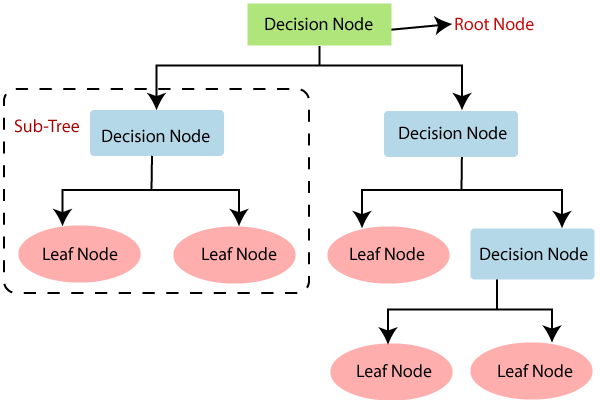

## Table of Contents

## What is a decision tree in the context of machine learning?

A decision tree is a type of model used in machine learning to make decisions or predictions. It works by breaking down a complex decision into a series of simpler decisions, represented as a tree-like structure. Each branch of the tree represents a possible decision or condition, and each leaf represents an outcome or a final decision. For example, to decide if you should go for a walk, the tree might first ask if it's raining. If the answer is no, it might then ask if it's too hot, and so on until it reaches a final decision.

Decision trees are popular because they are easy to understand and interpret. They can be used for both classification and regression problems. In classification, the tree helps to sort data into different categories, like deciding if an email is spam or not. In regression, it can predict a continuous value, like the price of a house. One thing to keep in mind is that while decision trees are simple, they can sometimes be prone to overfitting, which means they might perform well on the data they were trained on but not as well on new data. To avoid this, techniques like pruning or using random forests, which are collections of decision trees, can be used.

## How does a decision tree work for classification and regression tasks?

For classification tasks, a decision tree works by splitting the data into different groups based on certain conditions. Imagine you're sorting fruits into apples and oranges. The tree might first ask if the fruit is round. If yes, it then asks if the fruit is red. If both answers are yes, the fruit is likely an apple. If not, it might be an orange. Each question or condition splits the data into smaller groups until the tree reaches a final decision at the leaves. The tree keeps splitting the data in a way that makes the groups as pure as possible, meaning each group should ideally contain only one type of fruit. The tree uses measures like Gini impurity or entropy to decide the best way to split the data.

For regression tasks, a decision tree works a bit differently but follows a similar idea. Instead of sorting data into categories, it predicts a number. Let's say you want to predict house prices. The tree might first ask if the house has more than 3 bedrooms. If yes, it then asks if the house is larger than 2000 square feet. Based on the answers, the tree reaches a leaf node where it gives a predicted price. The tree splits the data to minimize the difference between the actual prices and the predicted prices in each group. It uses measures like mean squared error to find the best splits. The goal is to make the predictions as accurate as possible by dividing the data into smaller, more similar groups.

## What are the key components of a decision tree?

The main parts of a decision tree are the root node, internal nodes, branches, and leaf nodes. The root node is at the top of the tree and represents the first decision or question. It splits the data into different groups based on this question. Internal nodes are the middle parts of the tree. Each internal node asks a new question and further splits the data into smaller groups. Branches are the lines connecting the nodes and show the different possible answers to the questions.

Leaf nodes are at the bottom of the tree and represent the final decisions or outcomes. When you follow the branches from the root node through the internal nodes, you end up at a leaf node. Each leaf node gives a prediction or classification based on the path you took. Together, these parts help the decision tree make decisions by breaking down complex problems into simpler steps.

## How do you construct a decision tree from a dataset?

To build a decision tree from a dataset, you start by choosing the best question to ask first. This question should split the data into groups that are as different from each other as possible. You look at all the possible questions you could ask about the data, like "Is the fruit red?" or "Does the house have more than 3 bedrooms?" You pick the question that makes the groups the most pure, meaning each group should ideally have similar items. You use measures like Gini impurity or entropy to figure out which question is best. Once you've chosen the first question, you split the data into groups based on the answers and create the root node of the tree.

After the root node, you repeat the process for each group of data. You find the best question to ask next for each group, and you keep splitting the data into smaller groups. Each time you split the data, you create a new internal node in the tree. You keep doing this until you can't split the data anymore, or until the groups are small enough. At the end, the smallest groups become the leaf nodes, where you make the final decisions or predictions. This way, the decision tree breaks down the data into smaller and smaller pieces until it can make accurate predictions or classifications.

## What are the common algorithms used to build decision trees?

There are a few common algorithms people use to build decision trees. One popular one is the ID3 algorithm. It works by choosing the best question to ask first based on something called entropy. Entropy is a way to measure how mixed up the data is. ID3 picks the question that makes the data less mixed up. Another common algorithm is C4.5, which is like ID3 but better. It can handle different types of data and can also prune the tree to make it simpler and less likely to overfit.

Another algorithm is CART, which stands for Classification And Regression Trees. CART can be used for both classification and regression tasks. It uses a measure called Gini impurity to decide which question to ask first. Gini impurity is another way to measure how mixed up the data is. CART tries to pick the question that makes the data less mixed up. These algorithms all work by breaking the data into smaller and smaller pieces until they can make good predictions or decisions.

## How do you evaluate the performance of a decision tree model?

To see how well a decision tree model is doing, you can use different ways to check its performance. One common way is to split your data into two parts: one part to train the tree and the other part to test it. You use the training data to build the tree, and then you use the test data to see how well the tree can predict or classify new data it hasn't seen before. You can measure how accurate the tree is by counting how many times it gets the right answer. For classification, you might use accuracy, which is the percentage of correct predictions. For regression, you might use something like mean squared error, which measures how far off the predictions are from the real values.

Another way to evaluate a decision tree is by using cross-validation. This means you split your data into several smaller parts and use each part to test the tree while training it on the rest. This helps you get a better idea of how the tree will perform with different sets of data. You can also look at other measures like precision, recall, and F1-score for classification tasks. These measures help you understand if the tree is good at finding all the right answers and avoiding wrong ones. By using these different methods, you can get a good picture of how well your decision tree is working and if it needs to be improved.

## What are the advantages of using decision trees in machine learning?

Decision trees are easy to understand and explain. They show decisions in a way that looks like a tree, with branches and leaves. This makes it simple for people to see how the tree makes choices. For example, if you're deciding whether to go for a walk, the tree might ask if it's raining first. If it's not raining, it might then ask if it's too hot. You can follow the tree step by step to see why it made a certain decision. This clear way of showing decisions makes decision trees great for explaining things to others who might not know a lot about [machine learning](/wiki/machine-learning).

Another good thing about decision trees is that they can work with different types of data. They can be used for both classification and regression problems. In classification, the tree sorts data into different groups, like deciding if an email is spam or not. In regression, it can predict a number, like guessing the price of a house. Decision trees are also quick to train and can handle large datasets. However, they can sometimes overfit, which means they might work really well on the data they were trained on but not as well on new data. To fix this, you can use techniques like pruning or using random forests, which are groups of decision trees.

## What are the limitations and challenges of decision trees?

Decision trees can sometimes overfit, which means they might work really well on the data they were trained on but not as well on new data. This happens because the tree keeps splitting the data into smaller and smaller groups until it fits the training data perfectly. But this can make the tree too complicated and not good at predicting new things. To fix this, you can use techniques like pruning, which means cutting off parts of the tree to make it simpler, or using random forests, which are groups of decision trees that work together to make better predictions.

Another challenge with decision trees is that they can be sensitive to small changes in the data. If you change just a little bit of the data, the tree might end up looking very different. This can make it hard to trust the tree's decisions because small changes shouldn't make a big difference. Also, decision trees can struggle with complex relationships in the data. If the data has a lot of different factors that all affect each other in complicated ways, a single decision tree might not be able to capture all of that. In these cases, using more advanced methods like ensemble techniques, which combine multiple models, can help improve the tree's performance.

## How can decision trees be pruned and why is pruning important?

Pruning a decision tree means cutting off some of its branches to make it simpler. You do this by removing parts of the tree that don't help much with making good predictions. There are two main ways to prune a tree: pre-pruning and post-pruning. Pre-pruning stops the tree from growing too big by setting rules before it starts, like saying it can't split the data if the group gets too small. Post-pruning happens after the tree is fully grown. You look at the tree and cut off branches that don't improve the tree's accuracy on a separate set of data.

Pruning is important because it helps stop the tree from overfitting. Overfitting happens when the tree works really well on the data it was trained on but not as well on new data. By making the tree simpler, pruning can make it better at predicting new things. A simpler tree is also easier to understand and explain to others. This makes decision trees more useful in real life, where you need models that work well and are easy to explain.

## What are ensemble methods like Random Forests and how do they relate to decision trees?

Ensemble methods like Random Forests are ways to make decision trees even better. A Random Forest is a group of decision trees that work together to make predictions. Instead of using just one tree, you grow lots of trees and let them vote on the final answer. Each tree in the forest is a bit different because it's trained on a different part of the data. This makes the Random Forest less likely to overfit, which means it can predict new data better than a single tree.

Random Forests relate to decision trees because they are made up of many decision trees. By combining the predictions from all these trees, Random Forests can be more accurate and reliable. They also help solve some of the problems with single decision trees, like being sensitive to small changes in the data. So, if you want to use decision trees but make them even better, using a Random Forest can be a great choice.

## How can decision trees be used in real-world applications?

Decision trees are used in many real-world situations because they are easy to understand and explain. For example, in healthcare, doctors might use a decision tree to help diagnose a patient. The tree could ask questions like "Does the patient have a fever?" or "Is the patient coughing?" Based on the answers, the tree can guide the doctor to a possible diagnosis. This helps doctors make quick and accurate decisions, especially when they need to consider many different symptoms and test results.

In business, decision trees can help with things like marketing and customer service. A company might use a decision tree to decide which customers to target with a new product. The tree could ask questions like "Has the customer bought from us before?" or "Does the customer live in a certain area?" Based on the answers, the company can figure out who is most likely to buy the product. This helps businesses make smart decisions about where to spend their money and how to reach their customers better.

## What advanced techniques can be applied to improve decision tree performance?

One way to make decision trees better is by using something called boosting. Boosting is when you build a bunch of decision trees one after the other, and each new tree tries to fix the mistakes made by the earlier trees. A popular boosting method is called AdaBoost, where each tree focuses more on the data points that were hard to predict before. This helps the final decision be more accurate because it takes into account what the trees learned from their mistakes.

Another technique is called bagging, which is short for bootstrap aggregating. Bagging is used in Random Forests, where you make lots of decision trees and let them vote on the final answer. Each tree is trained on a different random part of the data, so they all see things a bit differently. By combining their predictions, you get a more reliable and accurate result. This helps to reduce overfitting and makes the model better at predicting new data.

You can also use feature selection to improve decision trees. This means choosing only the most important pieces of information to use when building the tree. By focusing on the most relevant features, the tree can make better decisions without getting distracted by less important details. This not only makes the tree simpler and easier to understand but also helps it perform better on new data.

## What are Decision Trees in Supervised Learning?

Decision trees are predominantly utilized in supervised learning scenarios, where they excel in addressing classification and regression problems. In the context of [algorithmic trading](/wiki/algorithmic-trading), these models are invaluable for predicting future asset prices and classifying trading signals based on historical data.

The process begins by training the decision tree on labeled datasets, where the known parameters, such as buy or sell signals, are designated by the traders. This labeled data serves as a foundation for the decision tree to learn the relationships between different market factors and the associated trading signals. As a result, the model can optimize its structure to predict future market behaviors with greater accuracy.

For example, when predicting future asset prices, a decision tree model might analyze historical price data along with various market indicators like moving averages, trading [volume](/wiki/volume-trading-strategy), and other financial metrics. By doing so, it constructs a series of decision rules that can predict whether the price of an asset will rise or fall in the future.

$$
\text{Target} = \text{DecisionTreeClassifier().fit}( \text{features}, \text{labels})
$$

In this simplified Python example, `features` could include variables such as daily open, high, low, close prices, and volume, while `labels` represent the buy or sell signals. The `DecisionTreeClassifier` is used to fit these features and labels, creating a model capable of making predictions on new, unseen data.

The effectiveness of decision trees in algorithmic trading largely stems from their ability to find hidden patterns in historical data. Since they provide a clear path of logic in their decision-making process, traders can understand and validate the reasoning behind predictions, enhancing trust and transparency in automated trading systems.

Moreover, decision trees' adaptability in handling various types of data makes them particularly suited for the dynamic and complex datasets encountered in financial markets. This adaptability, however, requires careful tuning, as decision trees can also be prone to overfitting, particularly with small datasets or when the model becomes overly complex.

To mitigate such risks, integration with ensemble methods, such as Random Forests or Gradient Boosting, is common. These techniques combine the predictions from multiple decision trees, reducing overfitting and improving generalization capabilities, which are crucial aspects for robust trading systems.

In summary, decision trees serve as potent tools in supervised learning for algorithmic trading, leveraging historical data and labeled signals to enhance the precision of trading strategies. Their integration into broader machine learning frameworks ensures they remain a staple in the development of automated trading systems.

## References & Further Reading

[1]: Bergstra, J., Bardenet, R., Bengio, Y., & Kégl, B. (2011). ["Algorithms for Hyper-Parameter Optimization."](https://proceedings.neurips.cc/paper/2011/file/86e8f7ab32cfd12577bc2619bc635690-Paper.pdf) Advances in Neural Information Processing Systems 24.

[2]: ["Advances in Financial Machine Learning"](https://www.amazon.com/Advances-Financial-Machine-Learning-Marcos/dp/1119482089) by Marcos Lopez de Prado

[3]: ["Evidence-Based Technical Analysis: Applying the Scientific Method and Statistical Inference to Trading Signals"](https://www.amazon.com/Evidence-Based-Technical-Analysis-Scientific-Statistical/dp/0470008741) by David Aronson

[4]: ["Machine Learning for Algorithmic Trading"](https://github.com/stefan-jansen/machine-learning-for-trading) by Stefan Jansen

[5]: ["Quantitative Trading: How to Build Your Own Algorithmic Trading Business"](https://books.google.com/books/about/Quantitative_Trading.html?id=j70yEAAAQBAJ) by Ernest P. Chan

[6]: Breiman, L. (2001). ["Random Forests."](https://link.springer.com/article/10.1023/A:1010933404324) Machine Learning, 45(1), 5-32.

[7]: Quinlan, J. R. (1986). ["Induction of Decision Trees."](https://link.springer.com/article/10.1007/BF00116251) Machine Learning, 1, 81–106. 

[8]: ["Introduction to Machine Learning with Python: A Guide for Data Scientists"](https://www.amazon.com/Introduction-Machine-Learning-Python-Scientists/dp/1449369413) by Andreas C. Müller & Sarah Guido