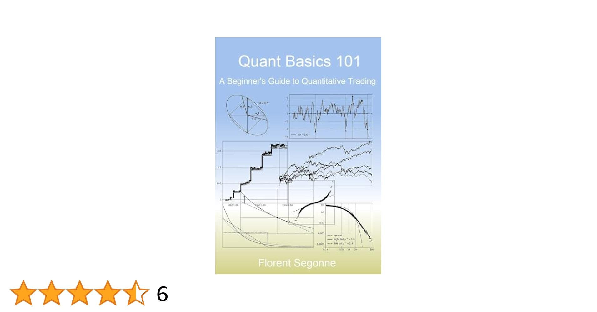

Quantitative trading, an essential segment within algorithmic trading, utilizes mathematical models, statistical analysis, and algorithmic techniques to identify and capitalize on market inefficiencies. By automating trading decisions and executions, quantitative trading enables strategies to be implemented with a speed and frequency unattainable by human traders. This automation relies on the ability to process vast amounts of data quickly, often involving complex computations and algorithmic processes. 

In recent decades, advancements in computational power and data availability have significantly transformed quantitative trading, making it a cornerstone of modern financial markets. The integration of quantitative methods with algorithmic trading allows traders to minimize human biases and errors, thereby enhancing the precision and efficiency of trading strategies. For example, by employing strategies like statistical arbitrage, traders can exploit pricing inefficiencies across different markets to secure profit margins that are considered risk-free under certain conditions.



This article explores the multifaceted world of quantitative trading within the broader context of algorithmic trading. It covers the formulation and execution of various strategies, weighs the benefits against inherent challenges, and looks at the technological underpinnings that drive this field forward. It also addresses the implications for the future, as ongoing innovations in artificial intelligence and machine learning are poised to further enhance the efficacy of quantitative trading strategies while ensuring market integrity.

## Table of Contents

## Understanding Quantitative Trading

Quantitative trading utilizes extensive datasets and sophisticated mathematical models to automate trading strategies, enhancing the efficiency and effectiveness of market operations. This approach relies on intensive computational resources to process vast amounts of market data, employing algorithms that are precise and logical in executing trades. These algorithms systematically analyze historical and real-time data to identify patterns and irregularities that could signify profitable trading opportunities.

The roots of quantitative trading can be traced back to the 20th century, coinciding with significant advancements in computational technology. The development of computers enabled the handling of large datasets and complex calculations, allowing traders to move beyond heuristic-based strategies to those driven by data and analysis. This evolution has made quantitative trading a staple in modern financial markets, where speed and accuracy are paramount.

The methodology of quantitative trading is grounded in statistical analysis, which aims to leverage high volumes of historical data to predict future market trends. Through algorithm-based trading, traders can minimize human errors and biases, leading to more consistent and reliable trading outcomes. An algorithm could be designed to execute trades when specific statistical conditions are met, thereby standardizing decision-making processes and allowing for rapid execution that human traders could not match.

For instance, a basic quantitative strategy might involve the identification of a moving average crossover in stock prices. Python code for such a strategy might be as follows:

```python
import pandas as pd

# Load historical stock data
data = pd.read_csv('stock_data.csv')

# Calculate short and long moving averages
data['Short_MAvg'] = data['Close'].rolling(window=50, min_periods=1).mean()
data['Long_MAvg'] = data['Close'].rolling(window=200, min_periods=1).mean()

# Generate trading signals
data['Signal'] = 0
data['Signal'][50:] = np.where(data['Short_MAvg'][50:] > data['Long_MAvg'][50:], 1, 0)

# Create trading positions
data['Position'] = data['Signal'].diff()

# Display data
print(data[['Close', 'Short_MAvg', 'Long_MAvg', 'Signal', 'Position']])
```

In this code, moving averages are used to generate buy and sell signals based on crossovers, demonstrating a simple yet effective [quantitative trading](/wiki/quantitative-trading) strategy. By automating this process, traders can systematically operate on multiple assets or markets, taking advantage of statistically validated signals to optimize their trading performance.

In summary, quantitative trading transforms market data into actionable insights through the judicious application of mathematics and technology. This disciplined approach reduces reliance on subjective judgment, harnessing algorithmic precision to navigate complex and rapidly changing financial landscapes.

## Key Components of Quantitative Trading

Quantitative trading is underpinned by key components that collectively enhance trading effectiveness and profitability. One of the foundational elements is strategy identification, which involves the formulation of trading strategies through the analysis of statistical patterns and the detection of market inefficiencies. Quantitative traders use mathematical models to identify these patterns, often employing statistical techniques such as regression analysis or time-series analysis to forecast market movements and devise strategic approaches accordingly.

Data [backtesting](/wiki/backtesting) is another crucial component, whereby these strategies are rigorously tested against historical data to assess their reliability and potential profitability. Backtesting involves simulating the execution of a trading strategy on past data and is instrumental in validating the approach before its application in live trading. This process helps to identify any weaknesses or adjustments needed in the strategy, ensuring that the models are robust and can withstand various market conditions. A typical backtesting setup in Python might look like this:

```python
import pandas as pd
import numpy as np

def backtest_strategy(data, strategy):
    returns = []
    for index, row in data.iterrows():
        if strategy(row):
            returns.append(row['return'])
    return np.mean(returns), np.std(returns)

# Example DataFrame 'data' with 'price' and 'return' columns
data = pd.DataFrame({
    'price': [100, 101, 102, 101, 105],
    'return': [0.01, 0.02, -0.01, 0.04, -0.02]
})

def strategy(row):
    return row['price'] > 100

mean_return, risk = backtest_strategy(data, strategy)
```

Execution synergy is key to transforming theoretical trading strategies into practical success, involving the real-time implementation of these strategies with minimal transaction costs and optimal methods for execution. This is achieved through the use of advanced technology and [algorithmic trading](/wiki/algorithmic-trading) platforms that facilitate high-frequency trading with precision and speed.

Risk management in quantitative trading involves using mathematical models to forecast and manage potential risks, thereby maximizing returns. These models assess various risk factors and propose limits and controls to mitigate possible adverse outcomes. For example, risk management may involve setting stop-loss limits, diversifying a trading portfolio, or employing financial derivatives to hedge against unfavorable movements in the market.

In summary, the efficacy of quantitative trading is significantly enhanced by these components—strategy identification, data backtesting, execution synergy, and risk management—each playing a pivotal role in decision-making processes and contributing to the overall success of trading activities.

## Popular Quantitative Trading Strategies

Quantitative trading encompasses a range of strategies designed to exploit market inefficiencies through mathematical and statistical methods. Here are some of the most prominent strategies utilized in the industry:

**Statistical Arbitrage** involves identifying price discrepancies between related financial instruments to exploit eventual price convergence. This strategy typically hinges on pairs trading, where two correlated assets are traded against one another—buying the undervalued asset while short-selling the overvalued one. The assumption is that any divergence in their relationship is temporary and will revert to the mean, yielding opportunities for profit. Traders use statistical tools to measure asset correlations and deviations from their historical relationship.

**High-Frequency Trading (HFT)** leverages algorithms to execute a vast number of trades in fractions of a second, capitalizing on minute price swings that are imperceptible to slower market participants. HFT strategies often involve market-making, arbitrage, and momentum trading, relying heavily on sophisticated technological infrastructure to maintain speed advantages in execution. The strategy's success depends on minimal latency, necessitating advanced computational resources and proximity to trading servers.

**Trend Following** focuses on assets following a consistent upward or downward trajectory over time, suggesting that the current trend will continue. Traders employ statistical tools to identify these trends, entering trades in the direction of the trend and exiting when signs of a reversal emerge. The strategy can be implemented using moving averages or other technical indicators to detect trends. Trend followers often adjust their position sizes dynamically to mitigate risk exposure.

For example, a simple moving average crossover strategy, in Python, would look as follows:

```python
def moving_average(data, period):
    return data.rolling(window=period).mean()

# Example of using two moving averages
short_window = 40  # Short-term window
long_window = 100  # Long-term window
short_mavg = moving_average(price_data, short_window)
long_mavg = moving_average(price_data, long_window)

# Generate buy/sell signals
signals = pd.DataFrame(index=price_data.index)
signals['signal'] = 0.0
signals['signal'][short_window:] = np.where(short_mavg[short_window:] > long_mavg[short_window:], 1.0, 0.0)
signals['positions'] = signals['signal'].diff()
```

**Mean Reversion** posits that asset prices will revert to their historical average over time. This approach involves trading securities based on deviations from their average price, assuming these deviations will correct themselves. Mean reversion can be mathematically represented using the formula:

$$
S(t) = \mu + \epsilon(t)
$$

where $S(t)$ is the price at time $t$, $\mu$ is the mean, and $\epsilon(t)$ is a white noise term. Traders use statistical measures such as the Z-score to determine how far a security's price has diverged from its historical mean:

$$
Z = \frac{X - \mu}{\sigma}
$$

where $X$ is the current price, $\mu$ is the average price, and $\sigma$ is the standard deviation. A high Z-score suggests the price is significantly away from the mean, indicating a potential reversal.

Each of these quantitative trading strategies carries unique risks and requires extensive data analysis to validate assumptions about market efficiency and price behaviors. While they offer opportunities for substantial profit, they also demand rigorous implementation and continuous refinement.

## Benefits and Challenges in Quantitative Trading

Quantitative trading offers numerous benefits, characterized primarily by its enhanced speed and precision in executing trades. This efficiency stems from the use of algorithms that can process vast amounts of data rapidly and execute trades at diverse frequencies, thereby reducing delays inherent in human trading. Consequently, the transaction costs can be significantly minimized, primarily due to the automation of trade processes which reduces manual errors and enhances pricing accuracy. Furthermore, algorithmic strategies remove emotional decision-making from trading activities, mitigating biases such as fear and overconfidence that can skew human judgment.

A major advantage of quantitative trading lies in its ability to reduce emotional influence. By relying on data-driven algorithms, quant trading mitigates subjective decision-making, which is often swayed by market emotions like panic or euphoria. This objectivity helps in executing consistent and disciplined trading strategies that aim for optimized returns.

Despite these advantages, quantitative trading faces several inherent challenges. One significant challenge is the requirement for substantial computational resources. The need for high-speed computing power to process and analyze large datasets cannot be overlooked. This includes both physical hardware such as servers and the high-level programming skills required to develop robust algorithms. The financial commitment and expertise required in maintaining and upgrading these systems can be considerable, potentially limiting access to well-resourced trading firms.

Another challenge is the vulnerability to exceptional and unpredictable market occurrences, often referred to as 'black swan' events. These rare and unanticipated events can lead to extreme market [volatility](/wiki/volatility-trading-strategies), adversely affecting algorithm-based strategies, which typically rely on historical data to make predictions. The assumptions embedded in quantitative models may not hold during such anomalies, potentially leading to significant financial losses.

Regulatory scrutiny represents another concern for quantitative trading. As markets are increasingly dominated by algorithmic strategies, regulatory bodies are enhancing their oversight to ensure fairness and transparency. This regulatory environment requires quants to stay abreast of compliance requirements, which may vary across different jurisdictions and over time, adding complexity to maintaining algorithmic trading operations.

The quantitative trading environment is highly dynamic, necessitating continuous model backtesting and fine-tuning to adapt to evolving market conditions. Effective backtesting involves simulating a trading strategy on historical data to evaluate its performance. For accurate assessments, quants must ensure access to comprehensive and high-quality historical data. Furthermore, as market conditions change, strategy parameters and assumptions must be updated frequently to maintain efficacy.

In conclusion, while quantitative trading provides significant advantages such as speed, objectivity, and cost-effectiveness, it also presents challenges that require substantial resources, adaptability, and regulatory compliance. Continual development and refinement of algorithms are essential to navigating these challenges and leveraging the benefits of quantitative trading.

## The Role of Technology in Quant Trading

Technological advancements have fundamentally transformed quantitative trading, enabling the execution of sophisticated strategies with unprecedented speed and precision. Key technological tools like application programming interfaces (APIs), advanced trading platforms, and comprehensive data analysis software have become indispensable in effectively implementing quantitative strategies. APIs facilitate seamless communication between trading systems and stock exchanges, allowing for the rapid exchange of information required for executing trades in real time. Advanced trading platforms offer powerful computational capabilities and intuitive interfaces, making it easier for traders to deploy complex algorithms and manage large-scale data sets efficiently.

The transition towards more user-friendly programming environments has democratized access to quantitative trading, allowing a broader array of traders to participate. Languages such as Python have gained predominance due to their simplicity and the extensive libraries available for data analysis, statistical modeling, and algorithm development. For example, libraries such as NumPy and pandas provide robust functions for handling large datasets, while scikit-learn and TensorFlow cater to [machine learning](/wiki/machine-learning) needs.

Emerging technologies, particularly [artificial intelligence](/wiki/ai-artificial-intelligence) (AI) and machine learning, are further revolutionizing quantitative trading. AI systems can analyze vast volumes of data to identify patterns and predict market movements with greater accuracy than traditional models. Machine learning algorithms, utilizing techniques such as [reinforcement learning](/wiki/reinforcement-learning) or neural networks, enhance the predictive power and adaptability of trading strategies. For instance, a common application is the use of supervised learning algorithms to predict stock prices based on historical data.

The utilization of these technologies in quantitative trading can be illustrated through a simple Python example using linear regression to model stock price data:

```python
import numpy as np
import pandas as pd
from sklearn.linear_model import LinearRegression

# Sample data: historical stock prices
data = {
    'day': np.array([1, 2, 3, 4, 5]),
    'price': np.array([100, 102, 104, 108, 110])
}

# Convert to DataFrame
df = pd.DataFrame(data)

# Independent variable (day) and dependent variable (price)
X = df[['day']]
y = df['price']

# Initialize and fit linear regression model
model = LinearRegression()
model.fit(X, y)

# Predict future price
future_day = np.array([[6]])
predicted_price = model.predict(future_day)

print(f"Predicted price for day 6: {predicted_price[0]:.2f}")
```

As technology continues to evolve, the potential for enhanced efficiency and accuracy in quantitative trading also expands. AI and machine learning promise to refine the precision of trading models further, while regulatory bodies are tasked with maintaining market integrity in the face of these technological advancements.

## Quantitative Trading and Its Future

Quantitative trading is increasingly significant in financial markets, driven by technological advancements that enhance its strategies and execution capabilities. As algorithmic models become more sophisticated, the role of artificial intelligence (AI) and machine learning in quantitative trading is growing. These technologies facilitate better pattern recognition, anomaly detection, and predictive modeling, which can lead to more precise and adaptable trading strategies. For instance, AI algorithms can analyze massive datasets in real time, identifying subtle correlations and trends that might be invisible to traditional statistical methods. This enables traders to adjust their portfolios dynamically, optimizing performance and managing risks more effectively.

Machine learning models, particularly those based on [deep learning](/wiki/deep-learning) frameworks, are implemented to forecast price movements, identify [arbitrage](/wiki/arbitrage) opportunities, and optimize trading algorithms continuously. These models learn from historical and real-time data, adapting to new market conditions without explicit human intervention. This adaptability is crucial as financial markets become more complex and interdependent, characterized by rapid information flow and short-lived trading opportunities.

As quantitative trading evolves, regulatory bodies play a critical role in maintaining market integrity and mitigating associated risks. Regulations aim to prevent market manipulation, ensure transparency, and protect investors, focusing on the potential systemic risks posed by high-frequency trading and algorithmic strategies. Regulatory frameworks are adapting to oversee the expanding influence of AI and machine learning in trading, incorporating measures to audit algorithms, monitor trading behavior, and enforce compliance.

The future of quantitative trading is intertwined with continued technological innovation, regulatory evolution, and the growing demand for more efficient and agile trading strategies. As AI and machine learning continue to advance, they promise to enhance the precision, speed, and adaptability of quantitative trading, potentially reshaping financial markets and their operational dynamics.

## References & Further Reading

[1]: Bergstra, J., Bardenet, R., Bengio, Y., & Kégl, B. (2011). ["Algorithms for Hyper-Parameter Optimization."](https://papers.nips.cc/paper/4443-algorithms-for-hyper-parameter-optimization) Advances in Neural Information Processing Systems 24.

[2]: ["Advances in Financial Machine Learning"](https://www.amazon.com/Advances-Financial-Machine-Learning-Marcos/dp/1119482089) by Marcos Lopez de Prado

[3]: ["Evidence-Based Technical Analysis: Applying the Scientific Method and Statistical Inference to Trading Signals"](https://www.amazon.com/Evidence-Based-Technical-Analysis-Scientific-Statistical/dp/0470008741) by David Aronson

[4]: ["Machine Learning for Algorithmic Trading"](https://github.com/stefan-jansen/machine-learning-for-trading) by Stefan Jansen

[5]: ["Quantitative Trading: How to Build Your Own Algorithmic Trading Business"](https://books.google.com/books/about/Quantitative_Trading.html?id=j70yEAAAQBAJ) by Ernest P. Chan