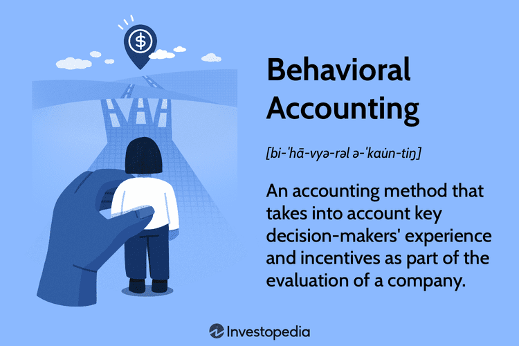

## Table of Contents

## What is behavioral accounting?

Behavioral accounting is a part of accounting that looks at how people's behaviors and decisions affect financial reports and accounting practices. It combines ideas from psychology and accounting to understand why people make certain choices when they are dealing with money and numbers. This field helps accountants see how human actions can change the way financial information is shown and used.

In simple terms, behavioral accounting helps explain why people might make mistakes or do things on purpose that affect financial statements. For example, a manager might want to make their company's profits look better than they really are, so they might change some numbers. By studying these behaviors, accountants can create better rules and systems to make sure financial reports are honest and accurate. This way, everyone who looks at these reports, like investors or other managers, can trust the information they see.

## How does behavioral accounting differ from traditional accounting?

Behavioral accounting and traditional accounting focus on different aspects of financial reporting. Traditional accounting is all about following strict rules and standards to record, summarize, and present financial data accurately. It's like a set of guidelines that accountants must follow to make sure the numbers in financial statements are correct and reliable. Traditional accounting doesn't usually look at why people make the choices they do; it just makes sure those choices are recorded properly according to the rules.

On the other hand, behavioral accounting dives into the human side of accounting. It tries to understand why people might make certain decisions that affect financial reports. For example, it looks at why a manager might want to make their company's profits look bigger than they really are. Behavioral accounting uses ideas from psychology to explain these actions and help create better systems that can prevent mistakes or dishonest reporting. While traditional accounting focuses on the "what" and "how" of financial reporting, behavioral accounting focuses on the "why" behind people's actions.

## What are the key principles of behavioral accounting?

Behavioral accounting is based on understanding how people's decisions affect financial reports. It looks at why people might make choices that change the numbers in accounting. For example, a manager might want to show higher profits to make their company look good, even if it means bending the truth a little. Behavioral accounting uses ideas from psychology to figure out what drives these decisions. It's about seeing the human side of numbers and understanding that people aren't always perfectly rational when it comes to money.

This field also focuses on creating better systems to stop mistakes or dishonest reporting. By studying how people behave, accountants can make rules that help keep financial reports honest and accurate. For instance, if they know managers often try to make profits look better, they can set up checks and balances to catch those actions. Behavioral accounting helps everyone trust the financial information they see, making sure it's a true reflection of a company's health.

## Can you provide a simple example of behavioral accounting in practice?

Imagine a manager at a company who wants to make the company's profits look bigger than they really are. The manager knows that if the profits look good, the company's stock price might go up, and everyone will think the manager is doing a great job. So, the manager decides to delay recording some expenses until the next year. This makes the current year's profits look higher, even though it's not an honest picture of the company's financial health.

Behavioral accounting helps us understand why the manager made this choice. It looks at the human side of things, like the pressure to look successful and the fear of disappointing others. By studying these behaviors, accountants can create better rules to stop managers from doing this kind of thing. For example, they might set up regular checks to make sure expenses are recorded on time, keeping the financial reports honest and trustworthy.

## What psychological factors influence accounting decisions?

People's decisions in accounting can be affected by many psychological factors. One big factor is the pressure to meet goals or targets. Managers might feel stressed to show good results, so they might bend the rules a little to make their numbers look better. This can happen when they're worried about losing their job or not getting a bonus. Another factor is how people see themselves and want others to see them. If someone wants to look successful, they might make choices that make their company's financial reports look better than they really are.

Another psychological factor is how people handle risk. Some people are more willing to take chances, while others play it safe. In accounting, someone who likes taking risks might be more likely to make aggressive choices that could lead to bigger rewards, but also bigger problems if things go wrong. Also, the way people think about money and numbers can influence their decisions. If someone believes they can predict the future well, they might make more optimistic choices about how to report financial data. Understanding these psychological factors helps accountants create better systems to keep financial reports honest and accurate.

## How does cognitive bias affect financial reporting?

Cognitive biases can really mess with financial reporting. One common bias is called "overconfidence." People with this bias might think they know more than they actually do, so they might make predictions about the future that are too optimistic. This can lead them to report higher profits or lower expenses than what's realistic. Another bias is "confirmation bias," where someone only looks for information that supports what they already believe. In accounting, this might mean ignoring signs that a project isn't going well and only focusing on the good news, which can make the financial reports look better than they should.

These biases can cause big problems because they make financial reports less accurate. If managers are overconfident, they might not prepare for risks that could hurt the company. And if they're only seeing what they want to see because of confirmation bias, they might miss important warnings that could save the company from trouble. By understanding these biases, accountants can set up better checks and balances to make sure financial reports are honest and give a true picture of the company's health.

## What role does ethics play in behavioral accounting?

Ethics is a big part of behavioral accounting. It's all about doing the right thing, even when no one is watching. In behavioral accounting, people study why some folks might make choices that aren't honest or fair. They look at things like pressure to meet goals or the desire to look good in front of others. Understanding these reasons helps accountants create rules that encourage everyone to act ethically. If everyone follows these rules, financial reports will be more honest and people can trust the numbers they see.

Ethics also helps in making sure that the systems in place catch any dishonest behavior. For example, if a manager knows it's wrong to delay recording expenses just to make profits look better, they might be less likely to do it. But even if they try, ethical rules and checks can stop them. By focusing on ethics, behavioral accounting helps keep the financial world fair and trustworthy. It's like having a moral compass that guides everyone to do the right thing, making sure the numbers in financial reports are a true reflection of a company's health.

## How can companies implement behavioral accounting techniques?

Companies can start using behavioral accounting by first understanding why people make the choices they do when dealing with money and numbers. They can do this by looking at how managers and employees behave and what pressures they face. For example, if managers feel a lot of pressure to meet certain targets, they might make choices that aren't honest. By studying these behaviors, companies can figure out what rules and systems they need to stop these kinds of actions. They might set up regular checks to make sure all expenses are recorded on time and profits are reported accurately.

Once companies understand these behaviors, they can create better rules and training programs to encourage everyone to act ethically. This means teaching employees about the importance of honesty and fairness in financial reporting. They can also use technology to help catch any mistakes or dishonest reporting. For instance, software can be used to flag unusual entries in financial records, which can then be reviewed by accountants. By focusing on these behavioral accounting techniques, companies can make sure their financial reports are trustworthy and give a true picture of their health.

## What are some advanced tools used in behavioral accounting research?

In behavioral accounting research, one advanced tool that researchers use is called eye-tracking technology. This tool helps them see where people look when they're making decisions about financial reports. By watching where someone's eyes go, researchers can figure out what information they pay attention to and what they might ignore. This can show if someone is focusing too much on the good news and not seeing the bad, which can affect how they report financial data. Eye-tracking helps researchers understand how people process information and make choices, leading to better ways to design financial reports that are clear and honest.

Another tool is called neuroimaging, which includes techniques like fMRI (functional magnetic resonance imaging). This tool lets researchers look at what's happening in the brain when people are making accounting decisions. By seeing which parts of the brain light up, they can learn about the emotions and thoughts that influence these choices. For example, if someone feels a lot of pressure to meet a target, their brain might show signs of stress, which could lead them to make less honest decisions. Neuroimaging helps researchers understand the deeper psychological reasons behind accounting behaviors, making it easier to create rules and systems that promote ethical choices.

Lastly, researchers use computer simulations and behavioral experiments to study how people react in different financial situations. These tools allow them to create controlled environments where they can watch how people behave when faced with accounting choices. For instance, they might set up a game where players have to make decisions about recording profits and expenses, and then see if they choose to be honest or bend the rules. By analyzing these behaviors, researchers can find patterns and come up with strategies to encourage better, more ethical decision-making in real-world accounting.

## How does behavioral accounting impact auditing practices?

Behavioral accounting changes the way auditors do their jobs. It helps them understand why people might make mistakes or try to cheat with financial reports. For example, if a manager feels a lot of pressure to meet a target, they might delay recording some expenses to make profits look better. By knowing about these behaviors, auditors can look more closely at areas where people might be tempted to bend the rules. This means they can set up better checks and tests to catch any problems early.

Auditors also use what they learn from behavioral accounting to make their audits more effective. They can design their work to focus on places where human behavior might lead to errors or fraud. For instance, if they know managers often try to make profits look bigger, they might spend more time checking how expenses are recorded. By understanding the human side of accounting, auditors can make sure financial reports are honest and trustworthy, helping everyone who relies on these reports to make good decisions.

## Can you discuss a case study where behavioral accounting significantly affected a company's financial decisions?

One famous case where behavioral accounting played a big role was at Enron, a huge energy company that went bankrupt in 2001. At Enron, the top managers felt a lot of pressure to keep the company's stock price high and make it look like they were doing better than they really were. They used something called "mark-to-market" accounting, which let them record future profits as if they had already happened. This made their financial reports look much better than they should have. Behavioral accounting helps us understand that these managers were driven by the need to look successful and keep their bonuses and jobs. They were willing to bend the rules and even break the law to make the company's numbers look good.

Because of these actions, Enron's financial reports were not honest. When the truth came out, the company's stock price crashed, and it went bankrupt. This case shows how important it is to understand why people make certain choices in accounting. By knowing about these behaviors, companies can set up better rules and systems to stop this kind of thing from happening. Behavioral accounting can help create a more honest and trustworthy financial world, making sure that everyone can rely on the numbers they see in financial reports.

## What are the future trends and potential developments in the field of behavioral accounting?

In the future, behavioral accounting might use more advanced technology to study how people make financial choices. Tools like eye-tracking and brain imaging could become more common, helping researchers understand even better why people do what they do with money and numbers. This could lead to new rules and systems that make financial reports more honest and trustworthy. Also, artificial intelligence and machine learning might start playing a bigger role. These technologies could help spot patterns in how people behave and catch any mistakes or dishonest actions before they cause big problems.

Another trend could be a focus on training and education. Companies might start teaching their employees more about the psychological factors that affect accounting decisions. This could help everyone make better, more ethical choices. There might also be more research into how different cultures and backgrounds influence financial behavior. Understanding these differences could help create better global accounting standards that work for everyone. Overall, the future of behavioral accounting looks like it will be about using technology and education to make financial reporting more accurate and fair.

## References & Further Reading

[1]: Lo, A. W. (2005). ["Reconciling Efficient Markets with Behavioral Finance: The Adaptive Markets Hypothesis"](https://papers.ssrn.com/sol3/papers.cfm?abstract_id=1702447). The Journal of Investment Consulting.

[2]: Thaler, R. H. (2015). ["Misbehaving: The Making of Behavioral Economics"](https://psycnet.apa.org/record/2015-22902-000). W.W. Norton & Company.

[3]: Barberis, N., & Thaler, R. (2003). ["A Survey of Behavioral Finance."](https://www.nber.org/papers/w9222) Handbook of the Economics of Finance.

[4]: Hull, J. C. (2018). ["Options, Futures, and Other Derivatives"](https://www.semanticscholar.org/paper/Options%2C-Futures%2C-and-Other-Derivatives-Hull/89bdee500c8623864fc9eb7a471546aa713acc44). Pearson.

[5]: Subramanian, A., & Kahle, C. (2013). ["Mark-to-Market Accounting: Advances in Concepts, Issues and Practices"](https://pmc.ncbi.nlm.nih.gov/articles/PMC3961762/). Palgrave Macmillan.

[6]: Lo, A. W. (2008). ["Hedge Funds: An Analytic Perspective"](https://www.jstor.org/stable/j.ctt7rq28). Princeton University Press.

[7]: Daniel, K., Hirshleifer, D., & Teoh, S. H. (2002). ["Investor Psychology in Capital Markets: Evidence and Policy Implications."](https://www.sciencedirect.com/science/article/pii/S0304393201000915) Journal of Monetary Economics.

[8]: Black, F. (1986). ["Noise"](https://onlinelibrary.wiley.com/doi/abs/10.1111/j.1540-6261.1986.tb04513.x). The Journal of Finance.