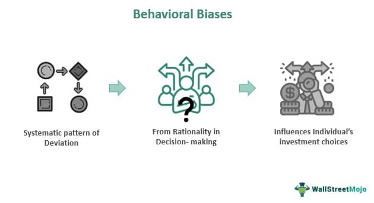

In recent years, algorithmic trading has transformed the financial landscape, enabling market participants to implement trading strategies through automated systems. This evolution has enhanced the speed and efficiency of financial markets but remains susceptible to behavioral biases originally exhibited by human traders. These biases, which occur as systematic deviations from rational decision-making, can significantly affect the performance and reliability of algorithmic trading systems.

Algorithmic trading leverages complex algorithms and models to make trading decisions, often executing these decisions without human intervention. However, the foundational design and parameters of these algorithms are developed by humans, thereby embedding any existing cognitive biases into the trading strategies. Behavioral biases such as overconfidence, loss aversion, and anchoring can inadvertently influence the decisions coded into algorithms, leading to suboptimal trading outcomes.



This article examines these behavioral biases and their impact on algorithmic trading. It sheds light on how biases are integrated into algorithms, posing challenges to the expected objectivity of programmatic trading systems. Additionally, it highlights strategies to mitigate these biases, which include employing comprehensive data sets, testing algorithms against various scenarios, and performing regular audits to maintain objectivity. Understanding these behavioral influences is crucial to improving algorithmic trading efficiency, ultimately fostering more rational and effective decision-making in financial markets. By recognizing and addressing these biases, traders and developers can optimize trading algorithms and enhance their overall performance.

## Table of Contents

## What is Behavioral Bias in Trading?

Behavioral biases are consistent patterns of deviation from rational judgment, often affecting decisions in financial environments. When applied to trading, these biases can lead to distorted market perceptions and, eventually, suboptimal trading results. Traders, whether human or algorithmic, may fall prey to a variety of these biases due to the inherent challenges in predicting market movements and the psychological components involved.

Overconfidence is one prominent example of behavioral bias. It manifests when traders, influenced by past successes or the perceived precision of their methods, overestimate their knowledge or predictive capabilities. This often results in excessive trading, which can increase transaction costs and market exposure without necessarily enhancing the potential for returns.

Loss aversion is another common bias, characterized by a preference to avoid losses rather than acquiring gains of equivalent value. This bias may lead traders to hold onto losing positions longer than warranted, hoping to recover losses rather than accepting and moving on from them. In [algorithmic trading](/wiki/algorithmic-trading), this can translate to the development of highly conservative strategies that may fail to capitalize on potential market upswings.

The disposition effect is related, highlighting the tendency of traders to sell winners too early and retain losers for too long. Such behavior is counterproductive, as it may cause a misalignment with optimal trading strategies, where the reverse approach—cutting losses quickly and letting profits run—is often preferable.

These biases do not disappear in an algorithmic context, as trading algorithms are generally programmed by humans who may unknowingly embed their personal biases into the system. Consequently, it's crucial to recognize that behavioral biases can infiltrate algorithmic trading through the foundational decision-making frameworks established by developers. Addressing these biases involves critical programming considerations and ongoing adjustments to ensure the alignment of the algorithm's decision-making process with rational and optimized trading outcomes.

## Impact of Behavioral Biases in Algorithmic Trading

Algorithmic trading was initially designed to eliminate the emotional biases inherent in human decision-making and leverage computational power for optimal trading outcomes. However, the algorithms that underpin these systems are created by humans and are not immune to the biases of their developers. These biases can inadvertently embed themselves within trading algorithms and impact their effectiveness.

One significant manifestation of behavioral biases in algorithmic trading is overfitting. Overfitting occurs when an algorithm is excessively tailored to historical data, capturing noise rather than the underlying pattern. This can lead to overconfidence bias, where developers may assume the algorithm's predictive accuracy is higher than it truly is. Overfitted models often perform exceptionally well on past data but fail to generalize to unseen market conditions, leading to suboptimal performance in real-time trading.

Another impactful bias is loss aversion, where developers, aiming to avoid losses, may program algorithms with overly cautious risk management parameters. This bias can result in algorithms that are too conservative, potentially missing out on profitable trading opportunities. By setting tight stop-loss limits or risk thresholds, such algorithms might [exit](/wiki/exit-strategy) trades prematurely or avoid entering trades with perceived high risk, even when the potential for gain is substantial.

These biases illustrate how algorithmic trading systems can deviate from their intended rationality, reflecting the psychological and emotional tendencies of their developers. As a result, these biases can skew trading decisions away from optimal market strategies, underscoring the importance of recognizing and addressing these underlying human influences in algorithm development.

## Common Behavioral Biases in Algorithmic Trading

Overconfidence Bias is a prevalent issue in algorithmic trading. This bias arises when traders place undue trust in the accuracy and effectiveness of their algorithms. This overreliance can result in excessive trading activity and heightened risk exposure. Traders and developers often misconstrue backtested results as guarantees of future success, ignoring the fact that past performance does not predict future results. Overestimation of an algorithm's capabilities can be mitigated by implementing robust risk management frameworks and regularly validating algorithmic strategies against out-of-sample data.

Loss Aversion is another critical bias that affects algorithmic trading. It stems from a strong preference to avoid losses rather than acquiring gains of equivalent value. This bias may cause traders to design algorithms with overly conservative risk parameters, potentially avoiding trades that could have been profitable. To address loss aversion, traders must balance caution with opportunity by employing dynamic risk assessment models that adapt to market conditions over time.

Anchoring Bias comes into play when algorithms are overly reliant on specific metrics or historical data inputs, potentially leading to imprecise predictions. Anchoring can cause algorithms to become fixated on initial data points or benchmarks, resulting in an ignorance of changing market dynamics. To counteract this, traders should continuously update their data sets and incorporate a wide array of indicators. This ensures the algorithms remain responsive to real-time market information, avoiding myopic perspectives based on outdated data.

## Strategies to Overcome Behavioral Biases

Quants and developers can utilize various strategies to mitigate behavioral biases in algorithmic trading. One effective approach is the application of quantitative methods to ensure data inputs accurately reflect broader market behaviors rather than isolated events. This involves the selection of comprehensive datasets that capture a wide range of market conditions, reducing the risk of overfitting and biased predictions.

Incorporating diverse datasets is crucial. By leveraging a variety of data sources, developers can create algorithms that account for different market scenarios and thus mitigate the anchoring bias—where algorithms may rely too heavily on initial data inputs. Scenario-based testing further enhances this strategy by evaluating how algorithms perform under various hypothetical market conditions, such as extreme [volatility](/wiki/volatility-trading-strategies) or economic crises. This method allows quants to identify potential biases that may arise in less common yet impactful situations.

Regular algorithmic audits can also provide significant value. By engaging third-party entities to review and assess algorithms, developers gain access to objective evaluations that may highlight implicit biases not apparent to internal teams. Such audits can identify skewed risk parameters or overconfidence in the algorithm’s predictive precision. External reviews ensure that trading strategies remain robust and reflective of the current market environment.

These strategies, when systematically applied, can significantly reduce the influence of behavioral biases, leading to more rational and efficient trading algorithms. Such efforts are essential for maintaining the integrity and efficacy of algorithmic trading systems in diverse market landscapes.

## The Role of Machine Learning in Minimizing Bias

Machine learning has revolutionized the field of algorithmic trading by providing tools to mitigate human-imposed biases in trading algorithms. These models, leveraging vast datasets, are capable of learning and adapting, thus offering a significant advantage in recognizing and minimizing bias. 

At the core of [machine learning](/wiki/machine-learning)'s capability to minimize bias is its ability to process and analyze large volumes of data. By ingesting diverse datasets, machine learning models can identify patterns that may be overlooked by human traders or simplistic algorithms. This pattern recognition can help in detecting biases that are reflected in historical trading data. For instance, biases such as overconfidence or anchoring can be identified when models notice consistent discrepancies or trends in trading decisions that deviate from optimal outcomes. 

Once biases are recognized, machine learning models can be programmed to adjust predictions and actions. For example, [reinforcement learning](/wiki/reinforcement-learning)—a subset of machine learning—can be used to continually update strategies based on new information. In a Python-based trading system, a simple reinforcement learning algorithm might be designed as follows:

```python
import numpy as np

# Initialize parameters
alpha = 0.1  # learning rate
gamma = 0.9  # discount factor
epsilon = 0.2  # exploration factor

# Placeholder for Q-values
Q = np.zeros((state_space, action_space))

def choose_action(state):
    if np.random.uniform(0, 1) < epsilon:
        return np.random.choice(action_space)
    else:
        return np.argmax(Q[state, :])

def update_q(store_state, action, reward, next_state):
    predict = Q[store_state, action]
    target = reward + gamma * np.max(Q[next_state, :])
    Q[store_state, action] += alpha * (target - predict)
```

In this context, the algorithms learn to penalize strategies linked with negative outcomes associated with biases while rewarding unbiased strategies that lead to better performance. 

Furthermore, advancements in [deep learning](/wiki/deep-learning) allow models to approximate complex, non-linear relationships, which are often where biases manifest. Convolutional Neural Networks (CNNs) and Recurrent Neural Networks (RNNs) can be particularly useful in time-series analysis prevalent in trading environments. CNNs can be employed to detect spatial patterns in price data, while RNNs can capture temporal dependencies that might indicate the presence of anchoring or trend-following bias.

By iteratively training these models, they effectively 'learn' from biased mistakes and adapt, gradually minimizing the bias in their decision-making process. However, the robustness of these models depends heavily on the quality and diversity of data used for training. Ensuring a comprehensive dataset that captures a wide array of market conditions is essential to mitigating the risk of biases reappearing under unobserved scenarios.

In conclusion, while machine learning presents a robust framework for minimizing behavioral biases in algorithmic trading, the models require continuous evaluation and retraining with diverse datasets to remain effective. These practices not only improve trading efficacy but also align closer with objective, data-driven decision-making in financial markets.

## Conclusion

Behavioral biases continue to be critical factors to consider in algorithmic trading, where decisions ostensibly free from emotional influence are fundamentally shaped by human design. Recognizing and addressing these biases is essential for developing robust and efficient trading algorithms. Algorithms, while computationally driven, inherently reflect the cognitive patterns and tendencies of their human programmers. For instance, overconfidence can lead to overly aggressive trading strategies, while loss aversion might result in excessively conservative approaches that miss opportunities.

To mitigate these biases, it is imperative for traders and developers to maintain a thorough understanding of both the psychological underpinnings of these biases and their specific manifestations within algorithmic systems. This includes routinely analyzing trading outcomes to identify potential patterns indicative of bias, employing quantitative and qualitative methods for a comprehensive approach.

Furthermore, as technological advancements such as machine learning continue to evolve, they offer powerful tools to identify and counteract biases in trading algorithms. Machine learning models, when properly designed and trained, have the capability to self-adjust by learning from extensive datasets, effectively recognizing patterns tied to biases and refining algorithmic actions to enhance trading efficacy.

Ultimately, the commitment to understanding and mitigating behavioral biases not only improves individual trading strategies but also contributes to more rational and efficient financial markets. Continued education, development, and application of advanced analytical techniques remain essential for traders and developers aimed at minimizing the impact of these pervasive biases.

## References & Further Reading

[1]: Bergstra, J., Bardenet, R., Bengio, Y., & Kégl, B. (2011). ["Algorithms for Hyper-Parameter Optimization."](https://papers.nips.cc/paper/4443-algorithms-for-hyper-parameter-optimization) Advances in Neural Information Processing Systems 24.

[2]: ["Advances in Financial Machine Learning"](https://www.amazon.com/Advances-Financial-Machine-Learning-Marcos/dp/1119482089) by Marcos Lopez de Prado

[3]: ["Evidence-Based Technical Analysis: Applying the Scientific Method and Statistical Inference to Trading Signals"](https://www.amazon.com/Evidence-Based-Technical-Analysis-Scientific-Statistical/dp/0470008741) by David Aronson

[4]: ["Machine Learning for Algorithmic Trading"](https://github.com/stefan-jansen/machine-learning-for-trading) by Stefan Jansen

[5]: ["Quantitative Trading: How to Build Your Own Algorithmic Trading Business"](https://books.google.com/books/about/Quantitative_Trading.html?id=j70yEAAAQBAJ) by Ernest P. Chan

[6]: "Kahneman, D., & Tversky, A. (1979). "Prospect Theory: An Analysis of Decision under Risk." Econometrica, 47(2), 263-291.

[7]: Barberis, N., & Thaler, R. (2003). "A Survey of Behavioral Finance." Handbook of the Economics of Finance, 1, 1053-1128.

[8]: "Menkhoff, L. (2010). "The Use of Technical Analysis by Fund Managers: International Evidence." Journal of Banking & Finance, 34(11), 2573-2586.