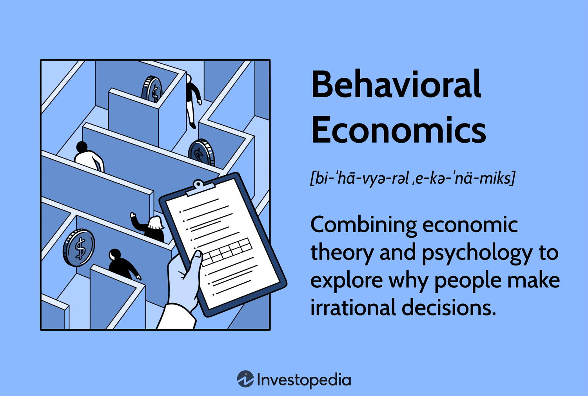

Behavioral economics offers a unique perspective on economic decision-making by integrating insights from psychology and economics. Unlike traditional economic models that often assume humans make rational decisions, behavioral economics acknowledges that human behavior is influenced by cognitive biases and emotional factors. This interdisciplinary approach provides a deeper understanding of why individuals and markets deviate from conventional theories of rationality.

The importance of this field is evident as it challenges traditional economic assumptions, offering more realistic depictions of decision processes. For instance, conventional models may predict choices based purely on logical evaluations of utility maximization. However, behavioral economics reveals scenarios where individuals prioritize short-term gains over long-term benefits or make inconsistent choices due to framing effects.



This article explores how behavioral economics applies not only to broader economic theories but also to the specific domain of algorithmic trading. Algorithmic trading, which relies heavily on computational algorithms to execute trades efficiently, stands to gain significantly from integrating behavioral insights. By understanding how cognitive biases affect trading decisions, traders and analysts can optimize economic models and strategies, potentially improving market predictions and trading performance.

In the context of algorithmic trading, insights from behavioral economics can help in developing strategies that take advantage of irrational behaviors observed in the markets. As behavioral economics continues to evolve, its integration with algorithmic trading represents a promising frontier at the intersection of psychology and finance, ultimately leading to more effective and adaptive economic systems.

## Table of Contents

## Basics of Behavioral Economics

Behavioral economics is a field that investigates the psychological influences on the economic decisions made by individuals and institutions. Contrary to traditional economic models, which often assume that individuals act rationally and in their own self-interest, behavioral economics acknowledges that decision-making can be influenced by cognitive limitations and psychological nuances.

One key concept in behavioral economics is bounded rationality, introduced by Herbert A. Simon. This concept suggests that the cognitive limitations of the human mind, coupled with the finite amount of time available to make decisions, result in individuals making satisficing rather than optimizing choices. Instead of striving for the highest utility, individuals often opt for a decision that is good enough under the circumstances.

Cognitive biases are another essential aspect examined in behavioral economics. These biases are systematic patterns of deviation from norm or rationality in judgment, resulting in a skewed perception of reality. Common examples include confirmation bias, where individuals prioritize information that confirms their existing beliefs, and loss aversion, described under prospect theory by Daniel Kahneman and Amos Tversky. Loss aversion illustrates that individuals tend to prefer avoiding losses over acquiring equivalent gains, suggesting a greater emotional impact from losing than from winning.

Framing, a critical concept in understanding behavioral economics, involves how information is presented to individuals, which significantly influences decision-making and judgment. The framing effect implies that different presentations of the same information can lead to varying decisions, emphasizing the importance of context and presentation in economic choices.

Heuristics, or mental shortcuts, also play a significant role in how decisions are made. These shortcuts allow individuals to solve problems and make judgments quickly and efficiently but can sometimes lead to errors in judgment. For example, the availability heuristic causes people to overestimate the likelihood of events based on their recent exposure or memory availability, rather than long-term statistical probability.

Understanding these components enables the identification of where decisions deviate from rational economic models, providing a more comprehensive view of economic behavior that includes human emotions and cognitive limitations. By integrating these insights, behavioral economics presents a more realistic depiction of decision processes, challenging the traditional assumptions of rationality in economics.

## Applications of Behavioral Economics in Economic Theories

Behavioral economics provides critical insights into the variations from traditional rational choice theory, focusing on cognitive biases that influence decision-making processes. Traditional economic models predominantly assume individuals make rational decisions to maximize utility. However, behavioral economics highlights that individuals frequently act irrationally due to cognitive limitations and framing effects. 

One of the major contributions of behavioral economics to economic theory is through prospect theory, introduced by Daniel Kahneman and Amos Tversky in 1979. Prospect theory proposes that individuals value gains and losses differently, leading them to make decisions based on perceived probabilities rather than actual outcomes. Unlike expected utility theory, which assumes a linear valuation of outcomes, prospect theory suggests that people have an asymmetrical value function. The valuation function is concave for gains and convex for losses, indicating risk aversion in the domain of gains and risk-seeking in the domain of losses. This is mathematically represented as:

$$

V(x) = 
\begin{cases} 
x^\alpha & \text{if } x \geq 0 \\
-\lambda (-x)^\beta & \text{if } x < 0 
\end{cases} 
$$

where $\alpha, \beta$ are parameters indicating the curvature of the value function, and $\lambda$ reflects the loss aversion coefficient.

Nudge theory is another area where behavioral economics significantly impacts economic thought. Pioneered by Richard Thaler and Cass Sunstein, nudge theory involves subtly guiding individuals towards better choices without restricting their freedom of choice. It operates on the principle that small interventions can 'nudge' people to more desirable behaviors and decisions. For example, default options in retirement savings plans have greatly increased participation rates, illustrating how altering the choice architecture can effectively influence decision-making. 

In marketing, nudges are often employed through strategic framing, where the presentation of products or information affects consumer choice. An example is the effect of labeling food products as "90% fat-free" compared to "10% fat," which can significantly influence consumer perception and choice, even though the factual content remains identical.

Overall, behavioral economics introduces concepts that challenge the conventional assumptions of rationality in economic theories and provides strategies for shaping economic policies and marketing initiatives by acknowledging and leveraging human cognitive biases. These insights have far-reaching implications across various sectors, encouraging more holistic and realistic approaches to modeling and influencing economic behavior.

## Algorithmic Trading and Behavioral Economics

Algorithmic trading, characterized by the use of computer algorithms to automate trading processes, stands to benefit significantly from integrating principles of behavioral economics. This synergy arises from the ability to exploit irrational market behaviors attributed to human cognitive biases, emotional responses, and other psychological factors.

One key approach in this integration is the use of sentiment analysis. Sentiment analysis involves processing large volumes of textual data, such as news articles, social media posts, and financial reports, to gauge market sentiment. Algorithms utilize natural language processing (NLP) techniques to quantify sentiment, often classifying it into positive, negative, or neutral sentiments. By aligning trading strategies with these sentiments, algorithmic systems can identify and capitalize on the market trends driven by collective human emotions. For example, a sudden increase in negative news sentiment about a particular stock might precipitate a sell-off, and an algorithm tuned to detect such shifts could preemptively forecast the price movement.

In addition to sentiment analysis, identifying cognitive biases plays a crucial role in optimizing [algorithmic trading](/wiki/algorithmic-trading) strategies. Cognitive biases, such as overconfidence, anchoring, and loss aversion, often lead to predictable patterns of human behavior. Algorithms can be designed to recognize these biases in trading data. For example, overconfidence might lead traders to overestimate their market knowledge and take on riskier positions. An algorithm that recognizes this bias can anticipate excessive trading volumes or price [volatility](/wiki/volatility-trading-strategies) and adjust trading strategies accordingly.

Predictive models that integrate behavioral data are essential in forecasting market trends with improved accuracy. These models incorporate variables related to human behavior, such as historical trading patterns influenced by psychological factors. Machine learning algorithms can be particularly effective in this context, learning from behavioral datasets to predict future market conditions. A basic example is using a time-series forecasting model to account for recurring behavioral patterns that emerge at specific times, such as increased buying at the beginning of a week due to renewed investor optimism.

Here is a simple Python code snippet demonstrating how sentiment analysis might be implemented using the natural language processing library, NLTK (Natural Language Toolkit):

```python
import nltk
from nltk.sentiment import SentimentIntensityAnalyzer

# Initialize the SentimentIntensityAnalyzer
sia = SentimentIntensityAnalyzer()

# Sample text representing market news
news_article = "The market rally has investors optimistic about continued growth."

# Conduct sentiment analysis
sentiment_score = sia.polarity_scores(news_article)

# Output the sentiment analysis results
print(sentiment_score)
```

In this code, the SentimentIntensityAnalyzer from the NLTK library processes a sample news article to output sentiment scores. These scores help in assessing whether the news sentiment might drive investor behavior in a manner that the algorithm could leverage.

By integrating these behavioral elements, algorithmic trading not only gains a competitive edge through nuanced market predictions but also fosters a deeper understanding of the human aspects underpinning financial markets. However, it is crucial for practitioners to continue refining these approaches to ensure reliable and ethical applications in trading strategies.

## Case Studies and Industry Examples

Bridgewater Associates, a prominent [hedge fund](/wiki/hedge-fund-trading-strategies), incorporates behavioral insights to refine its investment strategies, effectively harnessing the potential of behavioral economics. By understanding cognitive biases and human behavior, Bridgewater adapts its trading decisions to account for the non-rational factors influencing market movements. This approach allows the firm to anticipate and respond to market anomalies arising from collective investor behaviors such as overreaction or herd mentality.

Renaissance Technologies, another leader in [quantitative trading](/wiki/quantitative-trading), utilizes advanced behavioral models to pinpoint market inefficiencies. Their strategies involve analyzing historical trading data and behavioral patterns to forecast market trends. By incorporating behavioral economics, Renaissance Technologies can detect and exploit pricing anomalies that result from irrational investor behavior. Their quantitative models benefit from insights gained through behavioral data, enhancing their ability to capitalize on shifts not explained by traditional economic theories.

The application of behavioral economics extends to personal finance platforms like Betterment and Acorns, which focus on optimizing user engagement and decision-making in portfolio management. Betterment uses behavioral nudges to guide users towards more rational saving and investing behaviors, preventing common pitfalls like selling during market downturns or failing to diversify investments. Similarly, Acorns applies concepts such as "round-ups" to integrate savings into daily spending habits, thereby leveraging behavioral tendencies to encourage better financial practices. These platforms demonstrate how understanding and applying behavioral insights can lead to improved financial outcomes for individual investors by aligning product design with natural human tendencies.

These examples illustrate the tangible benefits of integrating behavioral insights into financial strategies, whether at the level of complex hedge fund operations or individual portfolio management platforms. By recognizing and addressing the cognitive biases and irrational behaviors that traditional economics may overlook, these firms enhance their strategic capabilities and user experiences.

## Ethical Considerations and Challenges

Behavioral economics, while offering valuable insights for enhancing trading strategies, raises crucial ethical concerns, particularly related to fairness and transparency. The exploitation of cognitive biases and psychological tendencies in trading systems can lead to manipulative practices that disadvantage consumers who are unaware of their vulnerabilities. Therefore, it is imperative to ensure that these systems respect consumer interests and adhere to principles of informed consent.

One primary ethical concern is the potential for algorithms to exploit behavioral biases without the user's awareness or understanding. For instance, algorithms might leverage cognitive biases such as loss aversion or overconfidence to influence trading decisions in a way that benefits firms at the expense of the consumer. It is vital that financial systems incorporate checks and balances to ensure that consumers are not unduly influenced or misled by these sophisticated strategies.

Transparency is another key concern. Users must have access to clear and comprehensible information regarding how behavioral insights are applied in trading algorithms. This transparency helps ensure that individuals can make informed choices about engaging with these systems. Financial institutions have a responsibility to disclose how they use consumer data and behavioral insights, ensuring that consumers are aware of any potential biases that may affect their trading outcomes.

Addressing these ethical challenges is essential to maintaining trust in financial markets. Trust is a foundational element that underpins market stability and participant confidence. Without it, the effectiveness of behavioral economics applications in trading is significantly undermined. Regulators and policymakers must establish guidelines to prevent misuse and ensure that any behavioral interventions in markets uphold ethical standards.

Furthermore, achieving equitable outcomes is critical. Behavioral economics should not exacerbate existing disparities but rather contribute to fairer and more accessible financial markets. By prioritizing ethical considerations, financial institutions can harness the full potential of behavioral economics while ensuring that both consumer protection and market integrity are upheld. This balance will support sustainable growth and innovation in the trading sector, benefiting all market participants.

## Conclusion

Behavioral economics enriches the understanding of economic decision-making and market behavior by incorporating psychological insights into economic models. This integration provides nuanced explanations of human behavior beyond the traditional assumptions of rationality. The field demonstrates the numerous cognitive biases and psychological factors that affect economic decisions, assisting in redefining theories and practices across various disciplines, including finance.

Algorithmic trading benefits significantly from the integration of behavioral economics. By acknowledging irrational market behaviors influenced by cognitive biases, algorithmic traders can devise strategies that anticipate and leverage these anomalies. The intersection of psychology and finance in this domain allows for the refinement of trading algorithms to enhance their predictive capabilities and optimize performance. Techniques such as sentiment analysis and [machine learning](/wiki/machine-learning) models trained on behavioral data represent cutting-edge tools that capitalize on these insights.

As technological and analytical methods evolve, future advancements must focus on ethical applications of behavioral economic principles. Exploiting cognitive biases in consumers and markets raises ethical concerns related to fairness, transparency, and informed consent. To maintain trust and equity in financial markets, it is crucial that these ethical challenges are addressed head-on. By ensuring that strategies respect consumer interests and operate with transparency, the financial industry can benefit from cognitive insights while upholding ethical standards. Through such balanced applications, behavioral economics continues to shed light on economic and market phenomena, driving innovation and informed decision-making.

## References & Further Reading

[1]: Kahneman, D., & Tversky, A. (1979). ["Prospect Theory: An Analysis of Decision under Risk."](http://web.mit.edu/curhan/www/docs/Articles/15341_Readings/Behavioral_Decision_Theory/Kahneman_Tversky_1979_Prospect_theory.pdf) Econometrica, 47(2), 263-291.

[2]: Thaler, R. H., & Sunstein, C. R. (2008). ["Nudge: Improving Decisions About Health, Wealth, and Happiness."](https://www.researchgate.net/publication/257178709_Nudge_Improving_Decisions_About_Health_Wealth_and_Happiness_RH_Thaler_CR_Sunstein_Yale_University_Press_New_Haven_2008_293_pp) Yale University Press.

[3]: Shiller, R. J. (2003). ["From Efficient Markets Theory to Behavioral Finance."](https://www.aeaweb.org/articles?id=10.1257/089533003321164967) Journal of Economic Perspectives, 17(1), 83-104.

[4]: Shleifer, A. (2000). ["Inefficient Markets: An Introduction to Behavioral Finance."](https://academic.oup.com/book/27761) Oxford University Press.

[5]: Tetlock, P. C. (2007). ["Giving Content to Investor Sentiment: The Role of Media in the Stock Market."](https://onlinelibrary.wiley.com/doi/abs/10.1111/j.1540-6261.2007.01232.x) Journal of Finance, 62(3), 1139-1168.

[6]: Lo, A. W. (2004). ["The Adaptive Markets Hypothesis: Market Efficiency from an Evolutionary Perspective."](https://www.researchgate.net/publication/228183756_The_Adaptive_Markets_Hypothesis_Market_Efficiency_from_an_Evolutionary_Perspective) The Journal of Portfolio Management, 30(5), 15-29.

[7]: Barberis, N., & Thaler, R. (2003). ["A Survey of Behavioral Finance."](https://www.nber.org/papers/w9222) In Handbook of the Economics of Finance, Vol. 1, Part B.

[8]: Malkiel, B. G. (2003). ["The Efficient Market Hypothesis and Its Critics."](https://pubs.aeaweb.org/doi/10.1257/089533003321164958) Journal of Economic Perspectives, 17(1), 59-82.

[9]: Montier, J. (2010). ["The Little Book of Behavioral Investing: How Not to Be Your Own Worst Enemy."](https://archive.org/details/littlebookofbeha0000mont) Wiley.