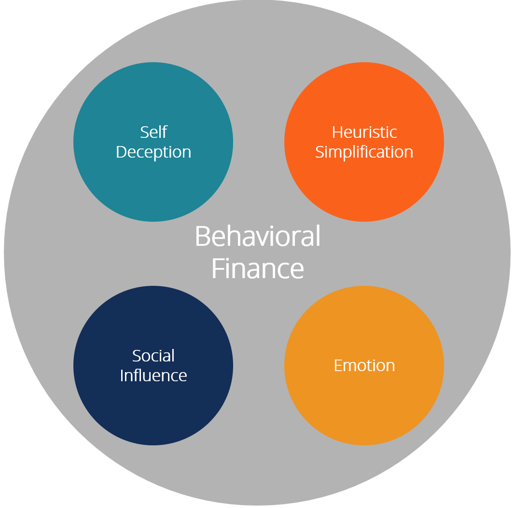

## Table of Contents

## What is behavioral finance?

Behavioral finance is a field that combines psychology and economics to understand why people make certain financial decisions. It looks at how emotions and biases can affect the choices people make about money, like investing or saving. Instead of assuming people always make rational choices, behavioral finance shows that people often make decisions based on feelings or shortcuts in thinking.

For example, people might hold onto losing investments too long because they feel attached to them, or they might follow the crowd and invest in something just because everyone else is doing it. These behaviors can lead to mistakes in managing money. By studying these patterns, experts in behavioral finance can help people make better financial decisions and design better financial products that take human behavior into account.

## How do emotions influence financial decision-making?

Emotions play a big role in how we make choices about money. Feelings like fear, greed, and excitement can push us to do things we might not do if we were thinking calmly. For example, when the stock market goes down, fear might make us sell our investments quickly, even if it's not a good time to sell. On the other hand, when the market is going up, greed might make us buy more stocks without thinking about the risks. These emotional reactions can lead to bad decisions that hurt our money in the long run.

Another way emotions affect financial choices is through something called loss aversion. This means we feel the pain of losing money much more than the joy of gaining it. Because of this, we might hold onto losing investments too long, hoping they'll come back up, instead of cutting our losses and moving on. Also, emotions can make us follow the crowd. If everyone around us is buying a certain stock or product, we might feel pressured to do the same, even if it's not the best choice for us. Understanding these emotional influences can help us make better, more rational financial decisions.

## What are common cognitive biases in finance?

Cognitive biases are mental shortcuts or errors that can affect how we make financial decisions. One common bias is overconfidence, where people think they know more than they actually do. This can lead them to take big risks with their money, believing they can predict the market or pick winning investments better than others. Another bias is confirmation bias, where people look for information that supports what they already believe and ignore information that doesn't. This can cause them to make choices based on a limited view of the facts, like sticking with a bad investment because they only pay attention to positive news about it.

Another important bias is the anchoring bias, where people rely too much on the first piece of information they get. For example, if someone hears a stock is worth $100, they might keep thinking it's worth that even if the market changes. This can stop them from making good decisions based on new information. Herd behavior is also a common bias, where people do what everyone else is doing without thinking it through. They might buy or sell investments just because others are doing it, which can lead to big mistakes if the crowd is wrong. Understanding these biases can help people make better financial choices by being aware of how their minds might trick them.

## Can you explain the concept of loss aversion?

Loss aversion is a feeling where people hate losing money more than they like gaining it. It's like when you find a $20 bill, you feel happy, but if you lose $20, you feel much worse. This strong feeling can make people do things that might not be the best for their money. For example, someone might keep a stock that's going down in value because they don't want to accept the loss. They hope it will go back up, even if it might be smarter to sell it and use the money for something better.

This feeling of loss aversion can also make people too scared to take risks. They might keep all their money in safe places, like a savings account, even if they could earn more by investing it. This can stop them from growing their money over time. Understanding loss aversion can help people see when their fear of losing is making them miss out on good chances to do better with their money. By knowing this, they can try to make more balanced choices and not let the fear of loss control their decisions.

## How does overconfidence bias affect investment choices?

Overconfidence bias makes people think they know more about investing than they really do. This can lead them to take big risks with their money because they believe they can predict the market or pick winning stocks better than others. For example, someone might think they're great at choosing stocks and put all their money into one company, thinking it will do well. But if the company doesn't do well, they could lose a lot of money because they were too sure of themselves.

This bias can also make people trade too much. They might buy and sell stocks all the time, thinking they can time the market perfectly. But studies show that people who trade a lot usually don't do as well as those who hold onto their investments longer. Overconfidence can also make people ignore advice from experts or not do enough research before making choices. By understanding overconfidence, people can try to be more careful and make better, more balanced investment decisions.

## What is the endowment effect and how does it impact financial decisions?

The endowment effect is when people value something more just because they own it. It's like thinking a toy you have is worth more than a toy you don't have, even if they're the same. This can happen with money too. For example, if you have a stock, you might think it's worth more than it really is just because it's yours.

This effect can make it hard to make good financial choices. You might not want to sell a stock, even if it's not doing well, because you feel attached to it. This can stop you from making better investments. Understanding the endowment effect can help you see when you're holding onto something just because it's yours, and maybe it's time to let it go for something better.

## How can confirmation bias lead to poor financial outcomes?

Confirmation bias can make people only look at information that agrees with what they already think. If someone believes a stock will do well, they might only read news that says good things about it. They ignore the bad news or warnings. This can make them keep a stock even when it's not doing well, because they only see the good stuff. This can lead to losing money because they're not seeing the whole picture.

For example, if someone is sure a certain company is going to grow, they might keep buying its stock without checking if there are problems. They might miss signs that the company is in trouble. By not looking at all the information, they could end up losing a lot of money. It's important to look at both good and bad news to make the best choices with money.

## What role does herd behavior play in the stock market?

Herd behavior is when a lot of people in the stock market do the same thing at the same time, just because everyone else is doing it. They might buy or sell stocks without really thinking about it, just because they see others doing it. This can make stock prices go up or down really fast. For example, if everyone starts buying a certain stock because they see others buying it, the price can go up a lot, even if the company isn't doing that well.

This kind of behavior can create bubbles in the market. A bubble is when the price of something goes way up, but it's not really worth that much. When people realize the price is too high, they start selling, and the price can drop really fast. This can cause big losses for people who bought the stock at the high price. Herd behavior can make the market feel like a roller coaster, with big ups and downs that can be hard to predict. It's important for investors to think for themselves and not just follow the crowd to avoid getting caught in these ups and downs.

## How can understanding behavioral finance improve personal financial planning?

Understanding behavioral finance can help you make better choices with your money. It shows you how feelings like fear or excitement can make you do things that aren't smart, like selling stocks when the market goes down or buying them when everyone else is. By knowing about these feelings, you can try to stop them from making you do things you might regret later. For example, if you know you feel scared when the market drops, you can remind yourself to wait and think before selling your stocks.

Also, knowing about biases like overconfidence or following the crowd can help you avoid big mistakes. If you think you're really good at [picking](/wiki/asset-class-picking) stocks, you might put all your money into one stock. But if you understand overconfidence, you can see that you might be wrong and spread your money out to be safer. And if you see everyone buying a certain stock, you might want to check if it's really a good idea or if you're just following the herd. By understanding these things, you can make a plan that helps you save and invest better, and feel more in control of your money.

## What are some strategies to mitigate the impact of biases in financial decision-making?

One way to reduce the impact of biases in financial decisions is by taking a step back and thinking carefully before acting. When you feel strong emotions like fear or excitement, try to wait a bit before making a choice. This can help you see if you're being pushed by your feelings or if it's a good idea. Also, it's helpful to write down the reasons for and against a decision. This can make you see both sides more clearly and stop you from just following your first thought.

Another strategy is to get advice from others. Talking to a financial advisor or even friends who know about money can give you different views. They might see things you don't because they're not caught up in the same emotions or biases. It's also good to do lots of research and look at all the information, not just what you want to see. This can help you avoid confirmation bias and make choices based on facts, not just what you hope will happen.

## How do prospect theory and mental accounting influence investor behavior?

Prospect theory helps explain how people make choices about money when they're not sure what will happen. It says that people feel the pain of losing money more than the joy of gaining it. This makes them more likely to take risks to avoid a loss, even if it's not the smartest move. For example, an investor might hold onto a stock that's losing value, hoping it will go back up, instead of selling it and moving on. This behavior can lead to bigger losses if the stock keeps going down. Understanding prospect theory can help investors see when they're making choices based on fear of loss rather than what's best for their money.

Mental accounting is when people treat money differently depending on where it comes from or what they plan to use it for. For example, someone might think of money they won as "fun money" and spend it more freely than their regular paycheck. This can lead to bad financial decisions, like not saving enough or investing money that should be used for bills. Investors might also keep different accounts for different goals, like one for retirement and another for a vacation, and treat the money in each account differently. Knowing about mental accounting can help investors see when they're not treating all their money the same way and make better overall financial plans.

## What are the latest research findings on the application of behavioral finance in institutional settings?

Recent research in behavioral finance shows that it's becoming more important in big organizations like banks and investment firms. These places are using what they learn about how people think and feel to make better decisions and create new products. For example, they might use this knowledge to help their clients avoid common mistakes, like selling stocks when the market goes down because they're scared. They're also using behavioral finance to design investment tools that help people stick to their plans, even when things get tough. This can make a big difference in how well these institutions do and how happy their clients are.

Another finding is that companies are using behavioral finance to train their workers. They're teaching them about biases and emotions to help them make better choices for the company and its clients. For example, they might learn about overconfidence and how it can lead to risky decisions. By understanding these things, workers can make smarter choices and help their clients do the same. This training can also help companies avoid big financial mistakes and manage their money better.

## References & Further Reading

[1]: Kahneman, D., & Tversky, A. (1979). ["Prospect Theory: An Analysis of Decision under Risk."](https://www.jstor.org/stable/1914185) Econometrica, 47(2), 263-291.

[2]: Barberis, N., & Thaler, R. (2003). ["A Survey of Behavioral Finance."](https://www.nber.org/papers/w9222) Handbook of the Economics of Finance, 1, 1053-1128.

[3]: Shiller, R. J. (2003). ["From Efficient Markets Theory to Behavioral Finance."](https://www.aeaweb.org/articles?id=10.1257/089533003321164967) Journal of Economic Perspectives, 17(1), 83-104.

[4]: Thaler, R. H., & Sunstein, C. R. (2009). ["Nudge: Improving Decisions About Health, Wealth, and Happiness."](https://www.researchgate.net/publication/257178709_Nudge_Improving_Decisions_About_Health_Wealth_and_Happiness_RH_Thaler_CR_Sunstein_Yale_University_Press_New_Haven_2008_293_pp) Penguin Books.

[5]: Shefrin, H. (2000). ["Beyond Greed and Fear: Understanding Behavioral Finance and the Psychology of Investing."](https://academic.oup.com/book/27607) Harvard Business School Press.

[6]: Jansen, S. (2020). ["Machine Learning for Algorithmic Trading: Predictive Models to Extract Signals from Market and Alternative Data for Systematic Trading Strategies in Python."](https://www.amazon.com/Machine-Learning-Algorithmic-Trading-intelligence/dp/1839217715) Packt Publishing.

[7]: De Bondt, W. F. M., & Thaler, R. (1985). ["Does the Stock Market Overreact?"](https://onlinelibrary.wiley.com/doi/full/10.1111/j.1540-6261.1985.tb05004.x) The Journal of Finance, 40(3), 793-805.