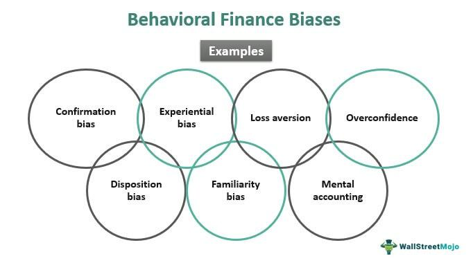

In the world of finance, understanding human behavior is crucial. Financial markets, driven by the actions and decisions of numerous participants, are inevitably influenced by human behavior. One of the fundamental ways that behavior impacts financial markets is through cognitive biases, which are systematic patterns of deviation from norm or rationality in judgment. These biases frequently lead to market anomalies, such as bubbles and crashes, which are often characterized by significant discrepancies between an asset’s market price and its intrinsic value.

Cognitive biases, like overconfidence, anchoring, and loss aversion, play a significant role in shaping financial decisions. For instance, overconfidence can lead to excessive trading and risk-taking, while anchoring might cause investors to rely too heavily on the initial information they receive, affecting price setting and market efficiency. Loss aversion, the tendency to prefer avoiding losses over acquiring equivalent gains, often results in risk-averse behavior, impacting asset pricing and portfolios management.

Behavioral finance, a burgeoning field that combines psychology and economic theory, studies these biases with the aim of improving financial decision-making processes. By identifying and understanding how cognitive biases alter financial behavior, behavioral finance offers insights that can be used to predict market trends and assist investors in making more rational decisions.

Algorithmic trading, which utilizes complex algorithms and electronic platforms to facilitate faster and more efficient trade executions, has begun to incorporate behavioral insights to enhance trading strategies. By integrating these insights, algorithmic trading systems can adjust to behavioral patterns observed in market participants, thus enhancing their efficacy in predicting market movements and optimizing investment returns.

This article explores these concepts and their impact on finance, highlighting the importance of understanding human behavior and its implications on markets. It provides an overview of how behavioral finance and algorithmic trading leverage cognitive biases to improve decision-making and trading performance in the financial sector.

## Table of Contents

## Understanding Financial Behavior and Cognitive Biases

Cognitive biases are systematic patterns of deviation from norm or rationality in judgment, whereby individuals create their subjective reality from their perception of the input. These cognitive biases significantly influence financial decisions, often leading to less than optimal outcomes. In finance, where decision-making under uncertainty is a recurring theme, understanding and recognizing these biases can be crucial.

Several common cognitive biases have been identified that consistently affect financial behavior. Overconfidence is one such bias, where investors overestimate their knowledge or predictive capabilities, often leading to excessive trading and risk-taking. This bias may result in the so-called "overconfidence effect," where the perceived probability of a given event or information being correct exceeds the actual probability.

Loss aversion, another prevalent bias, describes a situation where the pain of losing is psychologically twice as powerful as the pleasure of gaining. In financial terms, this bias can cause investors to hold losing assets for too long to avoid realizing a loss, often resulting in further financial deterioration. The Prospect Theory, introduced by Daniel Kahneman and Amos Tversky, mathematically formalizes this concept and demonstrates how loss aversion affects decision-making. According to the theory, people evaluate potential losses and gains asymmetrically, placing greater weight on perceived losses compared to equivalent gains.

Anchoring refers to the tendency to rely too heavily on the first piece of information encountered (the "anchor") when making decisions. In the context of investing, an individual might fixate on certain stock price targets or historical prices, which can lead to poor adjustment and subsequent decision errors, particularly in volatile markets.

These biases not only affect individual investor behavior but also have broader implications on market trends and anomalies. For instance, overconfidence can lead to increased market [volatility](/wiki/volatility-trading-strategies) due to excessive trading activity. Similarly, collective loss aversion during periods of market downturns can result in amplified sell-offs and market crashes. Anchoring bias, when widespread among investors, can distort asset prices, leading to mispricing and bubbles.

The study of how these cognitive biases impact financial decisions has given rise to the field of behavioral finance, which aims to integrate psychological insights into financial theories. Traditional finance models, like the efficient market hypothesis, assume that investors act rationally. However, behavioral finance challenges this notion by considering how emotional and cognitive factors affect investor behavior and market dynamics.

Behavioral finance focuses on understanding and addressing these biases, thereby enabling more informed and rational decision-making. For instance, by recognizing the inherent biases such as overconfidence or loss aversion, investors and financial advisers can implement strategies to combat these influences. Techniques include diversification to mitigate risk or setting predetermined rules for buying or selling assets, which can help in reducing emotional decision-making.

Overall, the recognition and study of cognitive biases through behavioral finance have transformed our understanding of market dynamics and investor behavior, highlighting the complexity and often irrational nature of financial decision-making processes.

## Behavioral Finance: An Overview

Behavioral finance, as a subset of behavioral economics, applies psychological influences and cognitive biases to understand how they affect the financial behaviors of investors and financial markets. Unlike traditional finance theories, which often assume that individuals are rational actors driven purely by logical decision-making and efficient markets, behavioral finance acknowledges that individuals are often influenced by emotions and irrational biases, leading to deviations from expected financial principles.

Traditional finance, grounded in models like the Efficient Market Hypothesis (EMH), suggests that asset prices fully reflect all available information, implying that it is impossible to consistently achieve higher returns than the market average without assuming additional risk. In contrast, behavioral finance challenges this notion by identifying systematic factors and cognitive biases that can lead to predictable errors in judgment.

Key principles of behavioral finance include:

1. **Overconfidence Bias**: This reflects a tendency for individuals to overestimate their knowledge and abilities, potentially leading to excessive trading and risk-taking.

2. **Loss Aversion**: Originating from Prospect Theory by Nobel laureates Daniel Kahneman and Amos Tversky, this principle emphasizes that individuals experience losses more intensely than gains of the same magnitude, influencing them to make risk-averse or sometimes risk-seeking choices to avoid losses.

3. **Anchoring**: This bias denotes the human tendency to rely heavily on the first piece of information encountered (the "anchor") when making decisions, leading to poorly informed financial judgments.

Understanding these biases allows investors and financial professionals to develop strategies that mitigate cognitive errors. For instance, acknowledging overconfidence can encourage more conservative trading strategies, while awareness of loss aversion might lead investors to reassess their risk tolerance and portfolio choices more objectively.

Numerous case studies illustrate the application of behavioral finance. For instance, the dot-com bubble of the late 1990s can be partly attributed to overconfidence and herd behavior, where investors excessively valued tech stocks without considering their inherent risks. Similarly, loss aversion is often observed in how investors react to market downturns, frequently leading to panic selling.

In another example, Richard Thaler, a prominent figure in behavioral finance, demonstrated through his work how small nudges, backed by an understanding of cognitive biases, can significantly impact saving behaviors and retirement planning among individuals, showcasing practical applications and tangible improvements in financial decision-making.

By integrating behavioral insights, financial professionals can better predict market trends, recognize areas of potential irrationality, and ultimately achieve improved financial outcomes. Continued exploration and application of behavioral finance principles promise to enhance both individual and institutional investment strategies, offering a critical toolkit for navigating the complexities of modern financial markets.

## Role of Behavioral Finance in Trading

Psychology plays a vital role in trading decisions, influencing traders' perceptions, judgments, and actions in the financial markets. Traders often encounter various psychological traps, such as overconfidence, confirmation bias, and the fear of missing out (FOMO), which can lead to suboptimal decision-making and financial losses.

Overconfidence can lead traders to overestimate their knowledge or ability, causing excessive risk-taking or frequent trading, a behavior known as overtrading. Confirmation bias might cause them to seek information that supports their existing beliefs while ignoring contradictory data, potentially leading to poor market entry or [exit](/wiki/exit-strategy) decisions. FOMO can drive traders to buy assets impulsively due to fear of missing a lucrative opportunity, often resulting in buying near market peaks.

Behavioral finance offers strategies to mitigate these biases by increasing traders' awareness of their psychological tendencies and providing tools to manage them. For instance, traders can use checklists to counteract impulsive decisions, implement stop-loss orders to manage risks, and maintain trading journals to reflect on previous trades and biases.

Integrating behavioral finance into trading algorithms involves incorporating these psychological insights to enhance algorithmic decision-making. Algorithms can be programmed to recognize and adapt to market conditions influenced by collective trader behaviors, such as herd mentality or panic selling. By accounting for common biases, algorithms can adjust their strategies, potentially outperforming models that rely solely on traditional financial theories.

Moreover, behavioral finance can improve trading performance by encouraging balanced decision-making. Traders who understand their cognitive biases are more likely to make rational, objective choices. For instance, algorithms that incorporate sentiment analysis can gauge market mood, adjusting trading strategies accordingly. By measuring sentiment through social media data or news sentiment scores, algorithms can anticipate market movements driven by trader emotions.

Incorporating behavioral insights into trading systems presents challenges, such as quantifying qualitative data like sentiment and continuously updating models to reflect evolving psychological patterns. Nevertheless, successful implementation can yield significant benefits, including enhanced risk management, better market timing, and increased profitability.

Future developments in this field may involve leveraging [artificial intelligence](/wiki/ai-artificial-intelligence) and [machine learning](/wiki/machine-learning) to automatically adapt to new behavioral patterns, further improving the integration of psychology and technology in finance. As the financial markets continue to evolve, understanding and applying behavioral finance principles in trading remains a crucial aspect for enhancing both human and [algorithmic trading](/wiki/algorithmic-trading) strategies.

## Algorithmic Trading and Behavioral Insights

Algorithmic trading, a method of executing orders using automated and pre-programmed trading instructions, has become a cornerstone of modern finance. By leveraging computational power and vast data sets, algorithmic trading seeks to optimize trading speed and efficiency, reduce manual errors, and improve investment outcomes. The integration of behavioral insights into these trading algorithms marks a significant advancement, where the understanding of cognitive biases and investor psychology enhances decision-making processes.

Behavioral insights are integrated into trading algorithms by incorporating models that account for common cognitive biases such as overconfidence, loss aversion, and herding behavior. These models can adjust trading strategies based on the expected irrational behaviors of market participants. For instance, during market overreactions driven by loss aversion, an algorithm might be programmed to anticipate a correction and adjust its trading patterns accordingly. 

The benefits of using behavioral models in trading are multifold. Firstly, they provide a layer of psychological analysis that can improve the accuracy of market predictions. Algorithms that [factor](/wiki/factor-investing) in behavioral insights can identify anomalies and inefficiencies that arise from irrational market behaviors, leading to potentially higher returns. Additionally, these models can enhance risk management by anticipating periods of market distress or euphoria driven by collective investor sentiment.

However, integrating behavioral models in trading also presents challenges. One primary concern is the complexity of accurately modeling human behavior, which can be unpredictable and influenced by numerous external factors. Furthermore, the over-reliance on these models might lead to systemic risks if many market participants adopt similar strategies, potentially exacerbating market volatility.

Successful implementation of behavioral-driven algorithms can be seen in various hedge funds and trading firms that have adopted such strategies. For example, firms like AQR Capital Management have utilized quantitative models incorporating behavioral insights to inform their investment strategies, leading to consistently strong performance.

Future trends in this field are likely to involve more advanced machine learning techniques and artificial intelligence, which can process large datasets to uncover deeper behavioral patterns. Innovations such as sentiment analysis via natural language processing, which can gauge market sentiment from social media and news sources, are also gaining traction. These advancements promise to enhance the adaptability and precision of behavioral-driven trading algorithms, allowing them to better navigate the complexities of human behavior in financial markets.

## Conclusion

Cognitive biases hold substantial influence over financial behavior, frequently contributing to suboptimal decision-making processes among investors and traders. These biases, such as overconfidence, loss aversion, and anchoring, can lead to predictable errors and market anomalies. Recognizing these influences is fundamental to constructing strategies that enhance financial outcomes.

Behavioral finance emerges as a pivotal tool for mitigating the adverse effects of cognitive biases. By understanding and addressing these mental shortcuts, investors and traders can make more rational, informed, and ultimately successful financial decisions. This field challenges traditional finance theories by incorporating psychological insights to develop strategies that reflect how individuals actually behave rather than how they are assumed to behave in classical economic theories.

Algorithmic trading is progressively utilizing these behavioral insights to optimize trading strategies. By integrating models that account for human behavior, trading algorithms can anticipate and react to market movements more effectively. This integration represents a significant evolution in trading practices, blending quantitative analysis with behavioral data to enhance decision-making processes.

Looking forward, the fusion of behavioral insights and advanced technology holds the potential to revolutionize finance. As algorithms become more sophisticated, they will increasingly incorporate behavioral models, offering more comprehensive solutions to market challenges. This trend underscores the importance of interdisciplinary approaches that unite psychology, finance, and technology to achieve superior market performance.

We encourage ongoing exploration into this dynamic and evolving field. As new research unveils deeper insights into human behavior, the potential for behavioral finance and algorithmic trading to reshape financial markets continues to expand. This synergy not only promises improved decision-making but also heralds a future where investors and traders are better equipped to navigate the complexities of financial environments.

## References & Further Reading

[1]: Kahneman, D., & Tversky, A. (1979). ["Prospect Theory: An Analysis of Decision under Risk."](https://www.jstor.org/stable/1914185) Econometrica, 47(2), 263-291.

[2]: Barberis, N., & Thaler, R. (2003). ["A Survey of Behavioral Finance."](https://www.nber.org/papers/w9222) Handbook of the Economics of Finance, 1, 1053-1128.

[3]: Shiller, R. J. (2003). ["From Efficient Markets Theory to Behavioral Finance."](https://www.aeaweb.org/articles?id=10.1257/089533003321164967) Journal of Economic Perspectives, 17(1), 83-104.

[4]: Thaler, R. H., & Sunstein, C. R. (2009). ["Nudge: Improving Decisions About Health, Wealth, and Happiness."](https://www.researchgate.net/publication/257178709_Nudge_Improving_Decisions_About_Health_Wealth_and_Happiness_RH_Thaler_CR_Sunstein_Yale_University_Press_New_Haven_2008_293_pp) Penguin Books.

[5]: Shefrin, H. (2000). ["Beyond Greed and Fear: Understanding Behavioral Finance and the Psychology of Investing."](https://academic.oup.com/book/27607) Harvard Business School Press.

[6]: Jansen, S. (2020). ["Machine Learning for Algorithmic Trading: Predictive Models to Extract Signals from Market and Alternative Data for Systematic Trading Strategies in Python."](https://www.amazon.com/Machine-Learning-Algorithmic-Trading-intelligence/dp/1839217715) Packt Publishing.

[7]: De Bondt, W. F. M., & Thaler, R. (1985). ["Does the Stock Market Overreact?"](https://onlinelibrary.wiley.com/doi/full/10.1111/j.1540-6261.1985.tb05004.x) The Journal of Finance, 40(3), 793-805.