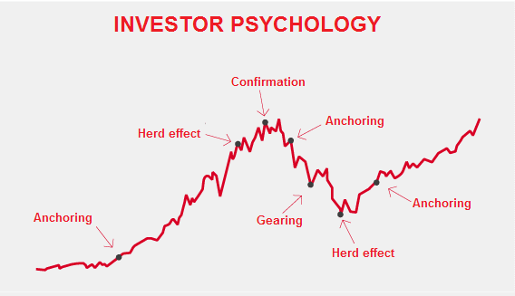

## Table of Contents

## What is behavioral finance and how does it relate to algo trading?

Behavioral finance is a field that studies how psychological influences and biases affect the financial decisions people make. It looks at why people might not always make the best choices when it comes to money, like buying stocks based on emotions rather than facts. For example, people might hold onto losing investments hoping they will bounce back, or they might follow the crowd and buy stocks just because everyone else is buying them. These behaviors can lead to mistakes in the stock market.

Algo trading, or algorithmic trading, uses computer programs to buy and sell stocks based on set rules and data. It tries to remove human emotions from trading decisions, which is where behavioral finance comes in. By understanding how emotions and biases can affect trading, algo trading can be designed to avoid these pitfalls. For instance, an algorithm might be programmed to sell a stock if it drops to a certain price, without getting influenced by the hope that the price will recover. This way, algo trading can make more rational decisions and potentially perform better than human traders who might be swayed by their emotions.

## Can you explain the basic principles of behavioral finance?

Behavioral finance looks at how people's feelings and thinking can affect their choices about money. It says that people don't always make smart choices about money because they can be influenced by things like fear, hope, or what other people are doing. For example, someone might buy a stock just because everyone else is buying it, even if it's not a good investment. This is called herd behavior. Another common mistake is when people hold onto a stock that's losing money, hoping it will go back up. This is known as loss aversion.

Another important idea in behavioral finance is overconfidence. This is when people think they know more about the stock market than they really do, and they might take big risks because of it. Behavioral finance also talks about how people often focus too much on recent events and forget about the bigger picture. This is called recency bias. By understanding these behaviors, people can try to make better money choices and avoid common mistakes.

## How do behavioral biases affect trading algorithms?

Behavioral biases can affect trading algorithms in a few ways. When people design trading algorithms, they might accidentally include their own biases into the code. For example, if a person tends to hold onto losing stocks because they hope the price will go back up, they might program the algorithm to do the same thing. This means the algorithm won't be as good at making money as it could be, because it's making the same mistakes people do.

To make trading algorithms better, it's important to understand these biases and try to avoid them. If an algorithm is designed to ignore emotions like fear or hope, it can make decisions based only on data and rules. This can help the algorithm buy and sell stocks more effectively, without getting caught up in the same mistakes that people often make because of their feelings.

## What are common behavioral biases that algo traders should be aware of?

Algo traders should be aware of several common behavioral biases that can creep into their trading algorithms. One big bias is overconfidence, where traders might think they know more about the market than they really do. This can lead them to take bigger risks, thinking they can predict the market better than they can. Another common bias is loss aversion, where traders hold onto losing stocks hoping they'll recover, instead of selling them and cutting their losses. This can make the algorithm less effective because it's not making decisions based on the best data.

Another important bias to watch out for is herd behavior, where traders might follow what everyone else is doing, buying stocks just because others are buying them. This can lead to buying stocks at high prices that might not be good investments. Recency bias is also a problem, where traders focus too much on recent events and ignore the bigger picture. This can make the algorithm react too quickly to short-term changes without considering long-term trends. By understanding these biases, algo traders can design their algorithms to make better, more rational decisions and avoid common pitfalls that come from human emotions and thinking.

## How can algo trading strategies be designed to mitigate the impact of behavioral biases?

Algo trading strategies can be designed to mitigate the impact of behavioral biases by focusing on data and rules, rather than human emotions. For example, to avoid overconfidence, traders can program their algorithms to stick to a set of pre-defined rules and not take unnecessary risks. Instead of making big bets based on a feeling of knowing the market, the algorithm can be set up to only trade when certain conditions are met, like when a stock's price reaches a specific level. This helps keep the trading decisions more rational and less influenced by the trader's confidence level.

To deal with loss aversion, algorithms can be set up to automatically sell stocks when they drop to a certain price, rather than holding onto them in the hope they will recover. This way, the algorithm cuts losses quickly and doesn't get stuck with stocks that keep losing value. Herd behavior can also be avoided by making sure the algorithm doesn't just follow what other traders are doing. Instead, it can be programmed to look at the data and make decisions based on that, rather than following the crowd. By setting up these rules, algo trading can help avoid the common mistakes that come from human biases.

## What role does sentiment analysis play in behavioral finance within algo trading?

Sentiment analysis is a tool that helps understand what people are feeling about the stock market. It looks at things like news articles, social media posts, and other writings to see if people are feeling positive, negative, or neutral about certain stocks or the market in general. In algo trading, sentiment analysis can be used to make better trading decisions by figuring out how the public's mood might affect stock prices. For example, if a lot of people are talking positively about a company, that might mean its stock price could go up, so the algorithm might decide to buy that stock.

By using sentiment analysis, algo traders can try to predict how people's feelings will move the market. This is important because behavioral finance tells us that people's emotions can really affect their investment choices. If an algorithm can see that people are getting scared or excited about the market, it can make trades that take advantage of these feelings. This way, the algorithm can make smarter decisions and maybe make more money by understanding and using the public's mood to its advantage.

## How can machine learning be used to identify and counteract behavioral biases in trading?

Machine learning can help find and fix behavioral biases in trading by looking at lots of data and spotting patterns that people might miss. For example, it can see when traders are holding onto losing stocks because of hope or fear, which is called loss aversion. By finding these patterns, [machine learning](/wiki/machine-learning) can help create rules for trading algorithms that avoid these mistakes. Instead of letting emotions like hope or fear guide decisions, the algorithm can follow a plan based on data and facts, which can lead to better trading results.

Another way machine learning can help is by figuring out when traders are following the crowd too much, which is known as herd behavior. By looking at past trading data, machine learning can see when this happens and then set up the trading algorithm to make decisions based on its own analysis instead of just copying what others are doing. This can help the algorithm make smarter trades and not get caught up in the same mistakes that come from following the crowd. By using machine learning to understand and avoid these biases, trading can become more effective and less influenced by human emotions.

## What are some case studies where behavioral finance has significantly influenced algo trading outcomes?

One well-known case study is the flash crash of May 6, 2010. During this event, the stock market dropped a lot very quickly, and then it came back up just as fast. Behavioral finance tells us that people can get scared and sell their stocks when they see prices falling fast. Algo trading algorithms, designed to trade quickly based on data, were affected by this fear. Some algorithms started selling stocks because they saw the prices dropping, which made the prices drop even more. This shows how algorithms can pick up on human emotions and make the problem worse if they're not careful.

Another example is the rise and fall of GameStop stock in early 2021. A lot of people on social media started talking about buying GameStop stock, and the price went up a lot. This is called a short squeeze, where people who bet the stock would go down had to buy it back at higher prices, pushing the price even higher. Behavioral finance explains this as herd behavior, where people buy stocks just because others are buying them. Algo trading algorithms had to deal with this situation. Some algorithms were set up to buy GameStop stock because they saw the price going up, while others sold it when the price started to drop. This shows how understanding human behavior can help design better algorithms that don't just follow the crowd.

## How do regulatory frameworks address behavioral finance in the context of algorithmic trading?

Regulatory frameworks around the world are starting to pay more attention to behavioral finance when it comes to algo trading. They know that people's feelings and mistakes can affect how trading algorithms work. So, they make rules to help make sure that algorithms don't make the same mistakes that people do because of emotions. For example, they might require that trading algorithms have certain safety measures to stop them from selling too much when the market is falling fast, like during a flash crash. This helps keep the market stable and stops one algorithm from making things worse for everyone else.

Another way regulators address this is by setting up rules about how algorithms are tested and watched. They want to make sure that before an algorithm starts trading, it's been checked to see if it can handle different situations without getting too influenced by things like fear or hope. They also keep an eye on how these algorithms are doing once they're in use, to make sure they're not causing problems because of human biases. By doing this, regulators try to make algo trading safer and more fair for everyone.

## What advanced techniques exist for integrating behavioral finance into algo trading systems?

One advanced technique for integrating behavioral finance into algo trading systems is using machine learning to predict how people's feelings might affect the market. By looking at lots of data from the past, machine learning can find patterns that show when people are acting based on fear, hope, or other emotions. This helps the algo trading system make better decisions by figuring out when these emotions might make the market go up or down. For example, if the system sees that people are getting scared and selling a lot, it can decide to sell before the prices drop too much, or it might even buy if it thinks the fear is overblown and the market will bounce back.

Another technique is using sentiment analysis to understand what people are thinking and feeling about the market. This involves looking at news articles, social media posts, and other writings to see if people are feeling good or bad about certain stocks or the market in general. The algo trading system can then use this information to make trades that take advantage of these feelings. If a lot of people are talking positively about a company, the system might decide to buy that stock because it thinks the price will go up. By understanding and using the public's mood, the algo trading system can make smarter decisions and possibly make more money.

## How can real-time behavioral data be effectively incorporated into trading algorithms?

Real-time behavioral data can be effectively incorporated into trading algorithms by using tools like sentiment analysis. This means looking at what people are saying on social media, in news articles, and other places to see if they are feeling good or bad about the market or certain stocks. The trading algorithm can then use this information to make decisions. For example, if a lot of people are talking positively about a company, the algorithm might decide to buy that company's stock because it thinks the price will go up. This way, the algorithm can take advantage of how people's feelings might affect stock prices.

To make sure this works well, the trading algorithm needs to be able to quickly process and understand this real-time data. It should also have rules set up to avoid common mistakes that come from human emotions, like holding onto losing stocks or following the crowd. By combining real-time behavioral data with these rules, the algorithm can make smarter trading decisions. This can help it perform better than if it just looked at numbers and didn't consider how people's feelings might move the market.

## What future trends are expected in the intersection of behavioral finance and algo trading?

In the future, we can expect more use of [artificial intelligence](/wiki/ai-artificial-intelligence) and machine learning in algo trading to better understand and use behavioral finance. These technologies will get better at figuring out how people's feelings and actions affect the stock market. For example, they might use more real-time data from social media and news to see what people are thinking and feeling about the market. This can help trading algorithms make smarter decisions by understanding how emotions like fear or hope might move stock prices. As these technologies improve, trading algorithms will become even better at avoiding common mistakes that people make because of their feelings.

Another trend we might see is more focus on using behavioral data to make trading more fair and stable. Regulators and trading firms will probably use this data to create better rules and safety measures for algo trading. This can help stop big problems like flash crashes, where the market drops a lot very quickly because of fear or other emotions. By understanding how people's behavior affects trading, we can design algorithms that don't make the same mistakes and help keep the market stable. This way, algo trading can be safer and more reliable for everyone.

## References & Further Reading

Thaler, R. H. (1993). Advances in Behavioral Finance, Volume II, provides a comprehensive exploration of the field of behavioral finance, analyzing how psychological factors affect market outcomes. This [volume](/wiki/volume-trading-strategy) delves into the theoretical frameworks and empirical studies that have shaped the understanding of investor behavior and market efficiency.

Kahneman, D. (2011). Thinking, Fast and Slow, offers insights into the dual systems of thought that govern decision-making processes. Kahneman's work is instrumental in understanding cognitive biases that influence financial decisions and market trends.

Barberis, N., & Thaler, R. (2003). A Survey of Behavioral Finance, surveys crucial developments in behavioral finance, highlighting significant findings about human behavior's impact on financial markets. This work identifies key biases and heuristics that challenge traditional economic theories.

Chen, G., & Weigand, R. A. (2004). Behavioral finance: An overview of key concepts, presents an accessible introduction to the core principles of behavioral finance. This article emphasizes the role of irrational behavior in investment decisions and its implications for market efficiency.

Montier, J. (2010). Behavioral Finance: Insights into Irrational Minds and Markets, explores psychological factors that cause seemingly irrational behavior in financial markets. Montier combines theoretical insights with practical examples to explain how biases manifest in trading strategies.

Ritter, J. R. (2003). Behavioral Finance, discusses key concepts in behavioral finance, focusing on the deviations from rationality observed in market participants. Ritter examines how these deviations create opportunities and challenges within financial markets.

Pompian, M. M. (2011). Behavioral Finance and Wealth Management, integrates behavioral finance principles into wealth management strategies. The book provides tools for financial advisors to better understand their clients' behaviors and improve investment outcomes.

De Bondt, W. F. M., & Thaler, R. H. (1985). Does the Stock Market Overreact?, investigates the phenomenon of overreaction in stock markets. This pioneering study demonstrates how investors' overreactions to news can lead to price anomalies and potential profit opportunities.

Shefrin, H. (2002). Beyond Greed and Fear: Understanding Behavioral Finance and the Psychology of Investing, offers readers an in-depth examination of the psychological forces that drive financial markets. Shefrin explains how emotions such as greed and fear influence investor behavior and affect market dynamics.

