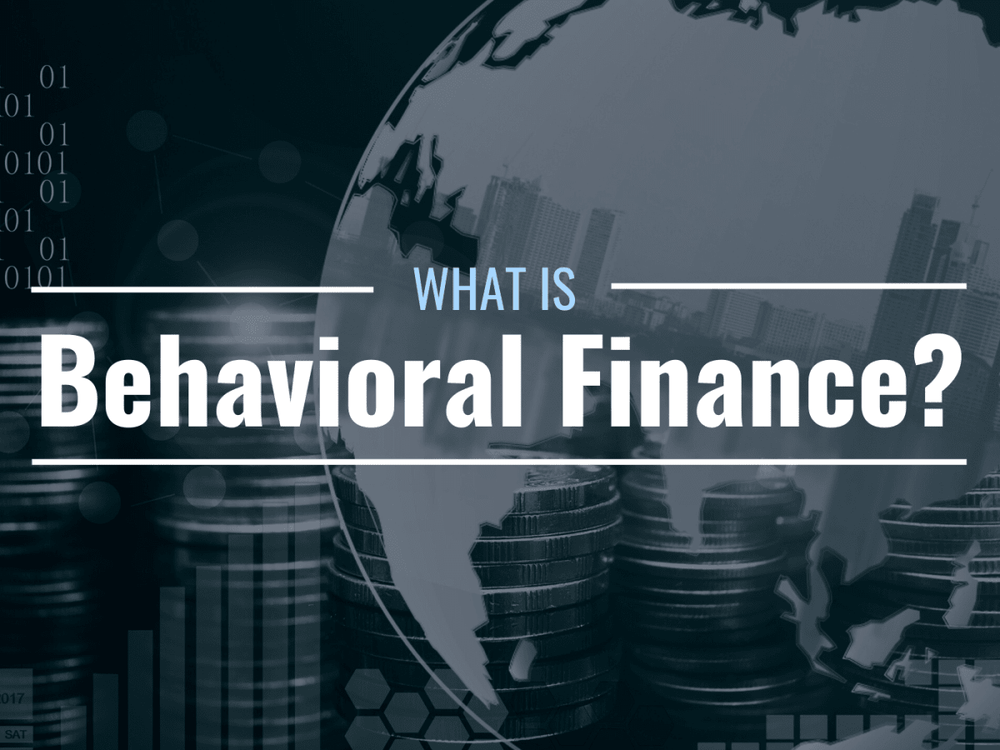

## Table of Contents

## What is behavioral finance and why is it important?

Behavioral finance is a field that combines psychology and economics to understand why people make certain financial decisions. It looks at how emotions, biases, and other psychological factors can affect the way people invest, save, and spend money. Instead of assuming that people always make rational choices, behavioral finance recognizes that humans often make decisions based on feelings or mental shortcuts, which can lead to mistakes.

Understanding behavioral finance is important because it helps explain why markets don't always behave as traditional economic theories predict. For example, people might buy stocks just because they're going up in price, even if the stocks are overvalued. This can create bubbles and crashes. By studying behavioral finance, investors and financial advisors can learn to recognize and avoid common pitfalls, like being overly influenced by recent events or following the crowd without thinking critically. This knowledge can lead to better financial decisions and more stable markets.

## How does behavioral finance differ from traditional finance?

Behavioral finance and traditional finance look at money decisions in different ways. Traditional finance thinks that people always make smart choices based on all the information they have. It believes that people are good at figuring out what's best for them and will always try to make more money while taking the least risk possible. This idea is called the "rational actor" model, where everyone is logical and wants to do what's best for their wallet.

On the other hand, behavioral finance says that people don't always make smart choices. It looks at how feelings and habits can make people do things that aren't the best for their money. For example, someone might sell their stocks just because they're scared, even if it's not a good time to sell. Behavioral finance studies these kinds of mistakes and tries to understand why people make them. It helps explain why markets can be unpredictable and why people sometimes do things that don't make sense financially.

## What are some common cognitive biases that affect financial decision-making?

One common cognitive bias that affects financial decision-making is overconfidence. This happens when people think they know more than they actually do. They might believe they can predict the stock market or pick winning investments better than others. This can lead them to take big risks without realizing how dangerous it might be. For example, someone might trade stocks often, thinking they can always beat the market, but end up losing money because they're not as good at predicting as they thought.

Another bias is loss aversion, where people feel the pain of losing money more than the joy of gaining it. This can make them hold onto losing investments too long, hoping they'll bounce back, instead of cutting their losses and moving on. It can also stop them from taking good risks that might pay off because they're too scared of losing what they have. For instance, someone might keep a stock that's going down in value because they can't stand the idea of selling it at a loss, even though it might be smarter to sell and invest in something else.

A third bias is the herd mentality, where people follow what others are doing without thinking for themselves. If everyone is buying a certain stock, they might jump in too, even if it's not a good investment. This can create bubbles where prices go way up because of hype, not because the investment is actually worth that much. When the bubble bursts, people who followed the herd can lose a lot of money. For example, during a stock market craze, someone might buy a popular stock just because everyone else is, without checking if it's really a good buy.

## Can you explain the concept of loss aversion in behavioral finance?

Loss aversion is a big idea in behavioral finance. It means that people feel the pain of losing money much more than they feel happy about gaining money. Imagine you find $100 on the street. You'd be happy, but if you lost $100, you'd feel a lot worse. This feeling can make people do things that aren't smart with their money. They might hold onto investments that are losing money because they can't stand the idea of selling at a loss. They might also avoid taking good risks because they're too scared of losing what they have.

This behavior can lead to big problems. For example, someone might keep a stock that's going down in value, hoping it will go back up, instead of selling it and moving on. They're so scared of locking in a loss that they end up losing even more money. On the other hand, they might miss out on good investments because they're too afraid to take any risk at all. Understanding loss aversion can help people make better choices by knowing why they feel the way they do about their money.

## How does overconfidence bias impact investment decisions?

Overconfidence bias makes people think they know more than they really do. In investing, this means they might believe they can predict the stock market or pick winning stocks better than most people. They might trade stocks a lot, thinking they can always beat the market. But this can lead them to take big risks without realizing how dangerous it could be. For example, someone might buy and sell stocks all the time, thinking they're making smart moves, but they end up losing money because they're not as good at predicting as they thought.

This overconfidence can also make people ignore advice from experts or not do enough research. They might think they don't need to listen to others because they believe they know best. This can lead to big mistakes, like investing all their money in one stock or betting on risky investments without understanding them fully. Overconfidence can make the stock market more unpredictable because so many people are making decisions based on what they think they know, not on what's really happening.

## What role do emotions play in financial markets according to behavioral finance?

Emotions play a big part in financial markets according to behavioral finance. People often make money choices based on how they feel, not just on what makes the most sense. For example, if everyone is excited about a stock and its price is going up, more people might buy it just because they feel good about it. This can make the stock's price go up even more, even if it's not really worth that much. But if people start to feel scared or worried, they might sell their stocks quickly, making the prices drop fast.

These emotional reactions can create big swings in the market. When everyone feels the same way at the same time, it can lead to bubbles or crashes. A bubble happens when prices go way up because of excitement, but then they crash when people start to feel scared. Understanding how emotions affect the market can help people make better choices. Instead of just following their feelings, they can try to think more clearly about their investments and not get caught up in the ups and downs caused by everyone else's emotions.

## How can understanding behavioral finance help in creating better investment strategies?

Understanding behavioral finance can help people make better investment strategies by showing them the common mistakes they might make because of their feelings and habits. For example, if someone knows about loss aversion, they might be less likely to hold onto a losing stock just because they can't stand the idea of selling it at a loss. Instead, they can make a plan to sell it at a certain point and move their money to a better investment. Knowing about overconfidence can also help. If someone realizes they might be too sure of their own predictions, they might do more research or listen to expert advice before making big decisions.

By understanding these biases and emotions, people can create rules for themselves to follow, like setting clear goals and sticking to them, no matter how they feel at the moment. They might decide to invest regularly, no matter if the market is going up or down, instead of trying to time the market based on their feelings. This can lead to a more steady and successful investment strategy over time. In the end, knowing about behavioral finance helps people be more aware of their own actions and make choices that are based on what's best for their money, not just how they feel right now.

## What are the implications of herd behavior in financial markets?

Herd behavior in financial markets happens when a lot of people do the same thing at the same time, like buying or selling a certain stock, just because others are doing it. This can make prices go up really fast if everyone is buying, creating a bubble. A bubble is when the price of something goes way higher than it should be, just because everyone wants it. But if everyone suddenly starts selling, the prices can drop just as fast, causing a crash. This can be bad for the market because it makes prices move in ways that don't make sense, based on what everyone else is doing, not on what the investments are really worth.

Understanding herd behavior can help people make better choices with their money. If someone knows that everyone else is buying a stock just because it's popular, they might think twice before jumping in. They might do their own research and decide if the stock is really a good investment, instead of just following the crowd. This can help them avoid getting caught in a bubble that might burst later. By not following the herd, people can make more steady and smart choices with their investments, which can lead to better results over time.

## Can you discuss the impact of framing effects on financial choices?

Framing effects happen when the way information is presented changes how people make choices. In finance, this means that how a question or investment option is described can make people decide differently, even if the facts stay the same. For example, if an investment is described as having a 95% chance of success, people might be more likely to choose it than if it's described as having a 5% chance of failure. Even though both statements mean the same thing, the way they're framed can make people feel differently about the risk.

This can have a big impact on financial decisions. People might choose investments that sound safer or more profitable just because of the way they're described, not because they're actually better choices. For instance, if a financial advisor frames a choice as avoiding a loss instead of gaining a smaller amount, people might go for that option because they're more scared of losing money than excited about gaining it. Understanding framing effects can help people see past the words and focus on the real facts, so they can make better financial choices based on what's truly important to them.

## How do prospect theory and behavioral finance intersect?

Prospect theory and behavioral finance are closely connected because prospect theory is a big part of understanding how people make financial choices. Prospect theory says that people don't always make decisions based on what makes the most sense. Instead, they look at possible gains and losses from their current situation. They feel the pain of losing money more than the joy of gaining it, which is called loss aversion. This idea is really important in behavioral finance because it helps explain why people might hold onto losing investments too long or avoid good risks because they're too scared of losing what they have.

Behavioral finance uses ideas like prospect theory to explain why markets can be unpredictable. It shows that people's emotions and habits can make them do things that don't make financial sense. For example, if someone is scared of losing money, they might make choices that aren't the best for their wallet. By understanding prospect theory, people in behavioral finance can see why markets sometimes go up or down in ways that traditional finance theories can't explain. This helps investors and advisors make better plans and avoid common mistakes based on how people really behave with their money.

## What are some advanced models used in behavioral finance research?

One advanced model used in behavioral finance research is the Cumulative Prospect Theory (CPT). This model builds on the original prospect theory by adding a few new ideas. It looks at how people make choices when they face risks. CPT says that people don't just look at the final amount of money they might win or lose. Instead, they think about how much they could gain or lose from their current situation. It also takes into account that people feel differently about small and big changes in their money. This model helps explain why people might take a big risk for a small gain or avoid a small risk if it means they could lose a lot.

Another model is the Behavioral Portfolio Theory (BPT). This model says that people don't just try to make their money grow as much as possible. Instead, they create a mix of investments that meet different goals. Some parts of their portfolio might be safe and aimed at keeping their money secure, while other parts might be riskier and aimed at growing their money. BPT helps explain why people might have a mix of safe and risky investments, even if it doesn't seem to make the most financial sense. It shows that people are trying to balance their need for security with their hopes for big gains, which can lead to different investment choices than traditional finance would predict.

## How can behavioral finance principles be applied to improve financial planning and advisory services?

Behavioral finance principles can help financial planners and advisors understand why people make the money choices they do. Instead of just telling people what to do, advisors can learn about common mistakes people make because of their feelings and habits. For example, if someone is scared of losing money, an advisor can help them see that holding onto a losing investment might not be the best choice. They can also help people set up plans that take these feelings into account, like setting clear goals and rules for when to buy or sell investments. This way, people can make better choices based on what's really best for their money, not just how they feel right now.

Advisors can also use behavioral finance to help people avoid following the crowd without thinking. If everyone is excited about a certain stock, an advisor can remind their clients to do their own research and not just jump in because everyone else is. They can also help people understand the risks of being too sure of their own predictions, which is called overconfidence. By knowing about these biases, advisors can guide their clients to make more steady and smart choices over time. This can lead to better financial planning and help people reach their money goals more successfully.

## References & Further Reading

[1]: Kahneman, D. (2011). ["Thinking, Fast and Slow."](https://link.springer.com/article/10.1007/s00362-013-0533-y) Farrar, Straus and Giroux.

[2]: Thaler, R. H. (2005). ["Advances in Behavioral Finance, Volume II."](https://www.degruyter.com/document/doi/10.1515/9781400829125/html) Princeton University Press.

[3]: Barberis, N., & Thaler, R. (2003). ["A Survey of Behavioral Finance."](https://www.nber.org/papers/w9222) In Handbook of the Economics of Finance, edited by G. Constantinides, M. Harris, and R. Stulz. North-Holland.

[4]: Aldridge, I. (2013). ["High-Frequency Trading: A Practical Guide to Algorithmic Strategies and Trading Systems."](https://www.amazon.com/High-Frequency-Trading-Practical-Algorithmic-Strategies/dp/1118343506) Wiley.

[5]: Lo, A. W. (2012). ["Adaptive Markets: Financial Evolution at the Speed of Thought."](https://www.jstor.org/stable/j.ctvc77k3n) Princeton University Press.

[6]: Shleifer, A. (2000). ["Inefficient Markets: An Introduction to Behavioral Finance."](https://academic.oup.com/book/27761) Oxford University Press.