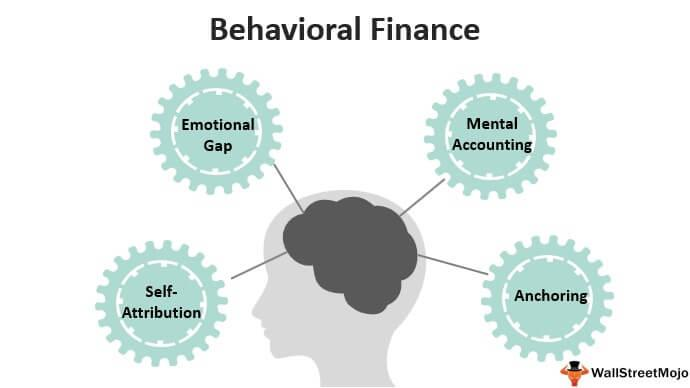

The world of finance is an intricate network of variables that significantly impact decision-making for both individual and institutional investors. Among these variables, investor psychology, behavioral finance, and algorithmic trading stand out as pivotal factors in shaping modern financial strategies. Each of these elements contributes uniquely to the financial decision-making landscape, offering insights into market dynamics and investor behavior.

Investor psychology delves into the cognitive processes that influence investment choices, often swayed by biases such as overconfidence and loss aversion. These biases can lead to irrational decision-making and erratic market behaviors, such as bubbles and crashes. Recognizing and understanding psychological biases can enable investors to make more rational financial decisions by integrating risk assessment and disciplined trading strategies.



Behavioral finance expands upon these psychological insights by examining how collective human behavior affects market outcomes, challenging the traditional efficient market hypothesis. It explains market anomalies that cannot be accounted for by traditional financial theories, such as herding behavior and the disposition effect. By analyzing these anomalies, investors can gain a deeper understanding of market trends and potentially exploit these patterns to their advantage, leading to more robust investment strategies.

On the technological front, algorithmic trading represents a convergence of finance and technology, utilizing automated, rule-based systems to execute trades with remarkable speed and efficiency. These systems leverage big data and predictive analytics to identify lucrative trading opportunities while minimizing human error. However, the inherent risks, such as flash crashes, require investors to have a nuanced understanding of these algorithms and incorporate human oversight to optimize their performance.

By exploring investor psychology, behavioral finance, and algorithmic trading, this article aims to enhance the strategic approaches of investors in an ever-evolving financial market. Understanding and integrating these components can provide a comprehensive framework for making informed decisions and achieving financial goals while navigating the complexities of the modern financial landscape.

## Table of Contents

## The Role of Investor Psychology

Investor psychology significantly influences financial decision-making processes. Psychological biases can lead investors away from rational choices, affecting both their personal investment outcomes and broader market dynamics.

Among the key biases affecting investors are overconfidence, availability bias, and loss aversion. Overconfidence often leads investors to overestimate their knowledge and predictive abilities, resulting in excessive trading and risk-taking. For instance, overconfident investors may ignore risk management principles, potentially causing significant financial losses. Availability bias, another common tendency, occurs when individuals rely on immediate examples that come to mind when evaluating a topic or making a decision. This bias might cause an investor to judge market conditions based mainly on recent news headlines, ignoring broader trends or historical data.

Loss aversion highlights investors' tendency to prefer avoiding losses rather than acquiring equivalent gains. The emotional impact of a loss can be twice as powerful as the pleasure derived from a gain. This can lead investors to hold onto losing stocks too long, hoping to break even, rather than cutting losses early. Fear and greed are powerful emotions that frequently drive market trends, often resulting in bubbles and crashes. During bull markets, greed can inflate asset prices as investors rush to get in on a rising trend, sometimes leading to unsustainable bubbles. Conversely, during bear markets, fear can cause widespread sell-offs, exacerbating market downturns.

To make more rational investment decisions, understanding one's psychological makeup is vital. Investors benefit from introspection and education about their behavioral tendencies. By recognizing personal biases, investors can work towards mitigating their effects. Several strategies can help manage the psychological impacts on investing. Diversification reduces risk by spreading investments across various asset classes, industries, or geographic regions, potentially stabilizing returns despite market fluctuations. Risk assessment plays a crucial role in assessing and prioritizing investments based on acceptable levels of risk, aligning with individual or institutional capacity for loss.

Disciplined trading is another crucial strategy, often involving setting predefined rules for buying and selling investments. This approach can include stop-loss orders to automatically sell a security when it reaches a certain price, thus limiting potential losses. By adhering to a well-thought-out trading plan, investors minimize the emotional reactions that often lead to irrational decisions.

Understanding investor psychology is critical to navigating the complexities of financial markets. By recognizing and adjusting for psychological biases, investors can make more informed, rational decisions that align with their financial objectives.

## Behavioral Finance: Understanding Market Anomalies

Behavioral finance is a field of study that examines the influences of psychological factors on financial decision-making and market behavior. It challenges traditional finance theories, which often assume rational behavior and efficient markets. Behavioral finance proposes that cognitive biases and emotions can lead to irrational financial decisions and market anomalies that deviate from the predictions of classical models.

One of the primary concepts explored in behavioral finance is herding behavior, where investors tend to follow the actions of the majority rather than relying on their own analysis. This behavior can lead to asset bubbles or abrupt market declines. For example, during a bubble, investors may continue to buy assets due to the fear of missing out, even when prices are significantly overvalued. Conversely, in a downturn, panic selling may occur as investors seek to minimize losses, further exacerbating the decline.

Another notable market anomaly under behavioral finance is the disposition effect, where investors are prone to sell assets that have increased in value while retaining those that have decreased in value. This behavior is often driven by the desire to "lock in" gains and the reluctance to realize losses, which can result in suboptimal investment returns. The disposition effect contrasts with the principle of cutting losses and letting profits run, often advocated in traditional investment strategies.

By understanding and recognizing these patterns, investors can develop more effective strategies to anticipate and respond to market movements. For instance, awareness of herding behavior might prompt an investor to analyze whether a prevailing market trend is based on sound fundamentals or simply a result of collective sentiment. Similarly, by acknowledging their own susceptibility to the disposition effect, investors can structure their decision-making processes to avoid emotional errors.

Incorporating insights from behavioral finance can lead to the formation of more robust investment strategies. By integrating knowledge of psychological biases into portfolio management, investors can tailor strategies that account for these biases, potentially improving returns and reducing risk. For example, an investor could use systematic investment approaches, such as defined rebalancing rules or automated trading algorithms, to mitigate the impact of emotional biases on their portfolio decisions.

Overall, incorporating behavioral finance into investment practice provides a more nuanced understanding of market dynamics and enhances strategic investment approaches by accounting for human behavior in financial contexts.

## Algorithmic Trading: The Intersection of Technology and Finance

Algorithmic trading employs automated, rule-based systems to execute trades at unprecedented speeds, revolutionizing the financial markets. By leveraging big data and predictive analytics, these algorithms can sift through vast amounts of information to identify profitable trading opportunities and execute trades in fractions of a second. This technological advancement reduces the potential for human error and emotions impacting investment decisions, offering a more systematic approach to trading.

The core of [algorithmic trading](/wiki/algorithmic-trading) lies in its ability to process data continuously and make decisions based on predefined criteria. This decision-making process often incorporates [machine learning](/wiki/machine-learning) models that are trained to predict price movements based on historical data. For instance, regression models, neural networks, or decision trees can be used to forecast price trends, allowing the algorithm to determine optimal entry and [exit](/wiki/exit-strategy) points for trades.

While algorithmic trading offers significant advantages, it also introduces certain risks. One notable concern is the potential for flash crashes, wherein rapid, automated selling triggers a dramatic, sudden drop in asset prices, exacerbated by similar responses from other algorithms. Such events underscore the importance of incorporating safeguards, such as circuit breakers or algorithmic circuit controls, to maintain market stability.

Understanding the inner workings of these algorithms is crucial for contemporary investors who wish to harness their full potential. This includes knowledge of the mathematical models and programming languages used to develop trading algorithms, such as Python, which is favored for its robust libraries and ease of use in data analysis. An example of a simple moving average crossover strategy in Python could be illustrated as follows:

```python
import pandas as pd
import numpy as np

def trading_signal(data, short_window, long_window):
    data['Short_MA'] = data['Close'].rolling(window=short_window, min_periods=1).mean()
    data['Long_MA'] = data['Close'].rolling(window=long_window, min_periods=1).mean()
    data['Signal'] = np.where(data['Short_MA'] > data['Long_MA'], 1, 0)
    data['Position'] = data['Signal'].diff()
    return data

# Example dataframe with closing prices
data = pd.DataFrame({'Close': [100, 101, 102, 98, 97, 105, 108]})

result = trading_signal(data, short_window=3, long_window=5)
print(result[['Close', 'Short_MA', 'Long_MA', 'Signal', 'Position']])
```

While automation in trading offers efficiencies, blending it with human oversight can further optimize investment performance. Human traders can provide contextual insights and strategic oversight, which may enhance the adaptability and robustness of algorithmic systems. This integration of human judgment prevents the system from executing trades that, while technically correct, might not align with broader market insights or economic indicators.

Ultimately, the synthesis of algorithmic trading with human insight furnishes a powerful tool for navigating the complexities of modern financial markets. However, it requires continuous refinement, evaluation, and regulation to reap maximum benefits while mitigating associated risks.

## Integrating Behavioral Finance and Algorithmic Trading: A Synergistic Approach

Integrating insights from behavioral finance with algorithmic trading systems offers a promising strategy for addressing cognitive biases and enhancing decision-making in financial markets. Behavioral finance highlights various cognitive biases such as overconfidence, anchoring, and herd behavior that can negatively impact investment decisions. By leveraging algorithmic systems, these biases can be systematically identified and mitigated. Algorithms can be designed to recognize patterns signaling irrational behaviors and automatically adjust trading strategies accordingly. 

For instance, to counteract overconfidence, which often leads investors to underestimate risks, algorithms can enforce strict risk management protocols through stop-loss mechanisms or adaptive position sizing. Suppose an investor's historical data exhibits a pattern of overconfident trades. In that case, algorithms might be programmed to automatically reduce exposure or increase scrutiny on trades that deviate significantly from predefined risk guidelines.

Moreover, technology can serve as a tool to enforce discipline and consistency among investors. By implementing rule-based systems, algorithmic trading ensures that emotional responses, which often lead to impulsive decisions, are minimized. For example, temporal constraints and condition-based order execution can be embedded into algorithms to prevent spontaneous trading during particularly volatile market sessions.

This synergistic approach provides a balanced methodology for navigating the intricate financial markets, marrying the intuitive understanding of market dynamics with the precision of machine-led analytics. However, successful integration demands vigilant oversight. Markets are dynamic, and both behavioral patterns and algorithmic efficacy must be continually evaluated to ensure optimal performance. Algorithms should be subject to regular tuning and stress testing against contemporary market data to adapt their function and mitigate any emergent vulnerabilities.

To optimize this integration, continuous learning systems can be employed, utilizing machine learning techniques to fine-tune algorithmic responses based on new data inputs. Python, for instance, offers versatile tools for such tasks, utilizing libraries like scikit-learn for machine learning models that dynamically adapt based on incoming market information.

```python
from sklearn.model_selection import train_test_split
from sklearn.ensemble import RandomForestRegressor
from sklearn.metrics import mean_squared_error

# Sample code to depict a simple model tuning for a trading algorithm
# X and y represent feature vectors and target variables derived from market data

# Split data into training and testing sets
X_train, X_test, y_train, y_test = train_test_split(X, y, test_size=0.2, random_state=42)

# Initialize a random forest model
model = RandomForestRegressor(n_estimators=100, random_state=42)

# Fit the model
model.fit(X_train, y_train)

# Predict and evaluate
y_pred = model.predict(X_test)
mse = mean_squared_error(y_test, y_pred)

print("Mean Squared Error:", mse)
```

This approach not only alleviates the influence of human bias but also optimizes decision-making processes for more robust and consistent investment outcomes. Continuous assessment and enhancement of both behavioral insights and algorithmic metrics are key to mastering modern financial decision-making.

## Conclusion

The interplay between investor psychology, behavioral finance, and algorithmic trading significantly influences financial decision-making in today's complex markets. By understanding these three interconnected elements, investors can more effectively navigate the intricacies of the financial landscape, thereby enhancing their likelihood of success.

Investor psychology emphasizes the importance of cognitive biases and emotions such as fear and greed, which often lead to irrational market behavior. Behavioral finance provides a framework for understanding why and how these irrational behaviors manifest, identifying patterns such as herding and the disposition effect. Algorithmic trading, on the other hand, employs technology to execute trades at speeds and efficiencies beyond human capability, drawing on vast datasets to optimize outcomes.

Adopting a holistic approach that balances human insight with technological precision is crucial for investors aiming to construct robust strategies. While human intuition and experience are invaluable, the precision and consistency offered by algorithmic systems can significantly enhance decision-making processes. By programming algorithms that account for known behavioral biases, investors can enforce discipline and mitigate the cognitive pitfalls that often plague financial decision-making.

As the financial environment continues to evolve, continuous education and adaptation are essential for maintaining an edge in the market. Investors must remain informed about emerging trends and technological advancements, ensuring their strategies are both current and effective. By integrating insights from investor psychology, behavioral finance, and algorithmic trading, investors can devise well-rounded strategies that not only safeguard against potential pitfalls but also capitalize on market opportunities.

Ultimately, with the right strategies, investors are well-equipped to harness these tools, steering them toward the achievement of their financial objectives. As new developments emerge, maintaining a flexible and informed approach will be the key to sustainable success in the financial markets.

## References & Further Reading

[1]: Kahneman, D. (2011). ["Thinking, Fast and Slow."](https://link.springer.com/article/10.1007/s00362-013-0533-y) Farrar, Straus and Giroux.

[2]: Thaler, R. H. (2005). ["Advances in Behavioral Finance, Volume II."](https://www.degruyter.com/document/doi/10.1515/9781400829125/html) Princeton University Press.

[3]: Barberis, N., & Thaler, R. (2003). ["A Survey of Behavioral Finance."](https://www.nber.org/papers/w9222) In Handbook of the Economics of Finance, edited by G. Constantinides, M. Harris, and R. Stulz. North-Holland.

[4]: Aldridge, I. (2013). ["High-Frequency Trading: A Practical Guide to Algorithmic Strategies and Trading Systems."](https://www.amazon.com/High-Frequency-Trading-Practical-Algorithmic-Strategies/dp/1118343506) Wiley.

[5]: Lo, A. W. (2012). ["Adaptive Markets: Financial Evolution at the Speed of Thought."](https://www.jstor.org/stable/j.ctvc77k3n) Princeton University Press.

[6]: Shleifer, A. (2000). ["Inefficient Markets: An Introduction to Behavioral Finance."](https://academic.oup.com/book/27761) Oxford University Press.