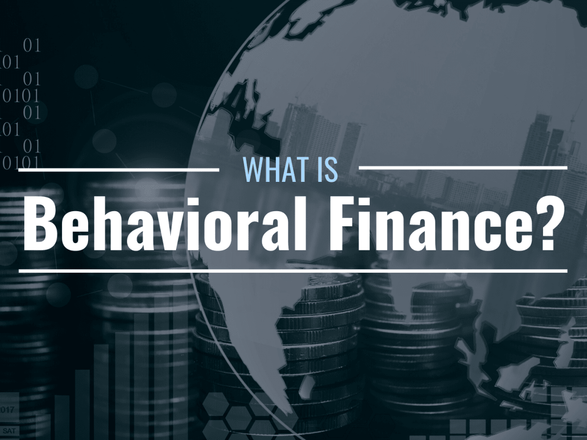

## Table of Contents

## What is behavioral finance?

Behavioral finance is a field that combines psychology and economics to understand why people make certain financial decisions. It looks at how emotions and cognitive biases can affect the choices people make about money, like investing or saving. Instead of assuming everyone always makes rational choices, behavioral finance recognizes that people often make decisions based on feelings or mental shortcuts.

For example, people might hold onto losing investments because they hope the value will go back up, even though it might be smarter to sell. This is known as the "sunk cost fallacy." Behavioral finance helps explain these kinds of behaviors and can help people make better financial decisions by understanding their own biases. It's used by financial advisors and investors to improve how they manage money and plan for the future.

## How does behavioral finance differ from traditional finance?

Behavioral finance and traditional finance both study how people make money decisions, but they look at things differently. Traditional finance is based on the idea that people always make smart, logical choices. It uses math and economic theories to predict how people will act with their money. For example, traditional finance says that if a stock goes down, people will sell it and buy something that's doing better.

On the other hand, behavioral finance says that people don't always make smart choices. It looks at how feelings and mistakes in thinking can make people do things that don't seem logical. For instance, someone might keep a stock that's losing money because they feel attached to it or hope it will go back up. Behavioral finance helps explain why people sometimes make choices that traditional finance can't predict.

## What are some common cognitive biases affecting financial decisions?

One common cognitive bias that affects financial decisions is the overconfidence bias. This is when people think they know more than they actually do, and it can make them take bigger risks with their money. For example, someone might think they can pick winning stocks better than experts, so they invest all their money in just a few stocks. This can lead to big losses if the stocks don't do well. Overconfidence can make people feel too sure about their choices, even when they don't have all the facts.

Another bias is loss aversion, where people feel the pain of losing money much more than the joy of gaining it. This can make them hold onto losing investments too long, hoping they'll recover, instead of selling and moving on. For instance, someone might keep a stock that's dropping in value because they can't stand the thought of locking in a loss. This can lead to even bigger losses if the stock keeps going down. Loss aversion can cause people to miss out on better opportunities because they're too focused on avoiding losses.

A third bias is the confirmation bias, where people look for information that supports what they already believe and ignore information that doesn't. In finance, this might mean someone only reads news or research that says their investments are good, even if there are signs they're not. For example, if someone invested in a certain company, they might only pay attention to positive news about that company and ignore any warnings. This can lead to poor decision-making because they're not seeing the whole picture.

## Can you explain the concept of loss aversion in behavioral finance?

Loss aversion is a big idea in behavioral finance. It means that people feel the pain of losing money much more than they feel happy about gaining money. Imagine you find a $20 bill on the street. You'd be happy, but not super excited. Now, imagine you lose $20. You'd probably feel really upset. That's loss aversion. People are often more worried about losing money than they are excited about making money.

Because of loss aversion, people might make choices that don't seem smart. For example, someone might keep a stock that's losing money because they can't stand the thought of selling it and locking in a loss. They hope the stock will go back up, even if it keeps going down. This can lead to even bigger losses. Loss aversion can make people miss out on better opportunities because they're too focused on avoiding losses. It's a common reason why people sometimes make choices that don't seem logical when it comes to money.

## What role does overconfidence play in investment decisions?

Overconfidence can make people think they know more about investing than they really do. When someone is overconfident, they might believe they can pick winning stocks better than experts or that they can time the market perfectly. This can lead them to take big risks with their money, like putting all their savings into just a few stocks. If those stocks don't do well, the person could lose a lot of money. Overconfidence makes people feel too sure about their choices, even when they don't have all the facts.

Because of overconfidence, people might ignore warnings or advice from others. They might think they're smarter than everyone else and don't need to listen to what others say. This can lead to bad decisions, like holding onto a losing investment for too long or not diversifying their portfolio. Overconfidence can cause people to miss out on safer, more balanced ways to invest their money. In the end, overconfidence can lead to big financial mistakes because people are too sure of themselves and don't see the whole picture.

## How does the anchoring bias influence financial choices?

Anchoring bias happens when people rely too much on the first piece of information they get. In finance, this might mean someone hears a stock's price and then makes all their decisions based on that number, even if it's not the best information to use. For example, if a stock was once worth $100, someone might think it's a good deal if it drops to $80, even if the company is doing badly. They're anchored to that $100 price and don't look at other important details.

This bias can lead to bad financial choices because people don't consider new information that might be more important. They stick to the first number they heard and make decisions based on that, even if it's not the smartest thing to do. For instance, someone might buy a house because they think it's a good deal compared to what it was listed for originally, but they might not see that the neighborhood is losing value. Anchoring can make people miss out on better opportunities because they're too focused on that first number.

## What is the impact of herd behavior on financial markets?

Herd behavior happens when people in financial markets start doing the same thing because they see others doing it. They might buy a stock because everyone else is buying it, even if they don't know much about the company. This can make stock prices go up really fast, creating a bubble. But if everyone starts selling at the same time because they see others selling, the prices can drop just as fast. This kind of behavior can make the market go up and down a lot, which can be risky for investors.

Herd behavior can lead to big market crashes. For example, if lots of people start buying a certain stock because they see others doing it, the price can get too high. When the bubble bursts and everyone starts selling, the price can fall a lot. This happened during the dot-com bubble in the late 1990s and early 2000s. People bought internet stocks because everyone else was, but when the bubble burst, many lost a lot of money. Herd behavior can make people follow the crowd without thinking for themselves, which can lead to big financial mistakes.

## How can understanding behavioral finance improve personal financial planning?

Understanding behavioral finance can help people make better choices with their money. It shows us that we all have biases and feelings that can make us do things that don't seem smart. For example, if you know you tend to hold onto losing stocks because you hate losing money (loss aversion), you can make a plan to sell them at a certain point instead of waiting too long. Knowing about these biases can help you avoid common mistakes and make decisions based on facts, not feelings.

By learning about behavioral finance, you can also set up your financial plan to work with your natural tendencies. If you know you get overconfident and might take too many risks, you can choose safer investments or work with a financial advisor to keep you in check. Understanding your own behavior can help you create a plan that's realistic and helps you reach your financial goals without getting sidetracked by emotions or biases.

## What are some practical applications of behavioral finance in investment strategies?

Behavioral finance can help investors create better strategies by understanding common mistakes people make. For example, knowing about loss aversion can help an investor set clear rules for when to sell a losing stock, instead of holding onto it too long hoping it will go back up. If an investor knows they tend to get overconfident, they might choose to invest in a mix of safer options, like index funds, to avoid taking too many risks. By being aware of biases like confirmation bias, an investor can make sure they look at all the information, not just what supports their current beliefs, which can lead to smarter choices.

Another practical use of behavioral finance is in setting up automatic savings and investment plans. People often put off saving for the future because they want to enjoy their money now. By setting up automatic transfers to a savings or investment account, an investor can overcome this procrastination bias. This way, they save money without having to think about it each time. Also, using dollar-cost averaging, where you invest a fixed amount of money at regular intervals, can help reduce the impact of emotional decisions like trying to time the market. These strategies use an understanding of human behavior to help people stick to their financial plans and reach their goals.

## How do emotions like fear and greed affect stock market trends?

Emotions like fear and greed can make the stock market go up and down a lot. When people feel greedy, they might buy a lot of stocks because they think they can make a lot of money fast. This can make stock prices go up quickly, creating what's called a bubble. But when the bubble bursts, and people start to feel scared, they might sell their stocks all at once. This can make the prices drop fast, leading to big losses for investors. Fear and greed can make the market move in ways that don't always make sense, based just on what people are feeling at the moment.

For example, during a market crash, fear can take over. People might see the prices going down and get scared that they'll lose all their money. So, they start selling their stocks, which makes the prices go down even more. On the other hand, when the market is doing well, greed can make people think they can't lose, so they keep buying more and more stocks. This can push prices up to levels that aren't based on the real value of the companies. Understanding how fear and greed affect the market can help investors make better decisions and not get caught up in the emotional rollercoaster.

## What are the key findings from experimental studies in behavioral finance?

Experimental studies in behavioral finance have shown that people often make money choices based on feelings and mental shortcuts, not just logic. One big finding is that people hate losing money more than they like making it. This is called loss aversion. It means people might keep a stock that's losing money because they can't stand the idea of selling it and making the loss real. Another finding is that people can be too sure of themselves, which is called overconfidence. This makes them take big risks with their money, thinking they know more than they really do. These studies show that understanding these biases can help people make better financial choices.

Another important finding is that people often follow what others are doing, which is known as herd behavior. This can make the stock market go up and down a lot because people buy and sell based on what they see others doing, not on what's best for them. Also, people tend to stick to the first piece of information they get, which is called anchoring bias. For example, if someone hears a stock was once worth $100, they might think it's a good deal at $80, even if the company is doing badly now. These findings help explain why the market can be hard to predict and why people sometimes make choices that don't seem smart.

## How can financial advisors use behavioral finance to better serve their clients?

Financial advisors can use behavioral finance to help their clients make better money choices by understanding the common mistakes people make. For example, if a client tends to hold onto losing investments because they hate losing money (loss aversion), the advisor can set clear rules for when to sell those investments. This way, the client won't wait too long hoping the stock will go back up. If a client gets too confident and takes big risks, the advisor can suggest safer investments like index funds to keep their portfolio balanced. By knowing about these biases, advisors can help clients avoid making choices based on feelings instead of facts.

Another way advisors can use behavioral finance is by setting up automatic savings and investment plans for their clients. People often put off saving for the future because they want to spend their money now. By setting up automatic transfers to a savings or investment account, clients can save money without having to think about it each time. Advisors can also use strategies like dollar-cost averaging, where clients invest a fixed amount of money at regular intervals. This helps them avoid making emotional decisions like trying to time the market. By understanding how emotions and biases affect financial choices, advisors can create plans that help clients reach their goals without getting sidetracked by their own behavior.

## References & Further Reading

[1]: Thaler, R. H. (1993). ["Advances in Behavioral Finance, Volume II"](https://www.degruyter.com/document/doi/10.1515/9781400829125/html) Princeton University Press.

[2]: Kahneman, D. (2011). ["Thinking, Fast and Slow"](https://link.springer.com/article/10.1007/s00362-013-0533-y) Farrar, Straus and Giroux.

[3]: Barberis, N., & Thaler, R. (2003). ["A Survey of Behavioral Finance."](https://www.nber.org/papers/w9222) Handbook of the Economics of Finance, Volume 1B, 1053-1128.

[4]: Chen, G., & Weigand, R. A. (2004). ["Behavioral finance: An overview of key concepts."](https://www.nature.com/articles/s41398-024-03120-6) Financial Analysts Journal, 60(6), 84-87.

[5]: Montier, J. (2010). ["Behavioral Finance: Insights into Irrational Minds and Markets"](https://www.amazon.com/Behavioural-Finance-Insights-Irrational-Markets/dp/0470844876) Wiley.

[6]: Ritter, J. R. (2003). ["Behavioral Finance."](https://www.sciencedirect.com/science/article/pii/S0927538X03000489) Pacific-Basin Finance Journal, 11(4), 429-437.

[7]: Pompian, M. M. (2011). ["Behavioral Finance and Wealth Management: How to Build Optimal Portfolios That Account for Investor Biases"](https://onlinelibrary.wiley.com/doi/book/10.1002/9781119202400) Wiley.

[8]: De Bondt, W. F. M., & Thaler, R. H. (1985). ["Does the Stock Market Overreact?"](https://onlinelibrary.wiley.com/doi/full/10.1111/j.1540-6261.1985.tb05004.x) The Journal of Finance, 40(3), 793-805.

[9]: Shefrin, H. (2002). ["Beyond Greed and Fear: Understanding Behavioral Finance and the Psychology of Investing"](https://academic.oup.com/book/27607) Oxford University Press.