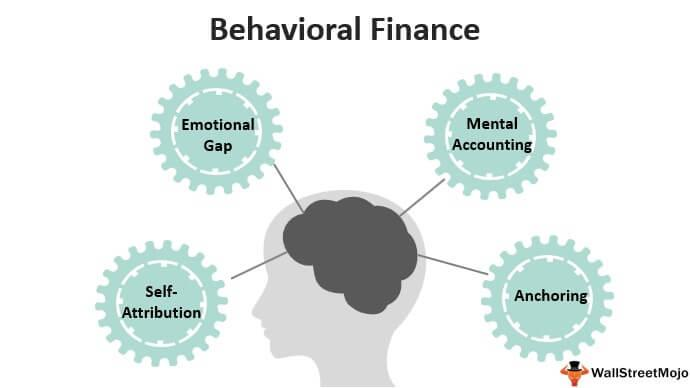

Behavioral finance is a groundbreaking field that combines elements of psychology with traditional financial theory to provide a deeper understanding of market behaviors. Unlike classical finance, which assumes that markets are efficient and participants are rational, behavioral finance acknowledges that emotional and cognitive biases can significantly impact decision-making processes. These biases, such as overconfidence, loss aversion, and herd behavior, often lead to irrational market behaviors that deviate from the predictions of traditional models.

This article focuses on the role of behavioral finance in the domain of algorithmic trading, a rapidly growing area that leverages automated systems and mathematical models to execute transactions at speeds beyond human capability. By integrating psychological insights into algorithmic models, traders can better anticipate and respond to market anomalies caused by human behavior. Cognitive biases can be systematically analyzed and used to fine-tune trading algorithms, potentially increasing profitability while also enhancing market stability.



The intersection of psychology and finance offers both opportunities and challenges for developing effective trading strategies. It allows traders to harness the irrational aspects of the market, turning them into opportunities for profit. However, it also necessitates a sophisticated understanding of both psychological principles and advanced computational techniques. This synthesis presents new pathways for innovation and growth in the financial markets, paving the way for the creation of more adaptive and responsive trading systems.

## Table of Contents

## The Basics of Behavioral Finance

Behavioral finance is a field that seeks to bridge the gap between traditional financial theories and the psychological components of human decision-making. Traditional finance models, such as the Efficient Market Hypothesis (EMH), assume that investors act rationally, making decisions based solely on available information and logical analysis. However, behavioral finance introduces the concept of irrational behaviors and cognitive biases, underscoring their significant impact on financial markets.

Cognitive biases are systematic patterns of deviation from norm or rationality in judgment, which can lead to illogical conclusions or actions. Prominent among these biases is overconfidence, where investors overestimate their knowledge or predictive ability about market movements. This can often lead to excessive trading and underestimation of risks, ultimately impacting market prices and [volatility](/wiki/volatility-trading-strategies).

Anchoring is another common bias, where investors rely heavily on the initial piece of information they receive (the "anchor") when making decisions. For instance, an investor might base their expectations of a stock's future performance on its historical price, ignoring new relevant data. This can lead to mispricing and inefficient market responses.

Herd behavior describes the tendency of individuals to mimic the actions of a larger group, often based on the assumption that such collective actions are as a result of higher knowledge. In financial markets, this can manifest as asset bubbles or crashes, as investors follow the herd in buying or selling assets without sufficient analysis.

Understanding these cognitive biases provides a framework for predicting market movements and developing strategic interventions. By recognizing that investors do not always act rationally, market participants can anticipate and exploit these inefficiencies. For instance, by identifying overconfidence bias in a market segment, traders might predict an eventual correction and position themselves accordingly.

Overall, behavioral finance enriches the understanding of financial market dynamics by highlighting the influence of human psychology. It challenges the simplistic assumptions of traditional financial theories and offers nuanced insights that can lead to more effective trading strategies, risk management, and policy-making.

## Algorithmic Trading: An Overview

Algorithmic trading is a method that employs complex algorithms, or sets of mathematical instructions, for executing trades on financial markets with remarkable precision and speed. This trading strategy is reliant on the ability of these algorithms to process vast amounts of market data efficiently, identifying trading opportunities that conventional methods might overlook.

Central to [algorithmic trading](/wiki/algorithmic-trading) is the implementation of predefined parameters or instructions that govern trading decisions. These parameters can include timing, price, quantity, or any mathematical model, which allows for the automation of this process. By leveraging historical data and complex quantitative models, algorithmic trading can execute orders at a fraction of a second, significantly faster than human capability.

The primary advantage of algorithmic trading lies in its speed and accuracy. Automated systems can scan and react to market conditions as they happen, executing orders faster than a human trader. This minimizes the impact of latency and reduces costs associated with manual trading. Moreover, the unemotional nature of algorithms eliminates the risk of human error due to emotional decision-making or fatigue, enabling consistent and reliable execution.

Algorithmic trading is widely used across various financial instruments, including stocks, options, and futures. High-frequency trading ([HFT](/wiki/high-frequency-trading-strategies)), a subset of algorithmic trading, epitomizes the benefits of speed and precision. HFT systems engage in numerous trades within short time frames, capitalizing on minute pricing discrepancies and generating profits from trading [volume](/wiki/volume-trading-strategy).

The development of algorithms involves sophisticated programming and an understanding of financial markets. Python is a popular programming language used in this field, equipped with libraries such as 'numpy' and 'pandas' for data analysis, and 'scikit-learn' for implementing [machine learning](/wiki/machine-learning) models. Here is a simple example of a moving average crossover strategy in Python:

```python
import yfinance as yf  # For more datasets, visit: https://paperswithbacktest.com/datasets
import numpy as np

# Load historical data for a stock
data = yf.download("AAPL", start="2020-01-01", end="2023-01-01")

# Calculate short-term and long-term moving averages
short_window = 40
long_window = 100

data['Short_MA'] = data['Close'].rolling(window=short_window, min_periods=1, center=False).mean()
data['Long_MA'] = data['Close'].rolling(window=long_window, min_periods=1, center=False).mean()

# Generate signals
data['Signal'] = 0.0
data['Signal'][short_window:] = np.where(data['Short_MA'][short_window:] > data['Long_MA'][short_window:], 1.0, 0.0)
data['Position'] = data['Signal'].diff()

# Display the generated signals
print(data[['Close', 'Short_MA', 'Long_MA', 'Signal', 'Position']].tail())
```

Algorithmic trading is not without its challenges, such as the risk of system malfunctions or market disruptions. However, when designed and implemented correctly, it provides traders with substantial advantages in terms of efficiency, accuracy, and the potential for higher returns in today's fast-paced financial markets.

## Integrating Behavioral Finance in Algorithmic Models

Integrating behavioral finance into algorithmic trading models involves recognizing and systematically analyzing the role of human cognitive biases in market dynamics. This synthesis requires a detailed examination of psychological heuristics and their quantifiable impacts on trading patterns.

Cognitive biases such as overconfidence, loss aversion, and herding can significantly alter market behaviors, creating anomalies that deviate from the expectations of traditional financial theories. To incorporate these biases into algorithmic models, it is essential first to identify these behavioral patterns through historical data analysis. Machine learning techniques and statistical methods such as regression analysis or cluster analysis can be employed to detect these patterns. This data-driven approach enables the algorithm to predict potential market conditions shaped by investor psychology.

For example, consider the overconfidence bias, which often leads traders to overestimate their market knowledge and predictions. This can result in excessive trading volumes and increased volatility. By quantifying this bias, an algorithm can monitor trading volumes and price movements for signs of overconfidence. The model can then adjust its trading strategy, perhaps by increasing stop-loss limits during high volatility periods, thereby mitigating potential risks associated with this bias.

Moreover, integrating sentiment analysis tools to gauge market sentiment from news articles, tweets, or blogs can provide additional layers of behavioral insights. Python libraries such as `TextBlob` or `NLTK` can facilitate this process by conducting natural language processing to assess market mood. This sentiment-oriented data can complement existing models, offering a richer, more nuanced perspective on market conditions.

Combining these methodologies, algorithms can be designed to adapt dynamically, adjusting their trading strategies in anticipation of irrational market behaviors. Such adaptive systems are likely to be more robust and resilient, offering a significant advantage by profiting from market inefficiencies caused by collective human psychology.

These advancements present trading systems that not only react swiftly to market data but also incorporate sophisticated behavioral signals, thus offering a comprehensive trading framework that aligns more closely with real-world market activities. By continuously refining algorithms with behavioral insights, traders can better navigate the complexities inherent in financial markets, resulting in more informed and strategic decision-making.

## Examples of Behavioral Patterns in Trading

Behavioral finance identifies various patterns that emerge from cognitive biases, impacting trading behaviors and market dynamics. One such pattern is the disposition effect, which describes investors' tendency to hold onto losing stocks for too long while prematurely selling winning stocks. This behavioral anomaly can be explained by investors' reluctance to realize losses, motivated by the hope that the value of depreciating assets will recover. Conversely, they may sell winning stocks too soon to lock in gains, often resulting in suboptimal portfolio performance.

Another prominent behavioral pattern involves overreaction and underreaction to market news. Investors often display excessive responses to new information, causing temporary price distortions. Overreaction can lead to inflated stock prices, while underreaction might result in missed valuation adjustments. These reactions can be quantified and anticipated by traders who recognize the psychological drivers of such behaviors, forming the basis for strategies like contrarian or [momentum](/wiki/momentum) trading.

Tools like sentiment analysis have become essential in trading to gauge market emotions. By analyzing data from social media, news articles, and other communication channels, traders can derive the market's emotional state, which often precedes significant price movements. Sentiment scores are generated using natural language processing techniques and can serve as indicators for market optimism or pessimism, aiding traders in predicting potential fluctuations.

The integration of behavioral patterns in trading strategies provides opportunities for improved prediction and strategic positioning in financial markets. By understanding and anticipating these psychological influences, traders can potentially enhance their decision-making processes and exploit inefficiencies resulting from human biases.

## Advantages and Challenges

Integrating behavioral finance into algorithmic trading offers significant advantages by integrating the human and psychological dimensions into traditional trading models. By acknowledging and leveraging the irrational aspects of the market, traders can gain a competitive edge. Recognizing patterns driven by common cognitive biases, such as overconfidence or herd behavior, allows algorithmic systems to anticipate and capitalize on irrational market behaviors, potentially leading to higher profitability.

However, accurately modeling behavioral patterns and incorporating them into algorithmic systems presents considerable challenges. The complexity arises from the necessity to quantify and formalize inherently subjective human behaviors. Capturing these behaviors requires extensive datasets and sophisticated models, often necessitating the use of [artificial intelligence](/wiki/ai-artificial-intelligence) and machine learning techniques. This process can be resource-intensive, requiring substantial computational power and expertise in both finance and technology.

Balancing mathematical precision with the unpredictability of human behavior poses another significant challenge. Algorithmic models are traditionally built on the assumption of rational behaviors and market efficiency, which conflicts with the erratic nature of human psychology. To address this, algorithms must be designed with flexibility, allowing for constant adaptation and learning from new data. Such adaptability ensures that the systems remain robust and resilient in the face of unexpected market changes driven by psychological influences.

The successful integration of behavioral finance into algorithmic trading necessitates a multidisciplinary approach that combines the rigor of quantitative analysis with insights from behavioral science. Through continuous improvement and optimization, traders can create sophisticated models that not only predict but also preemptively adjust to the nuances of market psychology, leading to sustainable competitive advantages.

## Technological Tools for Implementation

Python, a versatile programming language, plays a pivotal role in the implementation of behavioral finance models within algorithmic trading. The library 'yfinance' is particularly valuable as it facilitates the downloading of historical market data, which serves as the foundation for constructing and testing trading models. For instance, a Python snippet using 'yfinance' to download stock data might look like this:

```python
import yfinance as yf  # For more datasets, visit: https://paperswithbacktest.com/datasets

# Download historical data for a particular stock
data = yf.download('AAPL', start='2020-01-01', end='2023-01-01')
```

Artificial intelligence (AI) and machine learning (ML) are integral to optimizing algorithmic strategies based on behavioral insights. These technologies can uncover patterns and correlations that are not immediately obvious through traditional analysis. Machine learning algorithms, such as neural networks and support vector machines, enable the processing of large datasets to identify subtle behavioral tendencies that may influence trading decisions.

The adaptation of machine learning models often involves training algorithms on historical data and tuning them to recognize specific behaviors, such as investor overreaction or underreaction. This involves splitting the data into training and testing datasets to ensure model efficacy before real-world deployment.

Data visualization tools are indispensable for gaining insights into complex datasets, allowing for the identification of trends and abnormalities that may indicate cognitive biases affecting the market. Libraries such as Matplotlib and Seaborn in Python provide the capabilities to create intricate visual representations of trading behaviors, which can inform strategy adjustments.

Backtesting is another crucial component in the validation and enhancement of algorithmic models. Through [backtesting](/wiki/backtesting), traders can simulate the performance of a trading strategy against historical data to evaluate its potential effectiveness. This process helps to ensure that the model can adapt to various market conditions influenced by psychological factors. In Python, backtesting can be performed using libraries such as Backtrader, which allows for the detailed analysis and reporting of trading strategy performances.

In summary, the integration of technological tools such as Python programming, AI, machine learning, data visualization, and backtesting forms the bedrock of implementing behavioral finance in algorithmic trading. These tools enable the creation of sophisticated models that incorporate psychological insights, potentially leading to more adaptive and profitable trading strategies.

## Conclusion

Behavioral finance introduces a nuanced dimension to algorithmic trading by intertwining psychological factors with traditional quantitative models. This integration acknowledges that financial markets are influenced not only by hard data but also by human emotions and cognitive biases. By understanding and incorporating these psychological elements, traders can develop strategies that anticipate irrational market behavior, potentially leading to enhanced profit opportunities. This novel approach allows for a richer analysis of market movements, encompassing more than just technical and fundamental factors.

By bridging psychological insights with algorithmic trading strategies, new avenues for profit generation are presented. This synthesis creates opportunities to exploit market inefficiencies caused by human behavior, such as overreaction to news or herd mentality. For instance, models that [factor](/wiki/factor-investing) in the disposition effect—where investors hold onto losing positions too long and sell winners too early—can adjust trading strategies to account for these tendencies, thus optimizing returns.

Continued exploration and integration of behavioral finance with algorithmic trading can develop more adaptive and efficient trading platforms. Advances in technology, such as artificial intelligence and machine learning, further enhance this integration by allowing for improved pattern recognition and prediction capabilities. These tools can refine strategies that anticipate market behaviors driven by cognitive biases, thereby maintaining a competitive edge in dynamic markets. As these disciplines converge, they promise to yield trading systems that are not only technically proficient but also psychologically insightful, ensuring a comprehensive approach to understanding and leveraging financial markets.

## References & Further Reading

[1]: Thaler, R. H. (1993). ["Advances in Behavioral Finance, Volume II"](https://www.degruyter.com/document/doi/10.1515/9781400829125/html) Princeton University Press.

[2]: Kahneman, D. (2011). ["Thinking, Fast and Slow"](https://link.springer.com/article/10.1007/s00362-013-0533-y) Farrar, Straus and Giroux.

[3]: Barberis, N., & Thaler, R. (2003). ["A Survey of Behavioral Finance."](https://www.nber.org/papers/w9222) Handbook of the Economics of Finance, Volume 1B, 1053-1128.

[4]: Chen, G., & Weigand, R. A. (2004). ["Behavioral finance: An overview of key concepts."](https://www.nature.com/articles/s41398-024-03120-6) Financial Analysts Journal, 60(6), 84-87.

[5]: Montier, J. (2010). ["Behavioral Finance: Insights into Irrational Minds and Markets"](https://www.amazon.com/Behavioural-Finance-Insights-Irrational-Markets/dp/0470844876) Wiley.

[6]: Ritter, J. R. (2003). ["Behavioral Finance."](https://www.sciencedirect.com/science/article/pii/S0927538X03000489) Pacific-Basin Finance Journal, 11(4), 429-437.

[7]: Pompian, M. M. (2011). ["Behavioral Finance and Wealth Management: How to Build Optimal Portfolios That Account for Investor Biases"](https://onlinelibrary.wiley.com/doi/book/10.1002/9781119202400) Wiley.

[8]: De Bondt, W. F. M., & Thaler, R. H. (1985). ["Does the Stock Market Overreact?"](https://onlinelibrary.wiley.com/doi/full/10.1111/j.1540-6261.1985.tb05004.x) The Journal of Finance, 40(3), 793-805.

[9]: Shefrin, H. (2002). ["Beyond Greed and Fear: Understanding Behavioral Finance and the Psychology of Investing"](https://academic.oup.com/book/27607) Oxford University Press.