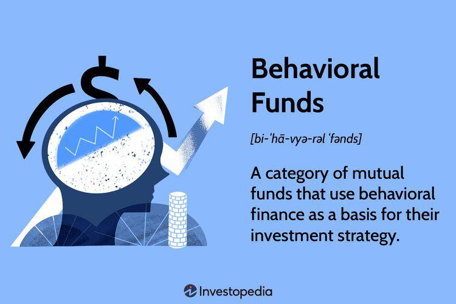

In today's rapidly evolving financial landscape, investors are constantly seeking effective ways to maximize their returns while mitigating risks. This quest for optimal investment strategies has given rise to innovative approaches, such as behavioral funds and algorithmic trading.

Behavioral funds focus on capitalizing on market inefficiencies caused by human behavior. These funds rely on the principles of behavioral finance, which examine how psychological influences and biases affect the decisions of investors. By understanding and identifying these irrational behaviors, behavioral funds aim to exploit temporary market anomalies and invest in undervalued stocks that possess strong fundamentals.



In contrast, algorithmic trading harnesses the power of technology to automate trading decisions through the use of computer algorithms. These algorithms are designed to execute trades at precise moments based on pre-set criteria, effectively removing human emotions from the process. By leveraging vast amounts of data and sophisticated statistical models, algorithmic trading seeks to identify profitable trading opportunities with increased speed and accuracy.

This article explores the diverse spectrum of investment strategies that have emerged, focusing on the role of behavioral funds and fund management, alongside the capabilities of algorithmic trading. Together, these elements provide a comprehensive view of how modern investment approaches can be effectively employed to achieve financial goals, offering investors sophisticated tools to navigate the complexities of today's financial markets. The synergy between human insight and technological advancements continues to redefine traditional investment paradigms, creating opportunities for enhanced portfolio performance and risk management.

## Table of Contents

## Understanding Behavioral Funds

Behavioral funds are a category of mutual funds that implement investment strategies based on the tenets of behavioral finance. Behavioral finance posits that psychological influences and cognitive errors can lead to market inefficiencies, creating opportunities for astute investors. Unlike traditional financial theories that assume markets are efficient and participants act rationally, behavioral finance looks at how emotions and biases can affect investment decisions, often leading to suboptimal outcomes.

Human emotions and irrational behavior are central to the functioning of behavioral funds. Individuals often exhibit predictable biases, such as overconfidence, loss aversion, and herd behavior, which can cause deviations from a security's intrinsic value. These deviations may result in temporary mispricings, which behavioral funds aim to exploit for higher returns.

A key tactic employed by behavioral funds includes identifying irrational market biases. For instance, during periods of market stress, investors might irrationally sell off well-performing stocks, causing their prices to drop. Behavioral fund managers are skilled at pinpointing these instances and may choose to invest in these temporarily undervalued stocks, provided they possess strong fundamentals. This approach aligns with the contrarian investment strategy, where investors capitalize on the market's overreactions to news or events.

Another aspect contributing to the recent interest in behavioral funds is their ability to harness pricing anomalies that arise from the interplay between rational and irrational investors. Rational investors typically base their decisions on available information and [fundamental analysis](/wiki/fundamental-analysis), while irrational investors might be swayed by sentiment or crowd behavior. Behavioral funds seek to identify and benefit from these discrepancies. For instance, a stock that is unduly depressed due to short-term pessimism but has strong long-term growth prospects represents a potential target for these funds.

This strategy does not come without its challenges. Accurately distinguishing between genuine market inefficiencies and noise requires a nuanced understanding of market behavior and a robust analytical framework. Furthermore, while these funds aim to exploit biases in others, they must also guard against falling prey to the same biases themselves. This requires a disciplined investment process that integrates behavioral finance insights with traditional financial analysis.

In conclusion, behavioral funds represent an innovative approach to maximizing returns by addressing the psychological and cognitive dynamics that influence financial markets. By focusing on market inefficiencies induced by human behavior, these funds offer a unique method for investors to achieve superior returns.

## The Role of Fund Management in Behavioral Funds

Fund management is central to the execution of strategies in behavioral funds, capitalizing on the principles of behavioral finance. Skilled fund managers play a pivotal role by analyzing market conditions and investor sentiment to make informed decisions that align with the funds' objectives.

A primary responsibility of fund managers is to identify stocks with unexpected indicators—those that may be undervalued due to irrational investor behavior. This involves scrutinizing various market signals and economic indicators to detect anomalies and biases. For instance, stocks might be undervalued due to herd behavior, where investors collectively move in a certain direction based on sentiments rather than fundamentals.

To mitigate emotional biases in trading, fund managers employ a range of strategies. This includes implementing rules-based systems that enforce a disciplined investment approach, reducing the influence of short-term market fluctuations on decision-making. For example, stop-loss orders can be systematically applied to limit potential losses, thereby curbing emotional reactions to unfavorable market movements.

Diversification is another critical aspect managed by fund managers. By ensuring that investment portfolios are not overly concentrated in specific sectors or assets, managers can balance risk and yield potential across various holdings. This strategy not only minimizes exposure to individual asset [volatility](/wiki/volatility-trading-strategies) but also aligns the portfolio with an investor's risk tolerance and long-term financial goals. 

Moreover, fund managers frequently reassess and adjust portfolios in response to shifts in market conditions or changes in economic indicators, ensuring that the investment strategy remains proactive rather than reactive. This dynamic approach allows the behavioral fund to remain aligned with evolving market landscapes and investor expectations.

Overall, effective fund management in behavioral funds requires a keen understanding of behavioral finance principles and a disciplined approach to mitigate the biases that might affect market behavior, thereby optimizing investment outcomes.

 to Algorithmic Trading

Algorithmic trading refers to the sophisticated use of computer algorithms designed to execute trades according to explicit, predetermined conditions. This approach effectively eliminates the influence of human emotions, allowing for precision and efficiency in managing trades and associated risks. Algorithmic trading operates by leveraging extensive datasets and applying complex statistical models to discern potential buying and selling opportunities within the financial markets.

The automation facilitated by [algorithmic trading](/wiki/algorithmic-trading) ensures that trades are executed at the most favorable moments. This is achieved through the application of mathematical models and historical data analyses which identify optimal points for entering and exiting trades. For instance, an algorithm might use a quantitative strategy such as the moving average crossover, where a trade signal is generated when a short-term moving average intersects with a long-term moving average.

Here's a basic Python example to illustrate a simple moving average crossover strategy:

```python
import pandas as pd

# Sample data - assume 'data' is a DataFrame containing stock prices with a 'Close' column
# data = pd.read_csv('stock_data.csv')

def moving_average_strategy(data, short_window, long_window):
    # Calculate moving averages
    data['Short_MAvg'] = data['Close'].rolling(window=short_window, min_periods=1).mean()
    data['Long_MAvg'] = data['Close'].rolling(window=long_window, min_periods=1).mean()

    # Create signals
    data['Signal'] = 0
    data['Signal'][short_window:] = np.where(data['Short_MAvg'][short_window:] > data['Long_MAvg'][short_window:], 1, 0)

    # Generate trading orders
    data['Position'] = data['Signal'].diff()

    return data

# Set the window sizes
short_window = 40
long_window = 100

# Run the strategy
# strategy_data = moving_average_strategy(data, short_window, long_window)
```

Algorithmic trading has become indispensable for systematic hedge funds, where it plays a crucial role in rapidly evolving markets. The ability to analyze and react to market data at high speed gives algorithmic traders a distinct advantage in capturing fleeting market inefficiencies. Moreover, technological advancements, such as [machine learning](/wiki/machine-learning) and [artificial intelligence](/wiki/ai-artificial-intelligence), further enhance the capabilities of algorithmic trading systems, allowing them to adapt continuously to market conditions.

Overall, algorithmic trading is a cornerstone of modern financial strategies, facilitating an analytical, data-driven approach to decision-making in trading systems. Its evolution underscores the growing reliance on technology to achieve optimal investment outcomes.

## Benefits and Challenges of Algorithmic Trading

Algorithmic trading has revolutionized the execution of trades by providing enhanced speed and precision. Through the use of pre-set criteria and computer algorithms, this technique allows for the rapid processing of vast amounts of data, enabling traders to make informed decisions almost instantaneously. This ensures that trades are executed at optimal prices, reducing the slippage that can arise from manual trading processes. The high-speed nature of algorithmic trading is particularly beneficial in markets where price movements occur in fractions of a second.

A notable advantage of algorithmic trading is its consistency in execution. Algorithms adhere strictly to the predefined rules without the interference of emotions such as fear or greed, which can often influence human traders. This disciplined approach helps in exploiting market microstructure anomalies that may provide opportunities for profit. Market microstructure anomalies are deviations in market prices that can be captured and leveraged through specific algorithmic strategies.

Despite these advantages, algorithmic trading is not without its challenges. One major concern is the risk of overfitting, where models are too closely tailored to historical data, causing them to perform inadequately in real-world scenarios. Overfitting can lead to large discrepancies between expected outcomes and actual trading performance. To address overfitting, developers often employ techniques such as cross-validation and regularization to create more generalizable models.

Data quality also poses a significant challenge in algorithmic trading. Inaccurate or incomplete data can lead to erroneous trading signals, potentially resulting in financial losses. Ensuring data integrity involves rigorous data cleaning and validation processes, as well as sourcing reliable and up-to-date information.

Additionally, algorithmic errors can lead to unintended and potentially large-scale trading issues. These errors can be caused by bugs in the code or unforeseen market conditions that the algorithm is not equipped to handle. Therefore, thorough testing and validation of algorithmic solutions are crucial to minimize the risks associated with algorithmic errors.

Developers must continually refine their models to adapt to evolving market conditions. This involves monitoring the performance of algorithms, updating them in response to observed market dynamics, and ensuring they remain robust over time. As financial markets are complex and ever-changing, the ability to adapt is essential for maintaining the effectiveness of algorithmic trading strategies.

In conclusion, while algorithmic trading offers numerous benefits, its successful implementation requires careful consideration of potential challenges. By addressing issues such as overfitting, data quality, and algorithmic errors, developers can optimize these trading systems to better capitalize on market opportunities.

## Integrating Behavioral and Algorithmic Strategies

Integrating behavioral strategies with algorithmic trading represents an innovative approach in the investment domain, offering the potential for more nuanced investment techniques. This hybrid strategy harnesses the strengths of both behavioral finance and algorithmic precision, aiming to create a sophisticated decision-making process that benefits from the insights and limitations of human behavior alongside rigorous computational methodologies.

Algorithms designed for trading can incorporate signals based on principles of behavioral finance, which identifies common cognitive biases and emotional factors influencing market participants. Key behavioral finance signals include overreaction to news, herd mentality, and short-term bias, which can lead to mispricing in the markets. By embedding these signals into trading algorithms, the decision-making process of behavioral funds is enhanced, potentially improving their capacity to recognize and capitalize on temporary market inefficiencies.

For instance, an algorithm might be configured to identify stocks undergoing exaggerated price changes due to panic selling, allowing the fund to take a contrarian position if the company's fundamentals remain strong, aligning with the behavioral finance perspective. Python, a preferred language for such tasks due to its robustness and rich libraries, can be used to implement such a model:

```python
import pandas as pd
import numpy as np

# Sample function to detect overreaction based on price changes
def detect_overreaction(price_series, threshold=0.05):
    return np.abs(price_series.pct_change()) > threshold

# Example stock data
price_data = pd.Series([100, 95, 90, 85, 88, 93, 110])

# Detect overreactions
overreaction_signals = detect_overreaction(price_data)

print("Overreaction Signals:\n", overreaction_signals)
```

Integrating these behavioral insights with algorithmic systems allows for a balance between human judgment and computational efficiency, optimizing the investment process. Algorithms can be designed to adapt to both historical data trends and real-time dynamics, providing the agility necessary in volatile markets. This involves the continuous updating of models to refine predictions and interpretations of market behaviors, ensuring responsive adaptation to emerging market conditions.

Overall, the fusion of behavioral strategies with algorithmic trading holds promise for a more dynamic and flexible approach to investment, effectively leveraging the predictive power of technology with the psychological underpinnings of market behavior.

## Conclusion: The Future of Investment Strategies

The future of investment strategies lies in the seamless integration of human insight and technological advancements. Behavioral funds and algorithmic trading collectively form a robust framework for navigating the complexities of modern financial markets. Behavioral finance taps into the psychological aspects driving investor behavior, recognizing that emotions like fear and greed can lead to market inefficiencies. By capitalizing on these inefficiencies, behavioral funds offer opportunities for enhanced investment returns.

Conversely, algorithmic trading harnesses the power of technology and quantitative models to execute trades with precision and speed. This approach minimizes human error and emotional bias, optimizing trading outcomes through data-driven decisions. The exponential growth of data availability and computational power is set to refine these strategies further, propelling them towards greater sophistication.

As the investment landscape evolves, the ability to process and analyze vast amounts of data in real-time will become an essential asset. Computational advancements, such as machine learning and artificial intelligence, will enable more nuanced analyses of market trends and investor behavior, thus enhancing the predictive capabilities of both behavioral and algorithmic strategies.

To harness these advancements effectively, investors and fund managers need to maintain a high level of adaptability and stay well-informed about technological developments. The continuous evolution of market conditions requires a dynamic approach to investment, where strategic adjustments are made to leverage the strengths of both human insights and algorithmic precision.

Ultimately, the synergy between human intuition and advanced computational techniques promises a future where investment strategies are more responsive and tailored to the intricate dynamics of financial markets. Embracing this synergy will be crucial for sustained financial success in an increasingly complex and fast-paced investment environment.

## References & Further Reading

[1]: Thaler, R. H. (2005). ["Advances in Behavioral Finance, Volume II."](https://press.princeton.edu/books/paperback/9780691121758/advances-in-behavioral-finance-volume-ii) Princeton University Press.

[2]: ["Thinking, Fast and Slow"](https://en.wikipedia.org/wiki/Thinking,_Fast_and_Slow) by Daniel Kahneman

[3]: Lo, A. W. (2004). ["The Adaptive Markets Hypothesis: Market Efficiency from an Evolutionary Perspective."](https://papers.ssrn.com/sol3/papers.cfm?abstract_id=602222) Journal of Portfolio Management.

[4]: ["Algorithmic Trading: Winning Strategies and Their Rationale"](https://www.wiley.com/en-us/Algorithmic+Trading%3A+Winning+Strategies+and+Their+Rationale-p-9781118746912) by Ernest P. Chan

[5]: Barberis, N., & Thaler, R. (2003). ["A survey of behavioral finance."](https://www.nber.org/papers/w9222) Handbook of the Economics of Finance.