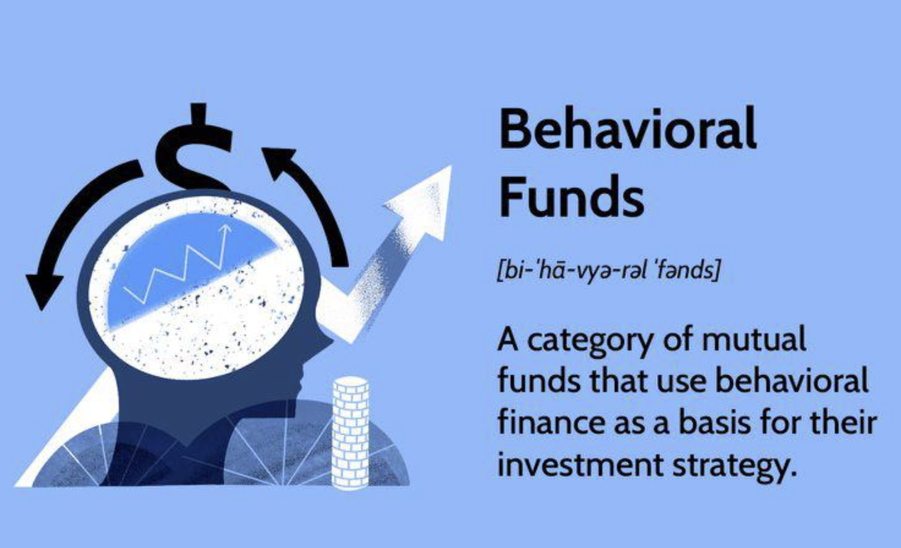

## Table of Contents

## What are Behavioral Funds?

Behavioral funds are a type of investment fund that uses principles from behavioral finance to make investment decisions. Behavioral finance is a field that studies how psychological factors affect the financial decisions of investors. These funds try to take advantage of common mistakes that people make when investing, like following the crowd or being too emotional. By understanding these patterns, the managers of behavioral funds aim to pick investments that will do better than the market.

These funds often look for stocks that are undervalued because many investors have overlooked them due to biases. For example, if a good company has bad news, many investors might sell their shares out of fear, causing the price to drop even if the company's long-term prospects are still strong. A behavioral fund might buy these shares, expecting the price to go back up once the panic subsides. This strategy relies on the idea that by going against the crowd and making more rational decisions, the fund can achieve higher returns.

## How do Behavioral Funds differ from traditional investment funds?

Behavioral funds and traditional investment funds both aim to grow your money, but they do it in different ways. Traditional funds usually focus on things like how well a company is doing or what the economy is doing. They might pick stocks based on numbers and data, trying to find companies that will do well in the future. These funds often follow well-known strategies, like buying stocks that are part of a big index or investing in companies that are expected to grow a lot.

On the other hand, behavioral funds pay a lot of attention to how people feel and think about investing. They look at why people might make bad choices with their money, like selling stocks when they're scared or buying stocks because everyone else is. These funds try to use this knowledge to find good deals on stocks that other people might be ignoring because of their emotions. By understanding and going against common mistakes, behavioral funds hope to do better than traditional funds that just look at numbers and trends.

## What is the underlying theory behind Behavioral Funds?

The idea behind Behavioral Funds comes from a field called behavioral finance. This field looks at how our feelings and thoughts can make us do things that aren't always smart when it comes to money. People might buy or sell stocks based on what everyone else is doing, or because they're scared or excited. Behavioral Funds use this knowledge to find good investments that other people might be missing because of these feelings.

These funds believe that by understanding and going against these common mistakes, they can pick stocks that will do better than the market. For example, if a lot of people are selling a good company's stock because of some bad news, a Behavioral Fund might buy it, thinking that the price will go up again once people calm down. By focusing on these patterns in how people behave, Behavioral Funds try to make smarter choices and get better returns for their investors.

## Who are the typical investors in Behavioral Funds?

Typical investors in Behavioral Funds are often people who are interested in understanding how human behavior affects the stock market. They might be looking for a different way to invest their money, one that takes into account not just the numbers, but also how people feel and think about their investments. These investors might be curious about why people make certain financial decisions and how those decisions can be used to find good investment opportunities.

These investors could also be people who want to try a strategy that goes against the usual way of [picking](/wiki/asset-class-picking) stocks. They might believe that by understanding and using the patterns in how people behave, they can do better than traditional investment methods. Behavioral Funds attract those who are willing to take a bit of a different approach, hoping that it will lead to better returns over time.

## What are the main strategies used by Behavioral Funds?

Behavioral Funds use strategies that look at how people's feelings and thoughts affect their investing choices. One main strategy is called contrarian investing. This means they buy stocks that other people are selling because of fear or bad news. They believe that these stocks might be undervalued and will go up in price once the panic goes away. For example, if a good company has a temporary problem, many investors might sell its stock, making the price drop. A Behavioral Fund might see this as a chance to buy the stock at a lower price, expecting it to recover later.

Another strategy is to look for stocks that are ignored by most investors because of biases. This is called exploiting market inefficiencies. Behavioral Funds try to find these hidden gems by understanding why people might overlook them. They might invest in companies that are not popular but have solid fundamentals. By going against the crowd and picking these stocks, the fund hopes to get higher returns than if they just followed the usual trends. Both of these strategies rely on understanding and using the patterns in how people behave when they invest.

## How do Behavioral Funds exploit market inefficiencies?

Behavioral Funds exploit market inefficiencies by understanding and using the patterns in how people behave when they invest. They look for stocks that are undervalued because many investors might be ignoring them due to biases or emotional reactions. For example, if a company gets bad news and lots of people start selling its stock out of fear, the price might drop even if the company's long-term prospects are still good. A Behavioral Fund might buy these stocks, expecting the price to go back up once the panic is over. By going against the crowd and making more rational decisions, the fund hopes to find good deals that others have missed.

These funds also look for companies that are not popular but have strong fundamentals. They believe that by picking these overlooked stocks, they can get higher returns than if they just followed the usual trends. For instance, a company might be doing well but not getting much attention because it's in an industry that people don't think is exciting. A Behavioral Fund might see this as an opportunity to invest in a solid company at a lower price. By understanding why people might overlook these stocks and investing in them, Behavioral Funds try to take advantage of the mistakes others make and do better than the market.

## What are the risks associated with investing in Behavioral Funds?

Investing in Behavioral Funds can be risky because they try to guess how people will act and feel about the market. If the fund managers get it wrong and the market doesn't act the way they thought, the fund might lose money. For example, if they buy a stock thinking it's undervalued because of panic selling, but the panic doesn't go away, the stock price might keep dropping. Also, these funds might not do as well as the market if everyone starts thinking the same way and there are no big mistakes to take advantage of.

Another risk is that Behavioral Funds might not be as well-known or have as much money to invest as bigger, traditional funds. This can mean they might have a harder time buying and selling stocks quickly, which can affect their performance. Plus, because these funds are trying something different, they might be more up and down in how they do. So, while they might do better than other funds some of the time, they could also do worse, and that can be hard for some investors to handle.

## Can you provide examples of successful Behavioral Funds?

One example of a successful Behavioral Fund is the Fuller & Thaler Behavioral Small-Cap Equity Fund. This fund uses behavioral finance to find small companies that are often overlooked by other investors. They look for companies that might be undervalued because of things like bad news or people's fears. By understanding how these feelings affect stock prices, the fund has been able to do better than many other small-cap funds over the years. It shows how paying attention to how people think and feel can lead to good investment choices.

Another example is the AQR Equity Market Neutral Fund. This fund uses behavioral finance to find stocks that are mispriced because of investors' mistakes. They use a strategy where they buy stocks they think are too cheap and sell stocks they think are too expensive. By balancing their investments this way, they try to make money no matter which way the market goes. The AQR fund has had some good years, showing that understanding people's behavior can help in making smart investment decisions.

## How do Behavioral Funds perform compared to market indices?

Behavioral Funds can do better than market indices sometimes, but it depends on a lot of things. These funds try to use people's feelings and mistakes to find good investments. If they guess right about how people will act, they might pick stocks that go up a lot and do better than the market. For example, if they buy a stock that everyone else is selling because of bad news, and the stock goes back up later, the fund could make more money than the market.

But, Behavioral Funds can also do worse than the market. If the fund managers guess wrong about how people will feel, the fund might lose money. For instance, if they buy a stock thinking it's undervalued, but the bad news keeps getting worse, the stock might keep going down. Also, these funds might not do as well if everyone starts thinking the same way and there are no big mistakes to take advantage of. So, while they can beat the market sometimes, they can also fall behind.

## What role does behavioral finance play in the management of Behavioral Funds?

Behavioral finance is a big part of how Behavioral Funds are managed. It's all about understanding how people's feelings and thoughts can make them do things that aren't always smart when it comes to money. Managers of these funds use this knowledge to find good investments that others might be missing. They look for stocks that are undervalued because people might be scared or following the crowd. By going against what everyone else is doing, they hope to pick stocks that will do better than the market.

For example, if a good company gets some bad news and everyone starts selling its stock, the price might drop even if the company's future still looks bright. A Behavioral Fund might buy this stock, thinking that once people calm down, the price will go back up. By understanding why people might make these mistakes and using that to their advantage, the fund managers try to make smarter choices and get better returns for their investors.

## How can one evaluate the performance of a Behavioral Fund?

To evaluate the performance of a Behavioral Fund, you can start by looking at how it has done over time compared to the market. You might check its returns over different periods, like one year, three years, or five years. It's good to see if the fund has beaten the market or if it has done better than similar funds. Another thing to look at is how much the fund's value goes up and down, which is called [volatility](/wiki/volatility-trading-strategies). If the fund's value changes a lot, it might be riskier, but it could also mean bigger wins or losses.

You can also look at other things like how much the fund costs to invest in. Fees can eat into your returns, so a fund with lower fees might be better if it performs well. It's also helpful to read reports from the fund managers to understand their strategy and how they use behavioral finance to pick stocks. By looking at all these things together, you can get a good idea of how well the Behavioral Fund is doing and if it's a good fit for your investment goals.

## What future trends are expected in the field of Behavioral Funds?

In the future, more people might start using Behavioral Funds because they see how understanding people's feelings and mistakes can help find good investments. As more people learn about behavioral finance, they might want to try these funds to see if they can do better than the usual ways of investing. Also, technology might help Behavioral Funds get even better. Computers and data can help fund managers see patterns in how people behave more quickly and accurately, which could make their choices smarter.

Another trend could be that Behavioral Funds start mixing with other types of investing, like using both behavioral finance and traditional ways to pick stocks. This mix might help the funds do well no matter what the market is doing. As more research comes out about how people's feelings affect the stock market, Behavioral Funds might find new ways to use this information. This could mean new strategies and maybe even new types of funds that focus on different parts of behavioral finance.

## References & Further Reading

[1]: Thaler, R. H. (2005). ["Advances in Behavioral Finance, Volume II."](https://press.princeton.edu/books/paperback/9780691121758/advances-in-behavioral-finance-volume-ii) Princeton University Press.

[2]: ["Thinking, Fast and Slow"](https://en.wikipedia.org/wiki/Thinking,_Fast_and_Slow) by Daniel Kahneman

[3]: Lo, A. W. (2004). ["The Adaptive Markets Hypothesis: Market Efficiency from an Evolutionary Perspective."](https://papers.ssrn.com/sol3/papers.cfm?abstract_id=602222) Journal of Portfolio Management.

[4]: ["Algorithmic Trading: Winning Strategies and Their Rationale"](https://www.wiley.com/en-us/Algorithmic+Trading%3A+Winning+Strategies+and+Their+Rationale-p-9781118746912) by Ernest P. Chan

[5]: Barberis, N., & Thaler, R. (2003). ["A survey of behavioral finance."](https://www.nber.org/papers/w9222) Handbook of the Economics of Finance.