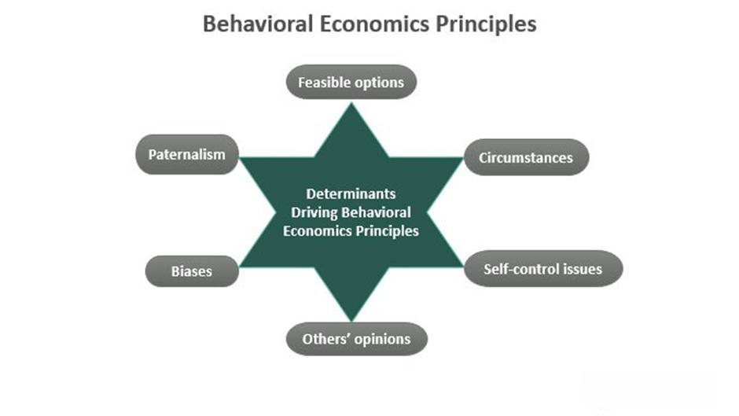

Behaviorism, a foundational theory in psychology, emphasizes the objective analysis of human behavior by focusing on observable actions and the influence of external stimuli. Developed in the early 20th century by figures such as John B. Watson and B.F. Skinner, behaviorism posits that all behaviors result from interactions with the environment, rather than internal states such as emotions or thoughts. This perspective has been instrumental in understanding human behavior, particularly in contexts where decision-making is critical.

Algorithmic trading, a prominent application within financial markets, involves employing automated systems to execute trades based on predefined rules and strategies. These algorithms function without emotional interference, leveraging mathematical models and data analytics to make rapid, efficient decisions. The reliance on predefined rules mirrors the behaviorist focus on observable actions and stimuli, as both prioritize objective over subjective inputs.



The connection between behaviorism and algorithmic trading is underscored by the shared emphasis on minimizing human emotional interference in decision-making processes. In trading, emotions like fear and greed can lead to suboptimal outcomes, a view well-aligned with behaviorist theory, which aims to reduce the influence of these emotional and cognitive biases. By understanding and applying behaviorist beliefs, traders can structure algorithms that maintain objectivity and adhere to strategic decision-making frameworks.

This article aims to explore how behaviorist principles can enhance algorithmic trading performance by examining the interplay between human psychology and automated trading systems. By recognizing the behaviorist foundation in creating trading algorithms, we can better understand how to manage and mitigate biases, ultimately leading to improved trading outcomes. The intersection of these disciplines offers an opportunity to develop trading strategies that are both emotionally resilient and strategically sound, paving the way for more effective and sustainable investment practices.

## Table of Contents

## Behaviorist Principles in Psychology

Behaviorism is a psychological theory that emphasizes the study of observable behavior over internal mental states. Founded by John B. Watson in the early 20th century, behaviorism focuses on the objective analysis of behavior through systematic observation and experimentation. This approach starkly contrasts with introspective methods that rely on subjective reports of mental experiences. Instead, behaviorism prioritizes the examination of the relationship between stimuli (environmental factors) and responses (observable behaviors).

Central to behaviorist principles is the belief that the environment significantly impacts behavior. Behavioral changes can be elicited through controlled manipulation of environmental variables, which is a fundamental concept in both classical and operant conditioning. Classical conditioning, as demonstrated by Ivan Pavlov's experiments with dogs, involves learning via association between a neutral stimulus and an unconditioned stimulus, leading to a conditioned response. Operant conditioning, developed by B.F. Skinner, involves altering behavior through reinforcement or punishment, thereby demonstrating environmental influence on decision-making.

Behaviorism distinguishes itself from other psychological frameworks by rejecting the focus on internal mental states such as thoughts, beliefs, or emotions. Instead, it concentrates on measurable and observable behavior, advocating that behavior can be understood and predicted through the study of stimuli and responses. This perspective necessitates a methodological rigor that centers on quantifiable data and statistical analysis to uncover behavioral patterns.

The influence of behaviorism extends beyond psychology, penetrating fields like economics and finance. In these areas, behaviorist concepts help explain how individuals make decisions based on environmental cues and reinforcements rather than intrinsic motivation or reasoning. Behavioral economics, for instance, draws upon principles of behaviorism to understand consumer behavior and market dynamics. It assesses how biases and heuristics—systematic patterns of deviation from norm or rationality in judgment—can lead to predictable economic outcomes.

In finance, the behaviorist approach sheds light on market phenomena that traditional theories, based on rational decision-making, struggle to account for. It posits that biases such as loss aversion, where individuals prefer avoiding losses over acquiring equivalent gains, significantly influence trading behaviors and market trends. Understanding these behaviorist principles provides valuable insights into the development of strategies that mitigate the adverse effects of biases and enhance decision-making processes in financial environments.

Overall, behaviorism offers a robust framework for analyzing and understanding behavior from an objective standpoint, with widespread applications in several disciplines seeking to leverage environmental influences to predict and modify behavior.

## Algorithmic Trading Explained

Algorithmic trading is a method of executing trades in financial markets using pre-programmed instructions or algorithms. These instructions are based on variables such as timing, price, quantity, and other mathematical models. The purpose of [algorithmic trading](/wiki/algorithmic-trading) is to take advantage of the speed and efficiency of computers in executing market transactions, minimizing human error and emotional biases that often accompany manual trading.

In modern financial markets, algorithmic trading plays a significant role by enabling high-frequency trading and automated execution of large orders that would be challenging to handle manually. Algorithms function by analyzing vast amounts of data and identifying patterns or trends that may not be immediately visible to human traders. This data-driven approach allows for precise decision-making and optimized trade execution, often leading to increased [liquidity](/wiki/liquidity-risk-premium) and reduced transaction costs in the markets.

One of the primary advantages of algorithmic trading is its ability to operate at speeds and with precision far beyond human capabilities. This speed is crucial in capturing fleeting market opportunities, particularly in high-frequency trading, where algorithms can execute thousands of orders per second. Moreover, algorithmic trading eliminates emotional biases that can negatively impact trading decisions, such as fear and greed. By adhering strictly to predefined rules and strategies, algorithmic trading systems maintain consistency and discipline, which are vital for long-term trading success.

Despite these advantages, algorithmic trading does present challenges, particularly in terms of human oversight. Algorithms require constant monitoring and adjustments to respond to market changes, as well as a robust process for strategy validation and deployment. Human intervention is sometimes necessary to manage unforeseen events or anomalies that algorithms may not be programmed to handle effectively. Additionally, there is the challenge of ensuring that algorithms do not inadvertently exacerbate market [volatility](/wiki/volatility-trading-strategies) or deviate from their intended function due to programming errors or limitations in the data they analyze.

Overall, algorithmic trading represents a convergence of technology, mathematics, and finance, reshaping how trades are executed in modern markets. Its benefits in terms of speed, efficiency, and reduction of emotional biases are clear, but the complexities involved underline the need for careful management and strategic oversight to mitigate risks and ensure optimal performance.

## Emotion and Bias in Trading Psychology

Cognitive biases are systematic patterns of deviation from norm or rationality in judgment, and they significantly impact traders' decision-making processes. Among these biases, overconfidence, confirmation bias, and recency bias are particularly pervasive in trading environments.

Overconfidence bias leads traders to overestimate their knowledge, underestimating risks and often resulting in overly aggressive trading behaviors. This bias compromises objective analysis and can result in significant financial losses. Confirmation bias further exacerbates this issue as traders selectively gather information that supports their preconceived notions and strategies, ignoring contradictory evidence that might suggest a different [course](/wiki/best-algorithmic-trading-courses) of action. This selective information processing hinders adaptability and responsiveness to actual market conditions.

Recency bias is another cognitive trap wherein traders give undue weight to recent events, expecting them to persist into the future. This bias often leads to misinterpretation of short-term market movements as trends, prompting premature decisions that can deviate from long-term strategic goals.

Behaviorist psychology provides a useful lens for understanding how these biases affect trading behavior. By focusing on observable behavior rather than internal thought processes, behaviorism emphasizes the role of external stimuli and consequences in shaping actions. This perspective highlights how environmental factors, such as market volatility and feedback, condition trader responses, reinforcing or discouraging certain behaviors over time. For instance, a trader frequently rewarded for aggressive trades may develop an overconfidence bias that aligns with prior experiences, despite changing market contexts.

Fear and greed are two potent emotional drivers in trading psychology, closely linked to cognitive biases. Greed can amplify overconfidence, pushing traders to chase returns through impulsive decisions, while fear can trigger loss aversion, leading to hasty exits from trades to avoid short-term losses. These emotions not only destabilize trading strategies but also perpetuate psychological biases, creating a cyclical effect that distorts market interpretations and reactions.

For traders managing algorithms, these psychological factors hold critical implications. Although algorithmic trading removes the direct emotional input from decision-making, the biases of human designers and managers can still influence algorithmic strategy development and adjustments. If not carefully managed, cognitive biases can infiltrate algorithmic models, reflecting in the selection of parameters, risk management protocols, and response mechanisms to market signals.

To mitigate the impact of cognitive biases in algorithmic trading, it is essential to incorporate behaviorist insights to create systems that account for emotional and cognitive influences. Techniques such as stress testing and adaptive learning models can help ensure that algorithms remain robust against irrational market conditions driven by collective trader biases.

In summary, understanding and managing cognitive biases through the principles of behaviorist psychology is critical for traders and algorithm designers. It not only refines the decision-making frameworks but also enhances the effectiveness and resilience of trading strategies in dynamic market environments.

## Behaviorist Influence on Algorithmic Trading

Behaviorist principles have significantly influenced the way cognitive biases are understood and managed in algorithmic trading. The fundamental concepts of behaviorism, which emphasize the observable aspects of human behavior and the effects of external stimuli, offer valuable insights for enhancing trading performance and reducing emotional decision-making errors.

### Strategies for Aligning Trading Systems with Behaviorist Insights

Behaviorist insights focus on eliminating emotional interference and emphasizing observable behavior, which is essential in trading. By embedding behaviorist principles into trading systems, traders can develop strategies that are less prone to emotional biases. This involves the rigorous application of rules that focus on objective data and predefined criteria, thus ensuring that decisions are consistently applied across varying market conditions.

1. **Rule-Based Systems**: Algorithms are inherently rule-based, reflecting the core tenet of behaviorism. These algorithms can mitigate biases by adhering strictly to predefined rules, such as utilizing moving averages to trigger buy/sell decisions without succumbing to momentary emotional impulses.

2. **Backtesting and Simulation**: These processes incorporate behaviorist ideas by allowing traders to observe how strategies perform under various conditions. By evaluating past data, traders can refine their algorithms to perform reliably regardless of emotional market anomalies.

3. **Feedback Loops**: Just as behaviorism relies on reinforcement and punishment to shape behavior, algorithmic systems can integrate performance feedback loops to adjust trading strategies dynamically, enhancing decision accuracy.

### Behavioral Finance Theories Bridging Psychology and Algorithmic Strategies

Behavioral finance provides a critical connection between psychology and financial strategies, offering insights into how cognitive biases affect trading decisions. It examines how psychological influences and biases systematically affect the financial behaviors of market participants.

1. **Prospect Theory**: This theory highlights how individuals value gains and losses differently, affecting their rationality in economic decision-making. Algorithms designed with an understanding of prospect theory can be structured to balance risk preferences efficiently, avoiding common traps such as excessive risk aversion or risk-seeking behavior during losses.

2. **Heuristic-driven Algorithms**: Trading algorithms can incorporate heuristics, which are mental shortcuts used for decision-making, into their logic. By understanding common heuristics and their limitations, trading systems can be designed to navigate complex market situations where human intuition might fail.

### Decision-Making Frameworks Incorporating Emotional and Cognitive Influences

Developing frameworks that consider both emotional and cognitive factors is essential for creating robust trading systems. Key approaches include:

1. **Integrated Cognitive Models**: These models employ machine learning to mimic cognitive processes and predict human market behavior, allowing algorithms to anticipate and react to patterns likely influenced by collective trader psychology.

2. **Mindful Algorithm Development**: Applying mindfulness in algorithm design involves a conscious effort to remain objective and detached from emotional fluctuation, mirroring the behaviorist emphasis on measurable outcomes. This leads to developing algorithms that perform consistently, independent of psychological market disturbances.

3. **Adaptive Learning Systems**: By utilizing adaptive algorithms that learn from market data in real-time, trading systems can adjust to emerging patterns. This adaptability ensures decisions are informed by current, objective data rather than outdated emotional biases.

In summary, by applying behaviorist principles to manage cognitive biases, traders can enhance their algorithmic trading strategies, aligning them with insights from psychology and behavioral finance. This intersection fosters better decision-making frameworks that effectively account for emotional and cognitive influences, contributing to improved trading outcomes and a higher degree of market resilience.

## Managing Cognitive Biases in Trading

In the fast-paced domain of algorithmic trading, cognitive biases can significantly impact the performance and decision-making of traders and their algorithmic systems. Understanding and managing these biases is essential for achieving consistent and objective trading outcomes.

### Techniques for Identifying and Mitigating Biases in Algorithmic Trading

Identifying biases in trading requires a systematic approach that integrates psychological insights and quantitative methods. Common biases such as overconfidence, confirmation bias, and recency bias can skew decision-making processes and must be recognized to minimize their negative effects.

**Importance of Mindfulness and a Disciplined Approach**

Mindfulness plays a critical role in maintaining objectivity in trading. By cultivating awareness of one's thoughts and emotions, traders can better identify when biases influence their decisions. This disciplined approach involves regularly assessing one's mental and emotional state, establishing clear trading rules, and adhering to a structured decision-making process. It promotes a focus on long-term strategy over impulsive reactions to market fluctuations.

**Practical Steps to Enhance Self-Awareness**

1. **Stress Testing**: Stress testing algorithmic models under various market conditions can reveal potential vulnerabilities and biases. This process involves simulating extreme scenarios to evaluate the performance and resilience of trading algorithms, aiding in the detection of hidden biases.

2. **Use of Ensemble Methods**: Incorporating ensemble methods can reduce the impact of biases by leveraging multiple models to make predictions or trading decisions. This approach combines different algorithms, each with distinct assumptions and perspectives, to average out bias and improve accuracy.

   ```python
   from sklearn.ensemble import RandomForestClassifier

   # Example ensemble method using RandomForest
   model = RandomForestClassifier(n_estimators=100)
   model.fit(X_train, y_train)
   predictions = model.predict(X_test)
   ```

3. **Trading Journals**: Maintaining detailed trading journals enhances self-awareness and accountability. By documenting trades, thoughts, and emotions, traders can reflect on past decisions and identify patterns indicative of cognitive biases. This practice aids in recognizing recurring biases and adjusting strategies accordingly.

### Real-world Case Studies

Real-world examples provide valuable insights into the impact of cognitive biases on trading outcomes. One notable case involved a [hedge fund](/wiki/hedge-fund-trading-strategies) that experienced significant losses due to confirmation bias. The fund managers selectively interpreted data that supported their pre-existing beliefs while ignoring contradicting evidence. By revising their approach to include regular bias assessments and ensemble models, they were able to correct course and improve performance.

Another case highlighted the role of overconfidence bias, where a proprietary trading firm relied excessively on a single model they believed to be infallible. The lack of a disciplined approach and overconfidence in the model's predictive power led to severe financial setbacks. Incorporating mindfulness practices and stress testing helped the firm identify underlying issues and adopt a more diversified and robust strategy.

Understanding and managing cognitive biases in algorithmic trading is pivotal for optimizing trading performance. By integrating techniques such as mindfulness, stress testing, ensemble methods, and reflective practices, traders can mitigate biases and pursue a more objective trading approach. This not only enhances decision-making but also contributes to sustainable investment success.

## Conclusion

Behaviorist beliefs play a critical role in moderating human influence in algorithmic trading by emphasizing the importance of observable behaviors and stimuli over intangible emotions and cognitive biases. By focusing on these principles, traders can make more rational decisions, reducing the impact of biases that often undermine trading performance. Incorporating behaviorist insights into algorithmic trading strategies enhances objectivity, providing a more structured approach to managing market volatility and emotional challenges.

Encouraging traders to integrate psychological insights into their strategies is essential for developing a comprehensive trading framework. By acknowledging the relevance of cognitive biases and emotional influences, traders can craft strategies that counteract these factors. Techniques such as stress testing and mindfulness foster a more disciplined trading environment, promoting both efficiency and effectiveness.

The interdisciplinary approach combining psychology and algorithmic trading holds promising implications for future financial markets. As traders and analysts continue to appreciate the relevance of behaviorist principles, we can anticipate a deeper understanding of market dynamics and improved educational resources for learning to trade effectively. This could lead to more sophisticated trading algorithms that self-adjust to new information, ultimately enhancing the robustness of financial markets.

The pursuit of bias-free trading is pivotal for achieving sustainable investment success. Eliminating emotional interference and cognitive biases enables traders to maintain a consistent and deliberate approach, fostering long-term growth and stability. As the border between psychology and algorithmic trading narrows, the industry will see a shift towards more holistic trading practices, empowering investors to achieve their goals with greater confidence and precision.

## References & Further Reading

[1]: Skinner, B.F. (1953). *Science and Human Behavior*. Macmillan.

[2]: Watson, J.B. (1913). *Psychology as the Behaviorist Views It*. Psychological Review, 20(2), 158-177.

[3]: O'Hara, M. (1995). *Market Microstructure Theory*. Blackwell.

[4]: Thaler, R.H. (2016). *Behavioral Economics: Past, Present, and Future*. American Economic Review, 106(7), 1577-1600.

[5]: Lo, A.W. (2004). *The Adaptive Markets Hypothesis: Market Efficiency from an Evolutionary Perspective*. Journal of Portfolio Management, 30(5), 15-29.

[6]: Barberis, N., & Thaler, R. (2003). A Survey of Behavioral Finance. In *Handbook of the Economics of Finance* (Vol. 1, pp. 1053-1128). Elsevier.