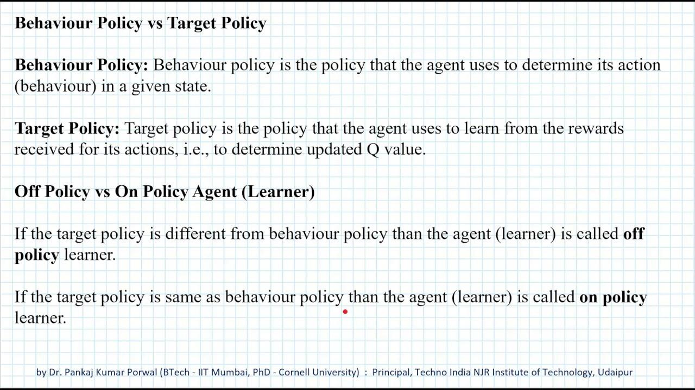

## Table of Contents

## What is a behavior policy in the context of machine learning?

In machine learning, a behavior policy is a set of rules or a strategy that an agent follows to decide its actions in a given environment. This is particularly important in reinforcement learning, where an agent learns by interacting with its environment. The behavior policy determines what actions the agent takes at each step, based on its current state and possibly other factors like past experiences or randomness. For example, in a game, the behavior policy could tell the agent whether to move left, right, or jump based on where it is on the screen.

The behavior policy is crucial because it affects how the agent explores the environment and learns from it. If the policy is too greedy and always chooses the action that seems best at the moment, the agent might miss out on discovering better strategies. On the other hand, if the policy includes some randomness, the agent can explore more and potentially find better solutions over time. A common approach is to use an epsilon-greedy policy, where the agent chooses the best known action most of the time but occasionally selects a random action to explore new possibilities. This balance between exploiting known good actions and exploring new ones is key to effective learning.

## How does a behavior policy differ from a target policy?

In reinforcement learning, a behavior policy is what the agent actually uses to decide its actions while interacting with the environment. Think of it as the "doing" policy. It tells the agent what to do at each step based on its current situation. For example, if the agent is playing a game, the behavior policy decides whether to move left, right, or jump. The behavior policy can change over time as the agent learns and gets better at the task.

A target policy, on the other hand, is what the agent aims to learn and eventually follow. It's the "ideal" policy that the agent hopes to achieve. The target policy might be updated based on the experiences gathered by following the behavior policy. For instance, if the agent finds that moving right more often leads to higher scores in the game, the target policy might start to favor moving right. The key difference is that while the behavior policy is used in real-time to make decisions, the target policy is what the agent is trying to improve and eventually adopt as its behavior policy.

To sum up, the behavior policy is the current strategy the agent uses to act, and it can include elements of exploration to help the agent learn. The target policy is the optimal strategy the agent is trying to discover and perfect. Over time, as the agent learns, the behavior policy might start to look more and more like the target policy.

## What is the purpose of using behavior policies in reinforcement learning?

In [reinforcement learning](/wiki/reinforcement-learning), the behavior policy helps the agent figure out the best way to act in different situations. It's like a guide that tells the agent what to do at each step. The main purpose of using a behavior policy is to let the agent explore the environment and learn from its experiences. By trying different actions, the agent can discover which ones lead to good outcomes and which ones don't. This exploration is important because it helps the agent improve over time and find the best way to reach its goals.

The behavior policy is also important because it can balance exploration and exploitation. Exploration means trying new actions to see what happens, while exploitation means sticking with actions that are known to work well. A good behavior policy will include some randomness to encourage exploration, but it will also use what the agent has already learned to make smart choices. This balance helps the agent learn faster and more effectively, leading to better performance in the long run.

## Can you explain the Epsilon Greedy Exploration strategy as a behavior policy?

The Epsilon Greedy Exploration strategy is a simple but effective way to balance exploring new actions and exploiting known good actions in reinforcement learning. In this strategy, the agent uses a number called epsilon (often written as $$\epsilon$$) to decide whether to explore or exploit. If the agent decides to explore, it will choose a random action. If it decides to exploit, it will choose the action that it thinks is best based on what it has learned so far. The value of epsilon controls how often the agent explores: a high epsilon means more exploration, while a low epsilon means more exploitation.

For example, if epsilon is set to 0.1, the agent will choose a random action 10% of the time and the best known action 90% of the time. Over time, as the agent learns more about the environment, the value of epsilon can be lowered to shift from exploration to exploitation. This helps the agent find the best actions more quickly and improve its performance. The Epsilon Greedy strategy is popular because it's easy to understand and implement, yet it can be very effective in many reinforcement learning scenarios.

## How does the Go-Explore algorithm work as a behavior policy?

The Go-Explore algorithm is a smart way for an agent to explore and learn about its environment in reinforcement learning. Instead of trying random actions all the time, Go-Explore starts by exploring the environment in a very thorough way. It keeps track of all the different states it visits, like a map, and tries to reach as many new places as possible. This is different from other methods because it focuses on exploring all the nooks and crannies of the environment first, rather than just trying to get a high score right away.

Once the agent has explored a lot and built its map, it uses this information to find the best way to reach its goal. It looks at all the states it visited and figures out which ones lead to the best outcomes. Then, it starts to focus on these good paths, trying to improve its performance by following them more often. This method can be really helpful in complex environments where it's hard to find the right way to go just by trying random actions. By exploring first and then exploiting what it learned, Go-Explore helps the agent learn faster and do better in the long run.

## What are the advantages of using Epsilon Greedy Exploration in machine learning?

Epsilon Greedy Exploration is a popular strategy in [machine learning](/wiki/machine-learning) because it is easy to understand and implement. It works by using a value called epsilon ($$ \epsilon $$) to decide whether to try a new action or stick with what's known to work. If epsilon is set to 0.1, for example, the agent will choose a random action 10% of the time and the best known action 90% of the time. This balance helps the agent explore new possibilities without forgetting what it has already learned. By adjusting epsilon over time, the agent can start with more exploration and gradually shift to more exploitation as it learns more about the environment.

The main advantage of Epsilon Greedy Exploration is that it helps the agent learn faster and more effectively. By trying new actions sometimes, the agent can discover better strategies that it might have missed otherwise. This is especially useful in complex environments where the best actions are not immediately obvious. At the same time, by choosing the best known action most of the time, the agent can still make good decisions based on what it has learned. This balance between exploring new actions and exploiting known good actions makes Epsilon Greedy a reliable and efficient strategy for many reinforcement learning tasks.

## What challenges might one face when implementing the Go-Explore behavior policy?

Implementing the Go-Explore behavior policy can be challenging because it requires the agent to explore the environment thoroughly before focusing on exploitation. This means the agent needs to keep track of all the states it visits, which can be difficult in complex or large environments. For example, if the environment is a big maze, the agent needs to remember every corner and dead-end it explores. This requires a lot of memory and can slow down the learning process. Additionally, deciding when to switch from exploring to exploiting can be tricky. If the agent stops exploring too soon, it might miss out on finding better paths or strategies.

Another challenge is that Go-Explore can be time-consuming. Because the agent spends a lot of time exploring at the beginning, it might take longer to start seeing improvements in performance compared to other methods. This can be frustrating if you need quick results. Also, the agent needs a good way to decide which states are worth revisiting. If it doesn't have a smart way to choose, it might waste time going back to states that don't lead to better outcomes. Balancing exploration and exploitation effectively is key to making Go-Explore work well, and getting this balance right can be hard.

## How can behavior policies be evaluated for effectiveness in a learning environment?

Evaluating the effectiveness of behavior policies in a learning environment involves looking at how well the agent learns and performs over time. One way to do this is by measuring the agent's performance using a reward or score system. For example, if the agent is playing a game, you can track its score or how quickly it reaches the goal. Another important measure is how much the agent explores new actions versus sticking with what it knows. A good balance between exploration and exploitation can be seen by tracking the agent's progress over many episodes. If the agent's performance improves steadily and it reaches high scores or rewards, the behavior policy is likely effective.

Another way to evaluate behavior policies is by comparing them to other policies or to a target policy. This can be done by running multiple experiments where the agent uses different policies and then comparing the results. For example, if you compare an Epsilon Greedy policy to a Go-Explore policy, you might find that one helps the agent learn faster or reach higher scores. You can also look at how the agent's behavior changes over time. If the policy helps the agent move from trying random actions to making smart choices based on what it has learned, it's a sign that the policy is working well. By using these methods, you can get a good idea of how effective a behavior policy is in helping the agent learn and perform in its environment.

## What are some common pitfalls to avoid when designing behavior policies?

When designing behavior policies, one common pitfall to avoid is focusing too much on exploitation and not enough on exploration. If the agent always chooses the action that seems best at the moment, it might miss out on discovering better strategies. For example, in the Epsilon Greedy strategy, if $$ \epsilon $$ is set too low, the agent might not explore enough new actions. This can lead to the agent getting stuck in a local optimum, where it thinks it's doing well but could actually do much better if it tried something different.

Another pitfall is not adapting the policy over time. As the agent learns more about the environment, the behavior policy should change to reflect this new knowledge. If the policy stays the same, the agent might not be able to improve its performance. For instance, in Go-Explore, the agent needs to switch from exploring to exploiting at the right time. If it keeps exploring too long, it might waste time that could be spent improving its performance. Balancing exploration and exploitation effectively and adjusting the policy as the agent learns are key to avoiding these pitfalls and designing an effective behavior policy.

## How do behavior policies adapt to different types of environments in reinforcement learning?

Behavior policies in reinforcement learning need to adapt to different environments to help the agent learn and perform well. One way they do this is by changing how much they explore or exploit based on the environment. For example, in a simple environment where the best actions are easy to find, the policy might start with a low value of epsilon in an Epsilon Greedy strategy, like $$ \epsilon = 0.1 $$. This means the agent will mostly stick to what it knows works well. But in a complex environment where the best actions are hard to find, the policy might start with a higher epsilon, like $$ \epsilon = 0.3 $$, to encourage more exploration and help the agent discover new strategies.

Another way behavior policies adapt is by changing over time as the agent learns more about the environment. For example, in the Go-Explore algorithm, the policy starts by exploring the environment thoroughly, building a map of all the states it visits. Once it has a good understanding of the environment, the policy shifts to exploiting the best paths it found. This shift from exploration to exploitation helps the agent improve its performance in any environment, whether it's a simple game or a complex simulation. By adapting in these ways, behavior policies can help the agent learn effectively in different types of environments.

## What advanced techniques can be used to optimize behavior policies in complex scenarios?

One advanced technique to optimize behavior policies in complex scenarios is using Deep Q-Networks (DQNs). DQNs combine reinforcement learning with [deep learning](/wiki/deep-learning) to help the agent learn better policies in environments with high-dimensional state spaces. In a DQN, the agent uses a [neural network](/wiki/neural-network) to estimate the value of different actions. The network is trained using experiences the agent collects while interacting with the environment. By using a technique called experience replay, the agent can learn from past experiences more efficiently. This helps the agent adapt its behavior policy to handle complex scenarios where simple strategies like Epsilon Greedy might not be enough.

Another technique is using policy gradient methods, like the REINFORCE algorithm. These methods directly optimize the behavior policy by adjusting it based on the rewards the agent receives. In policy gradient methods, the agent learns a policy that maps states to actions, and this policy is updated to increase the likelihood of actions that lead to higher rewards. This can be particularly useful in scenarios where the environment is continuously changing or when the agent needs to learn a policy that can handle a wide range of situations. By optimizing the policy directly, the agent can find effective strategies in complex and dynamic environments.

## How can the performance of different behavior policies like Epsilon Greedy and Go-Explore be compared in a specific application?

To compare the performance of different behavior policies like Epsilon Greedy and Go-Explore in a specific application, you can run multiple experiments where the agent uses each policy in turn. For example, if the application is a game, you can track the agent's score or how quickly it reaches the goal over many episodes. For Epsilon Greedy, you might start with an epsilon value like $$ \epsilon = 0.1 $$ and see how the agent's performance changes over time. For Go-Explore, you can observe how the agent first explores the game thoroughly before starting to exploit the best paths it found. By comparing the average scores or the time taken to reach the goal for each policy, you can see which one helps the agent learn and perform better in the game.

Another way to compare these policies is by looking at how they balance exploration and exploitation. Epsilon Greedy uses a simple rule where the agent chooses a random action $$ \epsilon $$ percent of the time and the best known action the rest of the time. This can be good for simple environments but might not work as well in complex ones. Go-Explore, on the other hand, starts by exploring the environment fully before focusing on the best paths. This can be more effective in complex scenarios where finding the best actions is harder. By analyzing how each policy adapts to the specific application and how well it helps the agent improve over time, you can decide which one is more suitable for the task at hand.

## References & Further Reading

[1]: Sutton, R. S., & Barto, A. G. (2018). ["Reinforcement Learning: An Introduction"](https://web.stanford.edu/class/psych209/Readings/SuttonBartoIPRLBook2ndEd.pdf) (2nd ed.). MIT Press.

[2]: Mnih, V., Kavukcuoglu, K., Silver, D., Graves, A., Antonoglou, I., Wierstra, D., & Riedmiller, M. (2015). ["Human-level control through deep reinforcement learning."](https://arxiv.org/abs/1312.5602) Nature, 518(7540), 529-533.

[3]: Salimans, T., & Chen, R., Sidor, S., & Sutskever, I. (2018). ["Learning Montezuma’s Revenge from a Single Demonstration."](https://arxiv.org/abs/1703.03864) arXiv:1805.11592.

[4]: Ecoffet, A., Huizinga, J., Lehman, J., Stanley, K. O., & Clune, J. (2021). ["First return, then explore."](https://arxiv.org/abs/2004.12919) Nature, 590(7847), 580-586.

[5]: Van Hasselt, H., Guez, A., & Silver, D. (2016). ["Deep Reinforcement Learning with Double Q-Learning."](https://arxiv.org/abs/1509.06461) In Proceedings of the AAAI Conference on Artificial Intelligence.

[6]: Watkins, C. J., & Dayan, P. (1992). ["Q-learning."](https://link.springer.com/article/10.1007/BF00992698) Machine Learning, 8, 279-292.