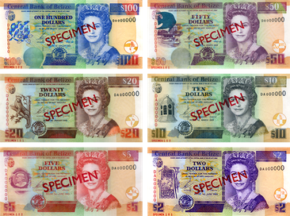

## Table of Contents

## What is the Belize Dollar and how is it abbreviated?

The Belize Dollar is the official currency used in Belize, a country in Central America. It is used by people in Belize to buy things like food, clothes, and other goods and services. The Belize Dollar is managed by the Central Bank of Belize, which makes sure that the currency stays stable and works well for the country's economy.

The abbreviation for the Belize Dollar is "BZD." This abbreviation is used in banks, stores, and other places where money is used. When you see BZD, it means the price or amount is in Belize Dollars. It's important to know this abbreviation if you are traveling to Belize or doing business there.

## How does the Belize Dollar compare to the US Dollar?

The Belize Dollar (BZD) is linked to the US Dollar (USD) in a fixed exchange rate system. This means that 1 US Dollar is always worth 2 Belize Dollars. This fixed rate makes it easier for people in Belize to know how much their money is worth in US Dollars, which can be helpful for trading and traveling.

Because the Belize Dollar is tied to the US Dollar, if the US Dollar goes up or down in value compared to other currencies, the Belize Dollar will move in the same way. This can affect how much things cost in Belize if they are bought from other countries. But inside Belize, prices stay stable because the exchange rate with the US Dollar does not change.

## What is the history of the Belize Dollar?

The Belize Dollar started being used in 1974. Before that, Belize used the British Honduras Dollar, which was the currency when Belize was still called British Honduras. The British Honduras Dollar was tied to the US Dollar, just like the Belize Dollar is now. When Belize became independent in 1981, they kept using the Belize Dollar and kept the same fixed exchange rate with the US Dollar.

The Belize Dollar was made to help Belize have its own money after becoming independent. The Central Bank of Belize was created to manage the Belize Dollar and make sure it stayed stable. The fixed exchange rate with the US Dollar was kept because it helped keep prices stable and made it easier for Belize to trade with other countries. Over the years, the Belize Dollar has stayed strong and helped the country's economy grow.

## What are the main economic sectors in Belize?

Belize has many important parts of its economy. The biggest one is tourism. People come to Belize to see its beautiful beaches, rainforests, and old Maya ruins. This brings a lot of money into the country. Another big part is agriculture. Farmers in Belize grow things like sugarcane, bananas, and citrus fruits. They also raise animals like cows and chickens. These things are sold in Belize and other countries, helping the economy.

Fishing is also very important in Belize. People catch fish, shrimp, and lobsters from the sea and sell them. This is a big part of the economy, especially in places near the coast. Another sector is services, which includes things like banking, insurance, and other businesses that help people and companies. These services help the economy grow by providing jobs and making money for the country.

## How does tourism impact Belize's economy?

Tourism is a big part of Belize's economy. It brings in a lot of money because people come to see the beautiful beaches, rainforests, and old Maya ruins. When tourists visit, they spend money on hotels, food, tours, and souvenirs. This helps create jobs for people in Belize who work in hotels, restaurants, and as tour guides. The money tourists spend helps the economy grow and makes life better for people in Belize.

Tourism also helps other parts of the economy. For example, when tourists buy things like local crafts or food, it helps small businesses and farmers. This means more money stays in Belize and helps more people. The government also gets money from tourism through taxes and fees, which they can use to build schools, roads, and hospitals. So, tourism is very important for making Belize's economy strong and helping the country develop.

## What is the role of agriculture in Belize's economy?

Agriculture is a big part of Belize's economy. Farmers in Belize grow many things like sugarcane, bananas, and citrus fruits. They also raise animals like cows and chickens. These crops and animals are sold in Belize and other countries. This brings money into the country and helps the economy grow. Many people in Belize work on farms, so agriculture also creates a lot of jobs.

Agriculture helps other parts of the economy too. For example, when farmers sell their products, it helps businesses that make things like food and drinks. This means more money stays in Belize and helps more people. The government also gets money from agriculture through taxes, which they can use to build schools, roads, and hospitals. So, agriculture is very important for making Belize's economy strong and helping the country develop.

## What are the current economic challenges facing Belize?

Belize faces some big economic challenges right now. One big problem is the country's debt. Belize has borrowed a lot of money, and it can be hard to pay it back. This means the government has to spend a lot of money on interest instead of things like schools and hospitals. Another challenge is that many people in Belize are poor. This means they don't have a lot of money to spend, which can make it harder for the economy to grow.

Another issue is that Belize depends a lot on tourism and agriculture. If something bad happens, like a hurricane or a drop in prices for crops, it can hurt the economy a lot. For example, if fewer tourists come to Belize, hotels and restaurants might lose money, and people could lose their jobs. Also, Belize needs to find new ways to make money and create jobs. This can be hard because the country is small and doesn't have a lot of industries to choose from.

## How does the government of Belize manage its currency and monetary policy?

The government of Belize manages its currency and monetary policy through the Central Bank of Belize. The Central Bank controls the Belize Dollar and makes sure it stays stable. One big way they do this is by keeping the Belize Dollar tied to the US Dollar at a fixed rate of 2 Belize Dollars for every 1 US Dollar. This helps keep prices stable in Belize and makes it easier for the country to trade with other countries. The Central Bank also watches how much money is in the economy and can change interest rates to help control inflation, which is when prices go up too fast.

Another thing the Central Bank does is manage the country's foreign reserves. These are like savings in other currencies that Belize can use if it needs to. Having enough foreign reserves helps make sure Belize can pay for things it buys from other countries. The Central Bank also works with the government to make rules about banks and other financial places to keep them safe and fair. By doing all these things, the Central Bank helps keep Belize's economy strong and stable.

## What is the inflation rate in Belize and how has it changed over time?

The inflation rate in Belize shows how much prices for things like food, clothes, and other stuff are going up over time. In recent years, Belize has had an inflation rate that goes up and down. For example, in 2022, the inflation rate was around 6%, which means prices went up by about 6% that year. This can be higher or lower depending on many things, like how much food costs or if there are big changes in the world economy.

Over the past few years, Belize's inflation rate has been different. From 2015 to 2020, the inflation rate was pretty low, usually between 0% and 1%. This means prices didn't go up very much during those years. But starting in 2021, the inflation rate started to go up more. This happened because of things like the cost of food going up and other global economic changes. The government and the Central Bank of Belize keep a close eye on inflation to make sure it doesn't get too high and cause problems for people and the economy.

## How does Belize's economy interact with global trade?

Belize's economy is connected to the world through global trade. The country exports things like sugar, bananas, and citrus fruits to other countries. This brings money into Belize and helps the economy grow. Belize also imports things it needs, like machinery, vehicles, and some food items. These imports help businesses in Belize run better and give people more choices when they shop. The fixed exchange rate with the US Dollar makes it easier for Belize to trade with other countries because it keeps the value of the Belize Dollar stable.

Global trade can also bring challenges for Belize. If the prices of the things Belize exports, like sugar or bananas, go down, it can hurt the economy because the country makes less money from selling them. Also, if there are big changes in the world, like a global economic crisis or a natural disaster, it can make it harder for Belize to trade. The government and the Central Bank work to manage these challenges by keeping the economy stable and finding new ways to trade with other countries.

## What are the major foreign investments in Belize and their impact on the economy?

Foreign investments in Belize come from different places and help the economy grow. A lot of money comes from tourism. Big hotel chains and resorts from other countries build places for tourists to stay. This brings in more tourists, which means more money for Belize. Another big area is agriculture. Companies from other countries invest in farming, especially in sugarcane and citrus fruits. This helps create jobs and brings in money when these products are sold to other countries.

These investments have a big impact on Belize's economy. They create jobs for people in Belize, which means more people have money to spend. This helps the economy grow because when people spend money, it goes back into businesses and helps them grow too. Also, foreign investments bring in new technology and ways of doing things, which can make Belize's businesses better and more competitive. But, there can be challenges too. Sometimes, foreign companies might take profits out of Belize, which means less money stays in the country. The government works to balance these benefits and challenges to make sure foreign investments help Belize's economy in the best way possible.

## What future economic strategies are being considered by Belize to enhance growth and stability?

Belize is thinking about different ways to help its economy grow and stay strong. One big idea is to make tourism even better. They want to build more places for tourists to stay and do more things for them to see and do. This will bring in more tourists and more money. Another idea is to help farmers grow more and different kinds of food. By doing this, Belize can sell more of its food to other countries and make more money. The government also wants to bring in more foreign companies to invest in Belize. This can create more jobs and bring in new ideas and technology.

Another strategy is to work on education and skills training. By helping people learn more and get better jobs, they can earn more money and help the economy grow. Belize also wants to use its natural resources in a smart way, like making energy from the sun and wind. This can save money and help the environment. The government is also looking at ways to manage the country's debt better so they can spend more money on things that help the economy, like schools and hospitals. By doing all these things, Belize hopes to make its economy stronger and more stable for the future.

## References & Further Reading

[1]: ["Belize: Selected Issues"](https://www.imf.org/en/Publications/CR/Issues/2024/05/15/Belize-Selected-Issues-549011) by International Monetary Fund (IMF)

[2]: Tarp, F. (2000). ["Stabilization and Structural Adjustment: Macroeconomic Frameworks for Analyzing the Crisis in Sub-Saharan Africa"](https://www.taylorfrancis.com/books/mono/10.4324/9780203018644/stabilization-structural-adjustment-finn-tarp). Structural Adjustment Programmes, Vol. 7, No. 2, pp. 25-44.

[3]: ["Advances in Financial Machine Learning"](https://www.amazon.com/Advances-Financial-Machine-Learning-Marcos/dp/1119482089) by Marcos Lopez de Prado

[4]: ["Quantitative Trading: How to Build Your Own Algorithmic Trading Business"](https://www.amazon.com/Quantitative-Trading-Build-Algorithmic-Business/dp/1119800064) by Ernest P. Chan

[5]: ["Belize: Financial Sector Assessment Program"](https://www.imf.org/external/pubs/ft/scr/2014/cr14281.pdf) by World Bank

[6]: ["A Review of Exchange Rate Regimes in Latin America"](https://ri.conicet.gov.ar/handle/11336/114590) by International Monetary Fund

[7]: ["Belize’s Tourism Industry: A Sustainable Growth Strategy"](https://www.interamericandialogue.org/wp-content/uploads/2020/11/Belize-Tourism-Industry-2020-Digital-Report.pdf) by Inter-American Dialogue

[8]: ["Caribbean and Central American Monetary Policies: The Pegged Exchange Rate Path"](https://www.centralbank.org.bb/viewPDF/documents/2022-02-14-03-24-55-Exchange-Rate-Regimes-and-Monetary-Autonomy-Empirical-Evidence-from-Selected-Caribbean-Countries.pdf) by Economic Commission for Latin America and the Caribbean (ECLAC)