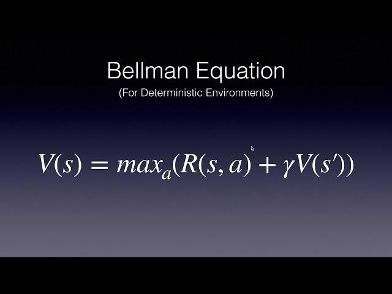

## Table of Contents

## What is the Bellman Equation in the context of machine learning?

The Bellman Equation is a fundamental concept in reinforcement learning, a type of machine learning where an agent learns to make decisions by interacting with an environment. It helps in breaking down a complex problem into smaller, manageable parts. The equation is named after Richard Bellman and is used to calculate the value of a state in an environment, which represents how good it is for the agent to be in that state. By understanding the value of states, the agent can decide on the best actions to take to maximize its rewards over time.

In simple terms, the Bellman Equation states that the value of a state is equal to the immediate reward the agent gets from being in that state, plus the discounted value of the next state the agent will transition to. Mathematically, it can be expressed as $$V(s) = R(s) + \gamma \sum_{s'} P(s'|s) V(s')$$, where $V(s)$ is the value of the current state, $R(s)$ is the immediate reward, $\gamma$ is the discount factor, $P(s'|s)$ is the probability of transitioning to the next state $s'$, and $V(s')$ is the value of the next state. This equation allows the agent to plan its actions by considering both short-term and long-term rewards, helping it to learn optimal policies for decision-making.

## How does the Bellman Equation relate to reinforcement learning?

The Bellman Equation is key to reinforcement learning because it helps the agent figure out how good a state is. In reinforcement learning, an agent learns by trying different actions in an environment and getting rewards or penalties. The Bellman Equation breaks down this learning process by saying that the value of being in a certain state is the reward you get right away, plus the value of where you might go next. This helps the agent plan ahead and choose actions that will lead to the best overall rewards.

For example, if you're playing a game and you're at a certain spot on the board, the Bellman Equation helps you decide if you should move left or right by calculating the value of each possible next spot. The equation looks like this: $$V(s) = R(s) + \gamma \sum_{s'} P(s'|s) V(s')$$. Here, $V(s)$ is how good the current spot is, $R(s)$ is the reward you get right now, $\gamma$ is how much you care about future rewards, $P(s'|s)$ is the chance of moving to a new spot, and $V(s')$ is how good the new spot is. By using this equation, the agent can learn the best way to play the game over time.

## Can you explain the difference between the Bellman Equation for value functions and policy evaluation?

The Bellman Equation for value functions and policy evaluation are closely related but serve slightly different purposes in [reinforcement learning](/wiki/reinforcement-learning). The Bellman Equation for value functions, often called the Bellman Optimality Equation, is used to find the best possible value for each state in an environment. It helps determine the optimal policy by considering all possible actions and their outcomes. The equation is $$V^*(s) = \max_a \left( R(s, a) + \gamma \sum_{s'} P(s'|s, a) V^*(s') \right)$$, where $V^*(s)$ is the optimal value of state $s$, $R(s, a)$ is the reward for taking action $a$ in state $s$, $\gamma$ is the discount [factor](/wiki/factor-investing), $P(s'|s, a)$ is the probability of transitioning to state $s'$ after taking action $a$ in state $s$, and $V^*(s')$ is the optimal value of the next state.

On the other hand, policy evaluation uses the Bellman Equation to assess the value of states under a specific policy, without necessarily finding the optimal policy. It calculates the value function for a given policy $\pi$, which tells the agent what action to take in each state. The equation for policy evaluation is $$V^\pi(s) = \sum_a \pi(a|s) \left( R(s, a) + \gamma \sum_{s'} P(s'|s, a) V^\pi(s') \right)$$, where $V^\pi(s)$ is the value of state $s$ under policy $\pi$, $\pi(a|s)$ is the probability of taking action $a$ in state $s$ according to the policy, and the other terms are the same as in the Bellman Optimality Equation. Policy evaluation is useful for understanding how well a particular strategy works before trying to improve it.

## What is the role of the Bellman Equation in dynamic programming?

The Bellman Equation plays a central role in dynamic programming, which is a method used to solve complex problems by breaking them down into simpler subproblems. In the context of reinforcement learning, dynamic programming uses the Bellman Equation to iteratively update the value of states until convergence. This process helps in calculating the optimal value function for an environment, allowing an agent to determine the best actions to take at each step. The equation $$V(s) = \max_a \left( R(s, a) + \gamma \sum_{s'} P(s'|s, a) V(s') \right)$$ is used in dynamic programming to find the optimal policy by considering the immediate reward and the discounted future rewards.

Dynamic programming methods like value iteration and policy iteration rely on the Bellman Equation to refine their estimates of state values or policy performance. Value iteration directly applies the Bellman Equation to update the value of each state until the values stabilize, indicating that the optimal value function has been found. Policy iteration, on the other hand, alternates between evaluating a policy using the Bellman Equation for policy evaluation $$V^\pi(s) = \sum_a \pi(a|s) \left( R(s, a) + \gamma \sum_{s'} P(s'|s, a) V^\pi(s') \right)$$ and improving the policy based on the evaluated values. Through these iterative processes, dynamic programming leverages the Bellman Equation to efficiently solve reinforcement learning problems by systematically improving the agent's decision-making strategy.

## How does the Bellman Equation help in solving Markov Decision Processes (MDPs)?

The Bellman Equation is key to solving Markov Decision Processes (MDPs) because it helps break down the complex problem of finding the best way to act into simpler steps. In an MDP, an agent moves through different states and tries to get the best rewards over time. The Bellman Equation, $$V(s) = \max_a \left( R(s, a) + \gamma \sum_{s'} P(s'|s, a) V(s') \right)$$, shows that the value of being in a state is the reward you get right away, plus the value of where you might go next, discounted by how much you care about future rewards. By using this equation, you can figure out the best value for each state and, in turn, the best actions to take in each state.

In practice, solving MDPs with the Bellman Equation involves methods like value iteration and policy iteration. Value iteration uses the Bellman Equation to keep updating the value of each state until the values stop changing much, which means you've found the best values. Policy iteration, on the other hand, first figures out how good a current way of acting is using the Bellman Equation for policy evaluation, $$V^\pi(s) = \sum_a \pi(a|s) \left( R(s, a) + \gamma \sum_{s'} P(s'|s, a) V^\pi(s') \right)$$, and then tries to make the way of acting better. Both methods help the agent learn the best way to move through the MDP by using the Bellman Equation to guide its decisions.

## What are the practical applications of the Bellman Equation in real-world scenarios?

The Bellman Equation is used in many real-world situations where decisions need to be made over time. For example, in robotics, a robot might use the Bellman Equation to figure out the best way to move around a room to clean it. The robot can calculate the value of being in different spots in the room, taking into account how much it needs to clean and the energy it will use to get there. By using the Bellman Equation, the robot can choose the path that will clean the most in the least amount of time, making it more efficient.

Another practical use of the Bellman Equation is in managing financial investments. When deciding where to invest money, people need to think about the immediate gains and the potential future returns. The Bellman Equation helps by breaking down the problem into smaller parts, allowing investors to calculate the value of different investment choices. For example, if you're deciding between stocks and bonds, the equation can help you figure out which option will give you the best overall return over time, considering both the immediate rewards and the risks involved in future market changes.

## How can the Bellman Equation be used to improve algorithms in reinforcement learning?

The Bellman Equation helps improve algorithms in reinforcement learning by breaking down big problems into smaller, easier parts. It lets the computer figure out how good it is to be in a certain situation by looking at the reward right away and guessing the rewards that might come later. This is really helpful because it makes the computer smarter about choosing what to do next. For example, if the computer is playing a game, it can use the Bellman Equation to decide the best move by figuring out how each move will affect its score in the future. The equation $$V(s) = R(s) + \gamma \sum_{s'} P(s'|s) V(s')$$ shows this by saying the value of a state is the immediate reward plus the future value, discounted by how much the future matters.

Using the Bellman Equation also makes it possible to try out different ways of making decisions and see which one works best. This is done through methods like value iteration and policy iteration. In value iteration, the computer keeps updating its guesses about how good each state is until it stops changing much. This means it has found the best way to play. In policy iteration, the computer first figures out how good its current plan is and then tries to make it better. Both methods use the Bellman Equation to keep getting better at making choices. This makes reinforcement learning algorithms more efficient and effective, helping them learn to do things like play games or control robots better over time.

## What are the challenges and limitations of applying the Bellman Equation in complex environments?

Using the Bellman Equation in complex environments can be tricky because these places have lots of different situations and choices. Imagine a robot trying to navigate a busy city; it has to deal with traffic, people, and changing weather, all at the same time. The Bellman Equation, which is $$V(s) = R(s) + \gamma \sum_{s'} P(s'|s) V(s')$$, helps by breaking down the problem into smaller pieces, but it can be hard to figure out all the possible next steps and their chances of happening. In a city, the robot needs to think about many different paths and what might happen on each one, which can make the calculations take a long time and need a lot of computer power.

Another challenge is that the Bellman Equation assumes you know all the rules of the environment, but in real life, things can change in ways you don't expect. For example, if you're using the equation to help a self-driving car, the car might encounter new road conditions or construction zones that weren't in its plan. This means the car has to keep learning and updating its understanding of the world, which can be hard to do quickly and accurately. Also, the Bellman Equation works best when you can try out different actions and see what happens, but in some situations, like in healthcare, you can't just experiment with different treatments to see what works best because it might harm the patient.

## Can you describe the iterative methods used to solve the Bellman Equation?

One common way to solve the Bellman Equation is by using a method called value iteration. This method starts with a guess about how good each state is and then keeps updating these guesses until they stop changing much. Imagine you're playing a game and you want to figure out the best moves. You start by thinking each spot on the board is worth a certain amount. Then, you use the Bellman Equation, $$V(s) = \max_a \left( R(s, a) + \gamma \sum_{s'} P(s'|s, a) V(s') \right)$$, to see if you can make a better guess. You keep doing this over and over until your guesses don't change much anymore. This means you've found the best way to play the game.

Another method is called policy iteration. This one works by first figuring out how good your current plan of action is, and then trying to make it better. You start with a plan that tells you what to do in each state. Then, you use the Bellman Equation for policy evaluation, $$V^\pi(s) = \sum_a \pi(a|s) \left( R(s, a) + \gamma \sum_{s'} P(s'|s, a) V^\pi(s') \right)$$, to see how well your plan works. After that, you try to come up with a better plan based on what you've learned. You keep switching between checking how good your plan is and trying to improve it until you can't make it any better. Both of these methods help the computer learn the best way to make decisions in different situations.

## How does the concept of temporal difference learning relate to the Bellman Equation?

Temporal difference (TD) learning is a way to learn from experiences in reinforcement learning, and it's closely related to the Bellman Equation. The Bellman Equation, $$V(s) = R(s) + \gamma \sum_{s'} P(s'|s) V(s')$$, tells us that the value of being in a state is the reward we get right away plus the value of the next state, discounted by how much we care about the future. TD learning uses this idea but instead of needing to know all the possible next states and their probabilities, it learns from what actually happens as you go along. So, if you're in a state and you take an action, you see what happens next and use that to update your guess about how good the state is. This makes learning faster because you don't have to wait until the end of a game or task to update your guesses.

In TD learning, you often use a formula called the TD error, which is the difference between what you expected to happen and what actually happened. If you expected to get a certain reward and end up in a certain next state, but then something different happens, the TD error helps you adjust your expectations. This is similar to the Bellman Equation because it's still about comparing the current value of a state to the value of future states and rewards. But, with TD learning, you can update your guesses about state values after each step, making it a more flexible and efficient way to learn, especially in complex environments where waiting for the end result might take too long.

## What advanced techniques can be used to optimize solutions derived from the Bellman Equation?

One advanced technique to optimize solutions derived from the Bellman Equation is called Monte Carlo methods. These methods help by letting the computer try out many different paths through the environment and see what happens. Instead of using the Bellman Equation directly to guess the value of states, Monte Carlo methods collect data from actual experiences. After trying many different things, the computer can calculate the average reward it gets from being in each state. This way, it can find the best way to act without needing to know all the rules of the environment ahead of time. For example, if you're playing a game, Monte Carlo methods can help you figure out the best moves by playing the game over and over and seeing which moves lead to the highest scores.

Another technique is called Q-learning, which builds on the Bellman Equation to learn the value of taking specific actions in specific states. In Q-learning, the computer keeps track of how good each action is in each state using a table called the Q-table. The Q-value for a state-action pair is updated using the formula $$Q(s, a) = Q(s, a) + \alpha \left( R(s, a) + \gamma \max_{a'} Q(s', a') - Q(s, a) \right)$$, where $\alpha$ is the learning rate, $R(s, a)$ is the immediate reward, $\gamma$ is the discount factor, and $\max_{a'} Q(s', a')$ is the best Q-value for the next state. This method lets the computer learn the best actions without knowing the full model of the environment, making it very useful for real-world problems where the rules might change or be unknown.

## How do modern deep reinforcement learning approaches incorporate the Bellman Equation?

Modern deep reinforcement learning approaches often use neural networks to approximate the value function or policy, which are central to the Bellman Equation. These approaches, like Deep Q-Networks (DQNs), use the Bellman Equation to update the [neural network](/wiki/neural-network)'s weights. For example, in DQN, the Q-value, which represents the expected future reward for taking a particular action in a given state, is updated using the Bellman Equation in the form of $$Q(s, a) = Q(s, a) + \alpha \left( R(s, a) + \gamma \max_{a'} Q(s', a') - Q(s, a) \right)$$. The neural network learns to predict these Q-values by minimizing the difference between its predictions and the target values derived from the Bellman Equation, allowing it to improve its policy over time.

Another approach is Deep Deterministic Policy Gradients (DDPG), which combines the Bellman Equation with actor-critic methods. Here, the actor network decides on actions, and the critic network evaluates those actions using the Bellman Equation. The critic's estimate of the value function is updated using the equation $$V(s) = R(s) + \gamma V(s')$$, where the value of the current state is based on the immediate reward and the discounted value of the next state. By using deep neural networks, these methods can handle high-dimensional state and action spaces that traditional methods might struggle with, making them powerful tools for solving complex reinforcement learning problems.