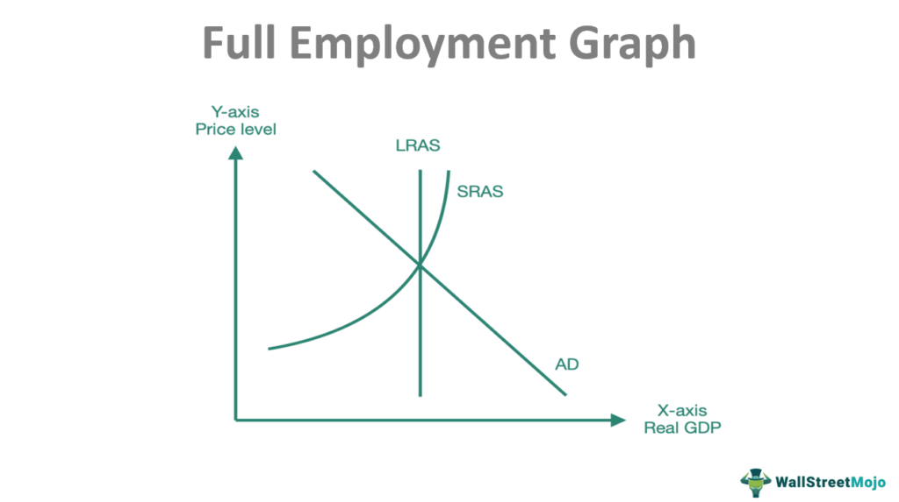

In today’s dynamic economic environment, understanding the interplay between economic equilibrium, full employment, macroeconomics, and algorithmic trading is crucial. These concepts are fundamental to assessing how economies operate and understanding the implications of technological innovations on global markets.

Economic equilibrium occurs when market supply and demand for goods and services are in balance, leading to stable prices. This balance is essential not just in goods markets but also in labor markets, where equilibrium ensures that all willing workers can find employment at prevailing wage rates. Disruptions to this balance, caused by factors such as technological advancements or shifts in government policy, can lead to significant economic consequences, influencing growth and stability.

Full employment, on the other hand, signifies a state where the labor market is efficiently utilizing all available labor resources, minimizing cyclical unemployment. Achieving full employment contributes to economic growth by increasing output and potentially driving up wages as competition for workers intensifies. However, maintaining this state requires careful management of inflationary pressures, which can be understood through tools like the Phillips Curve—a concept illustrating the inverse relationship between unemployment and inflation.

Algorithmic trading represents a technological advancement in financial markets, utilizing pre-programmed algorithms to execute trades at speeds and frequencies far beyond human capability. This practice enhances market efficiencies, influences key economic indicators such as interest rates, and alters investment patterns. While algorithmic trading can foster job creation in sectors that adapt to technological changes, it also poses challenges for industries and workers that cannot keep pace with these innovations.

By exploring these interconnected concepts, this article aims to provide insights into how they collectively impact economic stability and growth. A nuanced understanding of these dynamics is essential for policymakers and investors looking to make informed decisions. As global markets continue to evolve with technological advancements, ongoing learning and strategic policymaking remain imperative components for fostering economic resilience and prosperity.

## Table of Contents

## Understanding Economic Equilibrium

Economic equilibrium occurs in a market when the quantity of a good supplied equals the quantity demanded. This results in stable prices, as any deviation will naturally correct itself through market forces. For instance, if demand exceeds supply, prices will rise, incentivizing producers to increase production and consumers to reduce consumption, thus restoring equilibrium. Conversely, if supply exceeds demand, prices will fall, encouraging more consumption until equilibrium is re-established.

In the labor market, equilibrium is achieved when all individuals who are willing to work at the prevailing wage rates can find employment. This state implies that there is no involuntary unemployment. However, reaching this equilibrium involves several dynamic factors, including technological advancements, government policies, and global economic conditions. These elements can shift both supply and demand curves, impacting the equilibrium wage rate and the level of employment.

Technological advancements are prominent influencers of economic equilibrium. For example, automation and [artificial intelligence](/wiki/ai-artificial-intelligence) can increase productivity, thereby shifting the supply curve outward as goods and services become cheaper to produce. However, these advancements can also disrupt labor markets by reducing the demand for certain job roles, necessitating a shift in the labor force towards more skilled employment sectors.

Government policies, including fiscal and monetary interventions, play a crucial role in maintaining economic equilibrium. Fiscal policies, such as adjusting tax rates and public spending, can influence overall demand in the economy. Similarly, monetary policies, particularly changes in interest rates, can affect consumer spending and investment. Both types of policies aim to smooth out economic fluctuations and steer the economy towards a state of equilibrium.

Global economic conditions also significantly impact equilibrium. Factors like international trade agreements, exchange rates, and global financial markets can alter national supply and demand conditions. For a country heavily reliant on exports, changes in foreign demand can shift the domestic equilibrium, affecting employment and wages.

Understanding these labor market dynamics is crucial for assessing broader economic stability and growth. It allows policymakers to implement strategies that harness technological advancements and navigate global economic interactions effectively. By maintaining an equilibrium, economies can achieve sustainable growth, minimizing [volatility](/wiki/volatility-trading-strategies) and ensuring that resources are allocated efficiently.

## Full Employment and Its Economic Implications

Full employment refers to an economic state where all available labor resources are utilized, effectively minimizing cyclical unemployment. In this context, cyclical unemployment refers to the natural rise and fall in unemployment associated with cyclical trends in the economy, such as those experienced during economic recessions and expansions. When an economy achieves full employment, the demand for workers increases, often leading to a rise in wage levels. This relationship occurs because employers compete for a limited pool of workers, which can drive up the cost of labor.

The Phillips Curve illustrates the connection between unemployment rates and inflation. Typically, as unemployment decreases, inflation tends to increase—this is because lower unemployment levels contribute to higher wage demands, effectively boosting consumer spending, which can lead to rising prices. Conversely, higher unemployment typically results in lower inflation. The traditional form of the Phillips Curve suggests an inverse relationship between unemployment and inflation, demonstrating an important trade-off that policymakers must consider.

$$
\pi_t = \pi_e - \alpha(u_t - u_n)
$$

Where:
- $\pi_t$ is the actual rate of inflation,
- $\pi_e$ is the expected rate of inflation,
- $\alpha$ is a positive constant,
- $u_t$ is the unemployment rate, and
- $u_n$ is the natural rate of unemployment.

Effective economic policies are essential for managing this delicate balance between growth and inflation, particularly in scenarios where full employment is achieved. Policymakers can employ various strategies, such as adjusting interest rates and modifying fiscal policies, to manage economic performance while mitigating inflationary pressures. These measures are crucial for fostering a stable economic environment that promotes sustainable growth.

The pursuit of full employment presents policymakers with the challenge of curbing inflation without stalling economic expansion. This often requires a combination of strategic planning and adaptive policy instruments that can respond to economic changes swiftly. Through appropriate policy formulation, governments can aim to sustain full employment levels, thereby maximizing economic output and enhancing overall economic well-being.

## The Impact of Algorithmic Trading

Algorithmic trading involves the utilization of computer algorithms to automatically execute trades, often in a fraction of a second. These algorithms are programmed to follow defined instructions for trading, including the timing, price, and quantity criteria. Over recent years, [algorithmic trading](/wiki/algorithmic-trading) has significantly transformed the financial markets, influencing both market efficiency and labor dynamics.

By automating the trading process, algorithmic trading has contributed to enhanced market efficiencies. The increased speed and accuracy in executing trades help in narrowing bid-ask spreads, reducing transaction costs, and mitigating market volatility. This automation ensures that securities are priced more accurately, reflecting all available information seamlessly, thus contributing to a more robust price discovery mechanism. The increased efficiency in pricing and access to [liquidity](/wiki/liquidity-risk-premium) benefits institutional investors and retail traders alike.

One critical impact of algorithmic trading is its influence on economic indicators, most notably interest rates. Through high-frequency trading, algorithms can respond to monetary policy changes more rapidly than human traders, affecting asset prices and yields. For instance, an unexpected change in interest rates by central banks could lead to significant algorithmic trading responses, altering currency values and financial instruments' interest rates almost instantaneously.

Algorithmic trading also drives changes in investment patterns. The data-driven nature of these algorithms can shift investment strategies from traditional asset management approaches to more quantitative and systematic methods. Hedge funds and institutional investors increasingly rely on complex algorithmic strategies, including statistical [arbitrage](/wiki/arbitrage), index fund replication, and market-making, leveraging [machine learning](/wiki/machine-learning) and artificial intelligence to predict market movements and optimize portfolio returns.

However, the rise of algorithmic trading presents challenges alongside its benefits. It induces a demand for new job categories focused on quantitative analysis, data engineering, and software development, fostering job creation in technological sectors. Skilled professionals in these areas are becoming fundamental to developing, maintaining, and advancing trading algorithms, evidence of the burgeoning tech-finance industry crossover.

Conversely, industries unable to adapt to the rapid technological advancements face substantial risks. Traditional trading roles are diminishing as automated systems take over tasks once performed by human traders, potentially leading to job displacement in conventional finance sectors. Moreover, algorithmic trading can exacerbate market fragility, as seen in phenomena such as flash crashes, when automated trades exacerbate market movements leading to sudden price corrections.

Overall, while algorithmic trading is a cornerstone of modern financial markets, facilitating efficiency and innovation, it also requires strategic adaptation within the workforce and regulatory frameworks to mitigate associated risks and challenges.

## Policy Roles in Achieving Equilibrium

Fiscal and monetary policies are central to achieving economic equilibrium and full employment by addressing and managing economic fluctuations. These policies are tools used by governments and central banks to stabilize economies, promote sustainable growth, and maintain price levels. 

Fiscal policy involves government adjustments to spending and taxation, impacting economic activity directly. By increasing government spending during economic downturns, for instance, governments can inject money into the economy, stimulating demand and job creation. Conversely, reducing spending or increasing taxes during periods of high growth can help cool off an overheating economy, preventing excessive inflation. The fiscal multiplier effect, an economic concept, quantifies the impact of government spending changes on overall economic output. It indicates how initial spending can lead to broader economic activity, with a multiplier greater than one suggesting that the resulting increase in total economic activity exceeds the original spending increase.

Monetary policy, conducted by central banks, involves managing interest rates and money supply. Lowering interest rates makes borrowing cheaper, encouraging investment and consumer spending, which can boost economic activity. Raising interest rates has the opposite effect, slowing down an overheated economy. Quantitative easing and tightening are unconventional monetary policy tools used to adjust the money supply, particularly when traditional [interest rate](/wiki/interest-rate-trading-strategies) adjustments are insufficient. 

A key challenge for policymakers is maintaining a balance between economic growth and price stability. The Phillips Curve suggests an inverse relationship between inflation and unemployment, indicating that efforts to reduce unemployment below its natural rate might lead to increased inflation. Policymakers thus must carefully calibrate fiscal and monetary measures to ensure that the pursuit of full employment does not exacerbate inflationary pressures. 

In conclusion, fiscal and monetary policies play indispensable roles in guiding economies towards equilibrium and full employment, requiring strategic adjustments to government spending, taxation, and interest rates. Their effective implementation is crucial for managing economic fluctuations, ensuring sustainable growth, and maintaining stable price levels.

## Challenges and Opportunities in Labor Markets

Technological advancements have brought both promising opportunities and significant challenges to labor markets around the world. Automation and artificial intelligence (AI) are central to this transformation, as they alter the demand for various labor skills and reshape the traditional employment landscape.

Automation and AI are increasingly replacing routine tasks, leading to a pronounced shift towards a more skilled labor force. This transition emphasizes the importance of education and training programs that prepare workers to engage with new technologies effectively. Upskilling and reskilling programs are crucial in addressing the skill gap that automation trends create, as they enable workers to adapt to changing job requirements and pursue careers in emerging fields. According to a study by McKinsey Global Institute, approximately 375 million workers worldwide may need to transition to new occupational categories or endow themselves with new skills by 2030 due to automation (McKinsey Global Institute, 2017).

Nevertheless, the labor market challenges proliferate amidst these opportunities. Industries adopting advanced technologies create new job roles, but there is uncertainty about the net effect on employment. While technology can enhance productivity and drive economic growth, it simultaneously renders certain jobs obsolete, especially those involving repetitive and manual tasks. The labor force must be agile, continuously upgrading its skills to remain relevant in the dynamic job market.

Global economic interconnectedness further complicates the labor market dynamics. As markets globalize, economies are more interdependent, making adaptable policies critical for managing labor market fluctuations. Economic policies must consider the cross-border flow of labor and technology to maximize the benefits of globalization. Initiatives like international skill recognition frameworks and flexible migration policies can help bridge skill shortages and align labor supply with demand across global markets.

Policy frameworks must also address the socioeconomic implications of technological change in labor markets. Inclusive growth strategies, ensuring equitable access to education and technology, can prevent workforce polarization. Moreover, social safety nets and labor protection measures are vital in cushioning the impacts of job displacement and ensuring a fair transition for affected workers.

In conclusion, while technological advancements offer substantial growth opportunities, they also pose challenges that require strategic policy responses and continuous adaptation of the workforce. Balancing these dynamics will be crucial for fostering resilient labor markets and achieving sustainable economic development in a technology-driven world.

Reference:
- McKinsey Global Institute. (2017). "Jobs Lost, Jobs Gained: Workforce Transitions in a Time of Automation." [Link](https://www.mckinsey.com/featured-insights/future-of-work/jobs-lost-jobs-gained-what-the-future-of-work-will-mean-for-jobs-skills-and-wages)

## Conclusion

A nuanced understanding of economic equilibrium, full employment, and algorithmic trading is essential for sustained economic health. Economic equilibrium ensures that markets operate efficiently, with supply meeting demand and resources allocated optimally. Achieving this balance is vital for maintaining stable prices and fostering economic growth. Full employment, where all available labor resources are utilized efficiently, reduces unemployment and can drive wage increases. However, the relationship between unemployment and inflation, captured by the Phillips Curve, indicates that careful management through effective economic policies is needed to sustain growth without triggering excessive inflation.

Algorithmic trading, leveraging rapid technological advancements, has transformed financial markets by increasing efficiency and altering traditional investment strategies. While this technological shift has fostered job creation in tech-savvy sectors, it also challenges industries unable to adapt, highlighting the importance of workforce skill adaptation.

Proactive policy formulation is paramount in optimizing the interplay between these elements. Policymakers must craft and implement fiscal and monetary policies that promote economic equilibrium and manage economic fluctuations, balancing growth with price stability. Flexible policies that adapt to technological and market changes are essential.

As technology and global market dynamics continue to evolve, ongoing learning and strategic policymaking remain crucial. Continuous education and training initiatives ensure the workforce adapts to new demands, fostering resilience in the labor market. The ability to anticipate and respond to economic changes will dictate how effectively economies harness opportunities and mitigate challenges, shaping a stable and prosperous economic future.

## References & Further Reading

[1]: McKinsey Global Institute. (2017). ["Jobs Lost, Jobs Gained: Workforce Transitions in a Time of Automation."](https://www.mckinsey.com/~/media/McKinsey/Industries/Public%20and%20Social%20Sector/Our%20Insights/What%20the%20future%20of%20work%20will%20mean%20for%20jobs%20skills%20and%20wages/MGI-Jobs-Lost-Jobs-Gained-Executive-summary-December-6-2017.pdf)

[2]: Samuelson, P. A., & Nordhaus, W. D. (2010). ["Economics,"](https://books.google.com/books/about/EBOOK_Economics.html?id=rMovEAAAQBAJ) McGraw-Hill/Irwin.

[3]: Autor, D. H., Levy, F., & Murnane, R. J. (2003). ["The Skill Content of Recent Technological Change: An Empirical Exploration."](https://www.jstor.org/stable/25053940) The Quarterly Journal of Economics, 118(4), 1279-1333.

[4]: Dornbusch, R., Fischer, S., & Startz, R. (2010). ["Macroeconomics,"](https://books.google.com/books/about/EBOOK_Macroeconomics.html?id=KoZvEAAAQBAJ) McGraw-Hill/Irwin.

[5]: Biais, B., & Woolley, P. (Eds.). (2011). ["High-Frequency Trading: New Realities for Traders, Markets and Regulators."](https://www.tse-fr.eu/publications/high-frequency-trading) Risk Books.

[6]: Friedman, M. (1968). ["The Role of Monetary Policy."](https://www.aeaweb.org/aer/top20/58.1.1-17.pdf) American Economic Review, 58(1), 1-17.