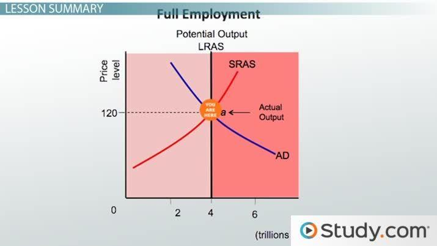

## Table of Contents

## What is meant by 'full employment' in economics?

Full employment in economics means that everyone who wants a job can find one. It doesn't mean that absolutely everyone is working, because some people might be between jobs, studying, or taking a break. But it means that the number of people without jobs is very small, usually around 4-5% of the people who could work. This small percentage is called the natural rate of unemployment.

When an economy reaches full employment, it's working at its best. Businesses are making things and providing services, and people are earning money to buy those things and services. This balance helps the economy grow without causing too much inflation, which is when prices go up too fast. Full employment is a goal that governments and policymakers aim for, because it means more people are working and the economy is strong.

## How does 'below full employment equilibrium' differ from full employment?

Below full employment equilibrium is when more people want jobs than there are jobs available. This means that the economy is not using all its workers, and there are more people looking for work than there are job openings. This situation can happen because businesses are not making as many things or providing as many services as they could. When there are fewer jobs, it can lead to a higher unemployment rate, which is the percentage of people who want to work but can't find a job.

In contrast, full employment is when almost everyone who wants a job can find one. The economy is working at its best because businesses are making a lot of things and providing many services. At full employment, the unemployment rate is very low, usually around 4-5%. This small amount of unemployment is normal because some people might be between jobs or looking for a better one. Full employment helps the economy grow without causing prices to go up too fast, which is good for everyone.

## What are the main causes of below full employment equilibrium?

Below full employment equilibrium happens when there are not enough jobs for everyone who wants to work. One main cause is when the economy is not growing fast enough. When businesses are not making as much money, they might not hire new workers or might even let some go. This can happen because people are not buying as many things, so businesses do not need to produce as much. Another reason can be big changes or problems in the economy, like a financial crisis or a sudden drop in demand for certain products or services. These changes can make businesses more cautious about hiring new workers.

Another cause of below full employment equilibrium is when there are problems with how the job market works. Sometimes, the skills that people have do not match the jobs that are available. This can happen if the economy changes quickly and people need new skills to get jobs. Also, if it is hard for people to move to where the jobs are, or if they do not know about job openings, it can be harder for them to find work. Government policies can also affect this. If taxes are high or if there are a lot of rules for businesses, it might make them less likely to hire new workers, leading to fewer job opportunities and higher unemployment.

## Can you explain the concept of the output gap in relation to below full employment equilibrium?

The output gap is the difference between what an economy is actually producing and what it could produce if it were working at its best. When an economy is at below full employment equilibrium, it means there are not enough jobs for everyone who wants to work. This leads to an output gap because the economy is not using all its workers, so it is not making as many things or providing as many services as it could. The output gap shows how much more the economy could be producing if everyone who wanted a job had one.

When there is a negative output gap, it means the economy is producing less than it could at full employment. This happens because businesses are not hiring as many workers as they could, so they are not making as much stuff. A negative output gap can lead to higher unemployment and slower economic growth. On the other hand, if the economy were at full employment, the output gap would be close to zero, meaning the economy is working at its best and producing as much as it can. Understanding the output gap helps policymakers figure out how to help the economy grow and create more jobs.

## How does below full employment equilibrium affect the overall economy?

Below full employment equilibrium means there are not enough jobs for everyone who wants to work. This can slow down the whole economy. When people can't find jobs, they don't have money to spend on things like food, clothes, and cars. When people buy less, businesses make less money, so they might not hire more workers or might even have to let some go. This can lead to a cycle where the economy keeps getting slower because fewer people are working and spending money.

This situation can also cause other problems. For example, when many people are out of work, the government might have to spend more money on programs to help them, like unemployment benefits. This can put pressure on the government's budget. Also, when the economy is not working at its best, it can make people feel less sure about the future, which can make them spend even less money. This can make the economy take longer to get better. Policymakers need to find ways to create more jobs and help the economy grow again to reach full employment.

## What role do aggregate demand and supply play in below full employment equilibrium?

Aggregate demand and supply are important in understanding below full employment equilibrium. Aggregate demand is the total amount of goods and services that people and businesses want to buy. When aggregate demand is low, businesses might not need as many workers because they are not selling as much. This can lead to fewer jobs and higher unemployment, which is below full employment equilibrium. On the other hand, if aggregate demand is high, businesses will need to produce more to meet the demand, so they will hire more workers, moving the economy closer to full employment.

Aggregate supply is the total amount of goods and services that businesses are willing to produce. If aggregate supply is not keeping up with demand, it can also lead to below full employment equilibrium. This might happen if businesses are not investing in new equipment or if workers do not have the right skills for the available jobs. When aggregate supply is low, businesses might not be able to hire as many workers, even if there is demand for their products. To reach full employment, both aggregate demand and supply need to be strong so that businesses can produce more and hire more workers.

## How can fiscal policy be used to address below full employment equilibrium?

Fiscal policy is when the government changes how much it spends or how much it taxes to help the economy. When there is below full employment equilibrium, it means not enough people have jobs. To fix this, the government can use fiscal policy to increase spending. For example, the government might spend more on building roads, schools, or hospitals. This spending creates jobs for people who build these things. When more people have jobs, they earn money and can spend it on things they need, like food and clothes. This helps businesses sell more, so they might hire even more workers, moving the economy closer to full employment.

The government can also use fiscal policy by changing taxes. If the government lowers taxes, people and businesses have more money to spend or invest. When people spend more, businesses sell more products and services, so they might need to hire more workers. Lower taxes can also make businesses more likely to invest in new projects, which can create more jobs. By using these fiscal policy tools, the government can help the economy grow and get more people working, which helps to reach full employment.

## What are the implications of below full employment equilibrium on inflation?

When there is below full employment equilibrium, it means there are more people looking for jobs than there are jobs available. This situation can lead to lower inflation or even deflation, which is when prices go down. When many people are out of work, they don't have as much money to spend on things. So, businesses might have to lower their prices to sell their products and services. This can keep inflation low because there is less demand for things, so prices don't go up as much.

However, if the economy stays at below full employment for a long time, it can cause other problems. Businesses might not invest in new projects or hire more workers because they are worried about the future. This can make the economy grow even slower, which can keep inflation low or even cause prices to keep going down. Policymakers need to find ways to create more jobs and get the economy moving again to avoid these problems and help inflation stay at a healthy level.

## How do different economic theories explain below full employment equilibrium?

Different economic theories explain below full employment equilibrium in their own ways. Keynesian economists believe that below full employment happens when there's not enough spending in the economy. They say that if people and businesses are not buying enough, companies won't need to produce as much, so they won't hire as many workers. To fix this, Keynesians think the government should spend more money or cut taxes to get people spending again. This can help create more jobs and get the economy back to full employment.

On the other hand, classical economists think that below full employment is usually just a short-term problem. They believe that wages and prices will adjust on their own to bring the economy back to full employment. If there are too many people looking for jobs, they think wages should go down, which would make it cheaper for businesses to hire more workers. Classical economists don't think the government needs to do much because they believe the market will fix itself over time.

Some newer theories, like those from the school of New Keynesian economics, mix ideas from both Keynesian and classical theories. They agree with Keynesians that government action can help, but they also think that markets can work well if given enough time. New Keynesians believe that prices and wages might not adjust quickly enough on their own, so the government should step in to help the economy get back to full employment faster.

## What are the long-term effects of sustained below full employment equilibrium on an economy?

If an economy stays at below full employment for a long time, it can cause big problems. When many people can't find jobs, they don't have money to spend on things they need, like food and clothes. This means businesses sell less, so they might not hire more workers or might even have to let some go. This can make the economy grow slower and slower. Also, when people are out of work for a long time, they might lose skills or feel less confident about finding a job. This can make it harder for them to get back to work even when the economy gets better.

Over time, below full employment can also hurt the government's budget. When many people are out of work, the government might have to spend more money on programs to help them, like unemployment benefits. This can make it harder for the government to pay for other important things, like schools and hospitals. If the economy stays weak for a long time, it can also make people feel less sure about the future, which can make them spend even less money. This can keep the economy stuck in a cycle where it's hard to get back to full employment and grow again.

## How can monetary policy be adjusted to mitigate below full employment equilibrium?

Monetary policy is when the central bank, like the Federal Reserve in the U.S., changes things like interest rates to help the economy. When there's below full employment equilibrium, it means not enough people have jobs. To fix this, the central bank can lower interest rates. When interest rates go down, it costs less for people and businesses to borrow money. This can make them more likely to spend on things like new cars or to invest in new projects. When people spend more, businesses sell more stuff, so they might need to hire more workers. This can help the economy grow and get more people working, moving closer to full employment.

The central bank can also use other tools, like buying bonds, to put more money into the economy. This is called quantitative easing. When the central bank buys bonds, it gives banks more money to lend out. This can help lower interest rates even more and make it easier for people and businesses to borrow. When borrowing is easier, it can lead to more spending and investment, which can create more jobs. By using these monetary policy tools, the central bank can help the economy get out of below full employment equilibrium and get back to a healthy level where more people can find work.

## What are some real-world examples of economies experiencing below full employment equilibrium, and how were they addressed?

After the 2008 financial crisis, the United States had a big problem with below full employment equilibrium. Many people lost their jobs because banks were not lending money, and businesses were not spending or hiring. The government and the Federal Reserve worked together to help fix this. The government spent more money on things like building roads and schools, which created jobs. The Federal Reserve also lowered interest rates a lot and bought bonds to put more money into the economy. These actions helped more people find jobs over time, and the economy slowly got back to a better place.

Another example is the European Union during the eurozone crisis around 2010. Many countries in Europe, like Greece and Spain, had high unemployment because their economies were not doing well. The European Central Bank (ECB) and the governments in these countries took steps to help. The ECB lowered interest rates and bought bonds to make it easier for people and businesses to borrow money. Some countries also made changes to their rules to help businesses grow and hire more workers. It took a long time, but these efforts helped bring down unemployment and get more people working again.

## What are the economic implications of full employment?

Full employment refers to an economic state where all available labor resources are utilized, effectively minimizing cyclical unemployment. In this context, cyclical unemployment refers to the natural rise and fall in unemployment associated with cyclical trends in the economy, such as those experienced during economic recessions and expansions. When an economy achieves full employment, the demand for workers increases, often leading to a rise in wage levels. This relationship occurs because employers compete for a limited pool of workers, which can drive up the cost of labor.

The Phillips Curve illustrates the connection between unemployment rates and inflation. Typically, as unemployment decreases, inflation tends to increase—this is because lower unemployment levels contribute to higher wage demands, effectively boosting consumer spending, which can lead to rising prices. Conversely, higher unemployment typically results in lower inflation. The traditional form of the Phillips Curve suggests an inverse relationship between unemployment and inflation, demonstrating an important trade-off that policymakers must consider.

$$
\pi_t = \pi_e - \alpha(u_t - u_n)
$$

Where:
- $\pi_t$ is the actual rate of inflation,
- $\pi_e$ is the expected rate of inflation,
- $\alpha$ is a positive constant,
- $u_t$ is the unemployment rate, and
- $u_n$ is the natural rate of unemployment.

Effective economic policies are essential for managing this delicate balance between growth and inflation, particularly in scenarios where full employment is achieved. Policymakers can employ various strategies, such as adjusting interest rates and modifying fiscal policies, to manage economic performance while mitigating inflationary pressures. These measures are crucial for fostering a stable economic environment that promotes sustainable growth.

The pursuit of full employment presents policymakers with the challenge of curbing inflation without stalling economic expansion. This often requires a combination of strategic planning and adaptive policy instruments that can respond to economic changes swiftly. Through appropriate policy formulation, governments can aim to sustain full employment levels, thereby maximizing economic output and enhancing overall economic well-being.

## References & Further Reading

[1]: McKinsey Global Institute. (2017). ["Jobs Lost, Jobs Gained: Workforce Transitions in a Time of Automation."](https://www.mckinsey.com/~/media/McKinsey/Industries/Public%20and%20Social%20Sector/Our%20Insights/What%20the%20future%20of%20work%20will%20mean%20for%20jobs%20skills%20and%20wages/MGI-Jobs-Lost-Jobs-Gained-Executive-summary-December-6-2017.pdf)

[2]: Samuelson, P. A., & Nordhaus, W. D. (2010). ["Economics,"](https://books.google.com/books/about/EBOOK_Economics.html?id=rMovEAAAQBAJ) McGraw-Hill/Irwin.

[3]: Autor, D. H., Levy, F., & Murnane, R. J. (2003). ["The Skill Content of Recent Technological Change: An Empirical Exploration."](https://www.jstor.org/stable/25053940) The Quarterly Journal of Economics, 118(4), 1279-1333.

[4]: Dornbusch, R., Fischer, S., & Startz, R. (2010). ["Macroeconomics,"](https://books.google.com/books/about/EBOOK_Macroeconomics.html?id=KoZvEAAAQBAJ) McGraw-Hill/Irwin.

[5]: Biais, B., & Woolley, P. (Eds.). (2011). ["High-Frequency Trading: New Realities for Traders, Markets and Regulators."](https://www.tse-fr.eu/publications/high-frequency-trading) Risk Books.

[6]: Friedman, M. (1968). ["The Role of Monetary Policy."](https://www.aeaweb.org/aer/top20/58.1.1-17.pdf) American Economic Review, 58(1), 1-17.