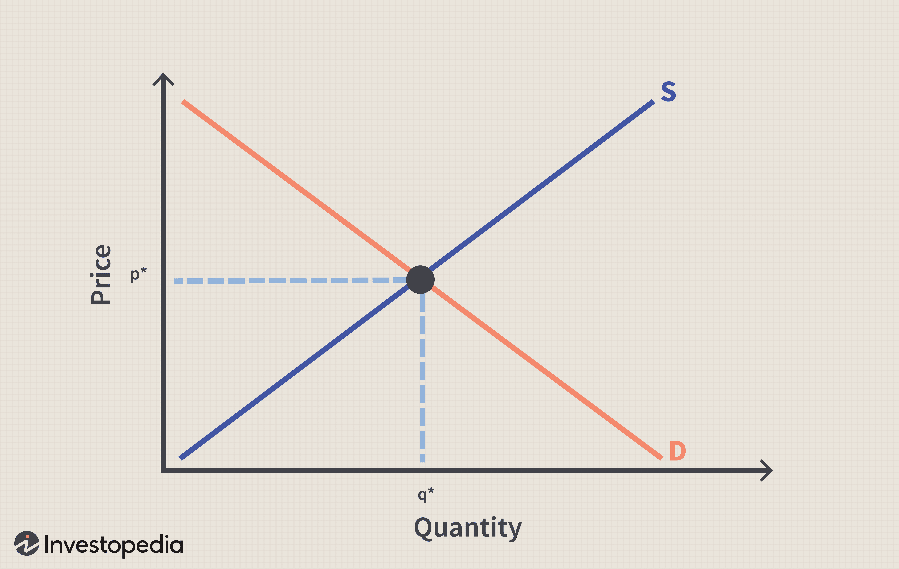

The financial markets represent a complex and ever-evolving environment where traders and investors continuously strive to optimize their returns. Success in this domain hinges on a thorough understanding of market pricing strategies, particularly in the context of algorithmic trading (algo trading). In essence, algorithmic trading involves the use of computer algorithms to automate trade execution, allowing for increased speed and efficiency in identifying and capitalizing on market opportunities.

A key component of successful trading is the ability to interpret and react to market prices, which are influenced by factors such as supply and demand dynamics, economic indicators, geopolitical events, and prevailing market sentiment. These prices reflect the collective perceptions and actions of market participants, making them central to trading decisions. Recognizing how market prices fluctuate is foundational for developing strategies that aim to buy low and sell high—or, in specific cases, to acquire assets below market price.



Below-market price strategies, such as limit orders, empower traders to purchase assets at prices they deem favorable—often below the current market rate. These strategies are particularly appealing as they hold the promise of acquiring undervalued assets, which can lead to significant gains if market conditions eventually align with the trader's expectations.

This article will focus on the intersection of market price strategies and algorithmic trading. It will examine how algo trading can efficiently execute below-market price strategies by leveraging large datasets to identify and act on pricing anomalies with precision. Additionally, this exploration will identify the advantages and challenges inherent in various trading approaches, providing insights into navigating the intricate landscape of financial markets.

## Table of Contents

## Understanding Market Prices

Market price is a fundamental concept in financial markets, representing the current price at which an asset or service can be transacted. Understanding the factors influencing market prices is crucial for traders and investors to make informed decisions.

Market prices are primarily determined by the forces of supply and demand. When demand for an asset exceeds supply, prices typically rise, while an excess of supply over demand generally leads to lower prices. This dynamic interplay is the cornerstone of price determination in competitive markets.

Economic indicators are another significant [factor](/wiki/factor-investing) that can cause market prices to fluctuate. Indicators such as Gross Domestic Product (GDP) growth rates, employment figures, inflation rates, and interest rates provide insights into the economic health of a country or region, influencing investor sentiment and subsequent price movements. For example, higher-than-expected economic growth can boost investor confidence, leading to higher asset prices.

Geopolitical events also play a vital role in shaping market prices. Political instability, wars, trade disputes, and diplomatic relations between countries can create uncertainty and [volatility](/wiki/volatility-trading-strategies) in financial markets. Such events may lead investors to seek safer assets or adjust their portfolios based on perceived risks, directly impacting market prices.

Market sentiment, the overall attitude of investors toward a particular market or asset, can lead to short-term price movements, often independent of fundamental factors. Sentiment is influenced by news, rumors, and investor psychology. Bullish sentiment can drive prices up, while bearish sentiment may push them down.

Having a grasp of how market prices fluctuate is essential for devising effective trading strategies. Traders often use technical analysis to predict price movements based on historical price data and patterns, aiming to capitalize on short-term market inefficiencies. Fundamental analysis, on the other hand, assesses an asset's intrinsic value by examining underlying factors such as financial health, industry conditions, and macroeconomic trends. A comprehensive approach involves integrating both technical and fundamental analyses to better understand and anticipate market price movements.

Mathematically, market pricing can be analyzed using models such as the supply-demand equilibrium: 

$$
P^* = P_e = \frac{a - bQ}{c + d}
$$

where $P^*$ represents the equilibrium price, $Q$ is the quantity, and $a$, $b$, $c$, and $d$ are parameters reflecting factors affecting supply and demand. Though simplified, such models help in understanding the underlying mechanics that drive market prices.

In conclusion, comprehending the intricate factors influencing market prices enables traders to adapt their strategies effectively, optimizing their efforts to achieve favorable outcomes in volatile and complex financial markets.

## Below Market Price Strategy

Below market price, or underpricing, occurs when traders acquire assets at a value lower than the prevailing market price. This approach is appealing to traders who identify potential in assets they believe are undervalued relative to their intrinsic value or future performance expectations. 

Limit orders are a common strategy used to execute trades at below market price. A limit order sets a predetermined price at which a trader is willing to buy a security. If the market reaches this price, the order is executed. For instance, if a stock is currently trading at $50 but a trader estimates its true value to be higher, they might place a limit order to purchase it at $48. This ensures that the trader only acquires the stock when the market price aligns with their price target, potentially maximizing returns if the stock price rises to or above its intrinsic value.

The advantages of employing below market price strategies include the potential to secure assets that are undervalued and the ability to capitalize on market inefficiencies. These strategies allow traders to enter positions at favorable prices, potentially leading to enhanced returns when the market normalizes or advances beyond the purchase price.

### Example of a Limit Order in Python

Using Python, traders can automate the process of placing limit orders. Here is a simple example using a mock trading API:

```python
class MockTradingAPI:
    def __init__(self):
        self.market_price = 50

    def place_limit_order(self, price):
        if price < self.market_price:
            return "Order placed at ${}".format(price)
        else:
            return "Price too high, order not placed."

# Example of placing a limit order at a price below market value.
trading_api = MockTradingAPI()
limit_order_price = 48
result = trading_api.place_limit_order(limit_order_price)
print(result)  # Output: Order placed at $48
```

This simulation demonstrates how to specify a purchase price below the current market rate. The order is only executed when favorable conditions are met, reflecting the strategic nature of below market price investing.

These methodologies allow traders to approach the market analytically, managing to possibly outperform the market averages when conditions are favorable. Understanding the mechanics of limit orders and other below market price strategies is a critical component for any trader aiming to optimize their investment approach.

 to Algorithmic Trading

Algorithmic trading automates the trading process using computer algorithms, facilitating faster decision-making and trade execution. This automation allows traders and investors to capitalize on market opportunities with a level of speed and precision unattainable by human traders alone.

At its core, [algorithmic trading](/wiki/algorithmic-trading) involves the use of complex mathematical models to analyze large volumes of market data. Algorithms are designed to detect patterns and trends that would be difficult to discern manually. These patterns may include price movements, [volume](/wiki/volume-trading-strategy) changes, or other market signals that could indicate potential buying or selling opportunities.

One of the primary advantages of algorithmic trading is its ability to process information and execute trades at a speed significantly faster than human traders. This speed is crucial in the highly dynamic financial markets where prices can change in fractions of a second. By quickly identifying and responding to market trends, algorithms can take advantage of even the smallest price discrepancies.

Algorithms can be particularly effective in implementing below-market price strategies. For instance, an algorithm can be programmed to automatically place limit orders when the price of an asset reaches a certain threshold below its perceived value. This strategic automation helps traders secure assets at advantageous prices, increasing the potential for profit when the market conditions adjust.

Python is a popular language for developing algorithmic trading strategies due to its versatility and extensive libraries. For example, the pandas library can be used for data manipulation, and the NumPy library provides support for mathematical calculations. Below is a basic Python snippet illustrating how one could implement a simple algorithm to detect price anomalies, which could be indicative of below-market pricing opportunities:

```python
import pandas as pd

# Assume 'data' is a DataFrame containing historical price data for an asset
data['return'] = data['price'].pct_change()

# Define a function to detect below-market price using a simple moving average crossover
def detect_underpricing(data, short_window=20, long_window=50):
    data['short_mavg'] = data['price'].rolling(window=short_window).mean()
    data['long_mavg'] = data['price'].rolling(window=long_window).mean()

    underpricing_signals = (data['short_mavg'] < data['long_mavg']) & (data['return'] < 0)
    return underpricing_signals

signals = detect_underpricing(data)

# Displaying dates with potential below-market price opportunities
print(data.loc[signals, 'Date'])
```

An important aspect of algorithmic trading is its customizability. Algorithms can be tailored to fit specific trading strategies, market conditions, and individual risk profiles. By continually adapting to the evolving financial landscape, algorithmic traders can enhance the efficacy of below-market price strategies, thus potentially improving their investment outcomes.

In summary, algorithmic trading provides a sophisticated means of identifying and exploiting below-market price opportunities. By leveraging advanced technology and quantitative analysis, traders can make more informed decisions, ultimately improving their chances of success in volatile financial markets.

## Popular Algo Trading Strategies

Algo trading strategies span a range of methodologies from the basic to the sophisticated, each catering to different aspects of market behavior and trader objectives. This section provides an overview of some of the most popular strategies, including [trend following](/wiki/trend-following), mean reversion, and [arbitrage](/wiki/arbitrage), particularly focusing on their application in identifying below market price opportunities.

### Trend Following

Trend following is a strategy that seeks to capitalize on market [momentum](/wiki/momentum) by identifying and entering trades in the direction of established trends. The core principle revolves around the idea that prices tend to move in a consistent direction over time, whether upward or downward.

**Mechanics:** Traders use technical indicators such as moving averages, relative strength index (RSI), or the moving average convergence divergence (MACD) to identify trends. A simple moving average crossover strategy, for instance, involves buying when a shorter-term moving average crosses above a longer-term moving average and selling when the opposite occurs.

**Strengths:** Trend following can lead to substantial gains in trending markets and is less susceptible to noise due to its reliance on broader market movements.

**Pitfalls:** The strategy can suffer in sideways or choppy markets, as frequent false signals may result in numerous losing trades.

### Mean Reversion

Mean reversion is based on the concept that asset prices will eventually return to their long-term average. This strategy assumes that extreme price movements will be reverted, and thus, provides opportunities to trade.

**Mechanics:** Statistical indicators like Bollinger Bands or the Z-score can be used to identify overbought or oversold conditions. In Python, a simple Z-score computation might look like:

```python
def compute_z_score(series):
    mean = series.mean()
    std = series.std()
    return (series - mean) / std

# Example usage:
import pandas as pd

price_data = pd.Series([100, 102, 98, 105, 103, 97, 95, 104, 106, 99])
z_scores = compute_z_score(price_data)
```

**Strengths:** The strategy thrives in volatile markets where price corrections are frequent, offering multiple entry and exit points.

**Pitfalls:** During strong trending markets, prices may not revert for extended periods, leading to potential losses.

### Arbitrage

Arbitrage opportunities arise when there are price discrepancies of a security between different markets or exchanges. The strategy involves simultaneously buying and selling an asset to exploit these inefficiencies for profit.

**Mechanics:** Common forms include statistical arbitrage, where statistical methods identify mispriced assets, and pairs trading, which involves taking offsetting positions on two related securities predicted to revert to a historical price relationship.

**Strengths:** Arbitrage strategies can provide risk-free profit opportunities when implemented correctly and are generally market-neutral.

**Pitfalls:** The competition for arbitrage opportunities can be intense, often requiring sophisticated algorithmic systems and access to multiple market platforms to capitalize effectively.

Each of these strategies has distinct mechanisms, benefits, and potential drawbacks. Optimizing them for below market price opportunities requires careful analysis and consideration of market conditions. By leveraging algorithmic techniques, traders can automate and refine these strategies to enhance execution speed and precision.

## Risk Management in Algo Trading

Effective risk management is fundamental in algorithmic trading to protect against potential losses and ensure stability in an unpredictable market environment. Several strategies and practices can be employed to manage risk exposure effectively.

Diversification is a key technique in risk management. It involves spreading investments across various asset classes, sectors, or geographic regions to minimize the impact of adverse price movements in any single asset. The principle of diversification is guided by the notion that not all markets move in the same direction simultaneously. Therefore, by holding diverse positions, traders can reduce the overall volatility of their portfolios.

Hedging is another strategy used to offset potential losses. This involves taking opposite positions in correlated instruments, with the intention of balancing any profit or loss. For example, a trader might hold a long position in a stock while simultaneously holding a short position in a related futures contract. This can protect against downside risk if the stock price falls, as gains in the futures position can partially or fully offset the losses.

Stop-loss orders are an essential tool in managing risk. These orders automatically execute a trade to sell a position when the price reaches a specified level, limiting potential losses. Implementing stop-loss orders can prevent significant financial damage during unexpected market downturns or when algorithm predictions deviate from expected outcomes.

Continuous monitoring and adjustment of algorithms are crucial to adapt to changing market conditions. Market dynamics are constantly evolving due to factors such as economic data releases, geopolitical events, and shifts in investor sentiment. Algorithms must be regularly reviewed and recalibrated to ensure they remain effective and align with current market realities. This can involve tweaking parameters, integrating new data sources, or even developing entirely new trading strategies.

To illustrate the importance of these practices, consider the following simple Python example implementing a basic stop-loss mechanism:

```python
def stop_loss_trigger(position, market_price, stop_loss_price):
    if market_price <= stop_loss_price:
        # Execute sell order
        position.close()
        print("Stop-loss triggered: position closed.")
    else:
        print("Market stable: no action required.")

# Example usage
market_price = 95  # Current market price
stop_loss_price = 100  # Predefined stop-loss price
position = Position('Stock', 'AAPL', quantity=10)

stop_loss_trigger(position, market_price, stop_loss_price)
```

In this example, the stop-loss function automatically closes a trading position if the market price drops below a predefined threshold, thereby mitigating potential losses.

In conclusion, the integration of diversification, hedging, and stop-loss orders, coupled with continuous monitoring and adjustment, form the backbone of risk management in algorithmic trading. Traders who effectively employ these strategies can preserve capital and maintain strategic flexibility amid market volatility.

## Evaluating the Performance of Algo Trading Strategies

Evaluating the performance of algorithmic trading strategies requires the application of specific metrics that reflect both profitability and risk. The primary metrics employed in this evaluation include return on investment (ROI), Sharpe ratio, and maximum drawdown, each offering a unique perspective on strategy efficacy.

**Return on Investment (ROI)** is a fundamental metric that quantifies the profitability of a trading strategy. It is calculated as:

$$

\text{ROI} = \left( \frac{\text{Net Profit}}{\text{Initial Investment}} \right) \times 100 
$$

This metric indicates the percentage return generated by the strategy over a specific period, offering a straightforward lens through which to measure financial gains.

**Sharpe Ratio** evaluates the risk-adjusted return of a trading strategy. It measures the excess return per unit of risk, providing insights into the trade-off between risk and return. The Sharpe Ratio is calculated as:

$$

\text{Sharpe Ratio} = \frac{R_p - R_f}{\sigma_p} 
$$

where $R_p$ is the expected portfolio return, $R_f$ is the risk-free rate, and $\sigma_p$ is the standard deviation of the portfolio's excess return. A higher Sharpe ratio indicates a more attractive risk-adjusted return.

**Maximum Drawdown** assesses the risk of potential loss in a trading strategy by measuring the largest peak-to-trough decline before a new peak is achieved. It is expressed as a percentage of the peak value, providing a measure of the worst-case scenario for investors:

$$

\text{Maximum Drawdown} = \frac{\text{Trough Value} - \text{Peak Value}}{\text{Peak Value}} \times 100 
$$

By assessing these metrics, traders can establish benchmarks for their strategies, ensuring they align with investment goals and risk tolerances. Optimization involves adjusting strategy parameters to enhance returns while maintaining acceptable risk levels.

**Case Studies and Real-World Examples:**

1. **Trend-Following Strategies**: Suppose a trend-following strategy using moving averages shows an ROI of 15% annually with a Sharpe ratio of 1.2 while maintaining a maximum drawdown of 10%. The relatively high Sharpe ratio suggests the strategy effectively manages risk in capturing market trends.

2. **Mean Reversion Strategies**: Consider a mean reversion strategy utilizing statistical arbitrage. A reported ROI of 8%, with a Sharpe ratio of 0.9 and a maximum drawdown of 5%, indicates a balanced approach with lower volatility compared to trend-following strategies.

To implement a performance evaluation system, traders might use Python for [backtesting](/wiki/backtesting) and analysis:

```python
import numpy as np
import pandas as pd

def calculate_return(prices):
    return (prices[-1] - prices[0]) / prices[0] * 100

def calculate_sharpe_ratio(returns, risk_free_rate=0.05):
    excess_returns = returns - risk_free_rate
    return np.mean(excess_returns) / np.std(excess_returns)

def calculate_max_drawdown(prices):
    peak = prices[0]
    max_drawdown = 0
    for price in prices:
        if price > peak:
            peak = price
        drawdown = (peak - price) / peak * 100
        max_drawdown = max(max_drawdown, drawdown)
    return max_drawdown

# Example usage
historical_prices = pd.Series([...])  # replace with actual data
returns = np.diff(historical_prices) / historical_prices[:-1]
roi = calculate_return(historical_prices)
sharpe_ratio = calculate_sharpe_ratio(returns)
max_drawdown = calculate_max_drawdown(historical_prices)

print(f"ROI: {roi}%")
print(f"Sharpe Ratio: {sharpe_ratio}")
print(f"Maximum Drawdown: {max_drawdown}%")
```

By applying these metrics and methods, traders can ensure disciplined and data-driven evaluations of algorithmic trading strategies, allowing for continuous improvement and adaptation to market conditions.

## Challenges and Ethical Considerations

Algorithmic trading introduces several challenges related to the dependence on technology and the intricacies of software systems. One significant challenge is system errors, which can occur due to programming mistakes, hardware malfunctions, or connectivity issues. These errors can lead to unintended orders or trades that deviate from the intended strategy. Mitigating such risks involves rigorous testing and the implementation of fail-safes.

Overfitting is another critical issue in algorithmic trading. Overfitting refers to a model's excessive complexity, allowing it to fit noise rather than signal in historical data. This results in a model that performs well on past data but poorly on new, unseen data. To avoid overfitting, traders may employ techniques like cross-validation and regularization, ensuring algorithms generalize well to out-of-sample data. 

Algorithmic biases can also influence trading outcomes and are often intertwined with data selection and model design. These biases may arise if historical data used to train models do not represent future market conditions accurately or if certain market segments are overrepresented. To address these biases, traders should regularly update data, use diverse datasets, and perform bias audits on their algorithms.

Ethical considerations in algorithmic trading are paramount. Market manipulation, such as spoofing or layering—where traders place orders they have no intention of executing—can disrupt market equilibrium and lessen trust in market mechanisms. As a result, there is increasing regulation around these practices. Traders must ensure their strategies comply with legal standards and promote fair market practices.

Data privacy is also an ethical concern, particularly with access to proprietary datasets. It is crucial that traders use data responsibly and in compliance with privacy laws to prevent unauthorized data exploitation or breaches.

Maintaining market integrity and practicing responsible trading requires an understanding of these challenges. Implementing robust compliance checks, fostering transparency, and staying abreast of regulatory developments are essential for ethically navigating algorithmic trading. By addressing both technological challenges and ethical considerations, traders can contribute to a more stable and fair financial market environment.

## Conclusion

The interplay between market prices, price strategies, and algorithmic trading presents myriad opportunities for traders looking to optimize their financial performance. By adeptly understanding market dynamics, traders can craft effective price strategies that capitalize on fluctuations and inefficiencies. Algorithmic trading enhances these strategies by offering precision, speed, and the ability to process large amounts of market data. 

Achieving success in this complex environment necessitates a harmonious blend of strategic planning, technological skill, and comprehensive market insight. Strategic planning involves setting clear objectives, defining risk parameters, and ensuring a solid understanding of market fundamentals. This is crucial for devising robust trading strategies, whether targeting below-market price acquisition or exploiting subtle market inefficiencies.

Technological proficiency plays a pivotal role in the successful implementation of these strategies. The infrastructure required for algorithmic trading must be tailored to handle real-time data analysis and rapid execution of trades. As technology evolves, traders must stay abreast of developments in [machine learning](/wiki/machine-learning), data analytics, and software engineering to maintain a competitive edge.

Market insight remains an indispensable element for traders seeking consistent returns. This requires continuous learning and adaptation to new information, market trends, and economic indicators. A nuanced understanding of factors affecting market prices, such as investor sentiment and geopolitical events, allows traders to anticipate shifts and adjust their strategies accordingly.

By effectively leveraging these elements—strategic planning, technological proficiency, and market insight—traders can navigate the intricacies of the financial markets. Doing so not only optimizes trading outcomes but also fosters resilience in the face of uncertainty and volatility, ultimately contributing to long-term success.

## References & Further Reading

[1]: Bergstra, J., Bardenet, R., Bengio, Y., & Kégl, B. (2011). ["Algorithms for Hyper-Parameter Optimization."](https://proceedings.neurips.cc/paper/2011/file/86e8f7ab32cfd12577bc2619bc635690-Paper.pdf) Advances in Neural Information Processing Systems 24.

[2]: ["Advances in Financial Machine Learning"](https://www.amazon.com/Advances-Financial-Machine-Learning-Marcos/dp/1119482089) by Marcos Lopez de Prado

[3]: ["Evidence-Based Technical Analysis: Applying the Scientific Method and Statistical Inference to Trading Signals"](https://www.amazon.com/Evidence-Based-Technical-Analysis-Scientific-Statistical/dp/0470008741) by David Aronson

[4]: ["Machine Learning for Algorithmic Trading"](https://github.com/stefan-jansen/machine-learning-for-trading) by Stefan Jansen

[5]: ["Quantitative Trading: How to Build Your Own Algorithmic Trading Business"](https://www.amazon.com/Quantitative-Trading-Build-Algorithmic-Business/dp/1119800064) by Ernest P. Chan