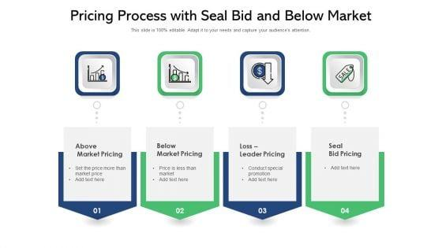

## Table of Contents

## What does 'Below Market' mean in real estate?

In real estate, 'Below Market' means a property is being sold or rented for less than its normal value. This can happen for many reasons. For example, the seller might need to sell the property quickly, or there might be many similar properties available, so sellers lower their prices to attract buyers.

When a property is listed as 'Below Market', it can be a good opportunity for buyers or renters. They can get a home or an apartment for less money than usual. However, buyers should be careful. Sometimes, a 'Below Market' price can mean there are problems with the property, like needing repairs or being in a less desirable location. It's important to check the property carefully before buying or renting.

## How does a property qualify as being 'Below Market'?

A property is considered 'Below Market' when it is priced lower than what is typical for similar properties in the same area. This can happen for various reasons. For example, the seller might be in a hurry to sell, or there might be a lot of similar properties for sale, which makes sellers lower their prices to stand out. Also, if a property needs repairs or is in a less popular location, it might be sold at a lower price.

When a property is listed as 'Below Market', it can be a great chance for buyers or renters to get a good deal. However, it's important to be careful. Sometimes, a low price can mean there are issues with the property that might cost money to fix later. It's a good idea to look at the property carefully and maybe even get a professional to check it before making a decision.

## What are the benefits of purchasing a 'Below Market' property?

Buying a 'Below Market' property can save you a lot of money. When a property is sold for less than what similar homes in the area cost, you pay less upfront. This can mean a smaller down payment and lower monthly payments if you take out a loan. Over time, these savings can add up to a big difference in your wallet.

Another benefit is the potential for a good return on investment. If you buy a 'Below Market' property and fix it up, you might be able to sell it later for a higher price. This is called flipping a house. Or, you could rent it out and earn more money each month than you would with a more expensive property. Just make sure to check the property carefully to avoid any hidden problems that could cost you more money in the end.

## Can you explain the risks associated with buying 'Below Market' properties?

Buying a 'Below Market' property can be risky. One big risk is that the property might have problems you don't see at first. It could need a lot of repairs, like fixing the roof or the plumbing. These repairs can be expensive and might cost more than the money you saved by buying the property at a lower price. It's important to have the property checked by a professional before you buy it to find any hidden issues.

Another risk is that the property might be in a bad location. It could be in a neighborhood that is not popular or safe. This can make it hard to sell the property later if you want to move. Also, if you plan to rent it out, you might have trouble finding good tenants. Location can really affect how much your property is worth and how easy it is to make money from it.

Lastly, buying 'Below Market' might mean you're in a hurry to buy without thinking it through. Sometimes, people see a low price and jump at it without doing enough research. This can lead to making a bad decision. It's always a good idea to take your time, compare prices, and understand why the property is being sold for less. This way, you can make a smarter choice and avoid future headaches.

## How do 'Below Market' properties affect the local real estate market?

When a lot of 'Below Market' properties are sold in an area, it can change the prices of other homes. If many homes are sold for less, people might think that all homes in the area are worth less. This can make other sellers lower their prices too. They do this to make sure their homes sell quickly. So, the whole neighborhood's prices can go down because of a few 'Below Market' sales.

On the other hand, 'Below Market' properties can also help the local market by making it easier for people to buy homes. If someone can buy a home for less, they might move into the neighborhood. This can bring more people to the area, which can be good for local businesses. More people living in the neighborhood can make it more lively and attractive, which might even help raise property values in the long run.

## What strategies can investors use to find 'Below Market' properties?

Investors can find 'Below Market' properties by keeping an eye on real estate listings and using online tools. Websites like Zillow, Redfin, and local real estate sites show homes for sale. Investors can set up alerts for new listings in certain areas. They should look for homes that are priced lower than similar homes nearby. This might mean the seller needs to sell quickly or the home needs some work. Also, working with a good real estate agent can help. Agents know the local market and can spot deals that others might miss.

Another strategy is to attend auctions and foreclosure sales. Sometimes, properties at these events are sold for less than their market value. Investors should do their homework and know the usual prices in the area so they can spot a good deal. It's important to check the property carefully before bidding, as auction properties might have hidden problems. Networking with other investors and joining real estate investment groups can also lead to tips about 'Below Market' opportunities. People in these groups often share information about good deals they find.

## How does one determine the true value of a 'Below Market' property?

To find out the true value of a 'Below Market' property, you need to compare it with other homes in the same area. Look at homes that are similar in size, age, and features. Websites like Zillow or Redfin can show you what other homes are selling for. This helps you see if the 'Below Market' price is really a good deal or if it's just a bit lower than normal. You should also think about the location. A home in a popular neighborhood might be worth more than one in a less popular area, even if they look the same.

Another important step is to get a professional to check the property. A home inspector can find problems that you might not see, like a leaky roof or old plumbing. These issues can cost a lot to fix, so knowing about them helps you decide if the lower price is worth it. Sometimes, the cost of repairs can make the 'Below Market' price not such a good deal after all. By comparing the property to others and getting a professional inspection, you can figure out its true value and make a smart decision.

## What are the common reasons a property might be sold 'Below Market'?

A property might be sold 'Below Market' for a few reasons. One big reason is that the seller needs to sell the house quickly. Maybe they got a new job in another city or they are having money problems. They might lower the price to make the home sell faster. Another reason is that there are a lot of homes for sale in the area. When there are many homes to choose from, sellers might lower their prices to make their home stand out and attract buyers.

Also, a property might be sold 'Below Market' if it needs repairs. If the house has problems like a broken roof or old plumbing, the seller might lower the price because it will cost money to fix these issues. Sometimes, the house might be in a location that people don't want to live in. It could be in a noisy area or far from good schools and shops. These factors can make the seller lower the price to make it more appealing to buyers.

## How do government policies influence 'Below Market' sales?

Government policies can have a big effect on 'Below Market' sales. Sometimes, the government makes rules to help people buy homes. They might give tax breaks or special loans to people who buy homes that cost less than the usual price. These rules can make it easier for people to afford a home, which can lead to more 'Below Market' sales. On the other hand, if the government changes rules about building new homes, it can change how many homes are for sale. If there are more homes than people want to buy, sellers might lower their prices to sell their homes faster.

Also, government policies can affect the economy, which can change how much people are willing to pay for homes. If the government does things that make the economy grow, more people might have money to buy homes, and prices might go up. But if the economy is not doing well, people might not want to spend a lot on homes, and more homes might be sold 'Below Market'. So, the government's actions can make a big difference in how many 'Below Market' properties are available and why they are sold at a lower price.

## What role do economic conditions play in the availability of 'Below Market' properties?

Economic conditions can really change how many 'Below Market' properties are available. When the economy is not doing well, people might lose their jobs or have less money. This can make them sell their homes for less than they are worth just to get some money quickly. Also, if a lot of people are trying to sell their homes at the same time, there might be more homes for sale than people want to buy. This can make sellers lower their prices to stand out and sell their homes faster.

On the other hand, when the economy is doing well, people might have more money to spend on homes. This can make home prices go up because more people want to buy. But even in a good economy, there can still be 'Below Market' properties. For example, if someone needs to move quickly for a new job, they might sell their home for less. So, economic conditions can make a big difference in how many 'Below Market' properties are out there and why they are sold at a lower price.

## How can technology and data analytics help in identifying 'Below Market' opportunities?

Technology and data analytics can help people find 'Below Market' properties by making it easier to look at a lot of information quickly. Websites and apps like Zillow and Redfin use data to show what homes are selling for in different areas. They can also tell you if a home is priced lower than similar homes nearby. This helps buyers see if a home is really a good deal. Also, tools like automated valuation models (AVMs) use data to guess what a home might be worth. By comparing this guess to the asking price, buyers can spot 'Below Market' opportunities.

Another way technology helps is by using big data to find patterns that might not be easy to see. For example, data analytics can show if a lot of homes in an area are being sold quickly or if prices are going down. This can help buyers understand why a home might be sold 'Below Market'. Also, technology can help with things like setting up alerts for new listings or using algorithms to find homes that meet certain criteria, like being in a certain price range or needing repairs. This makes it easier for buyers to find and act on 'Below Market' opportunities before others do.

## What are some advanced financial models used to assess the potential of 'Below Market' investments?

One advanced financial model used to assess the potential of 'Below Market' investments is the Discounted Cash Flow (DCF) model. This model helps investors figure out how much a property is really worth by looking at the money it could make in the future. The DCF model takes the expected rental income or the money from selling the property later and brings it back to today's value. This way, investors can see if buying a 'Below Market' property will make them more money than they spend on it. It's a good tool because it considers the time value of money, meaning money today is worth more than the same amount in the future.

Another useful model is the Comparable Sales Approach, often called the "Comps" method. This model looks at recent sales of similar properties in the same area to guess what a 'Below Market' property might be worth. By comparing the prices of these similar homes, investors can see if the 'Below Market' property is really a good deal. This model is helpful because it uses real data from the local market, which can show if a property is underpriced. It's important to make sure the homes being compared are as similar as possible to get a good idea of the property's true value.

## What is the key to understanding market prices?

Market price is a fundamental concept in financial markets, representing the current price at which an asset or service can be transacted. Understanding the factors influencing market prices is crucial for traders and investors to make informed decisions.

Market prices are primarily determined by the forces of supply and demand. When demand for an asset exceeds supply, prices typically rise, while an excess of supply over demand generally leads to lower prices. This dynamic interplay is the cornerstone of price determination in competitive markets.

Economic indicators are another significant [factor](/wiki/factor-investing) that can cause market prices to fluctuate. Indicators such as Gross Domestic Product (GDP) growth rates, employment figures, inflation rates, and interest rates provide insights into the economic health of a country or region, influencing investor sentiment and subsequent price movements. For example, higher-than-expected economic growth can boost investor confidence, leading to higher asset prices.

Geopolitical events also play a vital role in shaping market prices. Political instability, wars, trade disputes, and diplomatic relations between countries can create uncertainty and [volatility](/wiki/volatility-trading-strategies) in financial markets. Such events may lead investors to seek safer assets or adjust their portfolios based on perceived risks, directly impacting market prices.

Market sentiment, the overall attitude of investors toward a particular market or asset, can lead to short-term price movements, often independent of fundamental factors. Sentiment is influenced by news, rumors, and investor psychology. Bullish sentiment can drive prices up, while bearish sentiment may push them down.

Having a grasp of how market prices fluctuate is essential for devising effective trading strategies. Traders often use technical analysis to predict price movements based on historical price data and patterns, aiming to capitalize on short-term market inefficiencies. Fundamental analysis, on the other hand, assesses an asset's intrinsic value by examining underlying factors such as financial health, industry conditions, and macroeconomic trends. A comprehensive approach involves integrating both technical and fundamental analyses to better understand and anticipate market price movements.

Mathematically, market pricing can be analyzed using models such as the supply-demand equilibrium: 

$$
P^* = P_e = \frac{a - bQ}{c + d}
$$

where $P^*$ represents the equilibrium price, $Q$ is the quantity, and $a$, $b$, $c$, and $d$ are parameters reflecting factors affecting supply and demand. Though simplified, such models help in understanding the underlying mechanics that drive market prices.

In conclusion, comprehending the intricate factors influencing market prices enables traders to adapt their strategies effectively, optimizing their efforts to achieve favorable outcomes in volatile and complex financial markets.

## How can we evaluate the performance of algo trading strategies?

Evaluating the performance of [algorithmic trading](/wiki/algorithmic-trading) strategies requires the application of specific metrics that reflect both profitability and risk. The primary metrics employed in this evaluation include return on investment (ROI), Sharpe ratio, and maximum drawdown, each offering a unique perspective on strategy efficacy.

**Return on Investment (ROI)** is a fundamental metric that quantifies the profitability of a trading strategy. It is calculated as:

$$

\text{ROI} = \left( \frac{\text{Net Profit}}{\text{Initial Investment}} \right) \times 100 
$$

This metric indicates the percentage return generated by the strategy over a specific period, offering a straightforward lens through which to measure financial gains.

**Sharpe Ratio** evaluates the risk-adjusted return of a trading strategy. It measures the excess return per unit of risk, providing insights into the trade-off between risk and return. The Sharpe Ratio is calculated as:

$$

\text{Sharpe Ratio} = \frac{R_p - R_f}{\sigma_p} 
$$

where $R_p$ is the expected portfolio return, $R_f$ is the risk-free rate, and $\sigma_p$ is the standard deviation of the portfolio's excess return. A higher Sharpe ratio indicates a more attractive risk-adjusted return.

**Maximum Drawdown** assesses the risk of potential loss in a trading strategy by measuring the largest peak-to-trough decline before a new peak is achieved. It is expressed as a percentage of the peak value, providing a measure of the worst-case scenario for investors:

$$

\text{Maximum Drawdown} = \frac{\text{Trough Value} - \text{Peak Value}}{\text{Peak Value}} \times 100 
$$

By assessing these metrics, traders can establish benchmarks for their strategies, ensuring they align with investment goals and risk tolerances. Optimization involves adjusting strategy parameters to enhance returns while maintaining acceptable risk levels.

**Case Studies and Real-World Examples:**

1. **Trend-Following Strategies**: Suppose a trend-following strategy using moving averages shows an ROI of 15% annually with a Sharpe ratio of 1.2 while maintaining a maximum drawdown of 10%. The relatively high Sharpe ratio suggests the strategy effectively manages risk in capturing market trends.

2. **Mean Reversion Strategies**: Consider a mean reversion strategy utilizing statistical arbitrage. A reported ROI of 8%, with a Sharpe ratio of 0.9 and a maximum drawdown of 5%, indicates a balanced approach with lower volatility compared to trend-following strategies.

To implement a performance evaluation system, traders might use Python for [backtesting](/wiki/backtesting) and analysis:

```python
import numpy as np
import pandas as pd

def calculate_return(prices):
    return (prices[-1] - prices[0]) / prices[0] * 100

def calculate_sharpe_ratio(returns, risk_free_rate=0.05):
    excess_returns = returns - risk_free_rate
    return np.mean(excess_returns) / np.std(excess_returns)

def calculate_max_drawdown(prices):
    peak = prices[0]
    max_drawdown = 0
    for price in prices:
        if price > peak:
            peak = price
        drawdown = (peak - price) / peak * 100
        max_drawdown = max(max_drawdown, drawdown)
    return max_drawdown

# Example usage
historical_prices = pd.Series([...])  # replace with actual data
returns = np.diff(historical_prices) / historical_prices[:-1]
roi = calculate_return(historical_prices)
sharpe_ratio = calculate_sharpe_ratio(returns)
max_drawdown = calculate_max_drawdown(historical_prices)

print(f"ROI: {roi}%")
print(f"Sharpe Ratio: {sharpe_ratio}")
print(f"Maximum Drawdown: {max_drawdown}%")
```

By applying these metrics and methods, traders can ensure disciplined and data-driven evaluations of algorithmic trading strategies, allowing for continuous improvement and adaptation to market conditions.

## References & Further Reading

[1]: Bergstra, J., Bardenet, R., Bengio, Y., & Kégl, B. (2011). ["Algorithms for Hyper-Parameter Optimization."](https://proceedings.neurips.cc/paper/2011/file/86e8f7ab32cfd12577bc2619bc635690-Paper.pdf) Advances in Neural Information Processing Systems 24.

[2]: ["Advances in Financial Machine Learning"](https://www.amazon.com/Advances-Financial-Machine-Learning-Marcos/dp/1119482089) by Marcos Lopez de Prado

[3]: ["Evidence-Based Technical Analysis: Applying the Scientific Method and Statistical Inference to Trading Signals"](https://www.amazon.com/Evidence-Based-Technical-Analysis-Scientific-Statistical/dp/0470008741) by David Aronson

[4]: ["Machine Learning for Algorithmic Trading"](https://github.com/stefan-jansen/machine-learning-for-trading) by Stefan Jansen

[5]: ["Quantitative Trading: How to Build Your Own Algorithmic Trading Business"](https://www.amazon.com/Quantitative-Trading-Build-Algorithmic-Business/dp/1119800064) by Ernest P. Chan