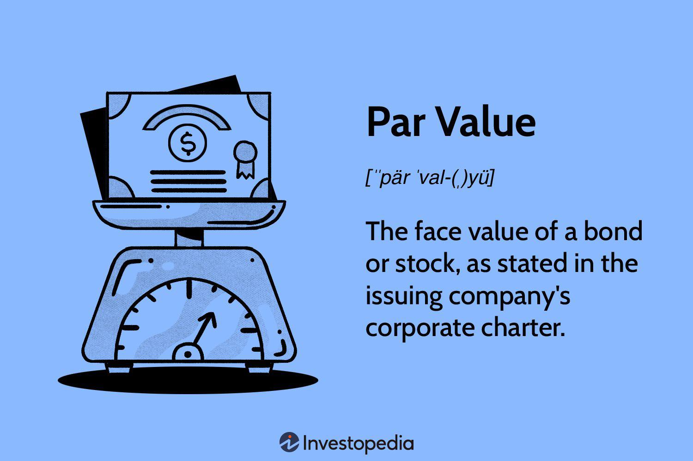

Bond pricing is a fundamental concept in finance that influences investor decisions and market dynamics. It involves assessing the present value of future cash flows generated by bonds, and these evaluations are critical for both individual investors and institutions. The structure of bond pricing not only reflects the time value of money but also incorporates various risks, making it a key area of focus for effective portfolio management.

In this article, we will explore the specific terms related to bond pricing, including "below par," and its relevance in algorithmic trading (algo trading). Bonds may trade at par, above par, or below par. When a bond's market price falls below its face value, it is referred to as trading "below par". This situation typically arises due to fluctuating interest rates, changes in the issuer's creditworthiness, or shifts in supply and demand. Understanding these conditions is crucial as they provide insight into the broader market sentiment and the strategies employed by investors.



Algorithmic trading plays an increasingly vital role in modern financial markets. Through the use of sophisticated computer algorithms, traders can analyze massive datasets and execute trades with high efficiency and precision. Algo trading systems particularly consider bonds trading below par, as these scenarios often present unique opportunities or risks that can be systematically exploited. By automating decision-making processes, algorithmic trading systems enable faster and often more effective responses to market changes.

This interplay between bond pricing dynamics and algorithmic trading redefines traditional investment strategies. Investors benefit from understanding how the pricing of bonds below par can influence yield calculations, offering potential gains when bonds mature at their face value. As financial markets evolve, the synergistic relationship between these concepts remains essential for informed decision-making and strategic planning.

## Table of Contents

## Understanding Bond Pricing and Below Par Bonds

Bonds are fundamental financial instruments that can be traded at various price levels: at par, above par, or below par. The term "par" refers to the bond's face value, which is typically the amount that will be repaid to the bondholder at maturity. When a bond trades below its face value, it is described as trading "below par." This indicates that the market price of the bond is less than 100 percent of its original face value.

Several factors can influence whether a bond trades below par. One of the primary factors is changes in interest rates. There exists an inverse relationship between bond prices and interest rates: as interest rates rise, the prices of existing bonds generally fall. This occurs because newer bonds may be issued with higher yields, making existing bonds with lower yields less attractive, thus driving their prices down below par.

Another [factor](/wiki/factor-investing) impacting bond prices is the credit rating of the issuer. A decline in the issuer's credit rating can signal increased risk of default, leading investors to require a higher yield for holding the bond. Consequently, the bond's price may decrease to reflect this risk, often resulting in a below-par trading price.

Supply and demand in the bond market also play a crucial role in determining bond prices. An excess supply of bonds can lead to price decreases, as potential buyers have a wide selection to choose from, minimizing the urgency to purchase at or above face value. Conversely, if demand for bonds decreases due to changes in investor sentiment or economic conditions, bond prices can also fall below par as sellers are compelled to lower prices to attract buyers.

In summary, bonds trading below par are influenced by a combination of [interest rate](/wiki/interest-rate-trading-strategies) movements, issuer creditworthiness, and market supply-demand dynamics. Understanding these factors is essential for assessing bond valuation and making informed investment decisions.

## Why Bonds Trade Below Par

Bonds are a vital component of financial markets, providing both issuers and investors with a mechanism for raising capital and generating returns. However, various factors can lead bonds to trade below their face value, a condition known as trading "below par." Understanding the reasons for this price deviation involves examining interest rate dynamics, issuer credit quality, and market supply conditions.

Interest rate fluctuations are one of the primary reasons bonds trade below par. The relationship between interest rates and bond prices is inversely proportional: as interest rates rise, the prices of existing bonds typically fall. This is because newer bonds may be issued at these higher prevailing rates, making older bonds with lower coupon rates less attractive. Consequently, the demand for these older bonds decreases, driving their prices below par. The inverse relationship can be mathematically represented by the bond price formula:

$$

P = \sum_{t=1}^{T}\frac{C}{(1+r)^t} + \frac{F}{(1+r)^T} 
$$

where $P$ is the price of the bond, $C$ is the coupon payment, $r$ is the discount rate (or yield), $F$ is the face value, and $T$ is the time to maturity.

Beyond interest rates, a decline in an issuer's credit rating can also result in bonds trading below par. Credit ratings are assessments of the creditworthiness of a borrower—in this case, the bond issuer. A downgrade in credit rating signals increased risk of default, making the bond less attractive to investors. As a result, investors demand a higher yield for taking on this additional risk, which translates to a lower market price for the bond. The reduced demand and increased yield requirements are crucial factors in the bond's price depreciation.

Lastly, excess supply in the bond market can lead to decreased bond prices. When there is an ample supply of bonds relative to demand, prices tend to drop to attract buyers. This situation may arise from increased issuance activity by corporations or governments aiming to capitalize on favorable financing conditions or to meet fiscal needs. The imbalance between supply and demand thus pressures bond prices, potentially pushing them below par.

Understanding these dynamics allows investors and financial professionals to interpret bond price movements accurately and adjust their investment strategies accordingly.

## Algorithmic Trading in the Bond Market

Algorithmic trading, often simply referred to as algo trading, utilizes computer algorithms to autonomously execute trading decisions based on a defined set of parameters. This approach has significantly transformed the operations of financial markets, including the bond market, by enabling trades to be executed with unmatched speed and precision. 

In the bond market, algorithms are designed to efficiently analyze a wide range of market signals. These signals can include interest rate changes, economic indicators, or price differentials. By automating the trading process, algorithms ensure that decisions are made quickly, often capitalizing on fleeting opportunities that may arise due to market inefficiencies. For instance, if a bond trades below par due to temporary market dislocations, algo trading systems can identify these discrepancies and execute trades to exploit potential profitable scenarios.

Moreover, [algorithmic trading](/wiki/algorithmic-trading) in the bond market often involves complex strategies such as statistical [arbitrage](/wiki/arbitrage), which seeks to profit from anomalies in pricing. A typical example involves using historical data and statistical models to forecast future price movements and execute trades, thus capturing the spread between the current and expected prices. The ability of algorithms to process vast amounts of data and execute trades milliseconds faster than a human trader offers a substantial competitive advantage. 

Consider the following Python pseudocode demonstrating a simple strategic framework for algorithmic trading in bonds:

```python
import numpy as np

def calculate_yield_to_maturity(face_value, market_price, coupon_rate, years):
    # Simplistic YTM calculation
    return (coupon_rate + ((face_value - market_price) / years)) / ((face_value + market_price) / 2)

def identify_trading_opportunity(bond_market_data):
    for bond in bond_market_data:
        market_price = bond['price']
        below_par_cutoff = 100 # assuming face value is 100
        if market_price < below_par_cutoff:
            ytm = calculate_yield_to_maturity(100, market_price, bond['coupon'], bond['years_to_maturity'])
            if ytm > some_threshold:  # strategic threshold for desirable yield
                execute_trade(bond)

def execute_trade(bond):
    print(f"Executing trade for bond: {bond['id']} at price: {bond['price']}")

# Sample bond market data
bond_market_data = [
    {'id': 'BondA', 'price': 95, 'coupon': 5, 'years_to_maturity': 5},
    {'id': 'BondB', 'price': 102, 'coupon': 6, 'years_to_maturity': 10},
    # More bonds...
]

identify_trading_opportunity(bond_market_data)
```

This script emphasizes how algorithmic systems assess bond market conditions and make decisions based on current prices relative to par, potential yields, and a predetermined trading strategy. By setting a threshold that signifies a beneficial yield-to-maturity, such algorithms can autonomously decide whether to trade a bond trading below par, enhancing the potential for returns.

Overall, algorithmic trading has become integral in modern bond markets due to its capability to swiftly interpret large datasets and execute trades in real-time, thus effectively responding to market-bound dynamism and inefficiencies.

## The Impact of Below Par Bonds on Yield Calculations

Bonds trading below par have a significant impact on yield calculations, offering investors the potential for a higher yield-to-maturity (YTM). Yield calculations are a critical aspect of bond valuation, as they allow investors to assess the profitability of holding a bond until it matures. When a bond is purchased at a discount, or below par, the bondholder stands to receive not only the periodic coupon payments but also a capital gain, as the bond will be redeemed at its face value upon maturity. This capital gain enhances the bond's yield.

To calculate the yield-to-maturity for a bond trading below par, investors typically use the following formula:

$$

YTM \approx \frac{C + \frac{F - P}{n}}{\frac{F + P}{2}} 
$$

Where:

- $C$ is the annual coupon payment
- $F$ is the face value of the bond
- $P$ is the purchase price of the bond
- $n$ is the number of years until maturity

This approximation takes into account the annual coupon income and the average of the initial and final price of the bond over its term. Importantly, this formula highlights how purchasing a bond at a discount (i.e., below par) increases the yield, as the investor benefits from a lower initial investment compared to the return they receive at maturity.

For investors, understanding the impact of trading below par is crucial. Purchasing bonds below face value can be a strategic move to increase yield, particularly in a declining interest rate environment where existing bonds with higher coupons become valuable. Additionally, the capital appreciation aspect can be attractive, especially if the investor anticipates that the issuer's creditworthiness will stabilize or improve, thus narrowing yield spreads and driving prices up.

For algorithmic trading systems, integrating yield calculations for bonds trading below par can enhance decision-making efficiency. As these systems are configured to detect market inefficiencies, identifying opportunities where bonds are undervalued due to price discounts can optimize portfolio returns. Algorithms account for fluctuations in market interest rates and issuer credit ratings, automatically adjusting strategies to leverage potential gains from bonds trading below par. By continuously interpreting the yield data, the systems guide trading strategies to align with investor goals, whether it’s maximizing yields or managing risk. 

In conclusion, the implications of below par trading on yield calculations emphasize the importance for both individual investors and algorithmic trading systems to accurately compute and interpret yields. Mastering these calculations enables informed decision-making and strategic positioning in the constantly evolving bond market.

## Implications for Traders and Investors

For traders and investors, bonds trading below par present a dual-edged sword, capable of providing lucrative buying opportunities or signaling increased risk. When a bond is priced below its face value, it often reflects broader market sentiments such as expected interest rate hikes or concerns about the issuer's creditworthiness.

Algorithmic trading systems particularly leverage these pricing dynamics. By employing sophisticated algorithms, trading systems can rapidly analyze market data to identify bonds trading below par and execute trades based on predefined conditional strategies. For example, an algorithm may be designed to purchase bonds when they reach a certain price threshold below par, anticipating a price correction or improvement in the issuer's financial outlook. This automation not only enhances efficiency but also helps traders capitalize on short-lived market inefficiencies.

Investors approaching below par bonds must balance potential risks and rewards. On one hand, purchasing these bonds can yield significant returns if the market perception improves and the bond price rises, potentially reaching or exceeding its face value. This scenario often results in a higher yield-to-maturity (YTM), calculated as:

$$
YTM = \frac{C + \frac{F - P}{n}}{\frac{F + P}{2}}
$$

Where:
- $C$ is the annual coupon payment,
- $F$ is the face value of the bond,
- $P$ is the current market price,
- $n$ is the number of years to maturity.

On the other hand, below par pricing may indicate heightened risk. A sharp decline in an issuer's credit rating could suggest potential default, making the bond a precarious investment. Furthermore, economic conditions such as rising interest rates or increased bond supply could suppress bond prices, contributing to further declines.

Investors should meticulously assess market trends and the issuer's credit profile when considering below par bonds. Comprehensive evaluation of these factors assists in optimizing risk-reward ratios and aligning investment strategies with market conditions. Ultimately, the ability to navigate the complexities of below par bonds and adjust strategies accordingly is crucial for both manual and algorithmic trading operations.

## Conclusion

Bond pricing, especially the phenomenon of trading below par, is crucial in the landscape of investment analysis and strategy formulation. This situation arises when a bond's market value falls below its face value, often triggered by changes in market interest rates, the issuer's creditworthiness, or supply-demand dynamics. Understanding these interactions is essential for developing effective investment strategies, as they directly influence an investor's potential return on investment.

Algorithmic trading, a major force in modern financial markets, significantly interacts with bond pricing dynamics. Algorithms are designed to swiftly process vast amounts of market data and execute trades based on pre-determined criteria, taking advantage of minute price movements. This capability becomes particularly relevant when bonds trade below par, as algorithms can exploit such pricing inefficiencies for potential gains. By leveraging algorithmic strategies, traders can respond rapidly to market shifts, optimizing the execution of trades and enhancing yield outcomes.

As market conditions continuously evolve, fueled by economic, political, and technological developments, market participants must remain adaptable. A nuanced understanding of bond pricing, especially in the context of bonds trading below par, is vital for making informed decisions. This includes recognizing the signals that affect pricing, appreciating the role of algorithmic trading in processing these signals, and ultimately, aligning investment strategies with prevailing market trends. By maintaining this level of comprehension, investors and traders can better navigate the complexities of the financial markets, balancing risk and reward to optimize their portfolios' performance.

## References & Further Reading

[1]: Fabozzi, F. J., Mann, S. V., & Choudhry, M. (2003). ["Bond Market Securities."](https://www.mhebooklibrary.com/doi/book/10.1036/9781260473902) Pearson.

[2]: Choudhry, M. (2010). ["Bond and Money Markets: Strategy, Trading, Analysis."](https://books.google.com/books/about/Bond_and_Money_Markets.html?id=c1N36C7LxU4C) Elsevier.

[3]: de Prado, M. L. (2018). ["Advances in Financial Machine Learning."](https://www.amazon.com/Advances-Financial-Machine-Learning-Marcos/dp/1119482089) Wiley.

[4]: Hull, J. C. (2018). ["Options, Futures, and Other Derivatives."](https://www.semanticscholar.org/paper/Options%2C-Futures%2C-and-Other-Derivatives-Hull/89bdee500c8623864fc9eb7a471546aa713acc44) Pearson.

[5]: Chan, E. P. (2013). ["Algorithmic Trading: Winning Strategies and Their Rationale."](https://github.com/ftvision/quant_trading_echan_book) Wiley.

[6]: ["Understanding Bonds."](https://www.investopedia.com/terms/b/bond.asp) Investopedia.

[7]: Sharpe, W. F., Alexander, G. J., & Bailey, J. V. (1999). ["Investments."](https://archive.org/details/investments0000shar) Prentice Hall.

[8]: Jansen, S. (2020). ["Machine Learning for Algorithmic Trading: Predictive models to extract signals from market and alternative data for systematic trading strategies with Python."](https://www.amazon.com/Machine-Learning-Algorithmic-Trading-alternative/dp/1839217715) Packt Publishing.