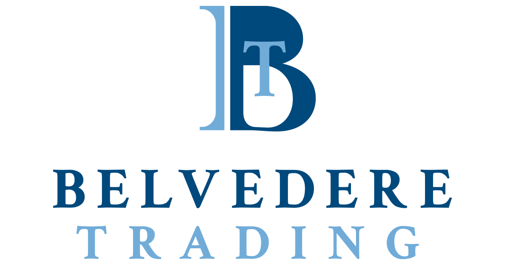

## Table of Contents

## What is Belvedere Trading?

Belvedere Trading is a company that helps people buy and sell things like stocks and other financial products. They use computers and technology to make trading faster and easier. The company started in 2002 and has grown a lot since then. They work with big clients like banks and other financial companies to help them make smart decisions about trading.

Belvedere Trading focuses a lot on using technology to improve trading. They have a team of smart people who create special computer programs to find the best times to buy and sell. This helps their clients make more money and take fewer risks. The company is based in Chicago, but they work with clients all over the world.

## When was Belvedere Trading founded?

Belvedere Trading was founded in 2002. This means it started almost 20 years ago. The company helps people and big clients buy and sell things like stocks.

They use computers and special programs to make trading easier and faster. Belvedere Trading is based in Chicago but works with clients all around the world. They focus a lot on using technology to help their clients make smart trading decisions.

## Who are the founders of Belvedere Trading?

Belvedere Trading was started by three people: Dan Wenhold, Steve Mock, and Matt Hulsizer. They all wanted to use technology to make trading easier and better. Dan, Steve, and Matt thought that computers could help people buy and sell stocks faster and smarter.

These founders began Belvedere Trading in 2002. They worked hard to build a company that could help big clients like banks make good trading decisions. Today, Belvedere Trading is still based in Chicago and helps clients all over the world.

## What types of financial instruments does Belvedere Trading deal with?

Belvedere Trading works with many different types of financial instruments. These include stocks, which are shares in a company that people can buy and sell. They also deal with options, which are contracts that give the buyer the right to buy or sell a stock at a certain price. Futures are another type of financial instrument they handle, which are agreements to buy or sell something at a future date for a set price.

In addition to these, Belvedere Trading also trades in commodities, like gold or oil, which are physical goods that can be bought and sold. They also work with foreign exchange, which involves trading different currencies. All these financial instruments help their clients manage risk and make money. Belvedere Trading uses special computer programs to help make these trades faster and smarter.

## In which markets does Belvedere Trading operate?

Belvedere Trading operates in many different markets around the world. They work in the stock market, where they help buy and sell shares of companies. They also trade in the options market, where they deal with contracts that give the right to buy or sell stocks at a certain price. Another market they are involved in is the futures market, where they trade agreements to buy or sell things at a future date.

In addition to these, Belvedere Trading is active in the commodities market, trading physical goods like gold and oil. They also participate in the foreign exchange market, where they trade different currencies. By working in all these markets, Belvedere Trading helps their clients manage risk and make money, using special computer programs to make trading faster and smarter.

## What is the business model of Belvedere Trading?

Belvedere Trading's business model focuses on using technology to help big clients like banks and financial companies buy and sell different financial products. They use special computer programs to make trading faster and smarter. This helps their clients make more money and take fewer risks. Belvedere Trading earns money by charging fees for their trading services and by taking a small part of the profits from the trades they help with.

The company works in many different markets, like stocks, options, futures, commodities, and foreign exchange. By being involved in all these markets, Belvedere Trading can offer a wide range of services to their clients. They use their technology to find the best times to buy and sell, which makes their clients happy and helps the company grow. Belvedere Trading is based in Chicago but helps clients all over the world.

## How does Belvedere Trading ensure compliance with financial regulations?

Belvedere Trading makes sure they follow all the rules by having a special team that knows a lot about financial laws. This team keeps an eye on what the company does and makes sure everything is done the right way. They also use special computer programs to check trades and make sure they follow the rules. If there are any new laws, the team learns about them and changes how the company works to stay compliant.

The company also works closely with regulators, which are the people who make and enforce the rules. They talk to these regulators regularly and share information to show they are following all the rules. Belvedere Trading trains all their employees about the importance of compliance and what they need to do to follow the rules. This helps everyone at the company understand how important it is to do things the right way.

## What are the key technological tools used by Belvedere Trading?

Belvedere Trading uses special computer programs to help them trade faster and smarter. These programs are called algorithms. They help find the best times to buy and sell stocks, options, futures, and other financial products. The company also uses high-speed computers and special software to handle a lot of trades quickly. This helps them make trading easier for their big clients like banks and financial companies.

Another important tool they use is something called a trading platform. This is like a special computer system where traders can see all the information they need to make good trading decisions. The platform shows prices, charts, and other data that help traders know when to buy or sell. Belvedere Trading also uses risk management tools to help their clients take fewer risks and make more money. These tools watch the trades and make sure they are safe and smart.

## What are some notable achievements or milestones of Belvedere Trading?

Belvedere Trading has had many important achievements since it started in 2002. One big milestone was when they began working with big clients like banks and financial companies. This helped them grow a lot and become a well-known name in the trading world. Another achievement was when they started using special computer programs, called algorithms, to make trading faster and smarter. This helped their clients make more money and take fewer risks.

Another important milestone for Belvedere Trading was when they expanded into new markets. They began trading in stocks, options, futures, commodities, and foreign exchange. This made their services more useful to their clients. Belvedere Trading also got a lot of attention for their focus on technology. They were praised for using high-speed computers and special software to handle a lot of trades quickly. This helped them stand out in the industry and keep growing.

## How does Belvedere Trading approach risk management?

Belvedere Trading takes risk management very seriously. They use special computer programs to watch all the trades they do. These programs help them see if any trades are too risky. If a trade looks like it might lose a lot of money, the programs can stop it before it gets too bad. This way, Belvedere Trading helps their clients take fewer risks and make more money.

They also have a team of people who know a lot about managing risk. These people watch the markets and the trades all the time. They make sure that everything Belvedere Trading does follows the rules and is safe. By using both technology and smart people, Belvedere Trading makes sure their clients can trade without worrying too much about losing money.

## What is the company culture like at Belvedere Trading?

The company culture at Belvedere Trading is all about teamwork and using technology to do great work. Everyone at the company works together to help clients buy and sell stocks and other financial products. They use special computer programs to make trading faster and smarter. This means that everyone needs to be good at working with technology and also good at working with other people. The company encourages people to share ideas and learn from each other, which helps them come up with new ways to help their clients.

Belvedere Trading also cares a lot about making sure everyone feels valued and respected. They have a friendly and supportive environment where people can grow in their jobs. The company offers training and chances to learn new skills, which helps employees do their best work. They also believe in having a good balance between work and life, so people can enjoy their time outside of work too. This makes Belvedere Trading a great place to work, where people can feel happy and successful.

## What future trends or innovations is Belvedere Trading focusing on?

Belvedere Trading is always looking at new ways to use technology to make trading better. They are focusing a lot on [artificial intelligence](/wiki/ai-artificial-intelligence), or AI. AI can help find the best times to buy and sell stocks even faster than before. This means their clients can make more money and take fewer risks. Belvedere Trading is also working on making their computer programs even smarter. They want these programs to learn from past trades and get better over time, which will help them trade more efficiently.

Another big trend Belvedere Trading is looking at is using more data to make decisions. They are finding ways to use all kinds of information, like news and social media, to understand what's happening in the markets. This can help them predict what might happen next and make smarter trades. Belvedere Trading is also thinking about how to use new technology like blockchain, which can make trading safer and more transparent. By staying on top of these trends, Belvedere Trading hopes to keep helping their clients in the best way possible.

## References & Further Reading

[1]: Byrne, P. (2020). ["Machine Learning for Asset Managers"](https://www.cambridge.org/us/universitypress/subjects/economics/finance/machine-learning-asset-managers) by Marcos Lopez de Prado.

[2]: Aldridge, I. (2013). ["High-Frequency Trading: A Practical Guide to Algorithmic Strategies and Trading Systems"](https://www.wiley.com/en-us/High+Frequency+Trading%3A+A+Practical+Guide+to+Algorithmic+Strategies+and+Trading+Systems%2C+2nd+Edition-p-9781118343500). Wiley Trading Series.

[3]: Narang, R. (2009). ["Inside the Black Box: The Simple Truth About Quantitative Trading"](https://onlinelibrary.wiley.com/doi/book/10.1002/9781118267738). John Wiley & Sons.

[4]: Johnson, B. (2010). ["Algorithmic Trading & DMA: An Introduction to Direct Access Trading Strategies"](https://archive.org/details/algorithmictradi0000john). 4th Story LLC.

[5]: Bouchaud, J.-P., & Potters, M. (2003). ["Theory of Financial Risk and Derivative Pricing: From Statistical Physics to Risk Management"](https://www.cambridge.org/core/books/theory-of-financial-risk-and-derivative-pricing/5BBBA04CE72ED9E5E7C1C028D9A94FCB). Cambridge University Press.