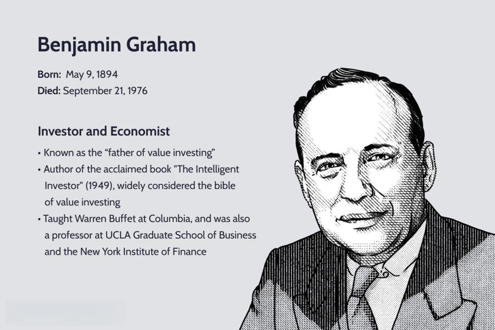

In recent years, the Ben Felix Portfolio has garnered attention in the investment community, particularly among enthusiasts of algorithmic trading. Spearheaded by Canadian portfolio manager Ben Felix, this investment model is noted for its globally diversified strategy, primarily employing index funds. The strategy is distinctively tilted towards specific factors, such as size, value, and profitability, leveraging academic research that ties these factors to potentially higher returns.

The Ben Felix Portfolio operates under a framework designed to optimize returns by balancing systematic exposure to diversified risk factors. This approach is grounded in well-documented finance principles, suggesting that smaller, undervalued firms with high profitability tend to yield better long-term returns compared to their larger, growth-oriented counterparts. By focusing on index funds, the portfolio maintains low operational costs, adhering to a low-maintenance and efficient investment strategy aligned with long-term financial growth.



This article aims to explore the nuances of the Ben Felix Portfolio within the context of algorithmic trading, a domain increasingly recognized for its ability to enhance investment outcomes. We will investigate the portfolio's structure, underscore the benefits of integrating algorithmic strategies, discuss diversification and risk management techniques, and assess the portfolio's historical performance through backtesting. Algorithmic strategies can optimize portfolio management by streamlining the execution of trades and systematizing rebalancing processes, ultimately aiming to improve investment returns.

Finally, a thorough evaluation of historical data through backtesting will provide insights into the portfolio's past performance, allowing for a critical analysis of its efficacy against broader market indices. This examination will highlight the potential of systematic enhancements in achieving consistent returns and reducing volatility. Recognizing the symbiotic relationship between modern algorithmic methodologies and traditional factor-based investing, the Ben Felix Portfolio offers an insightful case for diversified, low-cost investment strategies, appealing to both algorithmic traders and long-term investors.

## Table of Contents

## Understanding the Ben Felix Portfolio

The Ben Felix Portfolio, crafted by Ben Felix, a Canadian portfolio manager at PWL Capital, aims to offer a globally diversified investment approach through the strategic use of index funds. This model is rooted deeply in factor-based investing, a strategy that harnesses empirical financial research to enhance potential returns by focusing on specific investment factors—namely size, value, and profitability.

Factor-based investing is grounded in identifying and capitalizing on particular attributes or characteristics of securities that are empirically linked to higher expected returns. In the case of the Ben Felix Portfolio, the emphasis is placed on small-cap stocks (size factor), undervalued stocks (value factor), and companies with strong operational profitability. The academic foundations for these factors are robust, with numerous studies suggesting that exposure to these factors over time can lead to superior risk-adjusted returns compared to traditional market-weighted indices.

The portfolio structure primarily involves low-cost index funds. Index funds, by design, seek to replicate the performance of a specific index and are revered for their cost-efficiency, largely due to their passive management style. They provide broad market exposure, making them an appealing vehicle for long-term investors seeking to minimize costs and maximize diversification.

By employing this strategy, Ben Felix minimizes the need for constant active management, reducing transaction costs and potentially enhancing net returns over the long term. In doing so, the portfolio remains aligned with long-term investment objectives, making it an attractive choice for investors who prioritize a hands-off approach with an emphasis on systematic and strategic [factor](/wiki/factor-investing) exposure.

## Benefits of Integrating Algorithmic Trading

Algorithmic trading can significantly enhance the Ben Felix Portfolio by streamlining transaction processes and identifying optimal times for rebalancing. One of the primary advantages of incorporating algorithms is their ability to execute trades with precision and speed, which reduces human error and leads to more efficient resource management. By automating routine transactions, algorithms free up time for strategic planning, allowing portfolio managers to focus on broader investment goals.

Through data-driven insights, [algorithmic trading](/wiki/algorithmic-trading) systems can amplify the effectiveness of factor-based strategies like those employed in the Ben Felix Portfolio. Specifically, algorithms can be designed to assess real-time market data and adjust exposures based on prevailing conditions, ensuring that the portfolio maintains optimal alignment with targeted factors such as size, value, and profitability. This dynamic approach is particularly valuable in quickly identifying and leveraging profitable opportunities.

Algorithmic systems employ mathematical models like moving averages, [momentum](/wiki/momentum) indicators, or mean reversion strategies to make informed decisions on trades and asset allocation. For example, an algorithm might use a formula for calculating moving average convergence divergence (MACD) to determine the most opportune moments for rebalancing the portfolio. Python, a language commonly used in financial computations, can implement such strategies efficiently:

```python
import numpy as np
import pandas as pd

def calculate_macd(prices, short_window=12, long_window=26, signal_window=9):
    short_ema = prices.ewm(span=short_window, adjust=False).mean()
    long_ema = prices.ewm(span=long_window, adjust=False).mean()
    macd = short_ema - long_ema
    signal_line = macd.ewm(span=signal_window, adjust=False).mean()
    return macd, signal_line

# Example usage with historical price data
prices = pd.Series([100, 102, 101, 105, 107, 110, 115])  # Example price data
macd, signal_line = calculate_macd(prices)

print("MACD:", macd)
print("Signal Line:", signal_line)
```

This example demonstrates how real-time analytics can be achieved using algorithmic trading tools to optimize the Ben Felix Portfolio. These capabilities can result in more consistent investment outcomes by ensuring that portfolios are better positioned to capitalize on market movements.

## Diversification and Risk Management Strategies

The Ben Felix Portfolio's diversification strategy is integral to its robustness, strategically reduced exposure to market [volatility](/wiki/volatility-trading-strategies) through a spread across various geographies and sectors. This broad diversification is achieved by investing in a mix of index funds that cover a wide array of asset classes globally, which helps in offsetting risks inherent in any single market.

Algorithmic trading plays a crucial role in enhancing the portfolio's adaptability to market conditions. By employing sophisticated algorithms, the portfolio can dynamically adjust its holdings based on real-time market data. This capability not only helps in capitalizing on profitable opportunities but also in fortifying the portfolio against fluctuations and downturns. Algorithms can systematically assess the performance of individual assets, execute trades with high precision, and adjust sector or geographic weightings promptly in response to market changes.

Risk management is further advanced through the process of regular rebalancing. Rebalancing involves realigning the proportions of assets in the portfolio to maintain the desired level of risk and return, in line with the portfolio's investment strategy. By adhering to a structured rebalancing schedule, supported by algorithmic assessments, the portfolio can manage drift from target allocations caused by market movements. Predefined algorithms inform these tactical adjustments, which helps in keeping the investment trajectory steady and aligned with the predetermined objectives.

For example, consider a simple Python model to illustrate the concept of rebalancing:

```python
import numpy as np

# Define initial allocations and target allocations
initial_allocations = {'Equities': 0.6, 'Bonds': 0.4}
target_allocations = {'Equities': 0.5, 'Bonds': 0.5}

# Current values of assets in the portfolio
portfolio_values = {'Equities': 60000, 'Bonds': 40000}
total_value = sum(portfolio_values.values())

# Calculate current weights
current_weights = {k: v / total_value for k, v in portfolio_values.items()}

# Determine trade actions required for rebalancing
trade_actions = {}
for asset, target_weight in target_allocations.items():
    target_value = total_value * target_weight
    trade_actions[asset] = target_value - portfolio_values[asset]

# Output trade actions
print("Trade Actions for Rebalancing:", trade_actions)
```

This script calculates the necessary trades to rebalance the portfolio's asset allocations back to their target levels. By keeping allocations consistent with the broader market strategy, such algorithmic rebalancing techniques can contribute significantly to effective risk management in the Ben Felix Portfolio.

## Performance and Backtesting Results

The Ben Felix Portfolio has been rigorously backtested to assess its historical performance and compare it with broader market indices such as the S&P 500. The analysis reveals a robust performance profile characterized by a competitive Compound Annual Growth Rate (CAGR) and reduced volatility. These metrics highlight the portfolio's ability to mitigate risk while maximizing returns through its factor-based strategy.

By incorporating algorithmic strategies, the portfolio enhances its potential for achieving consistent returns. Algorithms can dynamically adjust holdings in response to market conditions, optimizing exposure to factors such as size, value, and profitability. This systematic approach leverages real-time analytics to refine investment decisions and capitalize on market inefficiencies.

The [backtesting](/wiki/backtesting) results underscore the efficacy of this strategy. For instance, the historical CAGR is higher than that of the S&P 500 over comparable periods, indicating the potential for superior long-term growth. Additionally, the integration of algorithmic trading contributes to lower volatility, as evidenced by the portfolio's reduced standard deviation relative to the market. This balance of risk and return is a testament to the strategic enhancements facilitated by algorithmic integration.

To illustrate, consider a simplified Python simulation of a factor-based portfolio versus a traditional index fund. The following code snippet demonstrates how a backtest may calculate CAGR and volatility:

```python
import numpy as np

def calculate_cagr(initial_value, final_value, num_years):
    return (final_value / initial_value) ** (1 / num_years) - 1

def calculate_volatility(returns):
    return np.std(returns, ddof=1)

# Example backtest data
initial_value = 100000
final_value = 200000
num_years = 10
returns = [0.05, 0.07, 0.08, 0.02, 0.06, 0.09, 0.01, 0.04, 0.07, 0.03]

cagr = calculate_cagr(initial_value, final_value, num_years)
volatility = calculate_volatility(returns)

print(f"CAGR: {cagr:.2%}")
print(f"Volatility: {volatility:.2%}")
```

The code calculates a hypothetical CAGR and volatility for a sample portfolio, demonstrating the metrics used in performance assessments. The combination of optimized factor exposure and algorithmic strategy within the Ben Felix Portfolio supports its strong historical performance, presenting an attractive option for investors seeking both growth and risk management.

## Conclusion

The Ben Felix Portfolio exemplifies a forward-thinking investment strategy by integrating factor-based investing principles with the efficiencies of algorithmic trading. This dual approach allows for a diversified and low-cost investing model, which is particularly appealing to both algorithmic traders and long-term investors. Factor-based investing leverages academic research to focus on specific factors like size, value, and profitability, potentially leading to higher returns. Algorithmic trading enhances this by optimizing trade execution and rebalancing strategies through data-driven insights and real-time analytics.

However, despite its promising structure, individuals considering this portfolio should align it with their personal investment objectives and risk tolerance. No strategy is entirely free of risk, and investors must assess how the portfolio's characteristics fit within their broader financial plans. The portfolio's emphasis on factors such as size and value, while historically shown to offer excess returns, inherently involves exposure to market segments that might exhibit different risk profiles compared to traditional index investing.

Furthermore, the ongoing exploration and enhancement of algorithmic trading techniques provide avenues for evolving and optimizing the Ben Felix Portfolio. The use of advanced algorithms can continuously refine the investment strategy, adapting to market changes and improving risk-adjusted returns. For example, Python libraries such as NumPy and pandas can be utilized to perform backtesting and analyze historical data, enabling a more robust strategy evaluation. As algorithmic capacities improve, they offer significant potential for refining factor exposures and enhancing overall portfolio performance.

In conclusion, the Ben Felix Portfolio stands as a compelling example of innovative investing, poised to benefit from the synergy between factor-based strategies and algorithmic trading. Investors must consider their unique circumstances while leveraging these advanced methodologies to create a resilient and rewarding investment experience.

## References & Further Reading

[1]: ["Your Complete Guide to Factor-Based Investing"](https://www.amazon.com/Your-Complete-Guide-Factor-Based-Investing/dp/0692783652) by Andrew L. Berkin and Larry E. Swedroe

[2]: Fama, E. F., & French, K. R. (1992). ["The Cross‐Section of Expected Stock Returns."](https://www.jstor.org/stable/2329112) The Journal of Finance, 47(2), 427-465.

[3]: Carhart, M. M. (1997). ["On Persistence in Mutual Fund Performance."](https://onlinelibrary.wiley.com/doi/full/10.1111/j.1540-6261.1997.tb03808.x) The Journal of Finance, 52(1), 57-82.

[4]: Hou, K., Xue, C., & Zhang, L. (2015). ["Digesting Anomalies: An Investment Approach."](https://academic.oup.com/rfs/article/28/3/650/1574802) The Review of Financial Studies, 28(3), 650-705.

[5]: Asness, C. S., Frazzini, A., & Pedersen, L. H. (2013). ["Quality Minus Junk."](http://www.econ.yale.edu/~shiller/behfin/2013_04-10/asness-frazzini-pedersen.pdf) Working Paper.