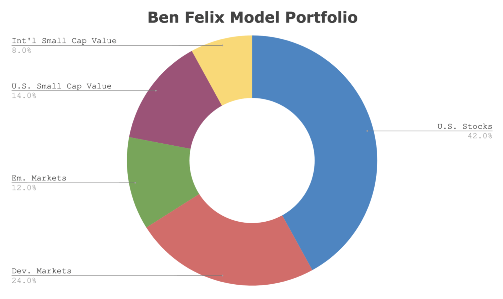

## Table of Contents

## What is the Ben Felix Model Portfolio?

The Ben Felix Model Portfolio is a set of investment ideas put together by Ben Felix, who is a popular financial expert. His portfolio is designed to help people invest their money in a smart way. It includes a mix of different types of investments like stocks, bonds, and real estate. The main goal is to help people grow their money over time while keeping risks low.

Ben Felix believes in using low-cost index funds, which are a type of investment that follows the performance of a group of assets, like all the stocks in a certain market. He suggests picking these funds based on solid research and data. His approach is all about keeping things simple and not trying to guess which stocks will do the best. Instead, he focuses on a balanced and diversified way of investing that can work well for many different people.

## Who is Ben Felix and why is his model portfolio significant?

Ben Felix is a well-known financial expert and the founder of PWL Capital, a wealth management firm in Canada. He is also famous for his YouTube channel, "The Rational Reminder Podcast," where he shares advice on investing and personal finance. Ben is known for using facts and research to help people make smart choices with their money.

The Ben Felix Model Portfolio is significant because it gives people a clear and simple way to invest their money. It focuses on low-cost index funds, which are a type of investment that spreads money across many different assets. This helps to lower the risk of losing money. Ben's approach is based on research and data, not on guessing which stocks will do well. This makes his model portfolio a helpful guide for anyone looking to grow their savings in a safe and smart way.

## What are the key components of the Ben Felix Model Portfolio?

The Ben Felix Model Portfolio is made up of different types of investments that work together to help grow your money safely. It includes a mix of stocks, bonds, and real estate. Stocks are pieces of companies that you can buy, and they can grow in value over time. Bonds are like loans you give to companies or governments, and they pay you back with interest. Real estate investments can be through funds that own properties, which can also grow in value and give you rental income.

The main idea behind Ben's portfolio is to use low-cost index funds. These are funds that follow the performance of a big group of assets, like all the stocks in a certain market. By using index funds, you spread your money across many different investments, which lowers your risk. Ben suggests choosing these funds based on good research and data, not on trying to guess which stocks will do the best. This way, his model portfolio is simple and based on facts, making it easier for anyone to invest their money wisely.

## How does the Ben Felix Model Portfolio differ from traditional investment strategies?

The Ben Felix Model Portfolio is different from traditional investment strategies because it focuses on using low-cost index funds instead of trying to pick individual stocks. Traditional strategies often involve trying to beat the market by choosing stocks that might do better than others. This can be risky and often doesn't work out well. Ben Felix's approach is to spread your money across many different assets through index funds, which helps to lower your risk and still grow your money over time.

Another big difference is that Ben Felix's model portfolio is based on solid research and data, not on guesses or feelings. Traditional investing might rely a lot on what people think will happen in the market or on tips from others. Ben's strategy uses facts to make choices, which makes it more reliable. By keeping things simple and using index funds, his portfolio can work well for many different people, without needing to spend a lot of time or money on managing their investments.

## What are the expected returns of the Ben Felix Model Portfolio?

The expected returns of the Ben Felix Model Portfolio depend on the mix of stocks, bonds, and real estate investments in it. Over the long term, you might expect to see returns that are a bit less than the overall stock market, but still good because it's spread out across many different assets. For example, if the stock market grows by about 7% each year on average, the Ben Felix Model Portfolio might aim for returns around 5% to 6%, depending on how much is in stocks, bonds, and real estate.

This lower return compared to the stock market is because the portfolio is designed to be safer. By using low-cost index funds and spreading money across different types of investments, it lowers the risk of losing a lot of money all at once. So, while the returns might not be as high as if you put all your money into stocks, the Ben Felix Model Portfolio is a good choice if you want to grow your money steadily over time without too much risk.

## How should one start investing using the Ben Felix Model Portfolio?

To start investing using the Ben Felix Model Portfolio, you first need to figure out how much risk you're okay with. This means deciding how much of your money you want to put into stocks, bonds, and real estate. Ben Felix suggests using low-cost index funds for all these types of investments. You can find these funds at places like Vanguard or iShares. Once you've chosen your mix, you can open an account with a brokerage that offers these funds and start putting your money in.

After you've set up your investments, it's important to keep an eye on them but not too closely. Ben Felix's approach is about sticking to your plan and not trying to guess what the market will do next. Every now and then, you might need to adjust your investments to keep them balanced. This means if one type of investment grows more than the others, you might sell some of it and buy more of the others to keep your mix the same. By following these steps, you can use the Ben Felix Model Portfolio to grow your money safely over time.

## What are the risks associated with the Ben Felix Model Portfolio?

The Ben Felix Model Portfolio, like any investment strategy, comes with its own set of risks. One main risk is that the overall market might go down, which means your investments could lose value. Even though the portfolio uses low-cost index funds to spread out the risk, if the whole market drops, your money will likely go down too. Another risk is that the mix of stocks, bonds, and real estate might not be right for everyone. If you need to get your money out quickly, having too much in stocks could be a problem because stocks can be more up and down than bonds.

Another thing to think about is that while the Ben Felix Model Portfolio aims for steady growth, there's no promise of how much money you'll make. Sometimes, the returns might be lower than you expect, especially if the economy is doing badly. Also, even though the portfolio uses low-cost index funds, there are still some fees to pay, which can eat into your returns over time. So, it's good to keep an eye on these costs and make sure they're not too high.

## How does the Ben Felix Model Portfolio adapt to different economic conditions?

The Ben Felix Model Portfolio is set up to work well no matter what the economy is doing. It uses a mix of stocks, bonds, and real estate, which helps it handle different economic conditions. When the economy is doing great, the stocks in the portfolio might grow a lot, helping your money grow too. But if the economy is not doing so well, the bonds and real estate parts can help keep your money safe because they don't go up and down as much as stocks.

To make sure the portfolio stays balanced, you need to check it sometimes and make small changes. If one part of your investments grows more than the others, you might sell some of it and buy more of the other parts to keep the mix the same. This way, the portfolio can keep working well even if the economy changes a lot. By sticking to this plan, you can feel more sure that your money will keep growing over time, no matter what's happening in the economy.

## Can the Ben Felix Model Portfolio be customized for individual investor needs?

Yes, the Ben Felix Model Portfolio can be changed to fit what each person wants. Everyone has different goals and how much risk they are okay with, so the portfolio can be tweaked to match those needs. For example, if someone is close to retiring and doesn't want to lose money, they might want more bonds and less stocks in their portfolio. On the other hand, a younger person who is okay with more risk might choose to have more stocks and less bonds to try to grow their money faster.

To make these changes, you can adjust the mix of stocks, bonds, and real estate in the portfolio. You can also pick different types of index funds that focus on certain parts of the market or different countries. By doing this, you can make the Ben Felix Model Portfolio work better for you, based on your own money goals and how much risk you're comfortable with.

## What historical performance data supports the Ben Felix Model Portfolio?

The Ben Felix Model Portfolio uses a mix of stocks, bonds, and real estate, which is based on the idea of spreading out your money to lower risk. Historical data shows that this kind of balanced approach can lead to steady growth over time. For example, studies have shown that a portfolio with 60% stocks and 40% bonds, similar to what Ben Felix suggests, has given average yearly returns of around 5% to 6% over the long term. This is less than just investing in stocks alone but helps avoid big drops in value during tough economic times.

Looking at specific index funds that Ben Felix recommends, like those from Vanguard or iShares, they have a good track record too. For instance, a broad stock market index fund like the Vanguard Total Stock Market Index Fund has had average yearly returns of about 7% over the last 20 years. On the other hand, a bond index fund like the Vanguard Total Bond Market Index Fund has given around 3% to 4% yearly returns in the same period. By mixing these types of funds in the right way, the Ben Felix Model Portfolio aims to give you a good balance of growth and safety, based on what history tells us.

## How does Ben Felix update and maintain his model portfolio?

Ben Felix keeps his model portfolio up to date by looking at how the investments are doing and making small changes when needed. He checks the mix of stocks, bonds, and real estate to make sure it stays balanced. If one part of the portfolio grows more than the others, he might sell some of it and buy more of the other parts to keep the mix the same. This helps the portfolio keep working well even when the market changes.

He also uses new research and data to make sure his advice is based on the latest information. Ben Felix believes in sticking to a plan and not trying to guess what the market will do next. By doing this, he keeps the portfolio simple and focused on growing your money safely over time.

## What advanced strategies can be applied to enhance the performance of the Ben Felix Model Portfolio?

To make the Ben Felix Model Portfolio work even better, you can use a strategy called tax-loss harvesting. This means selling investments that have lost value to lower your taxes, then buying similar investments to keep your portfolio balanced. Another way to boost performance is by using something called asset location. This means putting different types of investments in accounts where they will be taxed the least. For example, putting bonds in a tax-deferred account like an IRA can help you keep more of your money.

You can also look into using smart beta strategies. These are ways of picking investments that follow certain rules, like choosing stocks based on their size or how much they pay in dividends. By adding these types of investments to your portfolio, you might be able to get better returns than just using regular index funds. But remember, these strategies can make things a bit more complicated, so it's important to keep an eye on how they're working and make sure they fit with your overall plan for growing your money safely.

## References & Further Reading

[1]: ["Your Complete Guide to Factor-Based Investing"](https://www.amazon.com/Your-Complete-Guide-Factor-Based-Investing/dp/0692783652) by Andrew L. Berkin and Larry E. Swedroe

[2]: Fama, E. F., & French, K. R. (1992). ["The Cross‐Section of Expected Stock Returns."](https://www.jstor.org/stable/2329112) The Journal of Finance, 47(2), 427-465.

[3]: Carhart, M. M. (1997). ["On Persistence in Mutual Fund Performance."](https://onlinelibrary.wiley.com/doi/full/10.1111/j.1540-6261.1997.tb03808.x) The Journal of Finance, 52(1), 57-82.

[4]: Hou, K., Xue, C., & Zhang, L. (2015). ["Digesting Anomalies: An Investment Approach."](https://academic.oup.com/rfs/article/28/3/650/1574802) The Review of Financial Studies, 28(3), 650-705.

[5]: Asness, C. S., Frazzini, A., & Pedersen, L. H. (2013). ["Quality Minus Junk."](http://www.econ.yale.edu/~shiller/behfin/2013_04-10/asness-frazzini-pedersen.pdf) Working Paper.