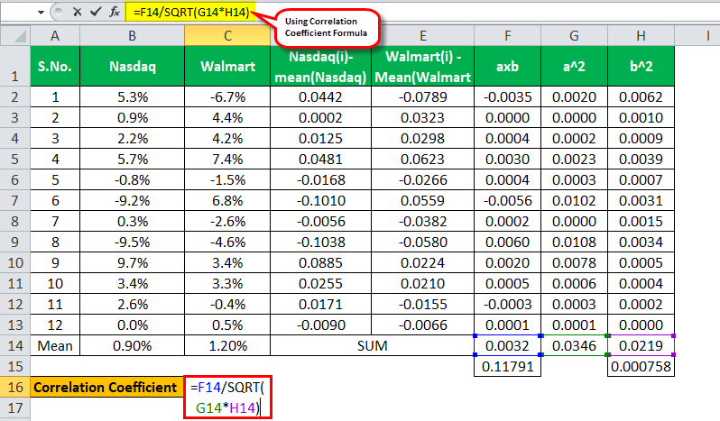

## Table of Contents

## What is a correlation value?

A correlation value is a number that tells us how two things are related to each other. It is often used in statistics to see if changes in one thing might cause changes in another thing. The value ranges from -1 to 1. If the correlation value is close to 1, it means that when one thing goes up, the other thing also goes up. If it's close to -1, it means that when one thing goes up, the other thing goes down. A value of 0 means there is no relationship between the two things.

For example, if we are looking at the correlation between the amount of time students study and their test scores, a high positive correlation value (close to 1) would suggest that students who study more tend to get higher test scores. On the other hand, if we are looking at the correlation between the amount of junk food people eat and their health, a high negative correlation value (close to -1) might suggest that people who eat more junk food tend to have worse health. Understanding correlation values helps us make better decisions and predictions based on data.

## How is correlation calculated?

Correlation is calculated using a formula called the Pearson correlation coefficient. This formula takes the data from two sets of numbers and figures out how much they move together. You start by finding the mean (average) of each set of numbers. Then, for each pair of numbers, you find the difference from their means, multiply these differences together, and add up all these products. You also need to find the square root of the sum of the squared differences from the mean for each set of numbers. Finally, you divide the sum of the products by the product of the two square roots to get the correlation value.

The formula might sound complicated, but it's just a way to measure how closely the two sets of numbers follow each other. If the numbers tend to go up and down together, the correlation will be close to 1. If one set goes up when the other goes down, the correlation will be close to -1. If there's no clear pattern, the correlation will be close to 0. This calculation helps us understand relationships in data, like how temperature might affect ice cream sales, or how exercise might relate to heart health.

## What are the different types of correlation coefficients?

There are different types of correlation coefficients that help us understand how two things are related. The most common one is the Pearson correlation coefficient. It looks at how much two sets of numbers change together in a straight line. If the numbers go up and down together, the Pearson correlation is high and positive. If one set goes up when the other goes down, it's high and negative. This type of correlation is used a lot because it's simple and works well with data that follows a straight line.

Another type is the Spearman's rank correlation coefficient. It looks at the order of the numbers instead of their exact values. It's good for data that doesn't follow a straight line and can be used when the data is not normally spread out. If the order of the numbers in both sets is similar, the Spearman's correlation will be high. This type is useful when you want to understand the general trend without needing the exact numbers to match up perfectly.

There's also the Kendall's tau coefficient, which is another way to look at the order of the numbers. It measures how often the order of the numbers in one set agrees with the order in the other set. It's good for small sets of data and can be easier to understand than Spearman's. Each type of correlation coefficient has its own use, and choosing the right one depends on the kind of data you have and what you want to learn from it.

## What does a correlation value of 0 indicate?

A correlation value of 0 means there is no relationship between the two things you are looking at. If you are studying how much time people spend exercising and their happiness levels, a correlation of 0 would mean that exercising more or less does not seem to affect how happy people are.

This does not mean that there is no connection at all between the two things. It just means that based on the data you have, you cannot see a clear pattern. Other factors might be at play, or maybe you need more or different data to see a relationship. So, a correlation of 0 tells you to keep looking or consider other ways to explore the relationship.

## How do correlation values range and what do they signify?

Correlation values range from -1 to 1. This range tells us how two things are related to each other. If the correlation value is close to 1, it means that when one thing goes up, the other thing also goes up. This is called a positive correlation. For example, the more time you study, the higher your test scores might be. If the correlation value is close to -1, it means that when one thing goes up, the other thing goes down. This is called a negative correlation. For instance, the more junk food you eat, the worse your health might be.

A correlation value of 0 means there is no clear relationship between the two things. It doesn't mean that there is no connection at all, just that you can't see a pattern with the data you have. Maybe you need more data or to look at things in a different way. Understanding these values helps us make better decisions and predictions. For example, if you know that exercise and heart health have a positive correlation, you might decide to exercise more to improve your heart health.

## What is the difference between correlation and causation?

Correlation and causation are two different things, but they can be easy to mix up. Correlation means that two things change together. For example, if ice cream sales go up when the temperature rises, we say there's a correlation between ice cream sales and temperature. But just because two things are correlated doesn't mean one causes the other. 

Causation means that one thing directly makes another thing happen. In our ice cream example, the temperature doesn't cause people to buy ice cream; it's more likely that people buy ice cream because it's hot out. To prove causation, you need to do experiments or have strong evidence. For instance, if you did a study where you made some people eat ice cream and others not, and then checked their body temperature, you might find that ice cream doesn't actually change their temperature. So, while correlation can give us clues, it's not the same as proving that one thing causes another.

## How can correlation values be used in data analysis?

Correlation values help us see how different pieces of data are related to each other. When we look at data, we often want to know if one thing affects another thing. For example, if we want to know if studying more leads to better test scores, we can use correlation values to find out. A high positive correlation value, close to 1, would show that students who study more tend to get higher scores. A high negative correlation value, close to -1, would show the opposite, like if more time spent on social media leads to lower test scores. By using correlation values, we can understand patterns in our data and make better decisions based on what we find.

Correlation values also help us decide what to study next. If we see a strong correlation between two things, it might be worth looking into more to see if there's a cause-and-effect relationship. For example, if we find a strong negative correlation between the amount of sleep people get and their stress levels, we might want to do more research to see if getting more sleep can help reduce stress. On the other hand, if we find a correlation value close to 0, it means there's no clear relationship, and we might need to look at other factors or collect more data. This way, correlation values guide us in our data analysis journey, helping us focus on what's important and what might need more attention.

## What are common misconceptions about correlation values?

One common misconception about correlation values is that if two things are correlated, one must cause the other. This is not true. Just because two things change together does not mean one makes the other happen. For example, ice cream sales and drowning incidents might both go up in the summer, but eating ice cream doesn't cause people to drown. It's important to remember that correlation is just about seeing if things change together, not about proving that one thing causes another.

Another misconception is that a correlation value of 0 means there is absolutely no relationship between the two things. While a correlation of 0 does mean there's no linear relationship, it doesn't rule out other types of relationships. There might be a different kind of pattern or connection that the correlation value doesn't show. For instance, the relationship might be more complex or depend on other factors that weren't considered in the analysis. So, a correlation of 0 should be seen as a sign to look deeper into the data, not as a final answer.

## How do you interpret correlation values in the context of statistical significance?

When you look at correlation values, you also need to think about if they are statistically significant. This means figuring out if the correlation you see in your data is likely to be true, or if it could just be a coincidence. To do this, you can use something called a p-value. If the p-value is small, usually less than 0.05, it means the correlation is probably real and not just a random thing. So, a high correlation value is good, but it's even better if it's also statistically significant.

Even if a correlation is statistically significant, it doesn't mean it's important or useful in real life. For example, you might find a small but statistically significant correlation between the number of hours people spend watching TV and their shoe size. This might be real, but it's not very useful or meaningful. So, when you interpret correlation values, you need to look at both the size of the correlation and whether it's statistically significant. This helps you understand if the relationship you see in your data is something worth paying attention to.

## What are the limitations of using correlation values in research?

Correlation values can be really helpful in research, but they have some limits. One big limit is that correlation doesn't show cause and effect. Just because two things change together doesn't mean one makes the other happen. For example, if you find that people who eat more chocolate also get better grades, it doesn't mean chocolate helps you study better. There might be other reasons, like maybe people who eat more chocolate also study more. So, you have to be careful not to think that correlation means one thing causes another.

Another limit is that correlation values only show linear relationships. This means they work best when one thing goes up as the other thing goes up, or one goes down as the other goes up, in a straight line. But not all relationships are like this. Sometimes the relationship between two things can be more complicated, like a curve or a U-shape. If you only look at the correlation, you might miss these other patterns. So, it's important to use other ways to look at your data too, to get a full picture of what's going on.

## How can advanced statistical methods improve the accuracy of correlation analysis?

Advanced statistical methods can make correlation analysis more accurate by looking at more than just simple relationships between two things. One way they do this is by using techniques like partial correlation, which lets you see the relationship between two things while taking into account other factors that might affect them. For example, if you want to know if exercise affects weight loss, partial correlation can help you see this relationship even if you also consider things like diet and age. Another way is by using multiple regression, which helps you understand how several things together affect one thing. This can give you a clearer picture of what's really going on, making your analysis more reliable.

These methods also help deal with problems like non-linear relationships and outliers. Sometimes, the relationship between two things isn't a straight line, and simple correlation might miss this. Advanced methods like non-linear regression can find these more complex patterns. Also, outliers, which are data points that are very different from the others, can mess up a simple correlation. Techniques like robust correlation can help you see the true relationship by not letting these outliers throw things off. By using these advanced methods, you can get a better, more accurate understanding of how things are related in your data.

## What are some benchmark datasets used for evaluating correlation analysis methods?

Some common datasets used to test how well correlation analysis methods work are the Anscombe's quartet and the Boston Housing dataset. Anscombe's quartet is a set of four datasets that all have the same basic statistics, like the same average and the same correlation value. But when you look at the data in a graph, you can see they are very different. This shows how important it is to look at the data in different ways, not just at the correlation number. The Boston Housing dataset has information about houses in Boston, like how many rooms they have and how old they are, and it's used to see how these things relate to the price of the house.

Another useful dataset is the Iris dataset, which has information about different types of iris flowers, like the length and width of their petals and sepals. Researchers use this dataset to test how well different methods can find relationships between these measurements and the type of iris. By using these benchmark datasets, people can see how well their correlation analysis methods work and make them better. This helps make sure the methods are good at finding the right relationships in the data.

## What is the understanding of correlation in algorithmic trading?

Correlation is a fundamental concept in [statistics](/wiki/bayesian-statistics), representing the degree to which two variables move in relation to each other. In the context of algorithmic trading, correlation analysis is crucial for constructing trading algorithms, managing risk, and optimizing portfolios. The correlation coefficient, which ranges from -1 to 1, serves as a quantitative assessment of these relationships. A coefficient of +1 indicates a perfect positive correlation, meaning that the variables in question move in exactly the same direction. Conversely, a coefficient of -1 signifies a perfect negative correlation, wherein the variables move in opposite directions.

Understanding these relationships allows traders to identify potential co-movements between assets, facilitating the development of strategies that exploit these dynamics. For instance, knowing that two stocks have a high positive correlation might suggest that simultaneous moves in the market could affect both similarly, thereby enabling more informed investment decisions.

Three primary methods are employed to calculate correlation: Pearson’s correlation coefficient, Spearman's rank correlation, and Kendall's tau.

1. **Pearson’s Correlation Coefficient**: This is the most widely used method for assessing linear relationships between two continuous variables. It is calculated as:
$$
   r = \frac{\sum (X_i - \bar{X})(Y_i - \bar{Y})}{\sqrt{\sum (X_i - \bar{X})^2 \sum (Y_i - \bar{Y})^2}}

$$

   where $X_i$ and $Y_i$ are the data points, and $\bar{X}$ and $\bar{Y}$ are the means of $X$ and $Y$ respectively. Pearson's correlation is particularly effective where a linear relationship is expected, though it may be less reliable for non-linear associations.

2. **Spearman’s Rank Correlation**: This non-parametric test measures the strength and direction of association between two ranked variables. It is used when data do not necessarily follow a normal distribution or are measured on an ordinal scale. The formula is:
$$
   r_s = 1 - \frac{6 \sum d_i^2}{n(n^2 - 1)}

$$

   where $d_i$ is the difference between the ranks of corresponding variables, and $n$ is the number of observations. Spearman's rank is robust to outliers and does not assume normal distribution, making it versatile for various data types.

3. **Kendall’s Tau**: Also non-parametric, Kendall’s tau assesses the strength of association between two measured quantities. It counts the number of concordant and discordant pairs:
$$
   \tau = \frac{(C - D)}{\frac{1}{2}n(n-1)}

$$

   where $C$ is the number of concordant pairs and $D$ is the number of discordant pairs. This method is particularly useful when the data set is small or contains many tied ranks.

Each of these methods comes with its own set of strengths and limitations. Pearson’s method requires interval data and assumes normal distribution, potentially limiting its applicability in certain datasets. Spearman’s rank and Kendall’s tau, with their non-parametric nature, are more flexible, allowing for the analysis of ordinal data or data with outliers. Understanding these various techniques enables traders to select the most suitable approach based on the specific characteristics of their data.

In [algorithmic trading](/wiki/algorithmic-trading), employing these correlation techniques can aid in developing robust trading algorithms that take into account interdependencies between financial assets, refining portfolio construction, and enhancing risk management protocols.

## What is the Benchmark Statistical Analysis for Correlation Values?

A benchmark for correlation values serves as a reference point for measuring the correlation of financial metrics, providing a crucial tool for investors and portfolio managers in assessing portfolio characteristics. Commonly utilized benchmarks include beta and R-squared, which are valuable in understanding both portfolio [volatility](/wiki/volatility-trading-strategies) in relation to the market and the explanatory power of a statistical model, respectively.

**Beta as a Benchmark**

Beta ($\beta$) is a measure of a security's sensitivity to movements in the overall market. It is calculated as the covariance between the returns of the asset and the returns of the market, divided by the variance of the market returns. The formula for beta is:

$$
\beta = \frac{\text{Cov}(R_i, R_m)}{\text{Var}(R_m)}
$$

Where:
- $R_i$ represents the return of the asset.
- $R_m$ denotes the return of the market.
- Cov stands for covariance.
- Var signifies variance.

A beta greater than one indicates that the asset is more volatile than the market, while a beta less than one suggests less volatility. Through this metric, investors can gauge how much risk they are taking relative to the market. Portfolio managers use beta to align their portfolios in accordance with market movements, aiming for desired levels of exposure and potential returns.

**R-squared as a Benchmark**

R-squared ($R^2$) measures the proportion of variance in the dependent variable that is predictable from the independent variable(s) in a regression model. It ranges from 0 to 1, where a value closer to 1 indicates a strong correlation, implying that a high percentage of variance is explained by the model. The formula for $R^2$ is:

$$
R^2 = 1 - \frac{\sum (y_i - \hat{y}_i)^2}{\sum (y_i - \bar{y})^2}
$$

Where:
- $y_i$ represents the actual data points.
- $\hat{y}_i$ are the predicted data points from the model.
- $\bar{y}$ is the mean of the observed data.

R-squared is instrumental in assessing how well a model replicates the observed outcomes. In financial applications, it helps portfolio managers evaluate the alignment of a portfolio's performance with market indices, facilitating insights into how well tactical positions adhere to strategic objectives.

**Application in Strategic Investment Decisions**

Accurate benchmarking with beta and R-squared allows portfolio managers to make informed decisions about possible adjustments. By understanding the volatility through beta and the alignment of performance via R-squared, managers can anticipate necessary rebalancing to mitigate risks or capitalize on prospective growth opportunities. This foresight, enabled by statistical benchmarks, aids in projecting future portfolio performance and strategically positioning investments in line with market conditions.

Incorporating these benchmarks effectively into investment practices promotes more robust portfolio management, thereby enhancing the capability to respond swiftly to market shifts. This methodology enables long-term alignment with financial goals and supports operational strategies integrating both predictive analysis and reactive adjustments.

## References & Further Reading

[1]: Bergstra, J., Bardenet, R., Bengio, Y., & Kégl, B. (2011). ["Algorithms for Hyper-Parameter Optimization."](https://dl.acm.org/doi/10.5555/2986459.2986743) Advances in Neural Information Processing Systems 24.

[2]: ["Advances in Financial Machine Learning"](https://www.amazon.com/Advances-Financial-Machine-Learning-Marcos/dp/1119482089) by Marcos Lopez de Prado

[3]: ["Evidence-Based Technical Analysis: Applying the Scientific Method and Statistical Inference to Trading Signals"](https://www.amazon.com/Evidence-Based-Technical-Analysis-Scientific-Statistical/dp/0470008741) by David Aronson

[4]: ["Machine Learning for Algorithmic Trading"](https://github.com/stefan-jansen/machine-learning-for-trading) by Stefan Jansen

[5]: ["Quantitative Trading: How to Build Your Own Algorithmic Trading Business"](https://www.amazon.com/Quantitative-Trading-Build-Algorithmic-Business/dp/1119800064) by Ernest P. Chan