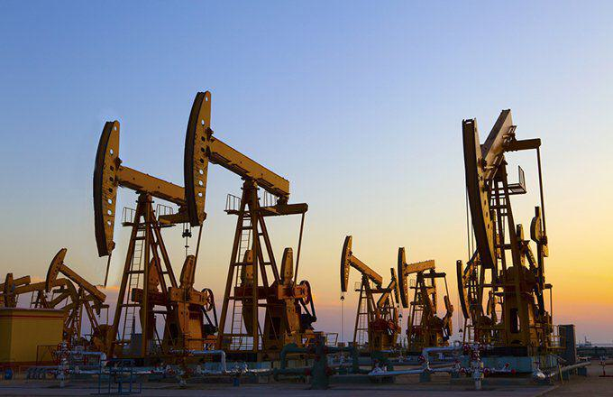

## Table of Contents

## What is benchmark crude oil?

Benchmark crude oil is a specific type of crude oil that is used as a standard for pricing other types of crude oil around the world. It is like a reference point that helps people in the oil industry understand the value of different oils. The most well-known benchmark crude oils are West Texas Intermediate (WTI) and Brent Crude. These benchmarks are important because they help traders, buyers, and sellers agree on prices easily, even if they are talking about different types of oil.

WTI is produced in the United States, mainly in Texas, and is known for its high quality. It is light and sweet, which means it has low sulfur content and is easier to refine into gasoline and other products. Brent Crude, on the other hand, comes from the North Sea and is also light and sweet. It is used as a benchmark for about two-thirds of the world's oil. Both WTI and Brent Crude are traded on major stock exchanges, and their prices are watched closely by people all over the world to understand the general trends in the oil market.

## Why is benchmark crude oil important in the oil industry?

Benchmark crude oil is really important in the oil industry because it helps everyone know what different types of oil are worth. Imagine you want to buy or sell oil, but there are many different kinds. It would be hard to agree on a price without a common reference. That's where benchmark crude oil comes in. It's like a standard that everyone can use to compare other oils. For example, if you know the price of West Texas Intermediate (WTI) or Brent Crude, you can figure out the price of other oils based on how they compare to these benchmarks.

These benchmarks, like WTI and Brent Crude, are used all over the world. They help make trading oil easier and more organized. When people in the oil industry talk about prices, they often use these benchmarks as a starting point. This way, even if they are in different countries and dealing with different types of oil, they can still understand each other and agree on prices. So, benchmark [crude oil](/wiki/crude-oil) is a big deal because it helps keep the global oil market running smoothly.

## What are the most commonly used benchmark crude oils?

The most commonly used benchmark crude oils are West Texas Intermediate (WTI) and Brent Crude. WTI comes from the United States, mostly from Texas. It is known for being light and sweet, which means it has low sulfur and is easy to turn into gasoline and other products. WTI is a big deal in North America and is traded on the New York Mercantile Exchange. People all over the world watch its price to understand what's happening in the oil market.

Brent Crude is another very important benchmark. It comes from the North Sea, off the coast of the United Kingdom and Norway. Like WTI, Brent Crude is also light and sweet. It is used as a benchmark for pricing about two-thirds of the world's oil. Brent Crude is traded on the Intercontinental Exchange in London, and its price is closely watched by people everywhere to get a sense of global oil prices. Both WTI and Brent Crude help everyone in the oil industry agree on prices and understand the market better.

## How is the price of benchmark crude oil determined?

The price of benchmark crude oil, like West Texas Intermediate (WTI) and Brent Crude, is determined by what people are willing to pay for it on the open market. This happens on big exchanges like the New York Mercantile Exchange for WTI and the Intercontinental Exchange in London for Brent Crude. Traders buy and sell these oils all day, and the price changes based on how much they want to buy or sell at any given time. If more people want to buy the oil than sell it, the price goes up. If more people want to sell it than buy it, the price goes down. It's a bit like a big auction that never stops.

Many things can affect the price of benchmark crude oil. For example, if there's news about a big storm that might stop oil from being produced, the price might go up because people think there will be less oil available. Or, if a big country like the United States says it will produce more oil, the price might go down because people think there will be more oil to go around. Other things that can change the price include how much oil countries like Saudi Arabia decide to produce, how strong the world's economy is, and even what people think might happen in the future. All these factors come together to decide the price of benchmark crude oil every day.

## What factors influence the price of benchmark crude oil?

The price of benchmark crude oil like West Texas Intermediate (WTI) and Brent Crude is influenced by many things. One big [factor](/wiki/factor-investing) is how much oil is being produced around the world. If countries like Saudi Arabia or Russia decide to produce more oil, there will be more oil available, and the price might go down. On the other hand, if there's a problem like a big storm that stops oil from being produced, the price might go up because there's less oil to go around. Another factor is how strong the world's economy is. When the economy is doing well, people use more oil, and the price can go up. If the economy is not doing well, people use less oil, and the price can go down.

Another thing that can change the price of benchmark crude oil is what people think might happen in the future. If people think there will be more oil available in the future, they might not want to buy oil now, and the price can go down. If they think there will be less oil in the future, they might want to buy more oil now, and the price can go up. Political events can also affect the price. For example, if there's a war or a big change in a country that produces a lot of oil, it can make the price go up or down. All these things together make the price of benchmark crude oil change every day.

## How does benchmark crude oil affect global oil markets?

Benchmark crude oil, like West Texas Intermediate (WTI) and Brent Crude, is really important because it helps everyone in the global oil markets agree on prices. Imagine you want to buy or sell oil, but there are many different kinds. It would be hard to know what to pay without a common reference. That's where benchmark crude oil comes in. It's like a standard that everyone can use to compare other oils. For example, if you know the price of WTI or Brent Crude, you can figure out the price of other oils based on how they compare to these benchmarks. This makes trading oil easier and more organized all over the world.

The price of benchmark crude oil can also affect the whole global oil market. If the price of WTI or Brent Crude goes up, it can make the price of all kinds of oil go up. This happens because people all over the world watch these prices and use them to decide what to pay for other oils. If the price goes down, it can make the price of other oils go down too. Many things can change the price of benchmark crude oil, like how much oil is being produced, how strong the world's economy is, and what people think might happen in the future. All these things together make the price of benchmark crude oil change every day, and that affects the whole global oil market.

## What is the difference between WTI and Brent crude oils?

West Texas Intermediate (WTI) and Brent Crude are both types of benchmark crude oil, but they come from different places and have some differences. WTI comes from the United States, mostly from Texas. It's known for being light and sweet, which means it has low sulfur and is easy to turn into gasoline and other products. WTI is a big deal in North America and is traded on the New York Mercantile Exchange. People all over the world watch its price to understand what's happening in the oil market.

Brent Crude, on the other hand, comes from the North Sea, off the coast of the United Kingdom and Norway. Like WTI, Brent Crude is also light and sweet. It's used as a benchmark for pricing about two-thirds of the world's oil. Brent Crude is traded on the Intercontinental Exchange in London, and its price is closely watched by people everywhere to get a sense of global oil prices. While both oils are important, Brent Crude is often considered the more global benchmark because it's used to price oil in more parts of the world than WTI.

## How are other crude oils priced relative to benchmark crude oils?

Other crude oils are priced relative to benchmark crude oils like West Texas Intermediate (WTI) and Brent Crude by using them as a reference point. If you want to know the price of another type of oil, you start with the price of the benchmark oil and then add or subtract money based on how the other oil compares to the benchmark. For example, if the other oil is heavier or has more sulfur, it might be worth less than the benchmark oil, so you would subtract money from the benchmark price. If the other oil is lighter or has less sulfur, it might be worth more, so you would add money to the benchmark price.

This way of pricing other oils helps everyone in the oil industry agree on prices easily, even if they are talking about different types of oil. Traders, buyers, and sellers all over the world use the prices of WTI and Brent Crude to figure out what to pay for other oils. This makes trading oil easier and more organized because everyone is using the same starting point to compare prices.

## What role do futures and options play in the trading of benchmark crude oil?

Futures and options are important tools that people use when trading benchmark crude oil like WTI and Brent Crude. Futures are contracts that let people agree to buy or sell oil at a certain price on a certain day in the future. This helps traders and companies plan ahead and protect themselves from big changes in oil prices. For example, if a company thinks the price of oil will go up, they can buy a futures contract now to lock in a lower price for the future. On the other hand, if they think the price will go down, they can sell a futures contract to make sure they get a higher price now.

Options are a bit different. They give people the right, but not the obligation, to buy or sell oil at a certain price before a certain date. This means you can choose whether or not to use the option, which can be really helpful if you're not sure what will happen with oil prices. For example, if you buy an option to buy oil at a certain price, and the price goes up, you can use the option to buy the oil at the lower price you agreed on. But if the price goes down, you can just let the option expire and buy the oil at the lower market price. Futures and options together help make the trading of benchmark crude oil more flexible and less risky.

## How do geopolitical events impact benchmark crude oil prices?

Geopolitical events can really shake up the price of benchmark crude oil like WTI and Brent Crude. When there's trouble in a country that produces a lot of oil, like a war or a big change in government, it can make people worried about how much oil will be available. If they think there will be less oil because of the trouble, the price can go up. For example, if there's fighting in the Middle East, where a lot of oil comes from, people might start buying more oil now to make sure they have enough, and that can push the price higher.

On the other hand, if a big oil-producing country decides to make more oil because of political reasons, like wanting to help the world economy, the price can go down. For instance, if Saudi Arabia says it will produce more oil to help keep prices low, that can make the price of benchmark crude oil drop. Geopolitical events are always watched closely by people in the oil industry because they can change the price of oil very quickly and in big ways.

## What are the historical trends in benchmark crude oil pricing?

Over the years, the price of benchmark crude oils like WTI and Brent Crude has gone up and down a lot. In the 1970s, there were big jumps in oil prices because of events like the oil embargo by OPEC countries. This made the price of oil go way up because there was less oil available. After that, in the 1980s and 1990s, oil prices were generally lower and more stable. But then, in the early 2000s, oil prices started to go up again because the world was using more oil and there were worries about where the oil was coming from. By 2008, the price of oil hit a high point, but then it crashed because of the global financial crisis.

In the 2010s, oil prices had some big ups and downs. At the start of the decade, prices were high because of growing demand from countries like China. But then, in 2014, prices fell a lot because there was too much oil being produced, especially from new sources like shale oil in the United States. Prices stayed low for a while, but then started to go up again in 2016. More recently, events like the COVID-19 pandemic in 2020 caused oil prices to drop again because people were not traveling as much and using less oil. But as the world started to recover, oil prices began to climb back up. These ups and downs show how many different things can affect the price of benchmark crude oil over time.

## How can traders and investors use benchmark crude oil data to make informed decisions?

Traders and investors can use benchmark crude oil data to make smart choices by watching the prices of oils like WTI and Brent Crude. These prices give them a good idea of what's happening in the oil market. For example, if the price of WTI goes up a lot, it might mean there's less oil available or that people are worried about future supplies. Traders can use this information to decide whether to buy or sell oil. If they think the price will keep going up, they might buy oil now to sell it later at a higher price. If they think the price will go down, they might sell their oil now to avoid losing money later.

Investors can also use benchmark crude oil data to plan their investments. They can look at the price trends over time to see if oil is a good investment. For instance, if the price of Brent Crude has been going up steadily, it might be a good time to invest in oil companies or oil-related stocks. They can also use futures and options to protect their investments from big price changes. By keeping an eye on benchmark crude oil data, investors can make better decisions about when to buy or sell, helping them make more money and avoid big losses.

## References & Further Reading

[1]: Platts. ["Crude Oil Prices Today | OilPrice.com"](https://oilprice.com/)

[2]: EIA. ["What are the Benchmarks Used in Oil Pricing?"](https://www.eia.gov/dnav/pet/PET_PRI_SPT_S1_D.htm)

[3]: Investopedia. ["Algorithmic Trading Definition"](https://www.investopedia.com/terms/a/algorithmictrading.asp)

[4]: Y. Gurbuz, N. Catik, & A. Ozden. (2020). ["The Role of Benchmark Crude Prices in Forecasting: A Comparison Between Brent, WTI, and Dubai Prices."](https://www.researchgate.net/publication/338948834_The_Role_of_Benchmark_Crude_Prices_in_Forecasting_A_Comparison_Between_Brent_WTI_and_Dubai_Prices) International Journal of Energy Economics and Policy.

[5]: "Trading Crude Oil: Forecasts, Opportunities and Findings". World Scientific Publishing Company.