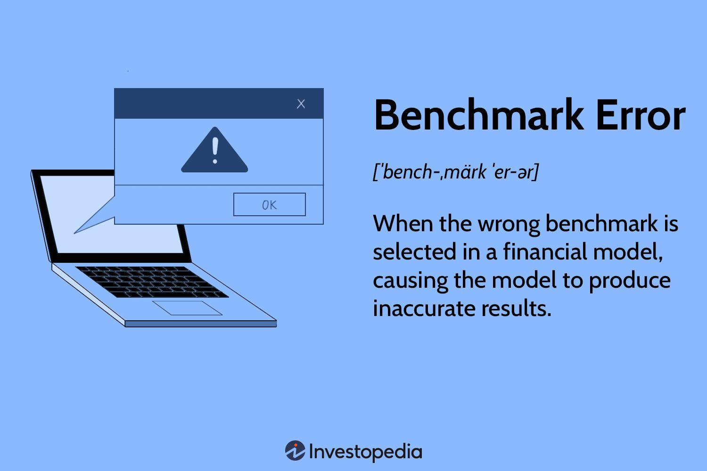

## Table of Contents

## What is a benchmark error?

A benchmark error is a mistake or difference that happens when we compare something to a standard or a reference point. This standard is called a benchmark. For example, if we are measuring how fast a computer can do a task, we might compare it to a benchmark computer. If our computer is slower than the benchmark, the difference between the two is the benchmark error.

Benchmark errors can happen for many reasons. Sometimes, the way we measure things can be off, or the benchmark itself might not be perfect. It's important to understand these errors because they help us know how reliable our comparisons are. By knowing the benchmark error, we can make better decisions about whether something meets our standards or not.

## Why is it important to understand benchmark errors?

Understanding benchmark errors is important because it helps us know how trustworthy our comparisons are. When we compare something to a benchmark, we want to be sure that our results are accurate. If we don't understand the errors, we might think something is better or worse than it really is. This can lead to bad decisions, like choosing the wrong computer or thinking a student did better or worse on a test than they actually did.

Knowing about benchmark errors also helps us improve our methods. If we see that our errors are too big, we can try to find better ways to measure things or choose a different benchmark. This way, our comparisons become more reliable over time. Understanding these errors makes our decisions more informed and helps us trust the results we get from our comparisons.

## How can benchmark errors impact performance measurements?

Benchmark errors can make performance measurements less accurate. If the errors are big, it might look like something is performing much better or worse than it really is. For example, if a computer is compared to a benchmark and there's a big error, we might think it's slower or faster than it actually is. This can lead to wrong decisions, like choosing a computer that isn't as good as we thought.

Understanding and reducing benchmark errors can help make performance measurements more reliable. When we know the errors, we can take them into account and adjust our results. This way, we get a better idea of true performance. For instance, if we know a test has a certain error, we can correct for it and get a more accurate score. This helps us make better choices and trust our performance data more.

## What are common sources of benchmark errors?

Benchmark errors can come from many places. One common source is the way we measure things. If our tools or methods aren't perfect, they can give us wrong information. For example, if a stopwatch isn't working right, it might make a race seem shorter or longer than it really is. Another source is the benchmark itself. Sometimes, the standard we're comparing to might not be the best choice. If we use an old computer as a benchmark for a new one, the results might not be fair because the old computer can't do as much.

Another source of benchmark errors is the environment. The place where we do the test can affect the results. For example, if we're testing how fast a car can go, doing it on a windy day can slow it down. People can also cause errors. If someone doing the test makes a mistake, like starting the timer too late, it can mess up the results. Understanding these sources helps us know why errors happen and how to fix them.

## Can you explain the difference between systematic and random benchmark errors?

Systematic benchmark errors happen in a regular way. They affect all the measurements in the same way, making them all too high or too low. For example, if a scale always shows 2 pounds more than the true weight, that's a systematic error. These errors come from things like a problem with the tool you're using or always doing the test in the same wrong way. Knowing about systematic errors can help you fix them, like by adjusting the scale or changing your method.

Random benchmark errors, on the other hand, happen without a pattern. They make the measurements go up and down in an unpredictable way. For example, if you're measuring the time it takes to run a race and the wind changes each time, that's a random error. These errors can come from things like changes in the environment or small mistakes that happen by chance. Because they're unpredictable, random errors are harder to fix, but you can reduce their impact by doing the test many times and taking an average.

## How do you identify benchmark errors in data?

To identify benchmark errors in data, you need to look at how your measurements compare to the benchmark. If your results are always off by the same amount, you might have a systematic error. For example, if every time you measure the speed of a computer, it's always 10% slower than the benchmark, there could be a problem with your testing method or tool. You can spot these errors by checking if the difference between your results and the benchmark stays the same over many tests.

Random errors are trickier because they don't follow a pattern. You can identify them by seeing if your measurements jump around a lot. If you test a car's speed on different days and the results vary a lot, even though the car hasn't changed, you might have random errors. These could be caused by things like weather changes or small mistakes during the test. To find random errors, you can do the test many times and see if the results spread out a lot.

Understanding both types of errors helps you know how reliable your data is. If you find systematic errors, you can fix them by adjusting your tools or methods. For random errors, doing more tests and taking an average can help reduce their impact. By identifying and dealing with benchmark errors, you can make your comparisons more accurate and trust your data more.

## What are some strategies to minimize benchmark errors?

To minimize benchmark errors, it's important to use good tools and methods. Make sure your tools are working right and are the best ones for the job. For example, if you're measuring time, use a good stopwatch. Also, try to do the test the same way every time. If you're testing a computer, use the same software and settings each time. This helps reduce systematic errors, which are mistakes that happen the same way every time. If you find a systematic error, like a scale that's always off by 2 pounds, you can fix it by adjusting the scale or changing your method.

Another way to minimize benchmark errors is to do the test many times. This helps with random errors, which are mistakes that happen without a pattern. For example, if you're testing how fast a car can go, do it on different days and in different weather. Then, take the average of all your results. This way, the random errors balance out, and you get a more accurate result. Also, try to control the environment as much as you can. If you're testing a computer, make sure it's in the same room with the same temperature each time. By doing these things, you can make your benchmark results more reliable and trust them more.

## Can you provide examples of benchmark errors in different industries?

In the tech industry, benchmark errors can happen when testing how fast computers work. For example, if a company uses an old computer as a benchmark to test a new one, the results might not be fair. The old computer might be slower because it's outdated, making the new computer look better than it really is. Another example is if the test is done in a hot room, which can make the computer slow down. This can make it seem like the computer is not as good as it really is. By understanding these errors, tech companies can choose better benchmarks and control the testing environment to get more accurate results.

In the sports industry, benchmark errors can affect how athletes are judged. For example, if a stopwatch used to time a race is not working right, it might show a time that's too fast or too slow. This can make it seem like an athlete did better or worse than they really did. Another example is if a swimming race is held in a pool that's not the right length, the times will be off. This can lead to wrong results and unfair judgments. By using good tools and making sure the conditions are right, sports organizations can reduce these errors and make sure the results are fair.

In the education industry, benchmark errors can impact how students are graded. For example, if a test is used as a benchmark to measure student performance, but the test has questions that are too hard or too easy, it might not show what students really know. This can make it seem like a student did better or worse than they actually did. Another example is if the grading is not consistent, with different teachers grading the same test differently. This can lead to unfair grades. By using well-designed tests and making sure grading is consistent, schools can reduce these errors and get a better picture of student performance.

## How do statistical methods help in analyzing benchmark errors?

Statistical methods help us understand benchmark errors by showing us how big and common they are. When we do a lot of tests, we can use statistics to see if our errors happen in a pattern or if they are random. For example, we can use something called standard deviation to see how spread out our results are. If the standard deviation is big, it means our results are all over the place, which can show us that we have a lot of random errors. By looking at these numbers, we can tell if our benchmark is good or if we need to change how we do our tests.

Another way statistics help is by letting us fix our errors. If we find systematic errors, like always getting results that are too high, we can use statistical methods to adjust our results. For example, if we know our scale is always off by 2 pounds, we can subtract 2 pounds from all our measurements. This makes our results more accurate. Also, by doing a lot of tests and taking the average, we can reduce the impact of random errors. This way, we get a better idea of what the true performance is, and we can trust our benchmark results more.

## What advanced techniques exist for correcting benchmark errors?

One advanced technique for correcting benchmark errors is called regression analysis. This method helps us find patterns in our data and correct for systematic errors. For example, if we notice that our computer speed tests are always a bit slower than they should be, we can use regression analysis to figure out by how much and then adjust our results to be more accurate. This technique looks at how different factors, like temperature or software settings, affect our tests and helps us make the right corrections.

Another technique is called Monte Carlo simulation. This method uses random numbers to run many different versions of a test. By doing this, we can see how random errors affect our results and find a way to reduce them. For example, if we're testing how fast a car can go, we can use Monte Carlo simulation to see how different weather conditions might change the results. This helps us understand the range of possible errors and make our benchmark results more reliable by taking an average of all the simulations.

## How do benchmark errors affect the validity of comparative studies?

Benchmark errors can make comparative studies less valid because they can make the results seem different from what they really are. If there are big errors, it might look like one thing is a lot better or worse than another, even if that's not true. For example, if a study compares the speed of two computers but has a lot of errors, it might say one computer is faster when they are actually the same. This can lead to wrong conclusions and decisions, like choosing the wrong computer or thinking a medicine works better than it does.

Understanding and fixing benchmark errors is important for making comparative studies more valid. By finding and correcting these errors, we can make our comparisons more accurate and trust our results more. For example, if we know our test has a systematic error, we can adjust for it and get a better idea of the true performance. If we do the test many times and take an average, we can reduce random errors and make our study more reliable. This way, the results of comparative studies can be more trustworthy and useful for making decisions.

## What are the latest research findings on managing benchmark errors?

Recent research has shown that using machine learning can help manage benchmark errors better. Scientists have found that machine learning can spot patterns in data that might be hard to see otherwise. For example, if there's a small mistake that happens over and over, machine learning can find it and help fix it. This means that by using computers to learn from the data, we can make our benchmarks more accurate and trust our results more.

Another finding from recent studies is that doing more tests in different conditions can help reduce benchmark errors. Researchers have found that if you test something many times and in different ways, you can see how much the results change. This helps you understand what might be causing errors, like changes in the environment or small mistakes. By doing this, you can take the average of all the tests and get a result that's closer to the truth. This way, benchmark errors can be managed better, making our comparisons more reliable.

## What is the role of financial analysis in algorithmic trading?

Financial analysis plays a critical role in algorithmic trading by assessing trading strategies through quantitative tools. This process aims to optimize automated trading systems to ensure consistent profitability while effectively managing associated risks.

Return on investment (ROI) is a fundamental metric in evaluating trading strategies. It measures the gain or loss generated relative to the amount invested. In algorithmic trading, ROI is crucial for determining the success of a particular strategy over a given period. The formula for ROI is:

$$
\text{ROI} = \left( \frac{\text{Net Profit}}{\text{Investment Cost}} \right) \times 100
$$

Risk-adjusted performance metrics such as the Sharpe Ratio are essential in [algorithmic trading](/wiki/algorithmic-trading). The Sharpe Ratio evaluates a strategy's returns relative to its risk, offering insights into the efficiency of risk-taking activities. It is computed as:

$$
\text{Sharpe Ratio} = \frac{E[R] - R_f}{\sigma}
$$

where $E[R]$ is the expected return, $R_f$ is the risk-free rate, and $\sigma$ is the standard deviation of the excess return. A high Sharpe Ratio indicates a more favorable risk-adjusted return, making the strategy more attractive.

Another crucial [factor](/wiki/factor-investing) in the analysis is market [volatility](/wiki/volatility-trading-strategies), which impacts trading strategy performance. Volatility refers to the degree of variation in asset prices over time. In algorithmic trading, understanding and adapting to changes in volatility can enhance the robustness of trading strategies. High volatility can present opportunities for profit but also increases risk; thus, strategies often include volatility-adjusted risk management tools.

Algorithmic trading systems may incorporate these metrics and models to refine trade execution and decision-making processes. Python, a preferred programming language for quantitative analysis, can be employed to implement these formulas and perform data analysis. For example:

```python
def calculate_roi(net_profit, investment_cost):
    return (net_profit / investment_cost) * 100

def calculate_sharpe_ratio(expected_return, risk_free_rate, std_dev):
    return (expected_return - risk_free_rate) / std_dev
```

By leveraging such quantitative tools, traders can modify algorithmic systems to react promptly to market conditions, thereby achieving strategic objectives of consistent profitability and managed risk exposure.

## What is the impact of benchmark error on financial models?

Benchmark error occurs when an inappropriate or suboptimal reference index is chosen for evaluating the performance of a financial portfolio. This error can significantly distort the assessment of an investment's success and subsequently lead to misguided strategic decisions. A benchmark serves as a standard against which the performance of a portfolio or asset is measured. When the selected benchmark does not accurately represent the investment strategy or asset class, it results in discrepancies that can mislead investors about a portfolio's relative performance.

A primary consequence of benchmark error is that it can produce misleading performance metrics. For instance, if a portfolio manager selects an index that is not representative of the portfolio's asset composition or investment style, the calculated performance may appear better or worse than it actually is. This misalignment can skew the results of key performance metrics such as alpha and beta, which are used to evaluate the excess return on an investment relative to the benchmark and its sensitivity to market movements, respectively.

Moreover, using an incorrect benchmark can contribute to style drift, which occurs when a portfolio's investment approach deviates from its stated objectives or style. Portfolio managers who are unaware of the benchmark error may inadvertently adjust their strategy to chase perceived performance metrics, leading to strategic misalignment and potential risk exposure that was not intended by the original investment mandate.

To mitigate benchmark error, it is essential to perform a comprehensive analysis when selecting a benchmark. The chosen index should closely reflect the investment universe of the portfolio, including its asset allocation, geographical distribution, and sectoral alignment. This alignment ensures that performance evaluations are accurate and meaningful.

Mathematically, the impact of benchmark error can be represented in the context of calculating portfolio return against a reference index. Suppose $R_p$ is the return of the portfolio, and $R_b$ is the return of the benchmark. The error can be quantified as:

$$
\text{Error} = R_p - R_{b_{\text{actual}}}
$$

where $R_{b_{\text{actual}}}$ is the return of the appropriate benchmark, which ideally should be used instead of $R_b$. Deviations in this calculation highlight the potential impact of selecting a suboptimal benchmark.

In practice, financial tools and analytics platforms play a crucial role in ensuring the correct benchmark is selected. Tools capable of extensive historical data analysis and factor modeling help identify an appropriate benchmark, thereby minimizing the risk of errors and enhancing the accuracy of investment performance evaluations. These practices enable investors to maintain alignment with investment goals and optimize their financial strategies effectively.

## What is the role of tracking error in portfolio management?

Tracking error is a critical measure in portfolio management that gauges how closely a portfolio tracks its benchmark index. This metric is instrumental in assessing both active and passive fund management strategies. 

In essence, tracking error quantifies the standard deviation of the difference between the portfolio's returns and the benchmark's returns. Mathematically, it can be expressed as:

$$
\text{Tracking Error} = \sqrt{\frac{1}{n} \sum_{i=1}^{n} (R_{p,i} - R_{b,i})^2}
$$

where $R_{p,i}$ is the return of the portfolio, $R_{b,i}$ is the return of the benchmark, and $n$ is the number of periods.

**High Tracking Error in Active Management:**

Active fund management typically exhibits a high tracking error, reflecting significant deviations from the benchmark index. This is because active managers deliberately take positions that differ from the index to generate higher returns. Active managers aim to outperform the benchmark through security selection and market timing, which inevitably results in a divergence from the benchmark's performance. 

**Low Tracking Error in Passive Strategies:**

Conversely, passive fund management is characterized by a low tracking error, as these funds aim to replicate the performance of a benchmark index. Passive strategies, such as index funds and ETFs, seek to mirror the benchmark by holding a similar composition of assets, ensuring minimal deviation. A low tracking error indicates effective index replication and is often desirable in passive investing to maintain alignment with the investment goals.

**Managing Tracking Error:**

Efficient management of tracking error involves systematic adjustments to the portfolio to ensure optimal alignment with the benchmark. This includes continuous rebalancing to address deviations caused by market movements, changes in asset prices, or corporate actions. Fund managers employ various techniques and tools, such as derivative instruments and optimization algorithms, to control tracking error within acceptable limits.

For instance, a Python-based approach to manage tracking error might involve using an optimization library to minimize the deviation between portfolio and benchmark returns:

```python
import numpy as np
from scipy.optimize import minimize

def tracking_error(weights, portfolio_returns, benchmark_returns):
    return np.sqrt(np.mean((portfolio_returns @ weights - benchmark_returns) ** 2))

# Example data
portfolio_returns = np.array([...])  # Portfolio returns
benchmark_returns = np.array([...])  # Benchmark returns
initial_weights = np.ones(portfolio_returns.shape[1]) / portfolio_returns.shape[1]  # Equal weights

# Optimization to find the weights that minimize tracking error
result = minimize(tracking_error, initial_weights, args=(portfolio_returns, benchmark_returns), bounds=[(0, 1)]*len(initial_weights))

optimal_weights = result.x
```

Through prudent management of tracking error, fund managers can enhance portfolio performance by effectively aligning investment strategies with client objectives while maintaining a consistent relationship with the benchmark index.

## What are the key metrics for evaluating algorithmic trading strategies?

Evaluating the effectiveness of algorithmic trading strategies is a critical aspect of financial analysis in trading. Various metrics are utilized to assess the performance, profitability, and risk management properties of trading algorithms. Among these, the Sharpe ratio, win rate, and maximum drawdown are prominent indicators that collectively provide insights into the risk-adjusted performance and financial viability of trading strategies.

### Sharpe Ratio
The Sharpe ratio measures the risk-adjusted return of an investment strategy. It is calculated using the formula:

$$
\text{Sharpe Ratio} = \frac{E[R_p - R_f]}{\sigma_p}
$$

where $E[R_p - R_f]$ is the expected return of the portfolio in excess of the risk-free rate, and $\sigma_p$ is the standard deviation of the portfolio's excess return. A higher Sharpe ratio indicates a more favorable risk-adjusted return, suggesting that the algorithmic strategy is more efficient in converting risk into returns.

### Win Rate
Win rate represents the proportion of winning trades to the total number of trades executed by the algorithm. It is expressed as:

$$
\text{Win Rate} = \frac{\text{Number of Winning Trades}}{\text{Total Number of Trades}}
$$

A high win rate indicates a predominance of successful trades, although it should be interpreted with caution, as it does not account for the size of gains versus losses. Analyzing the win rate alongside profitability metrics ensures a balanced view of the trading strategy's effectiveness.

### Maximum Drawdown
Maximum drawdown defines the largest peak-to-trough decline observed in the portfolio's value over a specified period. It is a critical measure of downside risk, indicating the potential losses an investor could face. The formula is:

$$
\text{Maximum Drawdown} = \frac{\text{Peak Value} - \text{Trough Value}}{\text{Peak Value}}
$$

This metric highlights the vulnerability of a trading strategy to significant losses, and lower maximum drawdown values are preferred as they imply better risk control.

### Balancing Metrics for Effective Strategies
Traders must strike a balance between these metrics to devise strategies that are both effective and profitable while mitigating risks. A high Sharpe ratio may lose significance if accompanied by a high maximum drawdown, indicating that potential returns are offset by excessive risk. Similarly, a high win rate is more meaningful when the average gains per winning trade significantly outweigh the average losses per losing trade. 

For a comprehensive evaluation, traders are encouraged to incorporate these metrics into a broader risk management framework, considering other indicators like volatility, [liquidity](/wiki/liquidity-risk-premium), and transaction costs. This holistic approach ensures that algorithmic trading strategies not only achieve financial goals but also align with risk tolerance levels, enabling sustainable performance in diverse market conditions.

## References & Further Reading

- De Prado, M. L. (2018). *Advances in Financial Machine Learning*. This comprehensive book offers insights into how machine learning techniques can be applied to financial markets, enhancing your understanding of algorithmic trading strategies.

- Chan, E. P. (2008). *Quantitative Trading: How to Build Your Own Algorithmic Trading Business*. This practical guide provides foundational knowledge for building and managing algorithmic trading models, including key metrics for evaluating performance.

- Investopedia. This online resource is excellent for clarifying terminologies related to financial markets, including detailed explanations of benchmark and tracking error, crucial for accurate portfolio assessments.

- uTrade Algos. As a source of practical insights, uTrade Algos details effective trading metrics and strategies for evaluating algorithmic trading. It is particularly useful in understanding real-world applications of model evaluation.

- Bloomberg Terminal. Access to Bloomberg Terminal offers real-time financial analytics, providing valuable tools for monitoring and analyzing financial data, crucial for precision in algorithmic trading and minimizing tracking errors.

