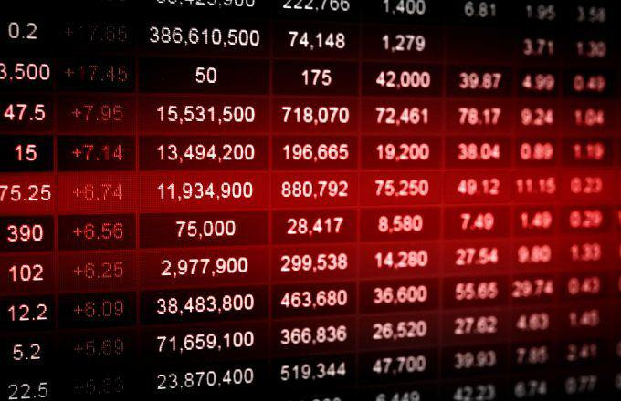

In the ever-evolving world of investing, small-cap stocks have consistently caught the eye of investors due to their growth potential. Typically comprising companies with market capitalizations between $300 million and $2 billion, small-cap stocks often represent businesses at a more nascent stage in their growth trajectory. Their relative obscurity compared to large-cap entities can result in higher growth rates, especially during periods of economic recovery. Consequently, they attract investors looking to capitalize on untapped opportunities.

Simultaneously, algorithmic trading is revolutionizing financial markets by executing trades based on data-driven, statistical models. This methodological approach minimizes human emotion from trading decisions, thus enhancing efficiency and precision in the market. The integration of artificial intelligence and machine learning further refines these algorithms, enabling investors to quickly adapt to market movements and capture fleeting opportunities.



This article explores how these two dynamic areas intersect—small-cap stocks and algorithmic trading—and the potential for harnessing their combined power. Effective investing in small-cap stocks requires robust benchmarking strategies to evaluate portfolio performance accurately. The Russell 2000 Index, for example, serves as a common benchmark for these stocks, providing a standard against which investors can measure their success.

By employing a quantitative approach to small-cap stocks, investors can potentially optimize returns by leveraging the inherent volatility and growth potential of smaller companies. This guide will provide insights into developing successful strategies that maximize these opportunities, focusing on balancing potential high returns with the associated risks.

## Table of Contents

## Understanding Small-Cap Stocks

Small-cap stocks are shares of publicly traded companies that typically possess a market capitalization ranging between $300 million and $2 billion. These companies are often in their developmental stages, showcasing considerable potential for growth. Due to their relatively smaller size, small-cap stocks can provide more significant returns compared to larger companies, primarily because they have more room to expand their operations and capture market share. For instance, during economic recoveries, small-cap stocks frequently outperform their larger counterparts, as they are more agile and can exploit new growth opportunities swiftly.

Despite their alluring growth prospects, small-cap stocks come with heightened risks, mainly due to their high [volatility](/wiki/volatility-trading-strategies). For example, changes in market sentiments or economic shifts can lead to rapid price fluctuations. The lower [liquidity](/wiki/liquidity-risk-premium) of small-cap stocks compared to larger companies means that these stocks are less frequently traded, which can lead to larger price swings. This volatility requires investors to exercise diligent risk management and thorough analysis.

To understand small-cap stocks' dynamics, investors must consider factors like company fundamentals, industry position, and broader economic conditions. A comprehensive assessment can help investors identify companies that are well-positioned to grow. Furthermore, diversifying across various small-cap stocks may mitigate some of the individual risks associated with these companies.

Investors might utilize various performance metrics such as the Price-to-Earnings (P/E) ratio or the Price-to-Book (P/B) ratio to evaluate small-cap stocks. These metrics can provide insights into valuation and potential growth, helping investors to identify undervalued opportunities.

Incorporating small-cap stocks into a diversified portfolio can enhance return potential. However, investors must balance this potential with the inherent risks by maintaining a strategy that aligns with their risk tolerance and investment goals. Understanding small-cap stocks' characteristics is fundamental for investors seeking to capitalize on their unique growth opportunities.

## Portfolio Benchmarking for Small-Cap Investments

Benchmarking is essential for evaluating the performance of investment portfolios, particularly for those dominated by small-cap stocks. A benchmark provides a standard against which the performance of a portfolio can be measured, enabling investors to ascertain the effectiveness of their investment strategies. When it comes to small-cap investments, the choice of benchmark plays a crucial role in evaluating portfolio success.

One of the most widely recognized benchmarks for small-cap portfolios is the Russell 2000 Index. This index encompasses 2,000 stocks that represent the smallest companies in the Russell 3000 Index, which covers the entire U.S. stock market. The Russell 2000 is designed to measure the performance of the small-cap segment, offering a comprehensive picture of how these stocks are performing relative to the broader market. Utilizing the Russell 2000 as a benchmark allows investors to evaluate whether their small-cap portfolio is achieving its performance goals relative to the broader small-cap market.

While indices like the Russell 2000 are commonly used benchmarks, investors can also consider mutual funds focused on small-caps as alternative benchmarks. These mutual funds, which tend to have similar investment objectives, can serve as useful resources for gauging performance. By analyzing the returns of peer mutual funds, investors can gain insights into how well their portfolio is performing compared to managed funds with similar strategies.

Understanding the performance of the chosen benchmark is critical for making informed adjustments to an investment strategy. By tracking the benchmark and comparing it to portfolio returns, investors can identify areas of strength and weakness within their portfolios. This can lead to strategic decisions, such as reallocating assets, altering stock selections, or adjusting overall investment strategies to align more closely with the benchmark and achieve desired results.

Implementing a systematic approach to benchmarking not only helps in tracking progress but also simplifies the process of assessing risks and rewards. Investors can optimize their portfolios by regularly reviewing benchmark data, using it as a guide for potential modifications to enhance performance while managing risk exposure.

## The Role of Algorithmic Trading

Algorithmic trading employs sophisticated algorithms to execute trades based on a set of predefined criteria, transforming the landscape of financial markets by increasing efficiency and precision in trading activities. By incorporating small-cap stocks into [algorithmic trading](/wiki/algorithmic-trading) strategies, traders can potentially exploit the inherent volatility of these stocks for higher returns. The dynamic nature of small-cap stocks, characterized by their price fluctuations and lower liquidity compared to large-cap stocks, presents opportunities for significant [arbitrage](/wiki/arbitrage) and short-term gains.

Algorithms in trading are particularly beneficial as they eliminate human emotional biases, ensuring that trading decisions remain objective and consistent. Human emotions such as fear and greed can often lead to irrational trading behaviors, but algorithms execute trades according to logic and strategy as they follow predetermined rules and conditions. This objectivity is crucial in markets characterized by rapid movements and volatility, which are typical of small-cap stocks.

Advancements in Artificial Intelligence (AI) and Machine Learning (ML) have further enhanced the adaptability of algorithmic trading strategies. These technologies enable traders to develop algorithms that can learn from historical data and adapt to changing market conditions. For instance, [machine learning](/wiki/machine-learning) algorithms can identify complex patterns and relationships within vast datasets, improving predictive accuracy and allowing for more sophisticated trading strategies. This adaptive capability means that algorithms can evolve over time, optimizing their performance as market conditions change.

Effective algorithmic trading requires meticulous model calibration and rigorous [backtesting](/wiki/backtesting). Calibration involves adjusting model parameters to ensure robustness and alignment with the desired trading strategy. Backtesting, a critical component of strategy development, involves running the algorithmic model on historical data to assess its performance under various market conditions. This process helps traders to evaluate the effectiveness of their strategies before deployment in live markets.

The backtesting process typically includes the following steps:

1. **Data Preparation**: Assemble historical price and volume data for small-cap stocks.
2. **Model Development**: Define trading rules and conditions based on chosen indicators or triggers.
3. **Backtest Execution**: Apply the model to historical data over a specific period.
4. **Performance Evaluation**: Analyze key metrics such as return on investment, drawdowns, and Sharpe ratio.
5. **Strategy Refinement**: Adjust the model parameters and improve the strategy based on backtesting results.

```python
# Example Python code for a simple moving average crossover strategy

import numpy as np
import pandas as pd

# Sample Data
data = {'Date': ['2023-01-01', '2023-01-02', '2023-01-03'],
        'Price': [100, 102, 101]}
df = pd.DataFrame(data)
df['Date'] = pd.to_datetime(df['Date'])
df.set_index('Date', inplace=True)

# Moving Averages
df['Short_MA'] = df['Price'].rolling(window=5).mean()
df['Long_MA'] = df['Price'].rolling(window=20).mean()

# Trading Signals
df['Signal'] = 0
df.loc[df['Short_MA'] > df['Long_MA'], 'Signal'] = 1  # Buy
df.loc[df['Short_MA'] < df['Long_MA'], 'Signal'] = -1  # Sell

print(df)
```

In summary, algorithmic trading represents a powerful approach to navigating the complexities of small-cap stocks, offering the advantages of speed, precision, and adaptability. By effectively leveraging algorithms, AI, and machine learning, traders can craft strategies that are not only responsive to current market trends but also poised to capitalize on the unique opportunities presented by small-cap stocks.

## Developing a Small-Cap Algo Trading Strategy

To effectively develop a small-cap algorithmic trading strategy, it is crucial to begin by clearly defining your investment objectives. Determine whether your primary focus is on capital appreciation, regular income, or a balanced approach. This clarity will serve as a foundation for all subsequent strategy development steps.

Next, it is essential to collect comprehensive data on a myriad of factors, including financial metrics, market behavior, and broader economic indicators. Financial metrics could include earnings per share (EPS), price-to-earnings (P/E) ratios, and return on equity (ROE). Market behavior data might encompass price trends, trading volumes, and volatility measures. Economic indicators could cover metrics like GDP growth rates, employment figures, and [interest rate](/wiki/interest-rate-trading-strategies) changes. Accessing reliable data sources, such as Bloomberg, Yahoo Finance, or Quandl, will be instrumental in this step.

With data in hand, the next step is to develop statistical models to pinpoint potentially profitable trading opportunities. These models can leverage techniques ranging from basic linear regression to more advanced methods like machine learning and artificial neural networks. Consider using Python libraries such as scikit-learn or TensorFlow to help build and refine these models. The primary goal is to detect patterns or anomalies that correlate with favorable trading outcomes.

```python
from sklearn.model_selection import train_test_split
from sklearn.linear_model import LinearRegression
import pandas as pd

# Example of model setup for predicting stock price movements based on historical data
data = pd.read_csv('financial_data.csv')
X = data[['P/E', 'EPS', 'ROE']]
y = data['stock_price_change']

X_train, X_test, y_train, y_test = train_test_split(X, y, test_size=0.2, random_state=42)

model = LinearRegression()
model.fit(X_train, y_train)

predictions = model.predict(X_test)
```

Backtesting is an indispensable phase in validating the efficacy of your model across historical data. This process involves applying your strategy to past market data to evaluate its performance. Key performance metrics such as the Sharpe ratio, maximum drawdown, and return on investment (ROI) should be examined to assess risk-adjusted returns. Tools like Python's [backtrader](/wiki/backtrader) can automate and facilitate rigorous backtesting.

```python
import backtrader as bt

class Strategy(bt.Strategy):
    def next(self):
        # define strategy logic
        ...

cerebro = bt.Cerebro()
cerebro.addstrategy(Strategy)
cerebro.run()
cerebro.plot()
```

It is critical to continuously refine and adapt your strategy based on performance evaluations and dynamic market conditions. This involves regularly revisiting your statistical models to incorporate new data points and evolving market trends. Machine learning models, in particular, can benefit from a process known as retraining, which involves updating model weights based on new data to maintain prediction accuracy and relevance.

In summary, developing a small-cap algorithmic trading strategy is a systematic process that requires clear objectives, exhaustive data collection, intricate modeling, thorough backtesting, and ongoing refinement. These steps not only increase the likelihood of optimizing returns but also ensure that the strategy remains resilient in changing market environments.

## Risks and Benefits of Small-Cap Algorithmic Trading

Small-cap algorithmic trading offers a unique intersection of high potential returns and notable risks. Small-cap stocks, known for their volatility and liquidity challenges, present significant opportunities for traders aiming to capitalize on swift market movements. However, the very attributes that make these stocks potentially lucrative also contribute to the risks involved.

One of the primary benefits of algorithmic trading in handling small-cap stocks is the ability to optimize trade execution, significantly reducing the influence of human emotion and indecision. Automated strategies allow for the execution of large volumes at high speeds, which is crucial given the fast-paced nature of stock markets. Algorithms can process real-time data and make split-second decisions, a capability that is humanly impossible at such scales and speeds.

However, market slippage presents a critical challenge in algorithmic trading. Slippage occurs when a trade is executed at a price different from the expected price, primarily due to the rapid price movements typical of small-cap stocks. Although well-calibrated algorithms can minimize slippage, it remains a persistent issue that requires sophisticated techniques such as limit orders to counteract. Implementing adaptive algorithms that monitor market conditions and adjust execution parameters dynamically can effectively mitigate slippage.

Another risk is the market impact, where significant trading volumes can influence stock prices, particularly in the case of small-cap stocks with less liquidity. Algorithmic strategies must, therefore, balance the [volume](/wiki/volume-trading-strategy) of trades executed to avoid substantial market impacts that could detract from potential profits.

The benefits of algorithmic trading in small-cap markets are substantial. The capability to implement diverse trading strategies, such as [momentum](/wiki/momentum)-based, [statistical arbitrage](/wiki/statistical-arbitrage), or mean reversion strategies, allows traders to exploit various market conditions. Algorithms use quantitative models to identify signals and execute trades quickly and efficiently, capitalizing on brief windows of opportunity that manual trading would likely miss.

An ongoing requirement for successful algorithmic trading in the small-cap domain is the regular updating and calibration of algorithms to ensure their efficacy remains intact. Algorithms are built on models and assumptions that must be aligned with current market dynamics. As such, continuous performance evaluations and adaptations are crucial. This involves retraining models with the latest data and applying machine learning techniques to enhance predictive accuracy.

In essence, small-cap algorithmic trading presents a compelling avenue for investors willing to engage with the nuances of volatility and liquidity challenges. Success relies heavily on the capacity to implement and maintain sophisticated algorithms that can adapt to rapidly changing market conditions, ensuring traders remain one step ahead in the quest for optimized returns.

## Conclusion

Quantitative small-cap investing through algorithmic trading offers significant opportunities for investors seeking to capitalize on market volatility and the inherent growth potential of smaller companies. These stocks, often characterized by their agility and innovative potential, can yield substantial returns when approached strategically. Algorithmic trading enhances this approach by employing precise calculations and data-driven insights to navigate the complexities of small-cap markets.

To successfully harness these opportunities, investors must develop and maintain robust, adaptable strategies. This involves a commitment to constant learning and integrating advanced technologies, such as [artificial intelligence](/wiki/ai-artificial-intelligence) and machine learning, into trading practices. These tools allow for the continuous refinement of trading algorithms, thus improving their responsiveness to market changes and enhancing their ability to predict and react to price movements.

A balanced approach that carefully weighs the risks against potential rewards is essential for optimizing investment outcomes. While small-cap stocks have the potential for high returns, they also [carry](/wiki/carry-trading) heightened volatility and liquidity risks. Algorithmic strategies must, therefore, include mechanisms for risk management such as stop-loss orders and diversified portfolio construction. 

The future of small-cap investing relies on combining traditional analysis with modern technology. Investors who blend insights from [fundamental analysis](/wiki/fundamental-analysis) with algorithmic precision stand to benefit from improved decision-making and execution efficiency. By leveraging technology's ability to process vast amounts of data and identify patterns beyond human capability, traders can position themselves to achieve superior returns in small-cap markets.

This strategic convergence of classical techniques and cutting-edge technology not only enhances trading outcomes but also fosters an adaptive mindset, where continuous improvement and innovation drive success in the dynamic landscape of small-cap investing.

## References & Further Reading

[1]: Bergstra, J., Bardenet, R., Bengio, Y., & Kégl, B. (2011). ["Algorithms for Hyper-Parameter Optimization."](https://dl.acm.org/doi/10.5555/2986459.2986743) Advances in Neural Information Processing Systems 24.

[2]: ["Advances in Financial Machine Learning"](https://www.amazon.com/Advances-Financial-Machine-Learning-Marcos/dp/1119482089) by Marcos Lopez de Prado

[3]: ["Evidence-Based Technical Analysis: Applying the Scientific Method and Statistical Inference to Trading Signals"](https://www.amazon.com/Evidence-Based-Technical-Analysis-Scientific-Statistical/dp/0470008741) by David Aronson

[4]: ["Machine Learning for Algorithmic Trading"](https://github.com/stefan-jansen/machine-learning-for-trading) by Stefan Jansen

[5]: ["Quantitative Trading: How to Build Your Own Algorithmic Trading Business"](https://www.amazon.com/Quantitative-Trading-Build-Algorithmic-Business/dp/1119800064) by Ernest P. Chan