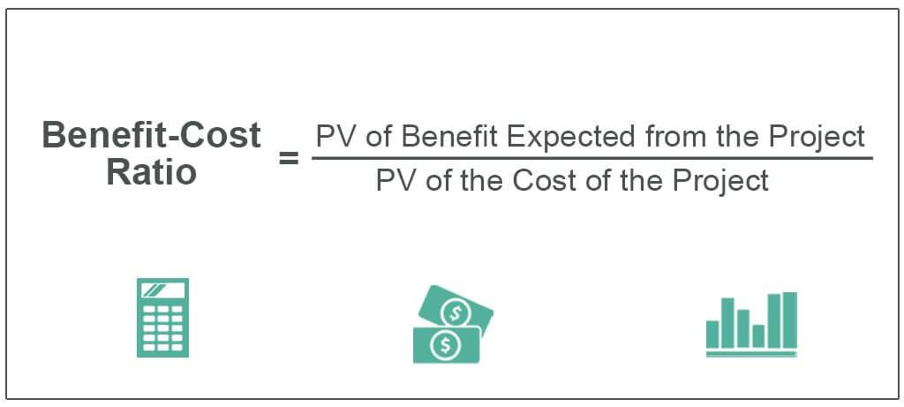

## Table of Contents

## What is the Benefit-Cost Ratio (BCR)?

The Benefit-Cost Ratio (BCR) is a simple way to compare the benefits of a project to its costs. It helps people decide if a project is worth doing. To find the BCR, you divide the total benefits of the project by its total costs. If the BCR is more than 1, it means the benefits are greater than the costs, and the project might be a good idea. If it's less than 1, the costs are higher than the benefits, and you might want to think twice about going ahead with the project.

Using the BCR can be very helpful for making decisions, especially when you need to choose between different projects. For example, if you have two projects and one has a BCR of 1.5 and the other has a BCR of 0.8, you would probably choose the first one because it promises more benefits for the money spent. However, the BCR is just one tool and it's important to consider other factors too, like how certain the benefits and costs are, and any other effects the project might have that are hard to put a number on.

## How is the Benefit-Cost Ratio calculated?

The Benefit-Cost Ratio (BCR) is calculated by dividing the total benefits of a project by its total costs. To do this, you first add up all the benefits that the project will bring. These benefits could be things like money saved, increased revenue, or other positive outcomes that can be given a monetary value. Then, you add up all the costs of the project, including any money spent on materials, labor, and other expenses. Once you have these two totals, you divide the total benefits by the total costs to get the BCR.

For example, if a project is expected to bring in benefits worth $150,000 and the costs to complete the project are $100,000, you would calculate the BCR like this: $150,000 (benefits) divided by $100,000 (costs) equals a BCR of 1.5. This means the benefits are one and a half times the costs, suggesting the project might be a good investment. Remember, a BCR greater than 1 indicates that the benefits outweigh the costs, while a BCR less than 1 means the costs are higher than the benefits.

## Why is the Benefit-Cost Ratio important in project evaluation?

The Benefit-Cost Ratio is important in project evaluation because it helps people make smart choices about where to spend their money. By comparing the benefits of a project to its costs, the BCR shows if a project is likely to be worth doing. If the BCR is more than 1, it means the project's benefits are bigger than its costs, which can make it a good choice. This simple number helps decision-makers see quickly if a project is a good investment or if they should look at other options.

Using the BCR also helps when you have to choose between different projects. For example, if you have two projects and one has a higher BCR, it might be the better choice because it offers more benefits for the money spent. But, it's important to remember that the BCR is just one tool. Other things like how sure you are about the numbers, and other effects that are hard to measure, should also be considered when making decisions.

## What does a BCR greater than 1 indicate?

A BCR greater than 1 means that the benefits of a project are more than its costs. If you have a project with a BCR of 1.5, for example, it means for every dollar you spend, you get $1.50 back in benefits. This makes the project seem like a good idea because you're getting more out of it than what you put in.

When a project has a BCR over 1, it's usually a sign that the project is worth doing. But, it's not the only thing to think about. You also need to consider if the numbers are reliable and if there are other important factors that the BCR doesn't show. Still, a BCR greater than 1 is a good starting point for deciding if a project is a smart choice.

## Can you provide a simple example of calculating BCR?

Imagine you want to start a small garden in your backyard. You think it will cost $200 to buy seeds, soil, and tools. You believe the garden will save you $300 on groceries over the year because you'll be growing your own vegetables. To find out if this is a good idea, you calculate the Benefit-Cost Ratio (BCR).

To calculate the BCR, you divide the total benefits by the total costs. In this case, the benefits are the $300 you'll save on groceries, and the costs are the $200 you'll spend to start the garden. So, you do the math: $300 divided by $200 equals 1.5. A BCR of 1.5 means that for every dollar you spend on the garden, you get $1.50 back in benefits. Since the BCR is greater than 1, starting the garden looks like a good idea.

## How does BCR help in decision making for investments?

The Benefit-Cost Ratio (BCR) helps people make smart choices about investments by showing if the good things that come from a project are worth the money spent on it. When you calculate the BCR, you add up all the benefits and divide them by the costs. If the BCR is more than 1, it means the project will give you more back than what you put in. This makes it easier to decide if a project is a good idea or not. For example, if you're thinking about buying a new machine for your business, you can use the BCR to see if the money you'll save or make from the machine is more than what it costs to buy it.

Using the BCR also helps when you have to choose between different investment options. If you have two projects and one has a higher BCR, it might be the better choice because it offers more benefits for the money spent. But, it's important to remember that the BCR is just one tool. You should also think about other things like how sure you are about the numbers, and any other effects that are hard to measure. Even though the BCR is a simple way to compare projects, it's a big help in making smart investment decisions.

## What are the limitations of using BCR?

Using the Benefit-Cost Ratio (BCR) can be helpful, but it has some limitations. One big problem is that it can be hard to put a number on all the benefits and costs of a project. Some things, like how happy people feel or the impact on the environment, are hard to measure in dollars. This means the BCR might not show the full picture of a project's value.

Another issue is that the BCR depends a lot on the guesses about future benefits and costs. If these guesses are wrong, the BCR will be wrong too. This can make it risky to use the BCR as the only tool for deciding if a project is good or not. It's important to look at other things, like how certain the numbers are and any other effects that the BCR might not show.

## How does the time value of money affect BCR calculations?

The time value of money is important when calculating the Benefit-Cost Ratio (BCR) because it means that money you get or spend in the future is worth less than money you get or spend now. This is because you could invest money now and earn interest on it, so a dollar today is worth more than a dollar in the future. When you calculate the BCR, you need to adjust the future benefits and costs to what they would be worth today. This is called discounting, and it makes sure that the BCR gives a fair comparison between what you spend now and what you get back later.

If you don't consider the time value of money, the BCR might make a project look better than it really is. For example, if a project costs $100 now but will give you $120 in five years, without discounting, the BCR would be 1.2, which looks good. But if you discount the future $120 to what it's worth today, it might be less than $100, making the BCR less than 1. This shows that the project might not be as good an investment as it first seemed. So, always remember to account for the time value of money when you're figuring out the BCR to get a true picture of a project's worth.

## What are some common mistakes to avoid when calculating BCR?

One common mistake when calculating the Benefit-Cost Ratio (BCR) is not considering all the costs and benefits. Sometimes people forget to include things like maintenance costs or indirect benefits, like how a project might make other parts of a business work better. If you don't count all these things, your BCR might be too high or too low, and you could make a wrong decision about the project.

Another mistake is not adjusting for the time value of money. This means not discounting future benefits and costs to what they're worth today. If you don't do this, the BCR might make a project look better than it really is because it doesn't account for the fact that money now is worth more than money later. Always remember to use discounting to get a true picture of a project's value.

## How can sensitivity analysis be applied to BCR?

Sensitivity analysis helps you see how changes in the numbers can affect the Benefit-Cost Ratio (BCR). When you're figuring out the BCR, you use guesses about future benefits and costs. But what if those guesses are wrong? Sensitivity analysis lets you change those guesses a little bit to see what happens to the BCR. For example, if you think a project will save you $100,000 but you're not sure, you can try different amounts like $90,000 or $110,000 to see how the BCR changes. This helps you understand if the project is still a good idea even if your guesses are off a bit.

Using sensitivity analysis with BCR is a smart way to make better decisions. It shows you how strong your project is against changes in the numbers. If the BCR stays above 1 even when you change the guesses a lot, it means the project is probably a good choice no matter what. But if small changes make the BCR drop below 1, you might want to think more about the project or look at other options. This way, sensitivity analysis helps you see if your project can handle uncertainty, making your decision more reliable.

## What are the differences between BCR and other financial ratios like ROI?

The Benefit-Cost Ratio (BCR) and Return on Investment (ROI) are both used to help people decide if a project or investment is worth doing, but they work a bit differently. BCR is calculated by dividing the total benefits of a project by its total costs. If the BCR is more than 1, it means the benefits are bigger than the costs, which is good. ROI, on the other hand, looks at the profit you make from an investment compared to how much you spent on it. You find ROI by taking the profit and dividing it by the cost of the investment, then turning it into a percentage. So, if you spend $100 and make $120, your ROI would be 20%.

One big difference between BCR and ROI is what they measure. BCR looks at all the benefits, not just the money you make. This can include things like saving time or helping the environment, as long as you can put a number on them. ROI focuses more on the money you make, so it's more about the financial side of things. Another difference is how they're used. BCR is often used for big projects, like building a new road or a public park, where you want to see if the project is worth the money for everyone. ROI is more common in business, where people want to know if an investment will make them more money. Both ratios help with decision-making, but they give you different kinds of information to think about.

## How can BCR be used in public sector projects versus private sector projects?

In the public sector, the Benefit-Cost Ratio (BCR) is often used to decide if big projects like building new roads, schools, or parks are worth doing. These projects usually help a lot of people, but they cost a lot of money too. The BCR helps the government see if the good things that come from the project, like less traffic or better education, are worth the money spent. Since public projects often have benefits that are hard to put a number on, like making people happier or helping the environment, the BCR needs to think about these things too. If the BCR is more than 1, it means the project might be a good choice for the public.

In the private sector, businesses use the BCR to decide if an investment will make them more money. For example, a company might use the BCR to see if buying a new machine or starting a new product line is a good idea. The BCR helps them compare the money they'll make from the project to the money they'll spend on it. If the BCR is more than 1, it means the project could be a good investment. But businesses also need to think about other things, like how sure they are about the numbers and how the project fits with their goals. So, while the BCR is important, it's just one tool they use to make smart choices.

## What is the Understanding of Benefit-Cost Ratio (BCR)?

The Benefit-Cost Ratio (BCR) is a crucial metric used to assess the economic feasibility of a project or investment by comparing its expected benefits to its costs. The BCR is computed as follows:

$$
\text{BCR} = \frac{\text{Present Value of Benefits}}{\text{Present Value of Costs}}
$$

By deriving the present values of both benefits and costs, BCR encapsulates the timing and scale of cash flows, allowing for a consistent and comprehensive evaluation. A BCR greater than 1.0 suggests that a project or investment is economically viable, with benefits outweighing costs.

### Calculating Present Values

The present value (PV) is an essential concept in computing BCR, reflecting the time value of money principle, which asserts that a given amount of money is worth more now than at a future date due to its earnings potential. The formula for computing the present value of a single future cash flow is:

$$
\text{PV} = \frac{C}{(1 + r)^n}
$$

where:
- $C$ is the future cash flow,
- $r$ is the discount rate, and
- $n$ is the number of periods until the cash flow occurs.

For projects with multiple cash flows, the present value is the sum of the PVs of all future benefits and costs.

### Monetary and Qualitative Assessment

BCR offers flexibility as an assessment tool since it can express and interpret both monetary and qualitative terms of benefits and costs. Financial benefits like revenue generation are typically assessed monetarily, while qualitative benefits such as strategic advantages or environmental impact might be quantified through proxies or adjusted metrics.

### Broad-Level Project Assessment

A high BCR indicates strong investment potential, guiding decision-makers in resource allocation to achieve maximum return. It aids in evaluating the relative profitability of various investment or project options, facilitating strategic planning and capital investment alignment with an organization's objectives.

In practice, BCR is often combined with other metrics, such as internal rate of return (IRR) or net present value (NPV), to provide a comprehensive view of a project's economic worthiness, enabling decision-makers to prioritize investments where potential benefits significantly exceed costs.

## How does BCR work in algorithmic trading?

The Benefit-Cost Ratio (BCR) serves as a valuable tool in [algorithmic trading](/wiki/algorithmic-trading) by effectively quantifying potential returns relative to the risks involved. In essence, BCR in algorithmic trading acts as a measure of the efficiency of various trading strategies, guiding traders to make informed decisions based on quantitative data.

At its core, the BCR is computed by dividing the present value of benefits by the present value of costs:

$$
\text{BCR} = \frac{\text{Present Value of Benefits}}{\text{Present Value of Costs}}
$$

This ratio assists in evaluating whether the expected profits from a trading strategy sufficiently exceed the associated costs. A BCR greater than one (BCR > 1.0) suggests that a trading strategy is considered viable from a financial perspective, as the benefits surpass the costs.

In algorithmic trading systems, BCR is integrated into trading algorithms, aiding in the assessment of trade viability. By embedding BCR within the logic of these algorithms, traders strive to ensure that trades executed by the systems are likely to offer positive returns. This integration is crucial, especially in high-frequency trading where decisions need to be made rapidly without human intervention. For example, a simple Python function to calculate BCR could be:

```python
def calculate_bcr(pv_benefits, pv_costs):
    return pv_benefits / pv_costs if pv_costs != 0 else float('inf')

# Example usage
present_value_benefits = 150000
present_value_costs = 100000
bcr = calculate_bcr(present_value_benefits, present_value_costs)
print(f"BCR: {bcr}")
```

Moreover, BCR plays an instrumental role in capital budgeting within algorithmic trading by determining the value for money of varied trading strategies. This approach allows traders to allocate financial resources efficiently, prioritizing strategies that present higher BCR values, and hence, potentially higher profitability.

In addition to initial assessments, BCR assists traders in monitoring whether their algorithmic trades are yielding the expected profits over time. By comparing the actual outcomes with the expected benefits used in BCR calculations, traders can verify the accuracy and effectiveness of their trading algorithms. This ongoing evaluation is fundamental to adjusting strategies and ensuring that they remain profitable amidst changing market conditions.

In summary, BCR is a central component in algorithmic trading, harmonizing the quantification of potential returns against risks and costs. Through its integration into trading algorithms and role in capital budgeting, BCR supports traders in maximizing profitability and refining their trading strategies.

## What are the limitations of BCR in algo trading?

The Benefit-Cost Ratio (BCR) is a widely-utilized metric that serves as a significant indicator for assessing the viability of trading strategies in algorithmic trading. Despite its utility, several limitations can impact the efficacy of BCR in this context.

One major limitation of BCR is its reliance on the accuracy of the input data used for its calculation. The BCR is computed by dividing the present value of benefits (PVᵦ) by the present value of costs (PV𝒸):

$$
\text{BCR} = \frac{\text{PVᵦ}}{\text{PV𝒸}}
$$

The accuracy of BCR is consequently dependent on the precision of these input values. Inaccuracies in data, whether due to flawed data collection methods, estimation errors, or incorrect assumptions about market conditions, can lead to misleading BCR calculations and, potentially, misguided trading decisions.

Furthermore, the BCR may not fully capture all qualitative benefits and costs associated with trading strategies. Algorithmic trading often involves qualitative elements such as strategic adaptability, ease of implementation, and competitive advantage, which can be challenging to quantify. These qualitative aspects may be significant, yet they are not easily expressed in monetary terms, potentially leading to underestimation or overstatement of a strategy's value when using BCR alone.

Market [volatility](/wiki/volatility-trading-strategies) further complicates the use of BCR as a predictive tool in algorithmic trading. Volatility can significantly affect the expected returns from trades, leading to variations in the projected benefits and costs used to calculate the BCR. As market conditions fluctuate, the benefits or returns initially anticipated may no longer hold, thus affecting the reliability of BCR as a standalone metric for future predictions.

Given these limitations, it is crucial for traders not to rely exclusively on BCR when evaluating trading strategies. To enhance decision-making accuracy, traders should integrate BCR analysis with other financial metrics and tools, such as Net Present Value (NPV), Internal Rate of Return (IRR), and risk-adjusted performance measures. Employing a comprehensive and multifaceted approach to evaluation can better accommodate the complexities and unpredictabilities inherent in algorithmic trading.

## References & Further Reading

[1]: Bergstra, J., Bardenet, R., Bengio, Y., & Kégl, B. (2011). ["Algorithms for Hyper-Parameter Optimization."](https://dl.acm.org/doi/10.5555/2986459.2986743) Advances in Neural Information Processing Systems 24.

[2]: ["Advances in Financial Machine Learning"](https://www.amazon.com/Advances-Financial-Machine-Learning-Marcos/dp/1119482089) by Marcos Lopez de Prado

[3]: ["Evidence-Based Technical Analysis: Applying the Scientific Method and Statistical Inference to Trading Signals"](https://www.amazon.com/Evidence-Based-Technical-Analysis-Scientific-Statistical/dp/0470008741) by David Aronson

[4]: ["Machine Learning for Algorithmic Trading"](https://github.com/stefan-jansen/machine-learning-for-trading) by Stefan Jansen

[5]: ["Quantitative Trading: How to Build Your Own Algorithmic Trading Business"](https://www.amazon.com/Quantitative-Trading-Build-Algorithmic-Business/dp/1119800064) by Ernest P. Chan