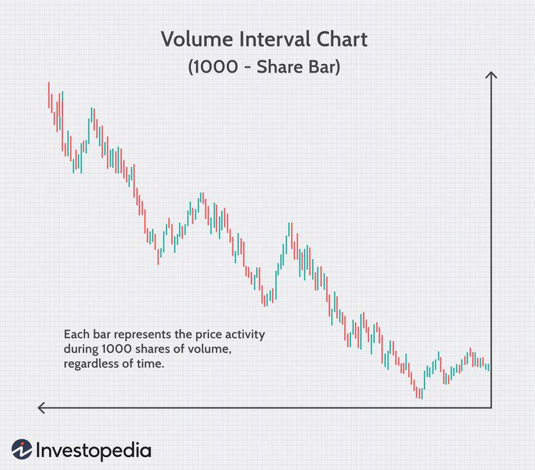

## Table of Contents

## What are intraday charts and how do they work?

Intraday charts are graphs that show how the price of something, like a stock or a currency, changes during a single day. They are useful for people who trade or invest because they can see the ups and downs of prices in real-time. These charts usually show time on the bottom, going from left to right, and the price on the side, going up and down. Each point on the chart represents the price at a specific time during the day.

These charts can be set to show different time frames within the day, like every minute, every five minutes, or every hour. This helps traders see short-term trends and make quick decisions. For example, if a stock's price is going up on the chart, a trader might decide to buy it, hoping to sell it later at a higher price. On the other hand, if the price is going down, they might sell it to avoid losing more money. Intraday charts are important tools for anyone who wants to understand and react to market movements within a single trading day.

## How can data-based intraday charts benefit beginner traders?

Data-based intraday charts can be really helpful for beginner traders because they show how prices change throughout the day. This helps beginners see patterns and trends in real-time, which is important for making quick decisions. Instead of guessing, beginners can use these charts to see if a stock's price is going up or down and decide when to buy or sell. It's like having a map that shows you where the price has been and where it might be going next.

Another way intraday charts help beginners is by teaching them about the market. By looking at these charts every day, beginners can learn how different events or news can affect prices. They can start to understand what times of the day are usually more active or when prices tend to move a lot. This knowledge can make them feel more confident and less scared about trading. Over time, using intraday charts can turn a beginner into a more experienced trader who knows how to read the market better.

## What types of data are typically used in intraday charts?

Intraday charts usually show price data, which is the most important information for traders. This includes the opening price, which is the first price of the day, the closing price, which is the last price of the day, the highest price, and the lowest price. These four prices together are called the OHLC (Open, High, Low, Close) data. Sometimes, intraday charts also show the volume of trades, which tells you how many shares or contracts were bought and sold. This can help traders see how much interest there is in a stock or other asset.

Besides price and volume, some intraday charts might include other types of data like moving averages. A moving average is a line on the chart that shows the average price over a certain period, like the last 10 or 20 minutes. This can help traders see the overall trend and ignore small ups and downs. Some charts also show technical indicators, which are calculations based on the price and volume data. These indicators, like the Relative Strength Index (RSI) or the Moving Average Convergence Divergence (MACD), can help traders predict where the price might go next. By using all this data together, traders can make better decisions about when to buy or sell.

## How do intraday charts help in identifying market trends?

Intraday charts help traders see how prices move during the day. By looking at these charts, traders can spot patterns that show if the market is going up or down. For example, if the price keeps making higher highs and higher lows, it might mean the market is in an uptrend. On the other hand, if the price is making lower highs and lower lows, it could be a sign of a downtrend. These trends can help traders decide when to buy or sell.

These charts also show moving averages, which are lines that smooth out the price data over time. If the price is above the moving average, it might mean the market is strong and in an uptrend. If the price is below the moving average, it could mean the market is weak and in a downtrend. By watching these moving averages, traders can get a better idea of the overall direction of the market. This helps them make smarter trading decisions based on what the market is doing right now.

## What are the key technical indicators used in data-based intraday charts?

Technical indicators in data-based intraday charts help traders understand market trends and make better decisions. One common indicator is the Moving Average, which shows the average price of a stock over a certain time, like the last 10 or 20 minutes. If the price is above the moving average, it might mean the market is strong and going up. If it's below, the market might be weak and going down. Another useful indicator is the Relative Strength Index (RSI), which measures how fast the price is changing. If the RSI is over 70, it might mean the stock is overbought and could go down soon. If it's under 30, the stock might be oversold and could go up.

Another important indicator is the Moving Average Convergence Divergence (MACD), which shows the relationship between two moving averages. When the MACD line crosses above the signal line, it might be a good time to buy because it suggests the price is going up. When it crosses below, it might be a good time to sell because it suggests the price is going down. Volume is also a key indicator, showing how many shares or contracts are being traded. High volume can mean there's a lot of interest in the stock, which can confirm a trend. By using these indicators together, traders can get a clearer picture of what the market is doing and make smarter trading choices.

## How can intraday charts improve trading decision-making?

Intraday charts help traders make better decisions by showing how prices change throughout the day. By looking at these charts, traders can see if a stock's price is going up or down and decide when to buy or sell. For example, if the chart shows the price is going up and making higher highs, a trader might decide to buy the stock because it looks like it will keep going up. On the other hand, if the chart shows the price is going down and making lower lows, a trader might decide to sell the stock to avoid losing more money.

These charts also use technical indicators like moving averages, RSI, and MACD to help traders understand the market better. Moving averages show the overall trend by smoothing out the price data, helping traders see if the market is strong or weak. RSI tells traders if a stock is overbought or oversold, which can help them decide when to buy or sell. MACD shows the relationship between two moving averages and can signal good times to buy or sell. By using these indicators along with the price data on intraday charts, traders can make smarter and quicker decisions based on what the market is doing right now.

## What are the common pitfalls to avoid when using intraday charts?

One common mistake when using intraday charts is overtrading. This happens when traders see small price movements and decide to buy and sell too often, hoping to make quick profits. But this can lead to big losses because the market can be unpredictable, and trading fees can add up. It's important to wait for clear signals from the chart and not to trade just because the price is moving a little bit.

Another pitfall is ignoring the bigger picture. Intraday charts show what's happening in a single day, but they don't show the long-term trends. If a trader only looks at intraday charts, they might miss important information about where the market is heading over time. It's a good idea to also look at longer-term charts to understand the overall trend and make better trading decisions.

Lastly, relying too much on technical indicators can be a problem. While indicators like moving averages, RSI, and MACD are helpful, they're not perfect. Sometimes, they can give false signals, making traders think the price will go up or down when it doesn't. It's important to use these indicators along with other information, like news and market events, to get a full picture of what's happening in the market.

## How do advanced traders use data-based intraday charts for strategy development?

Advanced traders use data-based intraday charts to create detailed trading strategies that help them make smart choices quickly. They look at the charts to see patterns and trends during the day. For example, they might notice that a stock's price often goes up in the morning and down in the afternoon. By seeing these patterns, they can plan to buy the stock in the morning and sell it later in the day to make a profit. They also use technical indicators like moving averages, RSI, and MACD to confirm their ideas about where the price might go next. This helps them decide when to enter and [exit](/wiki/exit-strategy) trades based on what the chart is showing.

Another way advanced traders use intraday charts is to test their strategies. They can look back at old charts to see how their strategy would have worked in the past. This is called [backtesting](/wiki/backtesting). If the strategy made money in the past, they might feel more confident using it now. They also use these charts to fine-tune their strategies, making small changes to see if they can do better. By constantly looking at intraday charts and adjusting their plans, advanced traders can improve their chances of success in the fast-moving world of trading.

## What role do intraday charts play in risk management?

Intraday charts help traders manage risk by showing them how prices move during the day. By looking at these charts, traders can see if a stock's price is going up or down and decide when to buy or sell. For example, if the chart shows the price is going down fast, a trader might decide to sell the stock to avoid losing more money. This way, they can set stop-loss orders, which are like safety nets that automatically sell the stock if the price drops too much. Using intraday charts helps traders know where to set these stop-losses based on what the market is doing right now.

Another way intraday charts help with risk management is by showing traders how much the price can change in a day. This is called [volatility](/wiki/volatility-trading-strategies). If a stock's price moves a lot during the day, it might be riskier to trade. Traders can use intraday charts to see how volatile a stock is and decide if they want to take that risk. By understanding the volatility, traders can adjust their strategies to be safer. For example, they might trade smaller amounts or use different types of orders to protect their money. Intraday charts give traders the information they need to make smart choices and keep their risks under control.

## How can data-based intraday charts be integrated with algorithmic trading?

Data-based intraday charts can be a big help for people who use computers to trade, which is called [algorithmic trading](/wiki/algorithmic-trading). These charts show how prices change during the day, and traders can use this information to make their computer programs smarter. For example, if the chart shows that a stock's price often goes up in the morning, a trader can tell their computer to buy the stock at that time and sell it later. The computer can look at the chart in real-time and make quick decisions based on what it sees. This can help traders make money faster and with less work.

Another way intraday charts help with algorithmic trading is by letting traders test their computer programs. Traders can use old charts to see how their program would have done in the past. This is called backtesting. If the program made money in the past, the trader might feel more confident using it now. By looking at intraday charts, traders can also make small changes to their program to make it work better. This way, they can keep improving their trading strategy and make smarter choices with their computer's help.

## What are the latest technological advancements affecting intraday chart analysis?

New technology has made intraday chart analysis a lot easier and faster. One big change is the use of [artificial intelligence](/wiki/ai-artificial-intelligence) (AI) and machine learning. These technologies can look at lots of data from intraday charts and find patterns that people might miss. They can also predict where prices might go next, which helps traders make better decisions. Another advancement is better data processing and storage. With more powerful computers, traders can now handle huge amounts of data in real-time, which means they can see what's happening in the market right away and react quickly.

Cloud computing is also making a big difference. Traders can use the cloud to store and analyze intraday chart data without needing big, expensive computers. This makes it easier for anyone to use advanced tools for trading. Plus, with the internet getting faster, traders can access these tools from anywhere. All these technological advancements are helping traders see more clearly what's happening in the market and make smarter choices based on intraday charts.

## How do expert traders validate the accuracy of data in intraday charts?

Expert traders make sure the data in intraday charts is right by checking it against other sources. They look at data from different places like financial news websites, stock exchange reports, and trading platforms. If the prices and trends on the intraday chart match what they see in these other places, they feel more sure that the data is correct. Sometimes, they also use special software that can spot mistakes in the data, like if a price suddenly jumps for no reason. By comparing and double-checking, expert traders can trust the information they see on their charts.

Another way expert traders check the accuracy of intraday chart data is by looking at historical data. They compare today's chart with charts from the past to see if the patterns and trends make sense. If the data on the chart fits with what has happened before, it's more likely to be right. They also keep an eye on any big news or events that could affect prices, making sure the chart reflects these changes correctly. By doing all these checks, expert traders can use intraday charts with confidence and make better trading decisions.

## What is the role of data analysis in intraday trading?

Data analysis plays a critical role in intraday trading by enabling traders to identify patterns and make informed predictions. By combining historical data with real-time information, traders gain insights into market trends and potential movements that can guide their trading decisions.

Historical data analysis provides a foundation for understanding past market behavior. It allows traders to recognize recurring patterns and develop predictive models. A commonly used technique in historical data analysis is statistical analysis, which involves summarizing data sets to derive meaningful insights. For example, traders might calculate moving averages to smooth out price fluctuations and identify trend directions. The formula for a simple moving average (SMA) over $n$ periods can be expressed as:

$$
\text{SMA} = \frac{P_1 + P_2 + \cdots + P_n}{n}
$$

where $P_1, P_2, \ldots, P_n$ are the closing prices over $n$ periods.

In addition to historical data, real-time information is indispensable for intraday trading. High-frequency data, such as minute-by-minute price changes, [volume](/wiki/volume-trading-strategy), and order flow, allow traders to respond promptly to market developments. Real-time data analysis often involves [machine learning](/wiki/machine-learning) techniques, which can dynamically adapt to new information. Machine learning models, like support vector machines or random forests, can classify or predict price movements based on features extracted from live data.

Quantitative modeling is another advanced technique in data analysis for intraday trading. Quantitative models use mathematical and statistical tools to analyze market data and generate trading signals. These models often leverage algorithms to identify [arbitrage](/wiki/arbitrage) opportunities or calculate the probability of price movements. Python is frequently used for developing such models due to its powerful libraries for data manipulation and analysis. For instance, using the `pandas` library, a trader can efficiently handle and analyze time-series data:

```python
import pandas as pd

# Load market data
data = pd.read_csv('market_data.csv', parse_dates=['Date'], index_col='Date')

# Calculate a moving average
data['Moving_Average'] = data['Close'].rolling(window=20).mean()

# Filter significant trading signals
signals = data[data['Close'] > data['Moving_Average']]
print(signals)
```

This code snippet demonstrates how to calculate a moving average and identify trading signals when the closing price exceeds this average. Such analyses enhance a trader's ability to forecast market dynamics and optimize intraday strategies.

In sum, the integration of historical data analysis, machine learning, and quantitative modeling provides a comprehensive approach to interpreting data for intraday trading. By leveraging these techniques, traders can improve their market predictions and make more informed trading decisions, ultimately leading to enhanced performance.

## References & Further Reading

[1]: Bergstra, J., Bardenet, R., Bengio, Y., & Kégl, B. (2011). ["Algorithms for Hyper-Parameter Optimization."](https://papers.nips.cc/paper/4443-algorithms-for-hyper-parameter-optimization) Advances in Neural Information Processing Systems 24.

[2]: ["Advances in Financial Machine Learning"](https://www.amazon.com/Advances-Financial-Machine-Learning-Marcos/dp/1119482089) by Marcos Lopez de Prado

[3]: ["Evidence-Based Technical Analysis: Applying the Scientific Method and Statistical Inference to Trading Signals"](https://www.amazon.com/Evidence-Based-Technical-Analysis-Scientific-Statistical/dp/0470008741) by David Aronson

[4]: ["Machine Learning for Algorithmic Trading"](https://github.com/stefan-jansen/machine-learning-for-trading) by Stefan Jansen

[5]: ["Quantitative Trading: How to Build Your Own Algorithmic Trading Business"](https://www.amazon.com/Quantitative-Trading-Build-Algorithmic-Business/dp/1119800064) by Ernest P. Chan