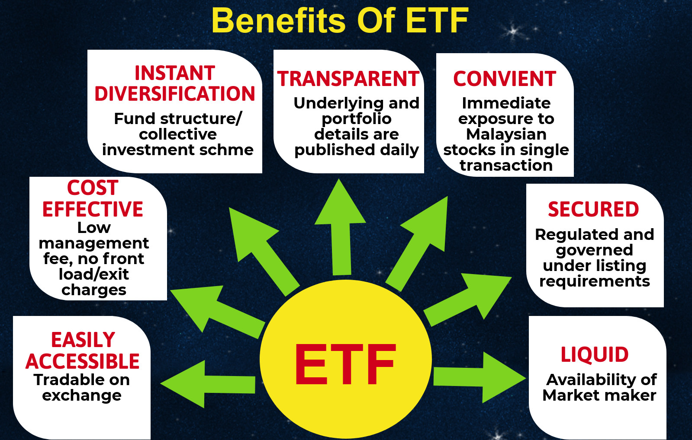

## Table of Contents

## What is an ETF and how does it work?

An ETF, or Exchange-Traded Fund, is a type of investment that works a lot like a mutual fund but trades on a stock exchange, just like a stock. You can buy and sell shares of an ETF throughout the day at market prices. ETFs usually aim to track the performance of a specific index, like the S&P 500, a sector, or a commodity. This means if you invest in an ETF that tracks the S&P 500, your investment will go up or down based on how the S&P 500 performs.

ETFs are popular because they offer diversification, which means you're spreading your money across many different investments, reducing the risk of losing money if one investment does poorly. They also tend to have lower fees than many mutual funds. When you buy an ETF, your money is pooled with other investors' money to buy the assets the ETF is designed to track. So, if you own shares in an ETF that tracks the tech sector, the ETF will use the pooled money to buy stocks of tech companies. This way, you get a piece of many tech companies without having to buy each stock individually.

## Why should young investors consider ETFs?

Young investors should consider ETFs because they offer an easy way to start investing without needing a lot of money or knowledge about the stock market. ETFs let you buy a small piece of a big group of investments, like stocks or bonds, all at once. This means you can spread your money across many different things, which is safer than putting all your money in one place. Plus, ETFs usually have low fees, so more of your money can grow over time.

Another reason young investors might like ETFs is that they are flexible and easy to manage. You can buy and sell them anytime during the trading day, just like stocks. This can be helpful if you need to get your money out quickly or if you want to change your investments. Also, because ETFs track indexes, you don't have to spend a lot of time [picking](/wiki/asset-class-picking) which stocks to buy. You can just choose an [ETF](/wiki/etf-trading-strategies) that fits your goals, like saving for a house or retirement, and let it do the work for you.

## How do ETFs help in diversifying an investment portfolio?

ETFs help in diversifying an investment portfolio by allowing you to own a little bit of many different investments all at once. When you buy shares in an ETF, you're not just buying one stock or bond; you're buying into a whole basket of them. For example, if you invest in an ETF that tracks the S&P 500, you're getting a piece of the 500 biggest companies in the U.S. This spread of investments means if one company does badly, it won't hurt your whole investment as much because you have so many other companies in your portfolio.

Another way ETFs help with diversification is by giving you access to different types of markets and sectors without needing to buy each investment separately. You can find ETFs that focus on things like technology, healthcare, or even countries like Japan or Germany. This means you can easily spread your money across different areas of the economy or the world, reducing the risk that comes from having all your money in one place. By using ETFs, young investors can build a well-rounded portfolio that can grow over time without having to manage lots of different investments on their own.

## What are the cost benefits of investing in ETFs?

ETFs usually have lower fees than many other types of investments like mutual funds. This is because ETFs are designed to track an index, which doesn't require a lot of active management. The lower fees mean more of your money stays in your pocket and can grow over time. For example, if you're paying a 0.1% fee on an ETF instead of a 1% fee on a mutual fund, that difference can add up to a lot of money over the years.

Another cost benefit of ETFs is that you can start investing with a small amount of money. Many ETFs let you buy shares for less than $100, which makes it easier for young investors to get started. Plus, when you buy and sell ETFs, you usually don't have to pay big commissions like you might with other investments. This means you can move your money around without losing a lot to fees, making it easier to manage your investments as your needs change.

## How liquid are ETFs and why is this important for young investors?

ETFs are very liquid, which means you can easily buy and sell them during the trading day. When you want to sell your ETF shares, you usually don't have to wait long to find a buyer. This is important because it means you can get your money out quickly if you need it for something else or if you want to change your investments.

For young investors, this [liquidity](/wiki/liquidity-risk-premium) is really helpful. It means you can start and stop investing without worrying about being stuck with your money in one place. If you're saving for a goal like a new car or a house, being able to turn your investments into cash quickly can make a big difference. Plus, knowing you can easily sell your ETFs can make you feel more confident about investing, even if you're just starting out.

## Can ETFs help young investors manage risk?

ETFs can help young investors manage risk by spreading their money across many different investments. When you buy an ETF, you're not putting all your money into one company or one type of investment. Instead, you're getting a piece of a whole bunch of them. This is called diversification, and it means if one company or sector does badly, it won't hurt your whole investment as much because you have so many other investments to balance it out.

Another way ETFs help manage risk is by making it easy to invest in different parts of the economy or the world. You can find ETFs that focus on different things, like technology, healthcare, or even countries like Japan or Germany. This means you can spread your money across different areas, reducing the risk that comes from having all your money in one place. By using ETFs, young investors can build a safer portfolio that can grow over time without having to manage lots of different investments on their own.

## What are the tax implications of investing in ETFs?

When you invest in ETFs, you need to think about taxes. ETFs are usually pretty tax-friendly because of how they work. When you buy and sell stocks inside an ETF, it doesn't usually cause a big tax bill right away. This is because ETFs often use a special way of trading called "in-kind" transactions, which means they swap stocks instead of selling them for cash. This can help keep your taxes lower because you're not paying taxes on gains as often.

But, when you sell your ETF shares and make a profit, you'll have to pay taxes on that profit. The tax rate depends on how long you held the ETF. If you held it for more than a year, it's called a long-term capital gain, and the tax rate is usually lower. If you held it for less than a year, it's a short-term capital gain, and you'll pay your regular income tax rate on it. So, if you're thinking about selling your ETFs, it's a good idea to think about the timing to maybe pay less in taxes.

## How can ETFs be used for long-term investment strategies?

ETFs can be a great choice for young investors looking to save for the long term, like for retirement or buying a house. When you invest in ETFs, you're buying a piece of a big group of investments, like stocks or bonds. This means you can spread your money across many different things, which is safer than putting all your money in one place. ETFs that track broad market indexes, like the S&P 500, are good for long-term goals because they give you a piece of the whole economy. Over many years, the economy tends to grow, and so do these ETFs.

Another way ETFs help with long-term investing is by having low fees. Because ETFs are designed to track an index, they don't need a lot of active management, which keeps costs down. Lower fees mean more of your money stays in your pocket and can grow over time. Plus, ETFs are easy to buy and sell, so you can adjust your investments as your goals change. By using ETFs, you can build a simple, cost-effective, and diversified portfolio that can help you reach your long-term financial goals without needing to be an expert in the stock market.

## What are some common types of ETFs that young investors might consider?

Young investors might want to start with ETFs that track broad market indexes like the S&P 500. These ETFs give you a piece of the biggest companies in the U.S., spreading your money across many different businesses. This is a good way to grow your money over the long term because the whole economy usually grows over time. ETFs like these are also easy to understand and don't need a lot of watching, which is perfect if you're new to investing.

Another type of ETF to think about is sector ETFs. These ETFs focus on specific parts of the economy, like technology or healthcare. If you believe a certain sector will do well in the future, you can invest in an ETF that tracks that sector. This can be a bit riskier than a broad market ETF, but it can also be more exciting if you're interested in a certain industry.

Lastly, there are bond ETFs, which can help balance out the risk in your portfolio. Bond ETFs invest in a bunch of bonds, which are loans to companies or governments. They usually don't grow as fast as stock ETFs, but they're safer and can give you regular income. This can be a good choice if you want to make your investments less risky while still growing your money over time.

## How do ETFs compare to mutual funds and individual stocks for young investors?

ETFs are a bit like mutual funds because they both let you invest in a bunch of different things at once. But ETFs usually have lower fees than mutual funds because they're designed to track an index instead of being actively managed. This means more of your money can stay in your pocket and grow over time. Also, ETFs are easy to buy and sell during the trading day, just like stocks. Mutual funds, on the other hand, are only bought and sold at the end of the day. So, if you need to get your money out quickly or want to change your investments, ETFs might be easier to work with.

When you compare ETFs to individual stocks, ETFs let you spread your money across many different companies or investments all at once. This is safer than buying just one stock because if that one company does badly, you could lose a lot of money. With an ETF, if one company does badly, it won't hurt your whole investment as much because you have so many other companies in your portfolio. But, if you pick the right individual stock, it could grow a lot more than an ETF. So, ETFs are a good choice if you want to be safer and don't want to spend a lot of time picking stocks.

## What are the potential pitfalls or risks associated with ETF investing?

One risk of investing in ETFs is that they can go down in value just like any other investment. If the market or the sector the ETF tracks does badly, the value of your ETF will go down too. This means you could lose money, especially if you need to sell your ETFs when the market is down. Also, while ETFs are usually safer than buying individual stocks because they're diversified, they're not completely safe. If the whole market or a big part of it does badly, your ETFs could lose value too.

Another thing to watch out for is the fees you pay for ETFs. Even though ETFs usually have lower fees than mutual funds, those fees can still add up over time. If you're not careful, you might pick ETFs with higher fees than you need to, which means less money in your pocket. Also, some ETFs, like those that use complicated strategies or track very specific parts of the market, might have higher fees and be riskier. It's important to understand what you're investing in and to keep an eye on the fees you're paying.

## How can young investors stay informed about their ETF investments and market trends?

Young investors can stay informed about their ETF investments and market trends by regularly checking financial news websites and apps. Websites like Bloomberg, Yahoo Finance, and CNBC offer up-to-date news, market analysis, and tools to track the performance of your ETFs. You can set up alerts for specific ETFs or sectors you're interested in, so you get notifications when something important happens. It's also a good idea to follow financial news on social media, where you can get quick updates and insights from experts.

Another way to stay informed is by using investment apps that give you real-time data and analysis. Apps like Robinhood, E*TRADE, and Charles Schwab let you see how your ETFs are doing and provide news and research to help you understand market trends. Some apps even have educational resources that can teach you more about investing. By using these tools, you can keep an eye on your investments and learn more about the market without spending a lot of time.

## References & Further Reading

[1]: ["Exchange-Traded Funds and the Investment Portfolio"](https://www.fool.com/investing/how-to-invest/etfs/). CFA Institute.

[2]: Sibilis Research. (2020). ["Understanding Algorithmic Trading: Advanced Trading Strategies for Professionals"](https://www.researchgate.net/publication/378548435_Algorithmic_Trading_and_AI_A_Review_of_Strategies_and_Market_Impact).

[3]: ["ETFs for the Long Run: What They Are, How They Work, and Simple Strategies for Successful Long-Term Investing"](https://www.wiley.com/en-us/ETFs+for+the+Long+Run%3A+What+They+Are%2C+How+They+Work%2C+and+Simple+Strategies+for+Successful+Long+Term+Investing+-p-9780470138946) by Lawrence Carrel

[4]: Narang, R. K. (2009). ["Inside the Black Box: A Simple Guide to Quantitative and High Frequency Trading"](https://onlinelibrary.wiley.com/doi/book/10.1002/9781118267738). Wiley Trading Series.

[5]: ["Trading and Exchanges: Market Microstructure for Practitioners"](https://academic.oup.com/book/52292) by Larry Harris

[6]: De Prado, Marcos Lopez. (2018). ["Advances in Financial Machine Learning"](https://www.amazon.com/Advances-Financial-Machine-Learning-Marcos/dp/1119482089).

[7]: ["The Man Who Solved the Market: How Jim Simons Launched the Quant Revolution"](https://www.amazon.com/Man-Who-Solved-Market-Revolution/dp/073521798X) by Gregory Zuckerman