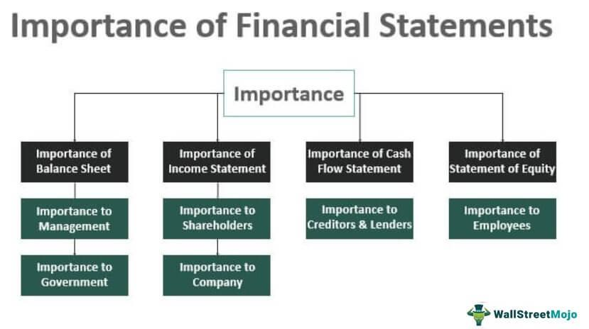

The landscape of financial markets is experiencing continual change driven by technological advancements and the integration of tools such as financial accounting and algorithmic trading. These developments are reshaping how financial activities are conducted, with significant implications for stakeholders. This article examines the intersection of financial accounting, lending, investment, and algorithmic trading, highlighting their collective benefits for lenders, investors, and the broader financial ecosystem.

Financial accounting plays a critical role by providing detailed and transparent insights into a company’s financial health, encompassing elements like profitability, liquidity, and solvency. These insights are vital for informed decision-making among investors and lenders, who rely on standardized accounting practices to ensure the consistency and comparability of financial information.



Algorithmic trading further enhances the financial landscape by improving market efficiency. It utilizes automated systems that execute trades based on predetermined criteria, offering increased speed, precision, and the ability to test strategies against historical data. The synergy between financial accounting and algorithmic trading supports enhanced transparency and operational efficiency, contributing to more strategic financial planning.

Understanding the interplay between these components is essential for leveraging their full potential. The integration of financial accounting and algorithmic trading within the financial sector not only supports better decision-making but also fosters improved operational efficiency and strategic foresight. This article aims to explore how the combination of these elements can maximize their benefits, ultimately contributing to more robust financial ecosystems.

## Table of Contents

## The Role of Financial Accounting in Investment and Lending

Financial accounting plays a pivotal role in investment and lending by serving as the foundation for informed decision-making. Its primary function is to offer a transparent and comprehensive view of a company’s financial health, which is critical for stakeholders aiming to evaluate aspects such as profitability, liquidity, and solvency.

Profitability is assessed using financial statements that detail a company’s revenue and expenses. The net income, derived from these financial reports, helps investors determine the potential return on investment. Liquidity measures a company's ability to meet its short-term obligations and is evaluated through ratios like the current ratio or quick ratio. The formula for the current ratio is:

$$
\text{Current Ratio} = \frac{\text{Current Assets}}{\text{Current Liabilities}}
$$

A high current ratio indicates sufficient asset coverage for liabilities, providing confidence to lenders about the company's short-term financial stability.

Solvency, on the other hand, measures long-term financial stability and is assessed using metrics such as the debt-to-equity ratio, calculated as:

$$
\text{Debt-to-Equity Ratio} = \frac{\text{Total Liabilities}}{\text{Shareholders' Equity}}
$$

A lower debt-to-equity ratio suggests the company is propelled more by its own capital rather than external financing, appealing to both investors and lenders concerned with long-term financial viability.

The adoption of standardized accounting practices ensures the consistency and comparability of financial statements. These practices, encapsulated in standards like the Generally Accepted Accounting Principles (GAAP) or International Financial Reporting Standards (IFRS), aid in the assessment of investment risks by maintaining uniformity in financial reporting across different companies. This uniformity is crucial, as it allows investors and lenders to compare financial data across different organizations effectively, facilitating better risk assessment and decision-making.

In summary, financial accounting supports investment and lending decisions by providing crucial financial insights through standardized, transparent reporting, enabling stakeholders to make informed evaluations regarding profitability, [liquidity](/wiki/liquidity-risk-premium), and solvency.

## Benefits to Lenders and Investors

Lenders and investors heavily rely on financial statements as vital tools for informed decision-making. For lenders, these statements offer crucial insights into the creditworthiness of potential borrowers. By focusing on liquidity ratios—such as the current ratio (current assets divided by current liabilities)—lenders measure a company's ability to meet short-term obligations. The leverage ratio, calculated as total debt divided by total equity, provides further understanding of a company's financial structure and potential risk of overleveraging.

Investors, on the other hand, utilize accounting reports to pinpoint potential growth opportunities and forecast dividend distributions. Key metrics such as earnings per share (EPS) offer a quantifiable measure of a company’s profitability, driving investment strategies. Additionally, the return on equity (ROE), which is net income divided by shareholder's equity, provides investors with an understanding of how efficiently a company is generating profit relative to its equity base.

Access to accurate financial data is indispensable for risk assessment, helping both lenders and investors to manage and mitigate risks effectively. By analyzing historical financial trends and projecting future performance, stakeholders can engage in strategic investment planning. This approach not only enhances portfolio diversification but also aligns with long-term investment goals.

Moreover, the consistency and comparability enforced by standardized accounting practices ensure that financial statements from different entities maintain uniformity, facilitating a clear assessment of investment risks. This transparency enables investors to conduct a comparative analysis across industry peers, optimizing decision-making processes. The precision of these assessments is increased further by technological advancements such as financial analytics software, which supports data-driven strategies for both investors and lenders.

## Algorithmic Trading: Enhancing Market Efficiency

Algorithmic trading, often referred to as algo trading, employs computerized systems to facilitate the automatic execution of trades, adhering to pre-defined criteria. This method predominantly relies on quantitative algorithms that analyze market data, predict price movements, and execute orders based on predefined strategies. The integration of these systems into financial markets brings several distinct advantages that enhance market efficiency.

Firstly, the speed and accuracy provided by [algorithmic trading](/wiki/algorithmic-trading) are unparalleled. Algorithms can process large datasets and execute trades in fractions of a second, significantly reducing latency and execution times compared to manual trading. This capability is crucial in high-frequency trading ([HFT](/wiki/high-frequency-trading-strategies)), where success is often determined by milliseconds. The precision of algorithmic trading minimizes the risk of human error, which can occur due to fatigue, miscalculation, or impulsive decision-making.

Another significant benefit is the unbiased nature of algorithmic trading, which removes human emotions from the equation. Emotions, such as fear and greed, can heavily influence manual trading decisions, often leading to suboptimal outcomes. By contrast, algorithms strictly adhere to their programmed strategies without deviation, ensuring consistent application of trading logic regardless of market conditions.

Algorithmic trading also facilitates the [backtesting](/wiki/backtesting) of strategies using historical data. This capability allows traders to evaluate the potential effectiveness of a strategy by simulating its performance in past market situations. Backtesting provides valuable insights and allows for the optimization of trading algorithms before they are deployed in live markets, reducing the likelihood of trading losses.

Furthermore, algorithmic trading is transforming financial markets by enabling large volumes of trades to be executed across various asset classes rapidly and precisely. The capacity to handle substantial volumes without error is essential for ensuring liquidity and maintaining market stability. Algorithms can react to market signals across equities, [forex](/wiki/forex-system), commodities, and other asset types simultaneously, providing a more interconnected and responsive trading environment.

An illustrative Python example to demonstrate algorithmic trading could be a simple moving average crossover strategy, where a short-term moving average crosses over a long-term moving average, triggering a buy signal:

```python
import pandas as pd

# Fetch historical data
data = pd.read_csv('historical_data.csv')
data['Short_MA'] = data['Close'].rolling(window=10).mean()  # 10-day moving average
data['Long_MA'] = data['Close'].rolling(window=50).mean()  # 50-day moving average

# Generate signals
data['Signal'] = 0
data['Signal'][10:] = np.where(data['Short_MA'][10:] > data['Long_MA'][10:], 1, 0)

# Calculate positions
data['Position'] = data['Signal'].diff()
```

This example highlights how basic trading algorithms can be structured using historical data to identify trade signals, showcasing the intersection of financial data analysis and trading execution that defines algo trading. The use of such models and their continuous evolution reinforces the positive impact of technology on market mechanisms, paving the way for further advancements in trading efficacy and market dynamics.

In conclusion, algorithmic trading significantly enhances market efficiency by leveraging speed, precision, emotion-free decision-making, and comprehensive backtesting. This transformative approach fosters a more resilient and efficient financial ecosystem capable of adapting to rapid shifts and opportunities in the global market landscape.

## How Financial Accounting Supports Algo Trading

Financial accounting is instrumental in supporting algorithmic trading by supplying essential data inputs for designing and executing robust trading models. These systems, which automate trading based on predefined criteria, depend heavily on accurate and timely financial information to function effectively.

Financial ratios, such as the price-to-earnings ratio (P/E), return on equity (ROE), and debt-to-equity ratio (D/E), are often calculated from financial statements. These quantitative measures play a crucial role in algorithmic trading strategies by helping traders assess a company's valuation, performance, and financial stability. For instance, a low P/E ratio might indicate that a stock is undervalued, making it a potential target for purchase by an algorithm designed to capitalize on undervalued opportunities.

Moreover, performance metrics derived from financial accounting—such as revenue growth, gross margins, and cash flow trends—inform predictive models that algorithms use to make trading decisions. By analyzing these metrics, algorithms can identify trends and anticipate future price movements, enabling more strategic and informed trading.

Standardized accounting principles, like Generally Accepted Accounting Principles (GAAP) or International Financial Reporting Standards (IFRS), ensure that the financial data feeding into these algorithms is both reliable and comparable across different companies and industries. This standardization minimizes risks associated with inaccurate or non-comparable data and supports the development of more precise trading models.

For example, an algorithmic trading strategy focused on [growth stocks](/wiki/growth-stocks) might include the following simplified Python snippet, which screens for companies with above-average revenue growth and strong ROE:

```python
import pandas as pd

# Sample data of companies: Revenue Growth (%) and Return on Equity (%)
data = {
    'Company': ['A', 'B', 'C', 'D'],
    'Revenue Growth': [15, 7, 12, 20],
    'ROE': [18, 11, 14, 22]
}

# Convert to DataFrame
df = pd.DataFrame(data)

# Define criteria for filtering growth stocks
revenue_growth_threshold = 10  # target revenue growth percentage
roe_threshold = 15  # target ROE percentage

# Filter companies meeting both criteria
selected_stocks = df[(df['Revenue Growth'] > revenue_growth_threshold) & (df['ROE'] > roe_threshold)]

print(selected_stocks)
```

In this code, companies are filtered based on their revenue growth and ROE, both derived from financial reports. This simplifies the initial stages of creating an algorithmic trading strategy focused on identifying promising growth stocks, highlighting how financial accounting data is foundational to the trading algorithms.

In summary, the transparency and comparability of accounting data foster more efficient algorithmic trading operations, allowing for better risk management and increased market efficacy. This synergy between financial accounting and algorithmic trading underscores the importance of reliable financial reporting in modern trading environments.

## Challenges and Considerations

Financial accounting and algorithmic trading, while integral to modern financial systems, present several challenges that need consideration to optimize their usage. One primary issue is the potential for accounting data to lack timely updates. In the rapidly changing financial markets, delays in financial information can hinder effective trading decisions. For instance, if a trader relies on quarterly financial data for decision-making, any lag in data release or revisions can lead to outdated analyses and increased risk. Addressing this requires the integration of more real-time data reporting mechanisms, possibly leveraging advancements in data technology to push for quicker updates.

On the technical side, algorithmic trading systems demand rigorous setup and constant monitoring to prevent technical glitches and systemic risks. Algorithms can execute trades within milliseconds, which necessitates a robust infrastructure to handle such speeds without error. A slight misconfiguration can lead to erroneous trades with significant financial implications. Moreover, algorithmic trading systems need to be safeguarded against systemic risks like flash crashes, where rapid algorithmic trades lead to sudden market dips. For example, the "Flash Crash" of May 6, 2010, demonstrates the potential [volatility](/wiki/volatility-trading-strategies) that algorithmic trading systems can introduce, leading to instantaneously wiping trillions of dollars in market value due to high-frequency trading glitches.

A comprehensive approach to mitigate these risks includes not only constant system audits and updates but also incorporating [machine learning](/wiki/machine-learning) algorithms that can adaptively respond to market changes and anomalies. Here is a simple Python script illustrating a basic adaptive mechanism in an algorithmic trading context:

```python
import random

def adjust_trade_strategy(market_condition, strategy_params):
    # Adjusts trading strategy based on market conditions
    learning_rate = 0.01
    if market_condition == 'volatile':
        # Increase risk-averse parameters
        strategy_params['risk_tolerance'] -= learning_rate
    elif market_condition == 'stable':
        # Increase aggressiveness parameters
        strategy_params['risk_tolerance'] += learning_rate
    return strategy_params

# Initial strategy parameters
strategy_params = {'risk_tolerance': 0.5}

# Simulate different market conditions
market_conditions = ['stable', 'volatile', 'stable', 'volatile']

# Adjust strategy over simulated conditions
for condition in market_conditions:
    strategy_params = adjust_trade_strategy(condition, strategy_params)
    print(f"Adjusted strategy parameters for {condition} market: {strategy_params}")
```

This code represents a rudimentary adaptive strategy to modify trading parameters based on perceived market conditions. The challenge is to integrate more sophisticated models that can autonomously adjust with greater precision and accuracy. Moreover, regulatory frameworks need to evolve to ensure these technologies do not pose excessive risk to market stability. Hence, a comprehensive blueprint that encompasses both technological advancements and regulatory support is necessary to address these challenges effectively.

## The Future of Financial Integration

As technology continues to evolve, the integration of financial accounting with automated trading systems is anticipated to become increasingly significant. This trend is marked by the growing implementation of [artificial intelligence](/wiki/ai-artificial-intelligence) (AI) and machine learning in algorithmic trading, which promises to advance data analytics, operational efficiency, and market forecasting.

AI and machine learning in algorithmic trading can process vast amounts of financial data in real time, identifying patterns and trends that are not immediately apparent to human traders. By leveraging these technologies, trading models can be adapted and refined continuously, ensuring that decisions are based on the most up-to-date and comprehensive information available. This capability not only enhances the speed and accuracy of trades but also minimizes risks by allowing for pre-emptive adjustments to trading strategies in response to dynamic market conditions.

Another key development in the future of financial integration is the anticipated increase in market transparency. As more sophisticated trading algorithms are deployed, regulations are likely to evolve to ensure fairness and prevent manipulation. These regulatory changes will aim to provide a level playing field, where transparent accounting practices and rigorous reporting standards underpin financial transactions. This transparency enables market participants to make more informed decisions, fostering trust and stability in financial markets.

Strategic partnerships between financial service providers are expected to play a critical role in this evolving landscape. Collaboration between banks, technology firms, and regulatory bodies can lead to the development of shared platforms and standards, facilitating seamless integration and interoperability between different systems. Such partnerships can drive innovation and increase the resilience of financial networks, ensuring that the benefits of technological advancements are widely distributed across the financial ecosystem.

In conclusion, the future of financial integration points toward a more interconnected and technologically-driven financial landscape, where AI and machine learning play pivotal roles in enhancing trading operations. By embracing these advancements, the financial sector can achieve new heights of efficiency, transparency, and cooperation, paving the way for more robust markets.

## Conclusion

Combining financial accounting with algorithmic trading results in a powerful synergy that optimizes benefits for both investors and lenders. Financial accounting provides a foundation of reliability and transparency, which are essential in making informed decisions within the fast-paced environment of trading. These accounting practices offer detailed insights into financial health, critical for evaluating investment risks and opportunities. Accurate accounting data aids in executing well-informed strategies by minimizing risk and maximizing potential returns.

Algorithmic trading further enhances the effectiveness of financial decision-making by utilizing this reliable data to automate trade execution. Algorithms, often designed using financial ratios and metrics derived from accounting data, serve to eliminate human error, bias, and delay, thus increasing operational efficiency. This integration supports large-scale trade processing, offering improved speed and accuracy and ensuring a stable link between financial insights and market actions.

Addressing the inherent challenges in this synergy, such as sluggish data updates and technical vulnerabilities, remains crucial. Continuous innovation in financial technologies, including the advancement of AI and machine learning, is essential for overcoming these barriers. Such developments promise to refine data analysis, enhance prediction accuracy, and streamline operations, consequently fostering healthier market environments.

Overall, this integration signifies a promising trajectory towards more robust financial models and efficient markets, ultimately benefiting all stakeholders involved.

## References & Further Reading

[1]: Bergstra, J., Bardenet, R., Bengio, Y., & Kégl, B. (2011). ["Algorithms for Hyper-Parameter Optimization."](https://dl.acm.org/doi/10.5555/2986459.2986743) Advances in Neural Information Processing Systems 24.

[2]: ["Advances in Financial Machine Learning"](https://www.amazon.com/Advances-Financial-Machine-Learning-Marcos/dp/1119482089) by Marcos Lopez de Prado

[3]: ["Evidence-Based Technical Analysis: Applying the Scientific Method and Statistical Inference to Trading Signals"](https://www.amazon.com/Evidence-Based-Technical-Analysis-Scientific-Statistical/dp/0470008741) by David Aronson

[4]: ["Machine Learning for Algorithmic Trading"](https://github.com/stefan-jansen/machine-learning-for-trading) by Stefan Jansen

[5]: ["Quantitative Trading: How to Build Your Own Algorithmic Trading Business"](https://www.amazon.com/Quantitative-Trading-Build-Algorithmic-Business/dp/1119800064) by Ernest P. Chan