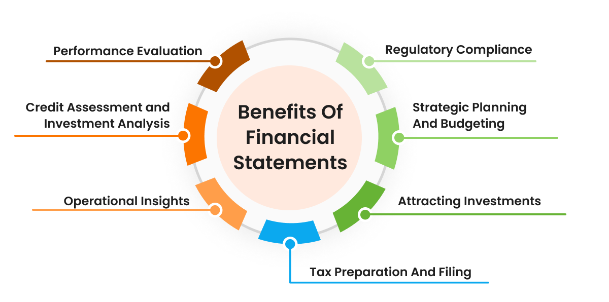

## Table of Contents

## What is financial accounting?

Financial accounting is the process of recording, summarizing, and reporting a company's financial transactions. It helps businesses keep track of their money and show how they are doing financially to people outside the company, like investors and the government. The main goal is to create financial statements that follow specific rules and are clear and accurate.

These financial statements include things like the income statement, which shows if the company made or lost money, the balance sheet, which shows what the company owns and owes, and the cash flow statement, which shows how money moves in and out of the business. By using financial accounting, companies can make sure they are following the law and giving a true picture of their financial health to anyone who needs to see it.

## How does financial accounting differ from managerial accounting?

Financial accounting and managerial accounting both deal with a company's finances, but they have different goals and audiences. Financial accounting focuses on creating reports for people outside the company, like investors, creditors, and the government. These reports follow strict rules and standards, so everyone can understand and trust them. The main reports are the income statement, balance sheet, and cash flow statement, which show how the company is doing overall.

On the other hand, managerial accounting is all about helping people inside the company make decisions. It doesn't have to follow the same strict rules as financial accounting, so managers can use it to look at specific parts of the business. They might use it to figure out how much it costs to make a product, plan a budget, or see if a new project will make money. The reports are more detailed and customized to what the managers need to know.

In short, financial accounting gives a clear, standardized view of the company's financial health for outsiders, while managerial accounting gives detailed, flexible information to help managers run the business better. Both are important, but they serve different purposes and have different audiences.

## What are the basic financial statements used in financial accounting?

The basic financial statements used in financial accounting are the income statement, the balance sheet, and the cash flow statement. The income statement shows if the company made money or lost money over a certain time, like a year. It lists all the money the company earned and all the money it spent. If the company earned more than it spent, it has a profit. If it spent more than it earned, it has a loss.

The balance sheet is a snapshot of what the company owns and owes at a specific time. It has two main parts: assets, which are things the company owns like cash or buildings, and liabilities, which are things the company owes, like loans. The difference between assets and liabilities is called equity, which is the value of the company that belongs to the owners.

The cash flow statement shows how money moves in and out of the business. It's divided into three parts: operating activities, which show money from the company's main business; investing activities, which show money spent on or earned from investments like buying equipment; and financing activities, which show money from loans or from the owners. This statement helps people see where the company's cash is coming from and going to.

## How can investors use financial statements to make investment decisions?

Investors can use financial statements to make smart choices about where to put their money. By looking at the income statement, investors can see if a company is making a profit or losing money. If a company keeps making profits, it might be a good investment. The income statement also shows how much money the company is making from its main business, which can tell investors if the company is growing or not.

The balance sheet helps investors understand what the company owns and owes. If a company has a lot of assets and not too much debt, it might be a safer investment. Investors can also look at the equity on the balance sheet to see how much of the company's value belongs to the owners. This can help them decide if the company is worth investing in.

The cash flow statement is also important because it shows how money is moving in and out of the company. Investors can see if the company has enough cash to pay its bills and if it's spending money wisely on things like new equipment. If a company has good cash flow, it might be a good sign that it can keep growing and paying dividends to investors. By looking at all these statements together, investors can get a full picture of a company's financial health and make better investment decisions.

## What key financial ratios should investors look at when analyzing a company?

Investors should look at several key financial ratios when analyzing a company to get a better idea of its financial health and performance. One important ratio is the price-to-earnings (P/E) ratio, which compares the company's stock price to its earnings per share. A lower P/E ratio might mean the stock is a good deal, while a higher P/E ratio could mean the stock is expensive. Another useful ratio is the debt-to-equity ratio, which shows how much the company relies on borrowed money. A high debt-to-equity ratio could mean the company is risky because it has a lot of debt to pay back.

Other ratios investors should consider are the return on equity (ROE) and the current ratio. ROE measures how well the company is using the money invested by shareholders to generate profit. A high ROE is usually a good sign that the company is making good use of its money. The current ratio compares the company's current assets to its current liabilities and shows if the company can pay its short-term bills. A current ratio higher than 1 means the company has enough assets to cover its short-term debts, which is a positive sign for investors. By looking at these ratios, investors can make smarter choices about where to put their money.

## How does financial accounting help in assessing a company's profitability?

Financial accounting helps investors and business owners figure out if a company is making money or not by looking at the income statement. This statement shows how much money the company made from selling things and how much it spent to run the business. If the money coming in is more than the money going out, the company is profitable. This means it's making a profit, which is a good sign for investors because it shows the business is doing well. By looking at the income statement over time, people can see if the company is getting better at making money or if it's struggling.

Another way financial accounting helps assess profitability is through the use of financial ratios, like the return on equity (ROE). ROE tells you how well the company is using the money that shareholders have put into the business to make a profit. A high ROE means the company is good at turning shareholder money into more money, which is a sign of strong profitability. By using these tools from financial accounting, investors can get a clear picture of how profitable a company is and make better decisions about where to invest their money.

## What role does financial accounting play in evaluating a company's liquidity?

Financial accounting helps people understand if a company can pay its short-term bills by looking at the balance sheet and using something called the current ratio. The balance sheet shows what the company owns and owes right now. The current ratio compares the company's current assets, like cash and things that can be turned into cash quickly, to its current liabilities, which are the bills it needs to pay soon. If the current ratio is more than 1, it means the company has enough assets to cover its short-term debts, which is a good sign that the company is liquid.

Another way financial accounting helps with liquidity is through the cash flow statement. This statement shows how money moves in and out of the company. By looking at the cash flow from operating activities, investors can see if the company is making enough money from its main business to pay its bills. If the company has positive cash flow from operations, it's a good sign that it can handle its short-term financial needs. By using these tools from financial accounting, people can get a clear picture of a company's liquidity and make better decisions about investing in it.

## How can lenders use financial accounting information to assess creditworthiness?

Lenders can use financial accounting information to see if a company is a good bet for a loan. They look at the balance sheet to see what the company owns and owes. If the company has a lot of assets and not too much debt, it might be a safer bet. Lenders also check the debt-to-equity ratio, which shows how much the company relies on borrowed money. A lower ratio means the company isn't too deep in debt, which is a good sign for lenders.

Another important thing lenders look at is the income statement. This shows if the company is making money or losing it. If the company is profitable, it's more likely to pay back the loan. Lenders also use the cash flow statement to see how money moves in and out of the business. If the company has good cash flow, it means it can pay its bills and the loan on time. By looking at all these financial statements, lenders can decide if a company is creditworthy and likely to pay back the money they borrow.

## What are the implications of financial accounting standards on investment analysis?

Financial accounting standards are important rules that companies have to follow when they make their financial statements. These rules make sure that the information in the statements is clear and the same for all companies. This helps investors because they can trust the numbers and compare different companies easily. If companies didn't follow these standards, it would be hard for investors to know if the information is right or if they can compare one company to another.

When investors look at a company, they use the financial statements to make decisions. The standards make sure that the statements show a true picture of the company's money situation. This means investors can see if a company is making money, if it has enough cash, and if it can pay its bills. Without these standards, investors might not trust the information and could make bad choices about where to put their money. So, financial accounting standards help investors feel more sure about their investment choices.

## How do changes in accounting policies affect the interpretation of financial statements?

When a company changes its accounting policies, it can make the financial statements look different. This is because accounting policies are the rules a company uses to record and report its money. If a company decides to use a new rule, like changing how it counts its inventory, the numbers in the financial statements will change. This can make it hard for investors to compare the new statements with the old ones. They might think the company is doing better or worse than it really is, just because of the new rule.

To help with this, companies have to explain any changes in their accounting policies in their financial reports. They need to say why they made the change and how it affects the numbers. This way, investors can understand what's going on and adjust their analysis. But even with these explanations, changes in accounting policies can still make it tricky to see the true financial health of a company over time. It's important for investors to pay close attention to these changes and think about how they might affect their investment decisions.

## What advanced techniques can be used to analyze financial statements for investment purposes?

One advanced technique for analyzing financial statements is ratio analysis. This involves looking at different numbers from the financial statements and comparing them to see how the company is doing. For example, investors can use the price-to-earnings (P/E) ratio to see if a company's stock is a good deal compared to its earnings. They can also look at the return on equity (ROE) to see how well the company is using the money from shareholders to make a profit. By using these ratios, investors can get a better idea of the company's financial health and make smarter investment choices.

Another technique is trend analysis, which looks at how the company's financial numbers change over time. By comparing the income statement, balance sheet, and cash flow statement from different years, investors can see if the company is growing or if it's having problems. For example, if the company's profits are going up every year, it might be a good sign that the business is doing well. Trend analysis helps investors see the bigger picture and understand if the company's financial performance is getting better or worse. By using these advanced techniques, investors can make more informed decisions about where to put their money.

## How can investors and lenders use financial accounting to predict future financial performance?

Investors and lenders can use financial accounting to predict a company's future financial performance by looking at past financial statements and using different techniques to see patterns. One way is to do trend analysis, which means looking at the income statement, balance sheet, and cash flow statement over several years. By seeing how the company's profits, assets, and cash flow have changed over time, investors and lenders can guess if the company will keep growing or if it might run into problems. If the company's profits are going up every year, it might be a good sign that it will keep doing well in the future.

Another way is to use financial ratios, like the price-to-earnings (P/E) ratio and return on equity (ROE). These ratios help investors and lenders see how the company is doing compared to other companies or to its own past performance. For example, a low P/E ratio might mean the stock is a good deal, and a high ROE shows that the company is good at making money from the money shareholders have put in. By using these ratios and looking at the financial statements, investors and lenders can get a better idea of how the company might do in the future and make smarter decisions about investing or lending money.

## What is the Role of Financial Accounting in Investment and Lending?

Financial accounting plays a pivotal role in investment and lending by serving as the foundation for informed decision-making. Its primary function is to offer a transparent and comprehensive view of a company’s financial health, which is critical for stakeholders aiming to evaluate aspects such as profitability, liquidity, and solvency.

Profitability is assessed using financial statements that detail a company’s revenue and expenses. The net income, derived from these financial reports, helps investors determine the potential return on investment. Liquidity measures a company's ability to meet its short-term obligations and is evaluated through ratios like the current ratio or quick ratio. The formula for the current ratio is:

$$
\text{Current Ratio} = \frac{\text{Current Assets}}{\text{Current Liabilities}}
$$

A high current ratio indicates sufficient asset coverage for liabilities, providing confidence to lenders about the company's short-term financial stability.

Solvency, on the other hand, measures long-term financial stability and is assessed using metrics such as the debt-to-equity ratio, calculated as:

$$
\text{Debt-to-Equity Ratio} = \frac{\text{Total Liabilities}}{\text{Shareholders' Equity}}
$$

A lower debt-to-equity ratio suggests the company is propelled more by its own capital rather than external financing, appealing to both investors and lenders concerned with long-term financial viability.

The adoption of standardized accounting practices ensures the consistency and comparability of financial statements. These practices, encapsulated in standards like the Generally Accepted Accounting Principles (GAAP) or International Financial Reporting Standards (IFRS), aid in the assessment of investment risks by maintaining uniformity in financial reporting across different companies. This uniformity is crucial, as it allows investors and lenders to compare financial data across different organizations effectively, facilitating better risk assessment and decision-making.

In summary, financial accounting supports investment and lending decisions by providing crucial financial insights through standardized, transparent reporting, enabling stakeholders to make informed evaluations regarding profitability, [liquidity](/wiki/liquidity-risk-premium), and solvency.

## References & Further Reading

[1]: Bergstra, J., Bardenet, R., Bengio, Y., & Kégl, B. (2011). ["Algorithms for Hyper-Parameter Optimization."](https://dl.acm.org/doi/10.5555/2986459.2986743) Advances in Neural Information Processing Systems 24.

[2]: ["Advances in Financial Machine Learning"](https://www.amazon.com/Advances-Financial-Machine-Learning-Marcos/dp/1119482089) by Marcos Lopez de Prado

[3]: ["Evidence-Based Technical Analysis: Applying the Scientific Method and Statistical Inference to Trading Signals"](https://www.amazon.com/Evidence-Based-Technical-Analysis-Scientific-Statistical/dp/0470008741) by David Aronson

[4]: ["Machine Learning for Algorithmic Trading"](https://github.com/stefan-jansen/machine-learning-for-trading) by Stefan Jansen

[5]: ["Quantitative Trading: How to Build Your Own Algorithmic Trading Business"](https://www.amazon.com/Quantitative-Trading-Build-Algorithmic-Business/dp/1119800064) by Ernest P. Chan