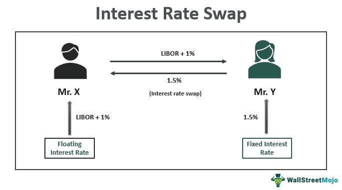

Financial derivatives are pivotal in modern finance, functioning as essential instruments for risk management and strategic investment. Among these, interest rate swaps are widely utilized by corporations and financial institutions to manage exposure to fluctuating interest rates. At its core, an interest rate swap involves two parties agreeing to exchange sequences of interest payments based on a specified notional principal amount. This exchange often features the conversion of fixed interest payments into floating rate payments, or vice versa, thereby allowing entities to tailor their financial obligations in line with prevailing market conditions.

Interest rate swaps are particularly valuable in hedging against interest rate risks. By enabling the transformation of variable rate liabilities into fixed-rate ones, companies can achieve greater predictability in interest expenses, thus stabilizing cash flows and enhancing budget accuracy. For instance, a corporation anticipating an upward movement in interest rates might leverage a swap to lock in current lower fixed rates, safeguarding its financial position against potential cost increments.



Algorithmic trading has revolutionized the execution of financial strategies, particularly those involving derivatives like interest rate swaps. Through the implementation of advanced algorithms, this approach automates the trading process, significantly boosting the speed, precision, and efficiency of transactions. By integrating algorithmic techniques, traders can execute complex trading strategies seamlessly, ensuring optimal timing and execution with reduced human error.

This article examines the interconnection between financial derivatives, interest rate swaps, corporate finance practices, and the role of algorithmic trading in enhancing the execution of these financial instruments. By understanding how these elements interact, stakeholders can better navigate the complexities of today's dynamic financial environment.

## Table of Contents

## Understanding Financial Derivatives

Financial derivatives are financial instruments whose value is derived from underlying assets or benchmarks, such as commodities, currencies, equities, and interest rates. These instruments are essential in financial markets, offering a range of mechanisms to manage risk, improve investment strategies, and take advantage of price differentials across markets.

There are several key types of financial derivatives, each serving distinct roles in financial markets:

1. **Futures**: Futures contracts are standardized agreements to buy or sell an asset at a predetermined price at a specified time in the future. These contracts are traded on exchanges and are commonly used to hedge against price fluctuations in commodities, currencies, or financial indices.

2. **Options**: Options provide the holder the right, but not the obligation, to buy or sell an asset at a specific price on or before a certain date. They come in two varieties: call options, which allow the purchase of the asset, and put options, which allow the sale of the asset. Options are versatile tools that can be used for hedging, speculation, or generating income through premium collection.

3. **Swaps**: Swaps involve the exchange of cash flows or liabilities between two parties. The most common type is the interest rate swap, where fixed and floating interest rate payments are exchanged to manage exposure to interest rate fluctuations. Swaps can also involve currencies, commodities, or other financial instruments.

4. **Forwards**: Forwards are customizable contracts between two parties to buy or sell an asset at a predetermined price at a future date. Unlike futures, forwards are not traded on exchanges and are typically utilized for hedging in corporate finance or for speculative purposes.

The versatility of derivatives allows them to serve three primary functions in financial markets:

- **Risk Management**: Derivatives enable market participants to hedge against adverse price movements, such as fluctuations in interest rates, currency exchange rates, or commodity prices. By locking in prices or adjusting exposure, businesses can mitigate risks related to their core operations.

- **Speculation**: Speculators use derivatives to bet on future movements in asset prices with the potential for significant returns. While this entails risk, the leverage afforded by derivatives can heighten the impact of price movements on investments.

- **Arbitrage**: Traders exploit price discrepancies between markets or instruments through arbitrage. Derivatives facilitate this by allowing simultaneous transactions aimed at capturing price differentials, thereby contributing to market efficiency.

Overall, derivatives are integral to modern financial systems, providing flexibility and opportunities for a myriad of trading and investment strategies, while also playing a critical role in enhancing market [liquidity](/wiki/liquidity-risk-premium) and price discovery.

## What is an Interest Rate Swap?

An [interest rate](/wiki/interest-rate-trading-strategies) swap is a financial instrument used extensively to manage interest rate risk and optimize funding costs. Fundamentally, it is a contractual agreement between two parties to exchange streams of interest payments, usually over a specified period, based on a notional principal amount. This principal amount is not exchanged between the parties; it serves solely as a reference for calculating the interest payments.

The most common structure of an interest rate swap is the exchange of fixed-rate interest payments for floating-rate payments, often linked to a benchmark interest rate such as the London Interbank Offered Rate (LIBOR) or its successors like the Secured Overnight Financing Rate (SOFR). This typical swap agreement can be represented by two primary components:

1. **Fixed Leg**: One party agrees to pay a fixed interest rate on the notional principal for the duration of the swap. The fixed rate is determined at the inception of the swap.

2. **Floating Leg**: The counterparty agrees to pay a floating interest rate that resets periodically, based on a predefined benchmark rate plus (or minus) a spread. The floating rate is recalculated at each reset date to align with current market conditions.

The primary motivation for engaging in interest rate swaps is to hedge against fluctuations in interest rates, providing financial stability. For example, a corporation with a floating rate loan can use an interest rate swap to convert its floating rate obligations into fixed-rate liabilities, thereby locking in its interest expenses and protecting against rising rates. Conversely, a company with fixed-rate debt might engage in a swap to pay floating rates if it anticipates a decline in interest rates, potentially lowering its financing costs.

This risk management capability underscores the attractiveness of interest rate swaps, allowing businesses and financial institutions to tailor their interest payment structures according to their preferences and market expectations. Additionally, these swaps offer cost-effective solutions for managing exposures compared to issuing new debt or restructuring existing obligations, making them an essential tool for sophisticated corporate finance strategies.

## Types of Interest Rate Swaps

Interest rate swaps are versatile financial instruments that allow parties to exchange cash flows, typically to manage their interest rate exposure. There are several types of interest rate swaps, each designed to cater to different financial strategies and objectives.

**Fixed-to-Floating Swaps**: These swaps involve exchanging fixed interest rate payments for floating rate payments. The fixed rate payer agrees to pay a predetermined, constant interest rate on a notional principal amount, while the floating rate payer makes payments based on a variable interest rate index, such as LIBOR (London Interbank Offered Rate). This type of swap is often used by entities with fixed-rate liabilities who wish to benefit from potentially lower short-term interest rates or hedge against rising rates.

Mathematically, in a fixed-to-floating swap:

$$
\text{Fixed Payment} = \text{Notional} \times \text{Fixed Rate} \times \frac{\text{Days}}{360}
$$

$$
\text{Floating Payment} = \text{Notional} \times \text{Floating Rate} \times \frac{\text{Days}}{360}
$$

Where "Days" represents the number of days in the interest period.

**Floating-to-Fixed Swaps**: This swap is essentially the inverse of a fixed-to-floating swap. In this arrangement, a party swaps floating interest payments for fixed rate payments. Floating-to-fixed swaps are typically used by entities with floating-rate liabilities that prefer the predictability and security of fixed payments, especially if they anticipate rising interest rates.

**Basis Swaps**: Basis swaps involve the exchange of two sets of floating rate payments, each tied to a different benchmark. This kind of swap is useful for parties needing to switch exposure between different floating rate indices, for example, from LIBOR to an overnight index swap (OIS) rate or between currencies. Basis swaps can be complex, involving adjustments for differing interest periods and fixing dates.

The payment structure of a basis swap can be illustrated through:

$$
\text{Payment 1} = \text{Notional} \times \text{Floating Rate 1} \times \frac{\text{Days}}{360}
$$

$$
\text{Payment 2} = \text{Notional} \times \text{Floating Rate 2} \times \frac{\text{Days}}{360}
$$

Where "Floating Rate 1" and "Floating Rate 2" are the indices involved in the swap.

Each type of swap offers distinct advantages, allowing participants to tailor their interest rate exposure according to market expectations and financial objectives. They provide the flexibility needed to manage debt and investment portfolios efficiently, particularly in volatile or unpredictable economic environments.

## Real-World Examples of Interest Rate Swaps

Interest rate swaps serve as vital instruments for corporate financial risk management, particularly for mitigating exposure to interest rate fluctuations. Large multinational companies, such as PepsiCo, employ these derivatives to manage and stabilize their cash flows and financial outlook.

For example, a company like PepsiCo may have significant amounts of variable-rate debt. If interest rates rise, the company faces increased interest expenses, potentially impacting profitability. By entering into an interest rate swap agreement, PepsiCo can swap these variable-rate payments for fixed-rate payments. This effectively transforms a potentially volatile cash flow into a more predictable and stable financial obligation.

The structure of an interest rate swap can be expressed algebraically as follows: if a company pays interest at a floating rate, say $L$ (LIBOR) plus a spread, they might swap this payment for a fixed rate $F$. Thus, the net cash flow alteration for a period would be:

$$
\text{Cash Flow} = (\text{Fixed Rate Payment}) - (\text{Floating Rate Payment})
$$

Where:

- Fixed Rate Payment is calculated as $F \times \text{Notional Principal}$
- Floating Rate Payment is calculated as $(L + \text{Spread}) \times \text{Notional Principal}$

This mathematical arrangement allows a company to hedge against rising interest rates by locking in fixed rates, ensuring a more predictable financial performance. PepsiCo's strategic use of interest rate swaps illustrates the utility of these instruments in corporate finance, providing a mechanism to stabilize financial forecasts and protect against unfavorable interest rate movements. By transforming variable-rate debt into fixed-rate obligations, companies can maintain better control over their financial strategies and outcomes.

## The Role of Interest Rate Swaps in Algo Trading

Algorithmic trading has transformed the financial landscape by automating trading processes based on predefined strategies. This automation extends to the trading of financial derivatives, including interest rate swaps, which involve exchanging interest payment streams between parties. Incorporating interest rate swaps into algo trading systems significantly improves risk management and trading efficiency by employing sophisticated algorithms to navigate the complexities of interest rate fluctuations.

Interest rate swaps in algo trading systems allow traders to automate the decision-making process when managing or hedifying portfolios against interest rate risks. For instance, these algorithms can automatically identify [arbitrage](/wiki/arbitrage) opportunities created by the differential between fixed and floating interest rates, optimizing the timing and execution of the swaps.

Algorithmic trading systems can enhance the precision of interest rate swap transactions by using data-driven strategies. These strategies can analyze vast datasets, identify patterns in interest rate movements, and execute swaps at the optimal time to leverage these insights, ensuring that traders capitalize on favorable rate environments while minimizing exposure during adverse conditions. This automated precision also reduces the operational costs and timing delays associated with manual trading, thereby increasing overall market efficiency.

Risk management is a critical function where [algorithmic trading](/wiki/algorithmic-trading) elevates the use of interest rate swaps. Algorithms can dynamically adjust the hedge ratios in real-time as market conditions evolve. For example, an algo may constantly recalibrate to maintain a balance between fixed and floating rate exposures, ensuring that the portfolio remains within the risk parameters set by the traders. 

Moreover, interest rate swaps integrated into algorithmic trading are often part of more complex trading strategies that include various derivatives. Here, algorithms coordinate the layered strategies and ensure that each component, such as a swap, options, or futures, functions cohesively to achieve the overall financial objectives.

The following is a simplified example of how an algorithm could be structured to execute an interest rate swap strategy in Python:

```python
import numpy as np

def calculate_swap_rate(fixed_rate, floating_rate):
    """
    Simulates the calculation of a swap spread between fixed and floating rates.
    fixed_rate: Fixed interest rate percentage
    floating_rate: Floating interest rate percentage
    """
    return fixed_rate - floating_rate

def execute_swap(fixed_rate, floating_rate, threshold=0.5):
    """
    Executes a swap if the calculated swap rate exceeds a certain threshold.
    threshold: The minimum rate differential at which the swap is considered profitable
    """
    swap_rate = calculate_swap_rate(fixed_rate, floating_rate)

    if swap_rate > threshold:
        print(f"Executing swap: Fixed Rate {fixed_rate} > Floating Rate {floating_rate}")
        return True  # Swap executed
    else:
        print("No execution: Threshold not met.")
        return False

# Example usage
fixed_rate = 3.0
floating_rate = 2.4
execute_swap(fixed_rate, floating_rate)
```

In conclusion, integrating interest rate swaps into algorithmic trading systems amplifies market efficiencies by enabling automated, precise, and cost-effective management of interest rate risks. As these algorithms continue to evolve, their capacity to enhance the effectiveness of interest rate swaps in hedging and speculative applications in financial markets will invariably increase.

## Conclusion

Interest rate swaps play a critical role in the financial markets as they provide an effective tool for managing financial exposure. By exchanging streams of interest payments, organizations can significantly reduce their vulnerability to fluctuations in interest rates, offering both stability and predictability in financial outcomes. This capability is essential for companies aiming to lock in certain borrowing costs and manage cash flows more securely.

Algorithmic trading has revolutionized how these swaps can be utilized by offering automation and enhanced precision in executing trades. The integration of interest rate swaps into algorithmic trading systems allows for more sophisticated risk management strategies, which can respond swiftly to market changes. This integration enhances the efficiency of managing interest rate risks, compounding the benefits already intrinsic to interest rate swaps.

For participants in today’s fast-paced financial markets, having a firm grasp of interest rate swaps is crucial. As financial markets grow increasingly complex and volatile, the ability to understand and effectively employ these instruments can provide a significant competitive edge. This knowledge allows market participants to tailor their financial strategies optimally, paving the way for more robust financial planning and performance.

In conclusion, interest rate swaps are indispensable tools in modern finance, offering unmatched flexibility and efficiency in managing interest rate risks. Their integration with algorithmic trading further augments their utility, making them vital components of contemporary financial strategies. Understanding these swaps and their potential benefits is imperative for anyone involved in the financial sector, ensuring informed decision-making and strategic advantage.

## References & Further Reading

The following resources offer valuable insights into the complex field of financial derivatives, interest rate swaps, and algorithmic trading. These references are instrumental for anyone looking to deepen their understanding of financial engineering and [machine learning](/wiki/machine-learning) applications in finance.

- **Principles of Financial Engineering by Salih N. Neftci**: This book provides a comprehensive overview of financial engineering, covering fundamental concepts and practical applications. It delves into the construction and application of financial instruments, including derivatives such as options, swaps, and futures. Neftci's text is invaluable for understanding the mathematical and theoretical foundations that underpin the diverse array of financial products and strategies employed worldwide.

- **Interest Rate Swaps and Other Derivatives by Howard Corb**: Howard Corb's book is a detailed guide to interest rate derivatives, offering a nuanced exploration of both standard and complex interest rate products. The text explains the mechanics and usage of interest rate swaps, providing readers with practical examples and strategies for managing interest rate risk. Corb's work is a critical resource for finance professionals involved in or considering the use of interest rate swaps to stabilize and optimize their financial performances.

- **Advances in Financial Machine Learning by Marcos Lopez de Prado**: This book addresses the intersection of machine learning and finance, presenting cutting-edge methods to improve trading strategies and manage risk in the financial markets. Lopez de Prado introduces advanced algorithms and techniques that are increasingly integral to the execution of sophisticated trading strategies, including those involving interest rate swaps. This resource provides a practical approach to implementing machine-learning techniques in finance, complete with examples and code snippets, particularly in Python, to guide practitioners in applying these concepts to real-world financial problems. 

These references collectively furnish a robust framework for understanding the theoretical and practical aspects of derivatives and algorithmic trading, equipping readers with the tools necessary to navigate and innovate within modern financial markets.

