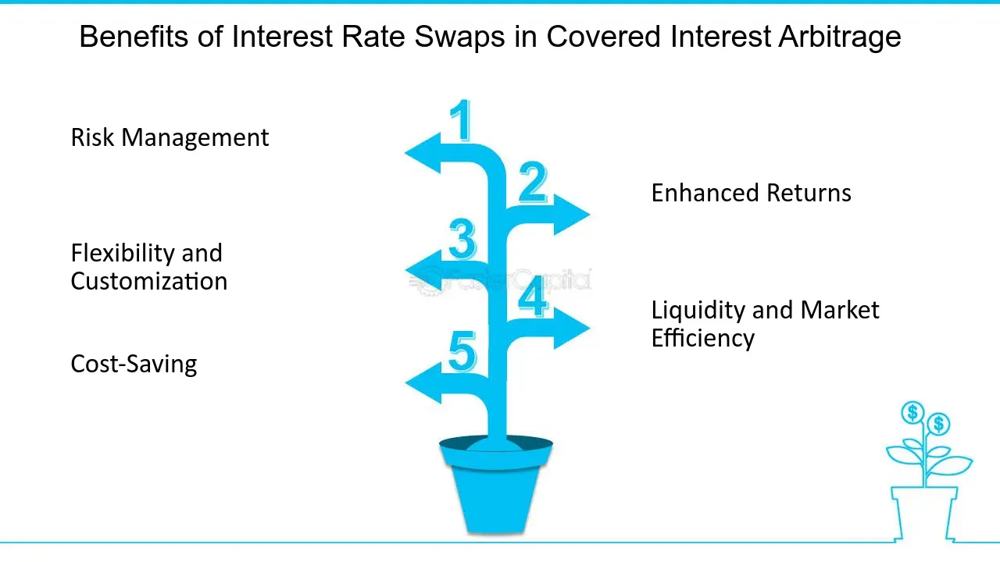

## Table of Contents

## What is an interest rate swap?

An interest rate swap is a financial agreement between two parties to exchange interest payments over a certain period. One party agrees to pay a fixed interest rate, while the other pays a floating interest rate, which can change over time. This swap helps both parties manage their exposure to interest rate fluctuations. For example, a company with a loan that has a variable interest rate might use an interest rate swap to switch to a fixed rate, giving them more predictable payments.

Interest rate swaps are commonly used by businesses and financial institutions to hedge against interest rate risks. They can also be used to speculate on future changes in interest rates. The terms of the swap, including the notional principal amount, the fixed rate, and the floating rate index, are agreed upon at the start. The notional principal amount is the hypothetical amount used to calculate the interest payments, but it's not actually exchanged between the parties. This makes interest rate swaps a flexible tool for managing financial risk.

## How do interest rate swaps work?

An interest rate swap is like a deal between two people or companies where they agree to swap the way they pay interest on some money. One person agrees to pay a fixed interest rate, which stays the same no matter what happens. The other person pays a floating interest rate, which can go up or down based on what's happening in the market. They don't actually swap the money itself, just the interest payments. For example, if you have a loan with a floating rate and you want it to be fixed, you can use an interest rate swap to make that happen.

The swap works by setting a pretend amount of money, called the notional principal, that they use to figure out how much interest to swap. They decide on this amount, the fixed rate, and which floating rate they'll use at the beginning. Then, every so often, like every month or every year, they calculate how much interest each should pay based on these rates and swap the difference. This helps them manage their money better because it can protect them from sudden changes in interest rates or help them take advantage of those changes if they think they know where rates are headed.

## What are the basic types of interest rate swaps?

There are two main types of [interest rate](/wiki/interest-rate-trading-strategies) swaps: fixed-for-floating swaps and basis swaps. In a fixed-for-floating swap, one party agrees to pay a fixed interest rate on a notional amount, while the other party pays a floating interest rate on the same notional amount. This type of swap is very common and helps businesses and financial institutions manage their exposure to interest rate changes. For example, if a company has a loan with a floating rate and they want to make their payments more predictable, they might enter into a fixed-for-floating swap to switch to a fixed rate.

The other type, a basis swap, involves exchanging one type of floating rate for another floating rate. Both parties pay floating rates, but these rates are based on different benchmarks or indexes. This can be useful when the parties have different views on how different interest rate benchmarks will move relative to each other. For instance, one party might pay interest based on the LIBOR rate, while the other pays based on the federal funds rate. Basis swaps help manage the risk that comes from having loans or investments tied to different floating rate indexes.

## Why might a company consider using an interest rate swap?

A company might consider using an interest rate swap to make their loan payments more predictable. If a company has a loan with a floating interest rate, their payments can change if interest rates go up or down. By using an interest rate swap, they can switch to paying a fixed rate instead. This means they know exactly how much they'll pay each month, which helps them plan their budget better and avoid surprises if interest rates go up.

Another reason a company might use an interest rate swap is to take advantage of their predictions about where interest rates are headed. If a company thinks interest rates are going to go down, they might want to keep their loan at a floating rate. But if they think rates are going up, they might use a swap to lock in a fixed rate now. This way, they can save money if their predictions are right. Interest rate swaps give companies a way to manage their money more smartly by protecting themselves from rate changes or trying to benefit from them.

## What are the potential benefits of interest rate swaps for companies?

Interest rate swaps can help companies make their loan payments more predictable. If a company has a loan with a floating interest rate, the payments can change if interest rates go up or down. By using an interest rate swap, the company can switch to paying a fixed rate instead. This means they know exactly how much they'll pay each month, which helps them plan their budget better and avoid surprises if interest rates go up. It's like turning a variable expense into a fixed one, which makes financial planning easier.

Another benefit of interest rate swaps is that they allow companies to take advantage of their predictions about where interest rates are headed. If a company thinks interest rates are going to go down, they might want to keep their loan at a floating rate. But if they think rates are going up, they might use a swap to lock in a fixed rate now. This way, they can save money if their predictions are right. Interest rate swaps give companies a way to manage their money more smartly by protecting themselves from rate changes or trying to benefit from them.

## How can interest rate swaps help manage interest rate risk?

Interest rate swaps help manage interest rate risk by allowing companies to change their loan payments from a floating rate to a fixed rate. This means if interest rates go up, the company's payments won't change because they're locked in at the fixed rate. It's like putting a safety net under their finances, so they don't have to worry about sudden increases in their costs. This can be really helpful for budgeting and planning because the company knows exactly what they'll be paying each month.

Also, interest rate swaps can help companies take advantage of their guesses about where interest rates are going. If a company thinks rates will go down, they might keep their loan at a floating rate. But if they think rates will go up, they can use a swap to switch to a fixed rate now. This way, they can save money if their guesses are right. It's like betting on the future of interest rates, and it gives companies more control over their financial risks.

## What are the costs associated with entering into an interest rate swap?

When a company decides to enter into an interest rate swap, there are a few costs they need to think about. First, there might be a fee to set up the swap. This is like a one-time payment to get the agreement started. It's not always there, but some banks or financial companies might charge it. Then, there's the cost of the swap itself. If the company wants to switch from a floating rate to a fixed rate, they might have to pay more if the fixed rate they get is higher than the current floating rate. It's like paying a bit extra for the peace of mind that their payments won't change.

Another cost to keep in mind is what happens if the company wants to end the swap early. This can happen if their plans change or if they want to take advantage of new interest rate changes. Ending a swap early can cost money, sometimes a lot, because it's like breaking a promise. The other side of the swap might need to be paid to make up for the change. Also, there could be ongoing costs like administrative fees or costs to manage the swap, though these are usually small. So, while interest rate swaps can help manage risk, companies need to be aware of these costs and think carefully before deciding to use them.

## How do companies assess whether an interest rate swap is suitable for their needs?

Companies need to look at a few things to decide if an interest rate swap is right for them. First, they should think about their current loans and how those loans work. If they have a loan with a floating rate and they want to make their payments more predictable, a swap to a fixed rate might be a good choice. They also need to consider what they think will happen to interest rates in the future. If they believe rates will go up, locking in a fixed rate now could save them money. But if they think rates will go down, they might want to keep the floating rate.

Another important thing to consider is the cost of the swap. There might be a fee to set it up, and if the fixed rate they get is higher than their current floating rate, they'll pay more each month. They should also think about what would happen if they need to end the swap early. This can be expensive, so they need to be sure they can stick with the swap for the whole time. By carefully weighing these factors, companies can decide if an interest rate swap will help them manage their money better.

## What are the accounting implications of interest rate swaps for companies?

When a company uses an interest rate swap, they need to keep track of it in their financial records. If the swap is used to hedge against changes in interest rates, it's called a "hedge accounting." This means the company can match the changes in the value of the swap with the changes in the value of the loan it's trying to protect. This can help smooth out the ups and downs in their financial reports, making it easier to see how well the company is doing overall. But, to use hedge accounting, the company has to follow strict rules to make sure the swap really does protect them from interest rate changes.

If the swap isn't used for hedging, it's treated differently. The company has to show any changes in the value of the swap as gains or losses on their income statement right away. This can make their financial reports look more up and down, which might not be what they want. So, companies need to think carefully about how they use interest rate swaps and how they'll show them in their financial records. It's important to get this right because it can affect how investors and others see the company's financial health.

## How do regulatory requirements affect the use of interest rate swaps?

Regulatory requirements can have a big impact on how companies use interest rate swaps. After the 2008 financial crisis, governments and financial watchdogs around the world made new rules to make sure these swaps are used safely. For example, companies might need to report their swaps to a special place called a swap data repository. This helps keep track of all the swaps happening and makes the market more open and safe. Also, some swaps need to go through a clearinghouse, which is like a middleman that makes sure both sides of the swap can pay up if things go wrong.

These rules can make using interest rate swaps more complicated and sometimes more expensive for companies. They might need to spend more time and money to follow the rules, like hiring experts or using special software. But these regulations also help protect the financial system and make sure companies are using swaps in a responsible way. So, while it might be a bit harder to use interest rate swaps now, the rules are there to keep everyone safer and more secure in the long run.

## What are the risks involved in using interest rate swaps, and how can they be mitigated?

Using interest rate swaps can come with some risks. One big risk is that if interest rates move in a way you didn't expect, the swap might end up costing you more than it saves. For example, if you swap to a fixed rate thinking rates will go up, but they go down instead, you'll be stuck paying more than you need to. Another risk is if the other side of the swap can't pay what they owe, you might lose money. This is called counterparty risk. Also, if you need to end the swap early, it can be expensive because you might have to pay a fee to get out of the agreement.

To manage these risks, companies can take a few steps. First, they can use something called a credit support annex (CSA), which is like a safety net that makes sure the other side of the swap can pay if things go wrong. They can also keep a close eye on interest rates and be ready to change their plans if rates move in an unexpected way. Another way to reduce risk is to use a clearinghouse, which acts like a middleman and helps make sure both sides of the swap can meet their obligations. By being careful and planning ahead, companies can use interest rate swaps more safely and get the benefits without as much worry.

## Can you provide case studies or examples of companies that have successfully used interest rate swaps?

A good example of a company that used an interest rate swap successfully is Southwest Airlines. Back in the early 2000s, Southwest wanted to protect itself from rising fuel prices, which are a big cost for airlines. They used interest rate swaps to hedge against fuel price changes. By doing this, Southwest was able to keep their costs more predictable and save money when fuel prices went up. This helped them stay profitable and even grow when other airlines were struggling.

Another example is Ford Motor Company. In the late 1990s, Ford had a lot of debt with floating interest rates. They were worried that if interest rates went up, their payments would get too high. So, Ford used interest rate swaps to switch some of their debt to a fixed rate. This move helped them manage their payments better and protect their finances from interest rate changes. It was a smart move that helped Ford keep their financial situation stable during a time when interest rates were unpredictable.

## What are the types of interest rate swaps?

Interest rate swaps are versatile financial instruments that allow parties to exchange cash flows, typically to manage their interest rate exposure. There are several types of interest rate swaps, each designed to cater to different financial strategies and objectives.

**Fixed-to-Floating Swaps**: These swaps involve exchanging fixed interest rate payments for floating rate payments. The fixed rate payer agrees to pay a predetermined, constant interest rate on a notional principal amount, while the floating rate payer makes payments based on a variable interest rate index, such as LIBOR (London Interbank Offered Rate). This type of swap is often used by entities with fixed-rate liabilities who wish to benefit from potentially lower short-term interest rates or hedge against rising rates.

Mathematically, in a fixed-to-floating swap:

$$
\text{Fixed Payment} = \text{Notional} \times \text{Fixed Rate} \times \frac{\text{Days}}{360}
$$

$$
\text{Floating Payment} = \text{Notional} \times \text{Floating Rate} \times \frac{\text{Days}}{360}
$$

Where "Days" represents the number of days in the interest period.

**Floating-to-Fixed Swaps**: This swap is essentially the inverse of a fixed-to-floating swap. In this arrangement, a party swaps floating interest payments for fixed rate payments. Floating-to-fixed swaps are typically used by entities with floating-rate liabilities that prefer the predictability and security of fixed payments, especially if they anticipate rising interest rates.

**Basis Swaps**: Basis swaps involve the exchange of two sets of floating rate payments, each tied to a different benchmark. This kind of swap is useful for parties needing to switch exposure between different floating rate indices, for example, from LIBOR to an overnight index swap (OIS) rate or between currencies. Basis swaps can be complex, involving adjustments for differing interest periods and fixing dates.

The payment structure of a basis swap can be illustrated through:

$$
\text{Payment 1} = \text{Notional} \times \text{Floating Rate 1} \times \frac{\text{Days}}{360}
$$

$$
\text{Payment 2} = \text{Notional} \times \text{Floating Rate 2} \times \frac{\text{Days}}{360}
$$

Where "Floating Rate 1" and "Floating Rate 2" are the indices involved in the swap.

Each type of swap offers distinct advantages, allowing participants to tailor their interest rate exposure according to market expectations and financial objectives. They provide the flexibility needed to manage debt and investment portfolios efficiently, particularly in volatile or unpredictable economic environments.

## What are some real-world examples of interest rate swaps?

Interest rate swaps serve as vital instruments for corporate financial risk management, particularly for mitigating exposure to interest rate fluctuations. Large multinational companies, such as PepsiCo, employ these derivatives to manage and stabilize their cash flows and financial outlook.

For example, a company like PepsiCo may have significant amounts of variable-rate debt. If interest rates rise, the company faces increased interest expenses, potentially impacting profitability. By entering into an interest rate swap agreement, PepsiCo can swap these variable-rate payments for fixed-rate payments. This effectively transforms a potentially volatile cash flow into a more predictable and stable financial obligation.

The structure of an interest rate swap can be expressed algebraically as follows: if a company pays interest at a floating rate, say $L$ (LIBOR) plus a spread, they might swap this payment for a fixed rate $F$. Thus, the net cash flow alteration for a period would be:

$$
\text{Cash Flow} = (\text{Fixed Rate Payment}) - (\text{Floating Rate Payment})
$$

Where:

- Fixed Rate Payment is calculated as $F \times \text{Notional Principal}$
- Floating Rate Payment is calculated as $(L + \text{Spread}) \times \text{Notional Principal}$

This mathematical arrangement allows a company to hedge against rising interest rates by locking in fixed rates, ensuring a more predictable financial performance. PepsiCo's strategic use of interest rate swaps illustrates the utility of these instruments in corporate finance, providing a mechanism to stabilize financial forecasts and protect against unfavorable interest rate movements. By transforming variable-rate debt into fixed-rate obligations, companies can maintain better control over their financial strategies and outcomes.

## References & Further Reading

The following resources offer valuable insights into the complex field of financial derivatives, interest rate swaps, and [algorithmic trading](/wiki/algorithmic-trading). These references are instrumental for anyone looking to deepen their understanding of financial engineering and [machine learning](/wiki/machine-learning) applications in finance.

- **Principles of Financial Engineering by Salih N. Neftci**: This book provides a comprehensive overview of financial engineering, covering fundamental concepts and practical applications. It investigates into the construction and application of financial instruments, including derivatives such as options, swaps, and futures. Neftci's text is invaluable for understanding the mathematical and theoretical foundations that underpin the diverse array of financial products and strategies employed worldwide.

- **Interest Rate Swaps and Other Derivatives by Howard Corb**: Howard Corb's book is a detailed guide to interest rate derivatives, offering a nuanced exploration of both standard and complex interest rate products. The text explains the mechanics and usage of interest rate swaps, providing readers with practical examples and strategies for managing interest rate risk. Corb's work is a critical resource for finance professionals involved in or considering the use of interest rate swaps to stabilize and optimize their financial performances.

- **Advances in Financial Machine Learning by Marcos Lopez de Prado**: This book addresses the intersection of machine learning and finance, presenting cutting-edge methods to improve trading strategies and manage risk in the financial markets. Lopez de Prado introduces advanced algorithms and techniques that are increasingly integral to the execution of sophisticated trading strategies, including those involving interest rate swaps. This resource provides a practical approach to implementing machine-learning techniques in finance, complete with examples and code snippets, particularly in Python, to guide practitioners in applying these concepts to real-world financial problems. 

These references collectively furnish a robust framework for understanding the theoretical and practical aspects of derivatives and algorithmic trading, equipping readers with the tools necessary to navigate and innovate within modern financial markets.

