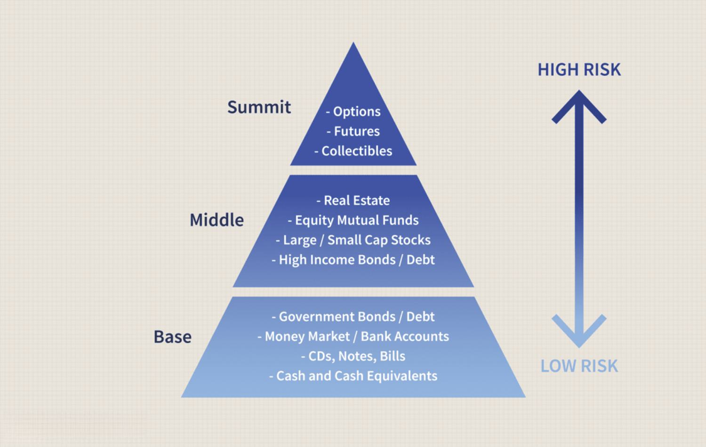

## Table of Contents

## What is an investment club?

An investment club is a group of people who pool their money together to invest in stocks, bonds, or other types of investments. The members of the club meet regularly to discuss and decide on investment choices. This way, they can learn about investing and share their knowledge with each other.

Joining an investment club can be a good way for people to start investing, even if they don't have a lot of money. By working together, the members can invest in a variety of assets, which can help spread the risk. It's also a great way to learn from others and make friends who are interested in the same things.

## How can joining an investment club benefit a beginner investor?

Joining an investment club can really help a beginner investor in many ways. First, it's a great way to learn about investing without feeling alone. When you're new to something, it can be hard to understand everything by yourself. But in an investment club, you can ask questions and learn from people who know more than you. They can explain things in a way that's easy to understand, and you can see how they make decisions about where to put their money.

Another big benefit is that you can start investing with less money. In an investment club, everyone puts in a little bit of money, and then the club uses all that money to buy investments. This means you can own a part of bigger investments that you might not be able to buy on your own. It's also safer because the risk is shared among all the members. If one investment doesn't do well, it won't hurt you as much because you're not the only one losing money.

Lastly, being part of an investment club can make investing more fun and less scary. It's nice to have friends who are interested in the same things as you. You can talk about your investments, share your wins and losses, and support each other. This can make the whole experience more enjoyable and help you stick with investing over the long term.

## What are the key advantages of participating in an investment club?

Joining an investment club has many benefits. One big advantage is that it helps you learn about investing. When you're new to investing, it can be hard to understand everything on your own. But in an investment club, you can ask questions and learn from people who know more. They can explain things in a way that's easy to understand, and you can see how they make decisions about where to put their money. This can make you feel more confident about your own investments.

Another advantage is that you can start investing with less money. In an investment club, everyone puts in a little bit of money, and then the club uses all that money to buy investments. This means you can own a part of bigger investments that you might not be able to buy on your own. It's also safer because the risk is shared among all the members. If one investment doesn't do well, it won't hurt you as much because you're not the only one losing money.

Lastly, being part of an investment club can make investing more fun and less scary. It's nice to have friends who are interested in the same things as you. You can talk about your investments, share your wins and losses, and support each other. This can make the whole experience more enjoyable and help you stick with investing over the long term.

## How does an investment club help in diversifying an investment portfolio?

An investment club helps in diversifying an investment portfolio by pooling money from all its members. This means the club can buy a wider range of investments than any single member could afford on their own. For example, if one person has a small amount of money, they might only be able to buy one or two stocks. But when many people come together, they can buy stocks in different companies, bonds, and maybe even other types of investments like real estate or mutual funds. This spreads the risk because the club's money is not all in one place.

Diversification is important because it can help protect the club's money. If one investment goes down in value, it won't hurt the whole portfolio as much because there are other investments that might still be doing well. This way, the club can balance out the ups and downs of the market. Plus, by working together, the members can learn about different kinds of investments and decide which ones to add to their portfolio to keep it diversified.

## What role does an investment club play in financial education?

An investment club is a great way to learn about money and investing. When you join a club, you get to be around other people who are also interested in learning. You can ask them questions, and they can explain things in a way that's easy to understand. For example, if you don't know what a stock is or how it works, someone in the club can teach you. You can also see how the club makes decisions about where to put their money, which helps you learn how to think about investing.

Being in an investment club also means you get to learn by doing. Instead of just reading about investing in [books](/wiki/algo-trading-books) or online, you actually get to use real money to buy stocks, bonds, or other investments. This hands-on experience is really helpful because you can see what works and what doesn't. Plus, since the club meets regularly, you keep learning new things all the time. Over time, this can make you much smarter about money and give you the confidence to make your own investment choices.

## How can investment clubs improve investment decision-making skills?

Joining an investment club is a great way to get better at making investment decisions. When you're part of a club, you get to hear different ideas and opinions from other members. This helps you think about investments in new ways and learn from others' experiences. For example, if someone in the club has done well with a certain stock, they can explain why they chose it and what they learned. This can help you understand how to pick good investments and avoid bad ones.

Another way investment clubs improve decision-making is by letting you practice in a safe environment. Since the club's money is shared among all members, the risk is lower. You can try out different strategies and see what happens without losing a lot of money. Over time, this practice helps you get better at making smart choices. Plus, the regular meetings mean you're always thinking about and discussing investments, which keeps your skills sharp and helps you make better decisions in the future.

## What are the different types of investment clubs and their specific benefits?

There are a few different types of investment clubs, each with its own way of working and benefits. One type is a traditional investment club, where members meet in person to discuss and decide on investments. This type of club is great for learning because you can ask questions and see how others think about investing. It's also a good way to make friends who are interested in the same things as you. Another type is an online investment club, where members meet and discuss investments over the internet. This is really convenient because you can join from anywhere and it's easier to find people with similar interests. Online clubs often use special tools to help with investing, which can make it easier to learn and manage your investments.

A third type of investment club is a specialty club, where members focus on a certain type of investment, like real estate or technology stocks. These clubs can be really helpful if you want to learn a lot about one specific area of investing. By focusing on one thing, you can become an expert and make better decisions about that type of investment. Each type of club has its own benefits, but they all help you learn about investing, share the risk with others, and make the process more fun and less scary.

## How do investment clubs typically structure their meetings and investment strategies?

Investment clubs usually have meetings once a month where everyone comes together to talk about their investments. During these meetings, they look at how their investments are doing, talk about new ideas, and decide what to do next. Someone in the club might suggest buying a new stock or selling one they already have. Then, everyone discusses it and votes on what to do. It's important for everyone to be there and share their thoughts because all members have a say in the decisions.

The investment strategy of a club can be different depending on what the members want. Some clubs might want to take big risks and try to make a lot of money fast. They might pick stocks that could go up a lot but are also risky. Other clubs might be more careful and choose investments that are safer but might not grow as fast. They might look at things like how much a company makes, how much it owes, and what people think about it. No matter what strategy they use, the club works together to make sure everyone is happy with the choices they make.

## What are the legal and tax considerations for members of an investment club?

When you join an investment club, there are some legal and tax things you need to know. The club needs to follow the rules about how to set up and run a business. This means they might need to register with the government and follow certain laws about how they make decisions and keep records. It's a good idea for the club to talk to a lawyer to make sure they're doing everything right. Also, the club might need to write down rules about how they work, like how often they meet and how they vote on things.

For taxes, the club has to pay taxes on any money it makes from investments. The club might need to file a tax return every year to report this money. Each member of the club will also need to report their share of the club's earnings on their own tax return. This can be a bit tricky, so it's smart for the club to talk to a tax expert to make sure everyone is doing their taxes the right way. If the club follows the rules and gets good advice, it can help make sure everything goes smoothly.

## How can one find and evaluate the best investment clubs in their area?

Finding the best investment clubs in your area can start with a simple internet search. Look for clubs near you and read about what they do and how they work. You can also check websites like Meetup or local community boards where people might talk about investment clubs. Another good way is to ask friends or family if they know of any clubs. Once you find some clubs, you can go to their meetings to see if they are a good fit for you. It's important to feel comfortable with the people and to like how the club makes decisions.

When you're evaluating a club, think about a few things. First, see if the club's goals match what you want. Some clubs might want to take big risks, while others are more careful. Make sure you feel good about the club's investment strategy. Also, look at how the club is run. Do they have clear rules about how they make decisions and keep records? It's also a good idea to talk to current members and ask them what they like and don't like about the club. This can help you decide if it's the right place for you.

## What are the potential risks and challenges associated with investment clubs?

Joining an investment club can be a great way to learn and invest, but there are some risks and challenges to think about. One big risk is that the club might make bad investment choices. If everyone in the club doesn't know a lot about investing, they might pick stocks or other investments that lose money. Also, since everyone in the club has a say in the decisions, it can be hard to agree on what to do. If people have different ideas about where to put the club's money, it might cause arguments and make it hard to move forward.

Another challenge is that being part of an investment club takes time and effort. You need to go to meetings and do research on investments. If you don't have a lot of time, it might be hard to keep up with everything the club is doing. Also, there are legal and tax things to think about. The club needs to follow rules about how it's set up and how it pays taxes. If the club doesn't do these things right, it could get in trouble. So, it's important for everyone in the club to understand these rules and maybe even talk to a lawyer or a tax expert to make sure everything is done correctly.

## How do advanced investment clubs leverage technology and data analytics for better investment outcomes?

Advanced investment clubs use technology and data analytics to make smarter investment choices. They use special computer programs and websites to look at a lot of information about different investments. These tools can show them how a stock has been doing over time, what people are saying about a company, and even what might happen to the stock price in the future. By using this information, the club can pick investments that are more likely to do well. They can also keep track of their investments more easily and make changes quickly if they need to.

Another way advanced investment clubs use technology is by meeting online. This makes it easier for everyone to join the meetings, no matter where they are. They can use video calls to talk about their investments and vote on what to do next. This saves time and makes it easier for the club to work together. Using technology like this helps the club make better decisions and manage their investments more effectively.

## References & Further Reading

[1]: Bergstra, J., Bardenet, R., Bengio, Y., & Kégl, B. (2011). ["Algorithms for Hyper-Parameter Optimization."](https://dl.acm.org/doi/10.5555/2986459.2986743) Advances in Neural Information Processing Systems 24.

[2]: ["Advances in Financial Machine Learning"](https://www.amazon.com/Advances-Financial-Machine-Learning-Marcos/dp/1119482089) by Marcos Lopez de Prado

[3]: ["Evidence-Based Technical Analysis: Applying the Scientific Method and Statistical Inference to Trading Signals"](https://www.amazon.com/Evidence-Based-Technical-Analysis-Scientific-Statistical/dp/0470008741) by David Aronson

[4]: ["Machine Learning for Algorithmic Trading"](https://github.com/stefan-jansen/machine-learning-for-trading) by Stefan Jansen

[5]: ["Quantitative Trading: How to Build Your Own Algorithmic Trading Business"](https://www.amazon.com/Quantitative-Trading-Build-Algorithmic-Business/dp/1119800064) by Ernest P. Chan