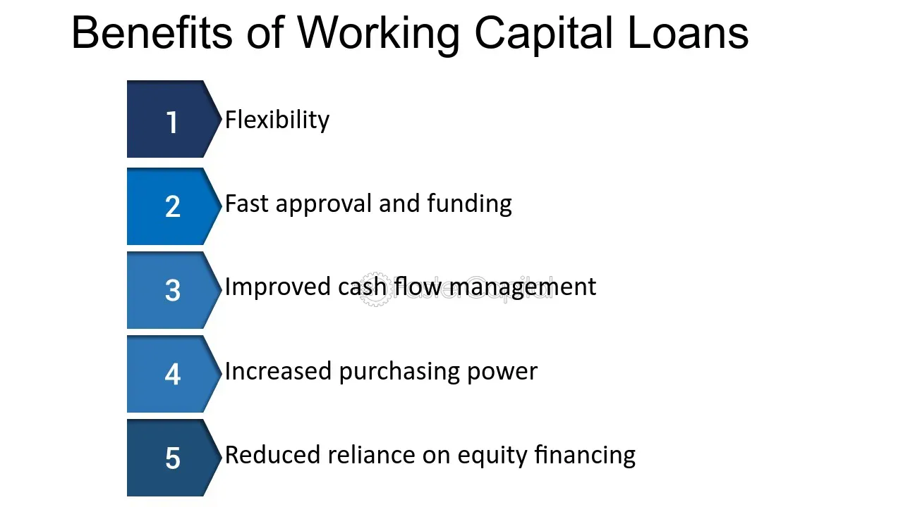

## Table of Contents

## What is working capital and why is it important for a business?

Working capital is the money a business has available to use for its day-to-day operations. It is calculated by subtracting a company's current liabilities from its current assets. Current assets include things like cash, inventory, and accounts receivable, while current liabilities are the debts and obligations that need to be paid within a year.

Having enough working capital is important for a business because it helps keep the company running smoothly. If a business doesn't have enough working capital, it might struggle to pay its bills on time, buy inventory, or cover unexpected expenses. This can lead to problems like not being able to fulfill orders, which can hurt the business's reputation and its ability to make money. On the other hand, having too much working capital can mean that the business is not using its resources efficiently, which can also be a problem. So, managing working capital well is key to keeping a business healthy and successful.

## How is working capital calculated?

Working capital is figured out by taking a company's current assets and subtracting its current liabilities. Current assets are things like cash, the stuff a company has in stock, and money that customers owe the company but haven't paid yet. Current liabilities are the bills and debts that the company needs to pay within a year.

It's important for a business to know its working capital because it shows if the company has enough money to keep running day to day. If the working capital is a positive number, it means the company can pay its short-term bills and keep doing business. If it's negative, the company might have trouble paying what it owes, which can cause big problems.

## What does low working capital mean for a business?

Low working capital means a business might not have enough money to pay its bills and keep running smoothly. When a company's working capital is low, it can struggle to buy the things it needs, like inventory, or to pay its employees and suppliers on time. This can lead to problems like not being able to fill orders, which can make customers unhappy and hurt the business's reputation.

If a business keeps running with low working capital for a long time, it can get into serious trouble. It might have to borrow money at high interest rates just to keep going, which can make the financial situation even worse. In the worst cases, low working capital can lead to the business failing because it can't meet its financial obligations.

## What are the immediate benefits of maintaining low working capital?

Keeping low working capital can help a business use its money more efficiently. When a business doesn't have a lot of extra cash sitting around, it can put that money into other parts of the business, like buying new equipment or investing in new projects. This can help the business grow and make more money in the long run.

Another benefit is that low working capital can make a business look more efficient to investors and lenders. If a business can show that it can operate well without needing a lot of extra cash, it might be seen as a safer bet for loans or investments. This can help the business get the money it needs to expand or improve without having to keep a lot of cash on hand.

## How can low working capital improve a company's cash flow?

When a company keeps its working capital low, it means they are not holding onto a lot of extra money. Instead, they use that money to pay off debts faster or invest in things that can bring in more cash. For example, if a company uses its money to buy new machines that help them make products faster, they can sell more and get paid quicker. This can make their cash flow better because money is coming in and going out more smoothly.

Also, when a company doesn't need a lot of extra cash to run, it can be more flexible with how it spends money. They might be able to take advantage of discounts from suppliers for paying early, which saves money. Or they might be able to invest in short-term opportunities that can bring in quick returns. By keeping working capital low, the company can keep its cash moving and avoid having money just sitting around, which helps improve cash flow overall.

## In what ways does low working capital affect a business's operational efficiency?

When a business has low working capital, it can make the business run more smoothly. Low working capital means the business isn't holding onto a lot of extra money. Instead, they use the money they have to pay bills quickly or buy things they need right away. This can help them keep their inventory moving and their production going without delays. When they can pay suppliers on time, they might get better deals or discounts, which saves money and helps the business run more efficiently.

However, if working capital gets too low, it can start to cause problems. The business might not have enough money to cover unexpected costs or to buy enough inventory to meet customer demand. This can slow down operations and make it hard to fulfill orders on time. If the business can't pay its bills, it might have to borrow money at high interest rates, which can make things even harder. So, while low working capital can help with efficiency, it's important to keep it at a level that still allows the business to operate smoothly.

## What are the risks associated with maintaining too low working capital?

Keeping working capital too low can be risky for a business. If a company doesn't have enough money to cover its day-to-day costs, it might struggle to pay its bills on time. This can lead to problems like not being able to buy enough inventory to meet customer demand. If the business can't fulfill orders, it can lose customers and damage its reputation. Also, if the business can't pay its suppliers, it might lose important business relationships, which can make it even harder to get the things it needs to operate.

Another big risk is that the business might need to borrow money to keep going. If it has to take out loans at high interest rates just to cover basic costs, it can get into a cycle of debt that's hard to break. This can make the financial situation worse over time. Plus, if the business can't handle unexpected expenses, like a sudden repair or a drop in sales, it might not have the money to deal with these problems. This can lead to serious financial trouble and, in the worst cases, the business might have to close down.

## How can a business effectively manage and optimize its working capital?

To manage and optimize working capital, a business needs to keep a close eye on its cash flow. This means making sure money is coming in and going out at the right times. One way to do this is by speeding up how quickly customers pay their bills. Offering discounts for early payments or using better invoicing systems can help. Another way is to manage inventory well. By not keeping too much stock, a business can free up cash that would otherwise be tied up. Also, negotiating better payment terms with suppliers can help keep more money in the business for longer.

Another important part of managing working capital is to keep an eye on the business's debts. Paying off short-term debts quickly can help keep working capital healthy. If a business needs to borrow money, it should look for loans with low interest rates to avoid adding too much cost. Using financial tools like cash flow forecasts can help a business plan ahead and make sure it always has enough money to cover its needs. By keeping a balance between having enough cash to operate and not holding onto too much, a business can optimize its working capital and stay financially strong.

## What industries benefit most from low working capital strategies?

Some industries benefit a lot from keeping their working capital low. Retail businesses, for example, can do well with low working capital because they need to keep their inventory moving quickly. If they can sell their products fast and get paid quickly, they don't need a lot of extra money sitting around. This helps them use their cash to buy more stock or invest in other parts of their business.

Another industry that can benefit is the service industry, like consulting or software companies. These businesses often don't need a lot of inventory or heavy equipment. They can keep their working capital low by getting paid quickly for their services and not holding onto a lot of cash. This lets them use their money to grow their business or invest in new projects.

Manufacturing companies can also see benefits from low working capital, but it's a bit trickier. They need to manage their inventory and raw materials carefully. If they can keep their production running smoothly without holding too much stock, they can use their cash more efficiently. This can help them invest in new technology or expand their operations.

## Can low working capital lead to better investment opportunities for a business?

When a business keeps its working capital low, it can have more money to invest in new opportunities. Instead of having a lot of extra cash sitting around, the business can use that money to buy new equipment, start new projects, or even buy another company. This can help the business grow and make more money in the long run. If the business can invest wisely, it might see a good return on its money, which can be better than just holding onto cash.

However, it's important for the business to be careful. If working capital gets too low, the business might not have enough money to cover its day-to-day costs. This can lead to problems like not being able to pay bills or buy enough inventory. So, while low working capital can open up investment opportunities, the business needs to balance this with making sure it has enough money to keep running smoothly.

## How does low working capital impact a company's ability to respond to market changes?

When a company keeps its working capital low, it can be quicker to respond to changes in the market. With less money tied up in day-to-day operations, the company can use its cash to take advantage of new opportunities or adjust its business strategy. For example, if there's a sudden demand for a new product, the company can use its money to start making that product right away, instead of waiting to free up cash from other places.

However, if working capital is too low, it can be hard for the company to handle unexpected changes. If the market takes a downturn or if there are unexpected costs, the company might not have enough money to keep going. This can make it hard to adapt to new situations because the company needs to focus on just staying afloat instead of making changes or trying new things. So, while low working capital can help a company be more flexible, it's important to have enough money to cover surprises and keep the business running smoothly.

## What advanced strategies can businesses employ to maintain optimal levels of working capital?

One advanced strategy businesses can use to keep their working capital at the right level is to use technology to manage their cash flow better. For example, they can use software that helps them see how much money is coming in and going out in real time. This can help them make better decisions about when to pay bills or buy inventory. Another way is to use something called supply chain financing. This means working with suppliers and banks to get better payment terms, so the business can hold onto its cash longer and use it more efficiently.

Another strategy is to use data analytics to predict future cash needs. By looking at past data and using special computer programs, a business can guess how much money it will need in the future. This can help them plan better and make sure they always have enough working capital. They can also use something called dynamic discounting, where they offer suppliers a discount if they get paid early. This helps the business save money and keep its cash flowing smoothly.

Finally, businesses can use a strategy called working capital optimization through asset management. This means selling off assets they don't need anymore and using that money to improve their working capital. They can also lease equipment instead of buying it, which can free up cash. By keeping a close eye on all these things and making smart decisions, businesses can keep their working capital at the right level and stay healthy and strong.

## How can we understand business efficiency in financial management?

Business efficiency in financial management centers on the optimal use of resources to bolster productivity and enhance profitability. Central to this concept is the effective allocation of financial resources, emphasizing strategies that minimize waste while maximizing output. This strategic resource allocation ensures that every unit of currency spent contributes to the company's overarching goals of growth and sustainability.

Key to assessing business efficiency is the analysis of financial ratios, which provide a quantifiable measure of a company's financial health. These ratios serve as critical indicators across three main domains: liquidity, profitability, and solvency.

**Liquidity:** Ratios such as the current ratio and the quick ratio offer insights into a business's capacity to cover its short-term obligations. These ratios are calculated as follows:

- **Current Ratio** is computed as:
$$
  \text{Current Ratio} = \frac{\text{Current Assets}}{\text{Current Liabilities}}

$$

- **Quick Ratio** (or Acid-Test Ratio) is calculated as:
$$
  \text{Quick Ratio} = \frac{\text{Current Assets} - \text{Inventory}}{\text{Current Liabilities}}

$$

These [liquidity](/wiki/liquidity-risk-premium) ratios are critical in determining whether a company can meet its short-term liabilities with its readily available assets.

**Profitability:** Profitability ratios, such as the return on assets (ROA) and return on equity (ROE), measure a company's ability to generate profit from its assets or shareholders' equity. The formulas are as follows:

- **Return on Assets (ROA):**
$$
  \text{ROA} = \frac{\text{Net Income}}{\text{Total Assets}}

$$

- **Return on Equity (ROE):**
$$
  \text{ROE} = \frac{\text{Net Income}}{\text{Shareholders' Equity}}

$$

These ratios help investors and managers understand how efficiently a company can convert the money it invests into net earnings.

**Solvency:** Solvency ratios assess a company's capacity to sustain operations in the long term. Debt to equity and interest coverage ratios are vital metrics:

- **Debt to Equity Ratio:**
$$
  \text{Debt to Equity Ratio} = \frac{\text{Total Debt}}{\text{Shareholders' Equity}}

$$

- **Interest Coverage Ratio:**
$$
  \text{Interest Coverage Ratio} = \frac{\text{Earnings Before Interest and Taxes (EBIT)}}{\text{Interest Expenses}}

$$

These measures indicate how well a company can meet its long-term debt obligations.

In conclusion, analyzing financial ratios provides important insights into the efficiency of financial management within a business. These metrics allow businesses to assess their current standing and devise strategies for improved resource allocation, contributing to sustained productivity and profitability.

## What is the role of working capital in business operations?

Working capital is a financial metric that represents the difference between a company's current assets and current liabilities. It plays a crucial role in the operational framework of businesses by indicating their capacity to meet short-term obligations. Current assets typically include cash, accounts receivable, and inventory, while current liabilities encompass obligations such as accounts payable and accrued expenses. The formula to calculate working capital is:

$$
\text{Working Capital} = \text{Current Assets} - \text{Current Liabilities}
$$

This metric serves as a vital indicator of a company's financial health. A positive working capital suggests that a company has sufficient resources to cover its short-term liabilities, which is essential for maintaining liquidity and operational efficiency. It ensures that a business can sustain its operations without facing financial distress, thus avoiding any interruptions caused by cash flow shortages.

Proper management of working capital can enhance liquidity by optimizing the balance between receivables, payables, and inventory. Efficient management strategies may include tightening credit policies to accelerate receivables, negotiating flexible payment terms with suppliers, and maintaining optimal inventory levels to meet customer demand without overstocking. This not only enhances cash flow management but also reduces the need for external financing.

Effective working capital management is crucial for operational efficiency as it directly impacts a company's ability to invest, grow, and respond to market changes. Companies with efficient working capital practices can quickly exploit market opportunities, allowing them to gain competitive advantages. Moreover, a well-managed working capital can lead to improved profitability by reducing costs associated with borrowing and enhancing the allocation of resources across operational activities.

In summary, managing working capital effectively is vital for maintaining liquidity, ensuring operational efficiency, and achieving sustainable growth in business operations.

## How can Working Capital Management be integrated with Algorithmic Trading?

The integration of working capital management with [algorithmic trading](/wiki/algorithmic-trading) represents a cutting-edge approach to modern financial management. At its core, working capital management focuses on managing a company’s short-term assets and liabilities to ensure sufficient liquidity and operational efficiency. When coupled with algorithmic trading, which automates trade executions based on predefined criteria, this integration provides substantial benefits in optimizing asset allocation and risk management strategies.

By leveraging technology, businesses can use sophisticated algorithms to monitor and adjust their working capital positions in real-time. This capability is particularly beneficial in dynamic market environments where speed and precision in executing trades can significantly impact a company's financial performance. For instance, algorithms can be designed to automatically adjust the levels of working capital allocated to various investment opportunities based on market indicators.

Moreover, the integration allows companies to maintain liquidity while simultaneously exploiting market opportunities. By automating trading processes, businesses can execute high-frequency trades far beyond human capabilities, ensuring that they do not miss lucrative trading opportunities due to manual delays. This is particularly advantageous as it reduces human error and transaction costs, while also benefiting from the scalability of automated systems.

Mathematically, this integration can be viewed through the optimization of the working capital cycle, which includes components such as inventory, accounts receivable, and accounts payable. The formula for working capital is:

$$
\text{Working Capital} = \text{Current Assets} - \text{Current Liabilities}
$$

In a Python-based algorithmic trading system, these parameters could be continuously monitored and adjusted based on market data. For example, a Python script could automatically rebalance asset allocations to optimize liquidity:

```python
def optimize_working_capital(current_assets, current_liabilities, market_conditions):
    working_capital = current_assets - current_liabilities
    if market_conditions['bullish']:
        allocation = working_capital * 0.7  # Allocate more for aggressive investment
    else:
        allocation = working_capital * 0.5  # Conservative strategy in uncertain markets
    return allocation

market_conditions = {'bullish': True}
optimized_allocation = optimize_working_capital(100000, 50000, market_conditions)
print(f"Optimized Allocation: {optimized_allocation}")
```

In this script, the function adjusts the working capital allocation based on market conditions, thus allowing firms to maintain an optimal level of liquidity while participating actively in financial markets.

Overall, the synergy between working capital management and algorithmic trading fosters a more agile and responsive financial management framework. This dual approach empowers businesses to enhance their risk management practices and capitalization on market trends, achieving a balanced financial strategy that supports both stability and growth.

## References & Further Reading

Lopez de Prado, M. *Advances in Financial Machine Learning*. This work investigates into the integration of [machine learning](/wiki/machine-learning) within algorithmic trading. It focuses on how financial data can be processed to improve decision-making processes in trading environments. The text is an essential read for understanding how technological advancements can be harnessed in financial markets to refine trading strategies and promote efficient capital management.

Aronson, D. *Evidence-Based Technical Analysis*. This book provides a comprehensive overview of rigorously applying scientific methods to technical analysis in trading. It challenges traditional heuristic methods, encouraging a data-driven approach that leverages statistical evidence to inform trading decisions. Such a perspective is crucial in enhancing algorithmic trading systems by grounding them in empirical data rather than speculative methods.

Jansen, S. *Machine Learning for Algorithmic Trading*. This resource offers a practical guide to applying machine learning techniques to develop, test, and deploy algorithmic trading strategies. It provides insights into using data science tools to anticipate market movements, optimize trading performance, and manage financial risk effectively. Jansen's approach underscores the relevance of machine learning as a transformative tool in modern trading environments and working capital management.

Chan, E. P. *Quantitative Trading: How to Build Your Own Algorithmic Trading Business*. Chan's book serves as a comprehensive manual for those looking to establish their own algorithmic trading venture. It covers a broad array of topics, from [backtesting](/wiki/backtesting) strategies to risk management, providing readers with the essential frameworks needed to build a successful algorithmic trading business. This practical guidance is vital for maintaining business efficiency in volatile financial markets.

