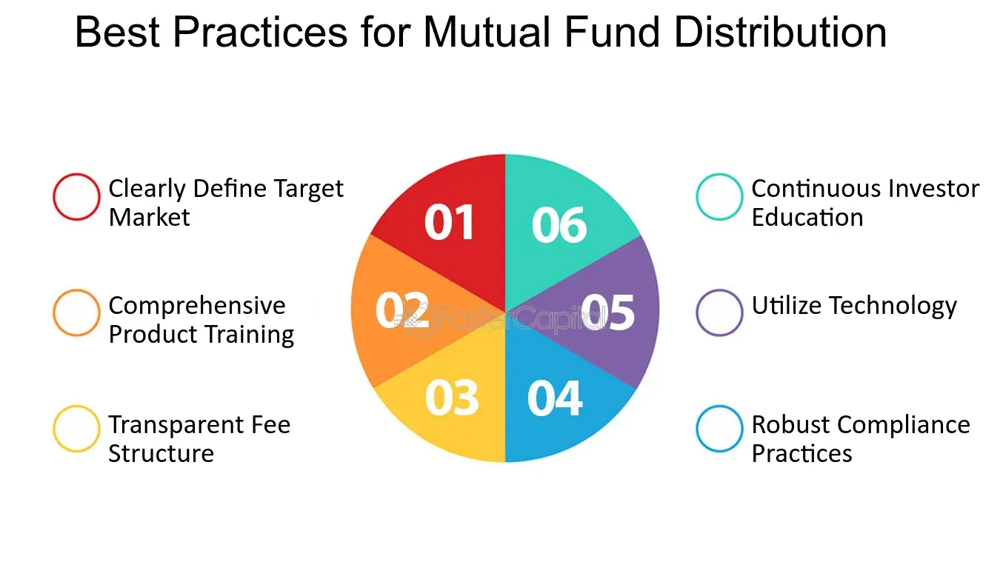

## Table of Contents

## What is a mutual fund?

A mutual fund is a type of investment where many people put their money together to buy a variety of stocks, bonds, or other assets. It's like a big basket where everyone's money is mixed and managed by a professional. This makes it easier for people to invest in a diverse range of things without having to pick each one themselves.

When you invest in a mutual fund, you buy shares of the fund. The value of your shares goes up or down based on how well the investments in the fund are doing. This can be a good way to grow your money over time, but it also comes with risks because the value can go down as well as up. Mutual funds are popular because they offer a simple way to invest in a broad range of assets, which can help spread out the risk.

## What is income distribution in mutual funds?

Income distribution in mutual funds is when the fund pays out money to its investors. This money comes from the interest or dividends that the fund earns from its investments. When a mutual fund makes money from its stocks or bonds, it can choose to give some of that money back to the people who own shares in the fund. This is called a distribution, and it can happen regularly, like every month or every quarter.

These distributions are important because they can provide investors with a regular income. For example, if you are retired, you might rely on these payments to help cover your living expenses. The amount you get depends on how many shares you own and how well the fund is doing. Sometimes, the fund might also give out capital gains, which is money made from selling investments at a profit. This can make your distributions bigger, but it's not as predictable as the regular income from interest and dividends.

## How does income distribution work?

Income distribution in mutual funds happens when the fund gives money to its investors. This money comes from the interest or dividends the fund earns from its investments. When a mutual fund makes money from its stocks or bonds, it can decide to share some of that money with the people who own shares in the fund. This sharing is called a distribution, and it can happen regularly, like every month or every three months.

These distributions are important because they can give investors a steady income. For example, if you are retired, you might use these payments to help pay for your daily needs. The amount of money you get depends on how many shares you own and how well the fund is doing. Sometimes, the fund might also give out extra money from selling investments at a profit. This can make your distributions bigger, but it's not as regular as the income from interest and dividends.

## What are the different types of income distributions from mutual funds?

There are mainly two types of income distributions from mutual funds: dividends and interest. Dividends come from the profits that the companies in the fund's portfolio pay out to their shareholders. If a mutual fund owns stocks that pay dividends, it collects these payments and can then distribute them to its own investors. Interest, on the other hand, comes from the bonds that the fund holds. When a bond pays interest, the mutual fund collects it and can pass it along to its investors.

Another type of distribution is capital gains. This happens when the mutual fund sells some of its investments for more than it paid for them. The profit from these sales is called a capital gain, and the fund can choose to distribute this money to its investors. Capital gains distributions are usually less predictable than dividends and interest because they depend on when and how the fund decides to sell its investments. All these types of distributions can provide investors with income, but they can also affect the value of the fund's shares.

## What are the tax implications of mutual fund income distributions?

When you get money from a mutual fund, you might have to pay taxes on it. The tax you pay depends on what kind of income you get from the fund. If you get dividends, you'll usually pay taxes on them at a special rate that's often lower than your regular income tax rate. If you get interest from bonds, that's usually taxed at your normal income tax rate, which can be higher. And if you get capital gains, you'll pay taxes on those too, but the rate depends on how long the fund held the investment before selling it. If it was held for more than a year, it's a long-term capital gain, and the tax rate is usually lower.

These taxes can affect how much money you actually keep from your mutual fund distributions. It's important to know that even if you reinvest your distributions back into the fund, you still have to pay taxes on them. This means you might owe taxes even if you don't see the money in your bank account. It's a good idea to talk to a tax professional to understand how these distributions will affect your taxes and to plan accordingly.

## How can income distributions benefit a beginner investor?

Income distributions from mutual funds can be really helpful for someone just starting to invest. When you get money from the fund, it's like getting a little bonus. This can be exciting because it shows that your investment is working and making money. For a beginner, seeing these regular payments can make you feel more confident about investing. It's like getting a small reward that can encourage you to keep investing and learning more about how to grow your money.

Another way income distributions can help is by giving you some extra cash. If you're just starting out, you might not have a lot of money to invest. But when you get these distributions, you can use them to buy more shares in the fund. This is called reinvesting, and it can help your investment grow over time. Plus, if you need money for something important, like paying bills or saving for a goal, these distributions can give you a bit of extra income to help you out.

## What strategies can be used to maximize benefits from income distributions?

One strategy to maximize the benefits from income distributions is to reinvest them back into the mutual fund. When you reinvest, you use the money you get from the distributions to buy more shares of the fund. This can help your investment grow faster over time because you're adding to your investment without spending extra money. It's like planting a seed and watching it grow into a bigger plant. The more you reinvest, the more shares you'll have, and the more distributions you'll get in the future.

Another strategy is to choose funds that have a history of good income distributions. Some mutual funds focus on stocks or bonds that pay high dividends or interest. By picking these funds, you can increase the amount of money you get from distributions. It's like choosing the best fruit trees to plant in your garden so you can enjoy more fruit. Make sure to look at the fund's past performance and see if it has been paying out good distributions regularly.

Finally, consider your tax situation when planning for income distributions. Since you have to pay taxes on the money you get from the fund, it can be smart to invest in funds that are tax-efficient. This means the fund is designed to minimize the taxes you have to pay. For example, some funds focus on investments that generate lower taxes. Talking to a tax advisor can help you choose the right funds and make the most of your distributions while keeping your tax bill low.

## How do income distributions affect the net asset value (NAV) of a mutual fund?

When a mutual fund pays out income distributions, it can change the net asset value (NAV) of the fund. The NAV is like the price of one share of the fund. When the fund gives money to investors, it's like taking money out of the fund's total value. So, the NAV usually goes down by the amount of the distribution. It's like if you take some money out of your piggy bank, the total amount of money in the piggy bank goes down.

Even though the NAV drops after a distribution, it doesn't mean your investment is worth less. If you reinvest the money you get from the distribution, you buy more shares at the lower NAV. This can actually help your investment grow over time. It's like if you use the money you took out of your piggy bank to buy more coins when they're cheaper, you end up with more coins in the end. So, while the NAV might go down right after a distribution, the overall value of your investment can still increase if you keep reinvesting.

## What are the considerations for reinvesting income distributions?

When you get money from a mutual fund through income distributions, you have a choice: you can take the money out or put it back into the fund. If you choose to reinvest the money, you're using it to buy more shares of the fund. This can be a good idea because it helps your investment grow over time. The more shares you own, the more money you can get from future distributions. It's like planting more seeds in your garden so you can grow more plants.

But there are things to think about before you decide to reinvest. One big thing is taxes. Even if you reinvest the money, you still have to pay taxes on it. This means you might owe taxes even if you don't see the money in your bank account. Also, think about your financial goals. If you need the money for something important, like paying bills or saving for a big purchase, it might be better to take the money out instead of reinvesting it. Talking to a financial advisor can help you figure out what's best for you.

## How do income distributions impact long-term investment goals?

When you invest in mutual funds, the money you get from income distributions can help you reach your long-term goals. If you reinvest these distributions, you buy more shares of the fund. Over time, this can make your investment grow bigger because you own more of the fund. It's like adding more bricks to a building, making it taller and stronger. This can be really helpful if your goal is to save for something big, like buying a house or retiring. The more your investment grows, the closer you get to reaching those goals.

But you also need to think about taxes and your immediate needs. Even if you reinvest the money, you still have to pay taxes on it. This can take away some of the money you could use to grow your investment. Also, if you need money for things like paying bills or saving for a short-term goal, you might want to take the distributions instead of reinvesting them. It's important to balance your long-term goals with your current needs. Talking to a financial advisor can help you figure out the best way to use your income distributions to meet your goals.

## What are the potential risks associated with relying on income distributions?

Relying on income distributions from mutual funds can be risky because they are not always the same. The amount of money you get can go up or down depending on how well the fund is doing. If the fund doesn't make as much money from its investments, your distributions might be smaller. This can be a problem if you need a certain amount of money every month to pay your bills or save for something important. It's like counting on a tree to give you the same amount of fruit every year, but sometimes the tree might not produce as much.

Another risk is that you might have to pay taxes on the money you get from distributions. Even if you put the money back into the fund, you still have to pay taxes on it. This means you might end up with less money than you thought. It's like getting a paycheck but then having to give some of it back in taxes. If you're not careful, this can affect how much money you have for your long-term goals. It's important to think about these risks and maybe talk to a financial advisor to make sure you're making the best choices for your money.

## How do expert investors analyze the performance of mutual funds based on their income distribution patterns?

Expert investors look at how much money a mutual fund gives out in income distributions to see how well it's doing. They check if the distributions are steady or if they change a lot. If a fund gives out the same amount of money every time, it might mean the fund is doing well and making money from its investments. But if the distributions go up and down a lot, it could mean the fund is taking more risks or not doing as well. Experts also compare the distributions to other funds to see if the fund is doing better or worse than others.

Another thing experts look at is how the distributions affect the fund's net asset value (NAV). When a fund pays out money, the NAV usually goes down. But if the fund keeps making money and the NAV goes back up quickly, it's a good sign. Experts also think about taxes. They know that even if you put the money back into the fund, you still have to pay taxes on it. So, they look for funds that are good at keeping taxes low. By looking at all these things, expert investors can tell if a mutual fund is a good choice for their money.

## How can integrating mutual funds and algo trading enhance returns?

Combining mutual fund investments with algorithmic trading offers significant potential in optimizing asset management and enhancing risk control. Mutual funds, by their nature, pool resources from investors to invest in diversified portfolios, providing reduced risk exposure and professional management. When coupled with algorithmic trading, mutual funds can leverage data-driven insights to refine their investment strategies.

Algorithmic strategies facilitate dynamic portfolio rebalancing, allowing funds to swiftly align with current market conditions. This real-time adjustment is made possible by algorithms that continuously analyze market data to identify optimal asset allocation. A common technique applied here is mean-variance optimization, where the portfolio weights are adjusted to minimize risk for a given level of expected return. The formula used for optimization is:

$$

w^* = \arg \min_w \frac{1}{2} w^T \Sigma w - \lambda (w^T \mu) 
$$

Where:
- $w$ is the weight vector of assets in the portfolio.
- $\Sigma$ is the covariance matrix of asset returns.
- $\lambda$ is the risk-aversion coefficient.
- $\mu$ is the expected return vector.

Exchange-traded funds (ETFs) that apply algorithmic models showcase the synergy of this integration. These hybrid strategies not only provide investors with diversified income sources but also undertake strategic trades that are both timely and cost-effective. Such ETFs often utilize algorithmic frameworks to capitalize on market inefficiencies through strategies such as [statistical arbitrage](/wiki/statistical-arbitrage) and high-frequency trading, thereby enhancing overall fund performance.

Empirical studies highlight several case studies where mutual funds have successfully integrated algorithmic trading to boost performance metrics like Sharpe Ratio and reduce tracking error. For instance, quant funds adopting these approaches have consistently outperformed traditional actively managed funds in terms of risk-adjusted returns.

Moreover, tailored solutions that align with investors’ objectives—be it for steady income generation or aggressive capital growth—are achievable through this integration. Investors, using custom algorithms, can filter investments that meet specific criteria, manage their exposure across various sectors, and exploit momentary market opportunities.

In conclusion, embracing the fusion of mutual funds and algorithmic trading empowers fund managers to offer more sophisticated, responsive, and diversified financial products. These contemporary investment tools not only enhance risk management but also pave the way for innovative strategies that cater to a broad spectrum of investor aspirations in an increasingly complex financial landscape.

## References & Further Reading

1. **Books and Articles:**
   - "Common Sense on Mutual Funds: New Imperatives for the Intelligent Investor" by John C. Bogle. This book outlines the principles of mutual fund investing and provides a comprehensive look at their mechanics and benefits.
   - "Algorithmic Trading: Winning Strategies and Their Rationale" by Ernie Chan. This work offers insights into developing algorithmic trading strategies and the theoretical underpinnings that support them.
   - "The Intelligent Investor" by Benjamin Graham. A cornerstone of investment literature, providing foundational insights into investment strategies, asset management, and risk management.

2. **Online Platforms and Resources:**
   - [Investopedia](https://www.investopedia.com): A comprehensive online platform offering articles, tutorials, and a financial dictionary to educate investors on mutual funds, trading strategies, and more.
   - [Morningstar](https://www.morningstar.com): Provides detailed mutual fund research, ratings, and analysis to help investors make informed decisions.
   - [QuantInsti](https://www.quantinsti.com): An educational platform focused on algorithmic trading, offering courses and articles on developing trading strategies.
   - [Financial Times](https://www.ft.com): Offers global financial news, with sections dedicated to mutual funds and trading strategies, assisting investors in staying updated with market developments.

3. **Research Papers and Journals:**
   - "The Benefits of Algorithmic Trading" - A journal article in the "Journal of Finance" detailing the advantages and methodologies of algorithmic trading in financial markets.
   - "Mutual Fund Performance and Risk Analysis" - Research examining the performance metrics and risk factors associated with mutual fund investments, available in the "Journal of Investment Analysis".

These resources provide a broad spectrum of information and education, addressing both the traditional elements and innovative strategies of investment management, ensuring investors have a solid understanding of mutual funds, algorithmic trading, and their integration.

