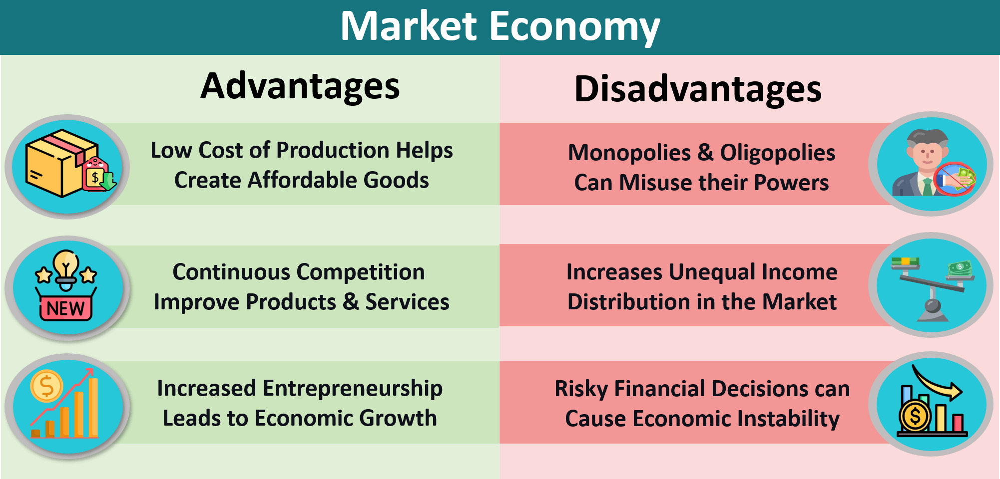

## Table of Contents

## What is a market economy?

A market economy is a type of economic system where the prices of goods and services are determined by the forces of supply and demand. In this system, individuals and businesses make decisions about what to produce, how much to produce, and at what price to sell based on what they think consumers want and are willing to pay. The government has a limited role and mostly stays out of the way, letting the market operate freely.

In a market economy, competition is a key feature. Businesses compete with each other to offer the best products at the lowest prices to attract customers. This competition can lead to innovation and efficiency, as companies strive to improve their products and services to stay ahead of their rivals. However, it can also result in inequalities, as some businesses and individuals may do better than others, leading to differences in wealth and income.

## How does a market economy differ from other economic systems?

A market economy is different from other economic systems because it relies on supply and demand to set prices. In a market economy, people and businesses decide what to make, how much to make, and how much to charge. The government does not control these decisions. Instead, it lets the market work on its own. This is different from a command economy, where the government makes all the decisions about what to produce and how much it should cost. In a command economy, the government owns the businesses and controls the economy.

Another type of economic system is a mixed economy, which combines elements of both market and command economies. In a mixed economy, the government and the market both play a role. The government might regulate certain industries or provide public services like healthcare and education, but businesses still have a lot of freedom to make their own decisions. This is different from a market economy, where the government's role is much smaller, and from a command economy, where the government's role is much larger.

In summary, a market economy focuses on individual freedom and competition, with minimal government involvement. A command economy focuses on government control and planning, with little room for individual choice. A mixed economy tries to balance the two, using government intervention to correct market failures while still allowing for some market freedom.

## What are the basic principles of a market economy?

In a market economy, the main idea is that people and businesses decide what to make, how much to make, and how much to charge. They do this by figuring out what people want and what they are willing to pay. This is called supply and demand. When people want a lot of something, the price goes up. When people don't want much of something, the price goes down. Businesses try to make things that people want so they can make money.

Another important part of a market economy is competition. Businesses compete with each other to sell the best things at the lowest prices. This can make businesses work harder to make better things and find new ways to do things. But it can also mean that some businesses do better than others, which can make some people richer than others. The government in a market economy usually stays out of the way and lets businesses and people make their own choices.

## What are the main benefits of a market economy for consumers?

In a market economy, consumers benefit a lot because they have many choices. Businesses compete to offer the best products at the lowest prices. This means that consumers can pick what they like the most and pay less for it. When businesses see that people want something, they make more of it, so there's always a lot to choose from.

Another big benefit for consumers is that businesses are always trying to make things better. They want to stay ahead of their competition, so they come up with new ideas and improve their products. This means that consumers get to use new and better things all the time. Even though some people might get richer than others, everyone can enjoy the good things that come from businesses trying to do their best.

## How does a market economy promote economic growth?

A market economy promotes economic growth by encouraging businesses to compete with each other. When businesses compete, they try to make better products and find new ways to do things. This leads to innovation, which means new ideas and inventions that can help the economy grow. For example, a company might come up with a new way to make a product faster and cheaper, which can lead to more jobs and more money being spent in the economy.

Another way a market economy helps economic growth is by letting people and businesses decide what to make and how much to make. When businesses see that people want something, they make more of it. This means that the economy can grow because businesses are making things that people actually want to buy. When people buy more things, it helps the economy grow even more because it creates more jobs and more money moving around.

## In what ways does a market economy encourage innovation?

In a market economy, businesses compete with each other to sell the best things at the lowest prices. This competition makes businesses want to come up with new ideas and better ways to do things. When a business finds a new way to make something, it can make more money and get more customers. This is called innovation. For example, a company might invent a new type of phone that is faster and easier to use. People will want to buy this new phone, and the company will make more money.

Another way a market economy encourages innovation is by letting businesses decide what to make. If a business sees that people want something new, it will try to make it. This means that businesses are always looking for new ideas to meet what people want. When businesses are free to try new things, they are more likely to come up with new inventions and better ways to do things. This helps the whole economy grow because new ideas lead to new products and services that people want to buy.

## How does competition in a market economy benefit society?

Competition in a market economy helps society because it makes businesses work harder to offer the best products at the lowest prices. When businesses compete, they want to attract more customers. This means they have to make things that people really want and keep the prices low. This is good for everyone because people can buy more things they like for less money. It also means that businesses have to keep improving their products to stay ahead of others. This can lead to new inventions and better ways of doing things, which can make life better for everyone.

Another way competition benefits society is by creating more jobs and helping the economy grow. When businesses compete, they need to make more things and offer better services. This means they need more workers, so more people can find jobs. When people have jobs, they can buy more things, which helps the economy grow even more. Even though some businesses might do better than others, the overall effect is that everyone in society can benefit from the growth and the new opportunities that come from competition.

## What role do prices play in a market economy and how do they benefit resource allocation?

In a market economy, prices are really important because they help decide what gets made and how much of it gets made. Prices go up when a lot of people want something and there isn't enough of it. This tells businesses that they should make more of that thing because they can make more money. On the other hand, if prices go down, it means not many people want that thing, so businesses might make less of it. This way, prices help make sure that the things people want the most get made the most.

Prices also help use resources in the best way. When prices are high, it means that the resources used to make that thing are worth a lot. Businesses will use those resources to make things that people really want and are willing to pay a lot for. This makes sure that resources like money, time, and materials are used to make things that are most important to people. So, prices help make sure that resources are used in the best way possible to meet what people need and want.

## How does a market economy impact income distribution and what are the potential benefits?

In a market economy, how much money people make can be very different. This is because some people and businesses do better than others. When businesses compete, some of them make more money and can pay their workers more. This can lead to some people having a lot more money than others. But it also means that people who work hard or have good ideas can make a lot of money. This can make people want to work harder and come up with new ideas.

Even though some people might get richer than others, a market economy can still help everyone. When businesses make more money, they can create more jobs. More jobs mean more people can work and make money. Also, when businesses compete, they try to make better things at lower prices. This means that everyone can buy more things they need and want. So, even if the money is not shared equally, a market economy can help make life better for a lot of people by creating more jobs and making things cheaper.

## What are the effects of a market economy on global trade and international relations?

A market economy can make global trade grow a lot. When countries have market economies, businesses want to sell their things to people all over the world. They try to make the best things at the lowest prices to get more customers. This can lead to more trade between countries because businesses want to sell their things everywhere. When countries trade more, they can get things they need from other places and sell their own things to other countries. This can help the economy of each country grow because they can make more money from trade.

Market economies can also affect international relations. When countries trade a lot, they often work together better. They might make agreements to help each other's businesses and make trade easier. This can make countries friends because they see that working together is good for everyone. But sometimes, countries might argue about trade rules or try to protect their own businesses. This can cause problems between countries. So, while market economies can help countries work together, they can also lead to disagreements if not managed well.

## How do government regulations and policies enhance the benefits of a market economy?

In a market economy, the government can help make things better for everyone by setting rules and making policies. These rules can stop businesses from doing bad things, like cheating or hurting the environment. For example, the government might make rules about how clean the air and water need to be. This helps keep people healthy and makes sure businesses don't just focus on making money without thinking about the impact on society. By having these rules, the government can make sure that the market economy works fairly and safely for everyone.

Government policies can also help make sure that everyone has a chance to do well in a market economy. For instance, the government might help people get education and training so they can get good jobs. They might also give money to people who need it, so everyone can buy the things they need. These policies can help make sure that the benefits of a market economy, like more jobs and cheaper products, reach more people. By doing this, the government can make the market economy work better for everyone, not just for those who are already doing well.

## What are some advanced economic theories that explain the efficiency of market economies?

One important theory that helps explain why market economies work well is called the "Invisible Hand" theory. This idea was introduced by Adam Smith, who said that when people look out for their own interests, they end up helping the whole economy. For example, when a business owner tries to make more money, they might make better products or lower their prices to attract more customers. This competition leads to better things for everyone because businesses have to work hard to keep their customers happy. The "Invisible Hand" means that the market, without anyone planning it, guides resources to where they are needed most, making the economy efficient.

Another theory is called "Pareto Efficiency," named after Vilfredo Pareto. This theory says that an economy is working well if you can't make one person better off without making someone else worse off. In a market economy, prices help make sure this happens. When prices go up, it means more people want something, so businesses make more of it. When prices go down, it means fewer people want it, so businesses make less. This way, resources are used to make the things people want the most, which helps the economy run smoothly and efficiently.

## What are the economic benefits of a free market?

Free markets, characterized by minimal governmental intervention, offer substantial economic benefits, contributing to the overall efficiency and innovation within economies. One of the primary advantages of a free market system is the enhanced efficiency it encourages. In a competitive environment where enterprises vie for consumer attention, businesses are motivated to optimize their operations to reduce costs and maximize output. This optimization often leads to the adoption of innovative techniques and technologies, facilitating improvements in production processes and resource allocation.

Competition plays a crucial role in shaping the dynamics of quality and pricing within a market economy. It serves as a catalyst for businesses to not only meet consumer demands but also exceed them by enhancing the quality of their products and services. This competitive pressure results in a downward trend in prices, benefiting consumers while compelling companies to be more efficient and creative in their offerings. Economic theory suggests that in a perfectly competitive market, prices tend to equal marginal costs, leading to the efficient allocation of resources. This principle can be expressed with the following equation:

$$
P = MC
$$

where $P$ represents the price of goods or services, and $MC$ represents the marginal cost of production.

Market economies inherently promote business efficiency and productivity by fostering an environment where only the most efficient producers thrive. Companies are incentivized to streamline their operations, innovate continuously, and adopt cutting-edge technologies to maintain a competitive edge. This drive towards efficiency ensures resources are allocated where they are most productive, ultimately contributing to higher overall productivity levels in the economy. As businesses become more productive, the economy grows, leading to an increase in the gross domestic product (GDP).

The potential for job creation and economic growth in a free market system is significant. As businesses expand to capture larger market shares and enter new markets, new job opportunities are created across various sectors. Additionally, entrepreneurial endeavors are encouraged in free market economies, leading to the establishment of new enterprises and industries, which further enhances employment prospects. Historical data has shown that countries with open and competitive markets tend to experience more robust economic growth rates than those with more controlled economic systems.

In summary, the economic benefits of free markets are rooted in their ability to foster efficiency, encourage innovation, enhance quality and pricing through competition, and stimulate job creation and economic growth. These benefits collectively contribute to a more dynamic and prosperous economy, underpinned by the principles of supply and demand that govern market operations.

## References & Further Reading

[1]: Bergstra, J., Bardenet, R., Bengio, Y., & Kégl, B. (2011). ["Algorithms for Hyper-Parameter Optimization."](https://papers.nips.cc/paper/4443-algorithms-for-hyper-parameter-optimization) Advances in Neural Information Processing Systems 24.

[2]: ["Advances in Financial Machine Learning"](https://www.amazon.com/Advances-Financial-Machine-Learning-Marcos/dp/1119482089) by Marcos Lopez de Prado

[3]: ["Evidence-Based Technical Analysis: Applying the Scientific Method and Statistical Inference to Trading Signals"](https://www.amazon.com/Evidence-Based-Technical-Analysis-Scientific-Statistical/dp/0470008741) by David Aronson

[4]: ["Machine Learning for Algorithmic Trading"](https://github.com/stefan-jansen/machine-learning-for-trading) by Stefan Jansen

[5]: ["Quantitative Trading: How to Build Your Own Algorithmic Trading Business"](https://www.amazon.com/Quantitative-Trading-Build-Algorithmic-Business/dp/1119800064) by Ernest P. Chan