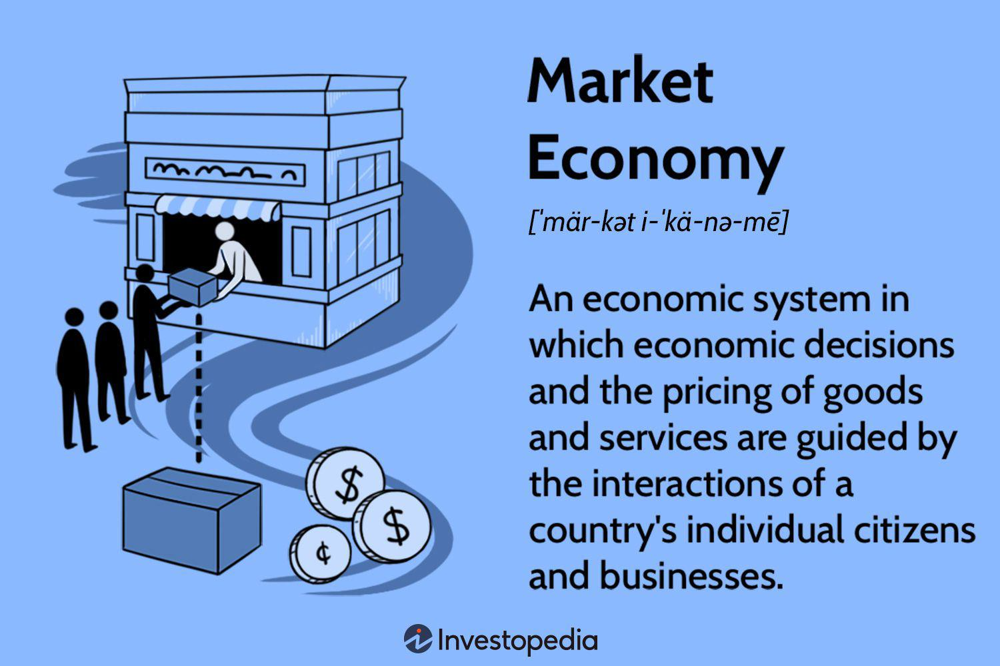

A market economy is an economic system in which the production, distribution, and pricing of goods and services are primarily determined by the forces of supply and demand. This system plays a pivotal role in global economics as it allows for the efficient allocation of resources and fosters economic growth through competitive practices and innovation. Unlike command economies, where central authorities make production decisions, market economies rely on decentralized decision-making with minimal government interference. This characteristic usually leads to a more dynamic and efficient economic environment. 

In a market economy, private enterprises are the main actors, engaging in competition to meet the needs and preferences of consumers. Firms strive to optimize their operations and differentiate their products and services, resulting in increased efficiency and a broader range of choices for consumers. The interplay of supply and demand dictates prices, incentivizing businesses to respond promptly to changes in consumer preferences and resource availability.

A notable trend within market economies is the growing interest in algorithmic trading, which utilizes complex algorithms and computer systems to execute trading decisions at high speeds. Algorithmic trading has revolutionized financial markets by enhancing efficiency and providing increased market liquidity. It employs quantitative models to analyze market data, allowing for quick adaptation to market conditions and optimizing trading strategies.

The economic benefits of a free market system are manifold, including enhanced productivity, innovation, and consumer choice. Algorithmic trading amplifies these advantages by improving the precision and speed of financial transactions, thereby supporting liquidity and market stability. As technology continues to evolve, algorithmic trading can further integrate into market economies, offering opportunities for growth and refined market dynamics.

In summary, a market economy with its minimal government role and reliance on supply and demand fosters a competitive environment. The emergence of algorithmic trading represents a natural extension of this paradigm, enabling even greater efficiencies within the economic landscape.

## Table of Contents

## Understanding Market Economies

A market economy is an economic system where the prices of goods and services are determined by supply and demand, with minimal governmental intervention. This decentralization promotes competition and efficiency. Characteristically, private individuals and businesses own the means of production and operate for profit. Decision-making is heavily anchored on consumer choices, and resources are allocated accordingly, leading to a dynamic and flexible economic structure.

In comparing market economies with other systems like command and mixed economies, significant differences emerge. A command economy, typified by central planning, allocates resources based on government directives rather than market signals. This often leads to inefficiencies and lack of innovation because the driving forces of competition and consumer preference are suppressed. On the other hand, a mixed economy incorporates elements from both market and command systems, allowing for a degree of private economic freedom intertwined with government intervention aimed at correcting market failures and promoting social welfare.

The principles of supply and demand are foundational to a market economy, where the price level of goods and services adjusts to balance the quantity supplied by producers and the quantity demanded by consumers. These principles are mathematically represented by demand and supply curves. The intersection of these curves indicates the market equilibrium price and quantity. The demand curve typically slopes downward, reflecting consumers' decreased willingness to purchase at higher prices, while the supply curve slopes upward, as higher prices motivate producers to supply more.

Laissez-faire economics is a concept intimately linked with market economies. The term, which translates to "let do" or "let go," advocates for minimal government intervention in economic activities. The rationale is that markets are self-regulating and capable of achieving equilibrium on their own. This approach underscores a belief in the efficiency of unfettered markets to allocate resources in a manner that results in the greatest economic benefit for society. The criticism, however, is that without oversight, negative externalities and income disparities might widen, necessitating some level of regulatory framework to mitigate these issues. 

Given these dynamics, a market economy promotes innovation and consumer choice while facing challenges that necessitate balanced regulation to ensure fairness and to temper the excesses of a laissez-faire approach. Its effectiveness lies in its adaptability and responsiveness to the preferences and needs of its participants.

## Economic Benefits of a Free Market

Free markets, characterized by minimal governmental intervention, offer substantial economic benefits, contributing to the overall efficiency and innovation within economies. One of the primary advantages of a free market system is the enhanced efficiency it encourages. In a competitive environment where enterprises vie for consumer attention, businesses are motivated to optimize their operations to reduce costs and maximize output. This optimization often leads to the adoption of innovative techniques and technologies, facilitating improvements in production processes and resource allocation.

Competition plays a crucial role in shaping the dynamics of quality and pricing within a market economy. It serves as a catalyst for businesses to not only meet consumer demands but also exceed them by enhancing the quality of their products and services. This competitive pressure results in a downward trend in prices, benefiting consumers while compelling companies to be more efficient and creative in their offerings. Economic theory suggests that in a perfectly competitive market, prices tend to equal marginal costs, leading to the efficient allocation of resources. This principle can be expressed with the following equation:

$$
P = MC
$$

where $P$ represents the price of goods or services, and $MC$ represents the marginal cost of production.

Market economies inherently promote business efficiency and productivity by fostering an environment where only the most efficient producers thrive. Companies are incentivized to streamline their operations, innovate continuously, and adopt cutting-edge technologies to maintain a competitive edge. This drive towards efficiency ensures resources are allocated where they are most productive, ultimately contributing to higher overall productivity levels in the economy. As businesses become more productive, the economy grows, leading to an increase in the gross domestic product (GDP).

The potential for job creation and economic growth in a free market system is significant. As businesses expand to capture larger market shares and enter new markets, new job opportunities are created across various sectors. Additionally, entrepreneurial endeavors are encouraged in free market economies, leading to the establishment of new enterprises and industries, which further enhances employment prospects. Historical data has shown that countries with open and competitive markets tend to experience more robust economic growth rates than those with more controlled economic systems.

In summary, the economic benefits of free markets are rooted in their ability to foster efficiency, encourage innovation, enhance quality and pricing through competition, and stimulate job creation and economic growth. These benefits collectively contribute to a more dynamic and prosperous economy, underpinned by the principles of supply and demand that govern market operations.

## Algorithmic Trading in a Free Market

Algorithmic trading refers to the use of computer algorithms to automatically execute trades in financial markets with minimal human intervention. These algorithms are designed to follow pre-defined instructions for various aspects of a trade, including timing, price, quantity, and other mathematical models. The rise of [algorithmic trading](/wiki/algorithmic-trading) in free markets is attributed to technological advancements, increasing market complexity, and the pursuit of efficiency and speed in trading operations.

In financial markets, efficiency and speed are crucial competitive factors. Algorithmic trading enhances these by enabling rapid execution of trades, often within microseconds, which is significantly faster than human capabilities. This speed is vital in capturing short-lived market opportunities and in executing large orders without causing significant market impact. Furthermore, algorithmic trading allows for the processing of immense volumes of data in real time, providing traders with the ability to make informed decisions based on comprehensive analysis.

The technology underpinning algorithmic trading includes high-frequency trading ([HFT](/wiki/high-frequency-trading-strategies)) systems, [machine learning](/wiki/machine-learning) models, and sophisticated data analytics tools. High-frequency trading, a subset of algorithmic trading, involves executing a large number of orders at extremely high speeds. These systems rely on cutting-edge computer hardware and networking technologies to reduce latency between the initiation and execution of trades.

Data processing in algorithmic trading involves the collection and analysis of vast quantities of data from various sources, including financial news, historical price data, and economic indicators. Machine learning models are increasingly used to identify patterns and predict market movements, allowing traders to develop strategies that optimize returns while managing risk.

Algorithmic trading significantly impacts market [liquidity](/wiki/liquidity-risk-premium) and transparency. On one hand, it can enhance liquidity by facilitating a higher [volume](/wiki/volume-trading-strategy) of trades, narrowing bid-ask spreads, and providing continuous market prices. This increased liquidity generally benefits all market participants by making it easier to enter and [exit](/wiki/exit-strategy) positions. On the other hand, the rapid pace and large volumes associated with algorithmic trading could contribute to market [volatility](/wiki/volatility-trading-strategies) and raise concerns about transparency. Instances like flash crashes—sudden, deep market sell-offs followed by sharp recoveries—are often attributed to the behavior of algorithms in stressed market conditions.

In conclusion, while algorithmic trading is a testament to the integration of technology in financial markets, it also necessitates a careful examination of its implications on market stability and fairness. The challenge for market participants and regulators is to harness the benefits of these technologies while mitigating potential risks.

## Challenges and Considerations

Market economies, while celebrated for their efficiency and innovative potential, present notable challenges. Income inequality is a significant issue in many market-driven societies. In such economies, the distribution of wealth tends to become concentrated over time, with individuals and entities who already hold capital and resources often reaping the greatest benefits. This phenomenon can be attributed to the structure of market economies where capital generates returns, often at a higher pace than labor income grows. Consequently, the gap between the wealthy and the poor can widen, potentially leading to social unrest and economic inefficiencies.

Algorithmic trading, a byproduct of technological advancement in free markets, poses distinctive challenges. One of the primary risks associated with algorithmic trading is increased market volatility. Algorithms can execute trades at speeds and frequencies far surpassing human capabilities, sometimes reacting to market conditions in unforeseen ways. A notable instance of such volatility occurred during the "Flash Crash" of May 6, 2010, when the Dow Jones Industrial Average experienced a rapid decline and recovery within minutes, largely attributed to automated trading algorithms operating without human intervention.

Regulatory frameworks are essential in managing the complexities and risks of algorithmic trading. Government oversight aims to ensure market stability and protect participants from manipulative practices. Regulations, such as the Securities and Exchange Commission's (SEC) implementation of circuit breakers, are designed to pause trading during extreme price movements, providing a buffer against abrupt market shifts. However, the fast-paced evolution of technology often outstrips the speed of regulatory adaptation, necessitating a continuous reassessment of policies to safeguard market integrity.

The ethical implications of high-frequency trading (HFT) also demand attention. HFT, a subset of algorithmic trading characterized by high-speed transactions, has been criticized for privileging those with advanced technological capabilities, potentially placing retail investors at a disadvantage. This form of trading raises questions about fairness, as algorithmic traders may gain insights and execute trades based on minuscule market signals that are inaccessible to average investors, thereby manipulating the market to their advantage.

In summary, while market economies and algorithmic trading offer substantial potential for growth and innovation, they also bring forth complex challenges. Addressing these issues requires a balanced approach combining effective regulatory oversight, ethical considerations, and mechanisms to curb income disparity to maintain sustainable economic ecosystems.

## Conclusion

Market economies offer significant benefits, including increased efficiency, innovation, and the promotion of competition. These systems leverage the dynamics of supply and demand to optimize resource allocation, thereby fostering economic growth and enhancing consumer choice. Algorithmic trading, a technological advancement within market economies, exemplifies these benefits by increasing market efficiency and liquidity through rapid and data-driven trading decisions.

However, maintaining a balance between innovation and regulation is crucial in a free market. While technological advancements like algorithmic trading propel market efficiency, they also bring challenges such as market volatility and potential manipulation. Effective regulatory frameworks are necessary to mitigate these risks and ensure fairness and transparency in financial markets. This balance is essential to preserve the integrity of market economies while allowing for the continued innovation that drives economic progress.

As the financial landscape evolves, the future of market economies and algorithmic trading will likely be shaped by ongoing technological advancements. The integration of [artificial intelligence](/wiki/ai-artificial-intelligence) and machine learning into trading strategies holds potential for further transformation of financial markets. These developments will require continuous adaptation of regulatory measures to address emerging challenges.

Encouraging further exploration and understanding of market economies, augmented by technological innovations, is imperative. This involves not only academics and policymakers but also technologists and industry practitioners who can contribute diverse perspectives and expertise. By embracing the dynamic nature of market economies, societies can harness technological advancements to promote sustainable economic growth and innovation.

## References & Further Reading

[1]: Bergstra, J., Bardenet, R., Bengio, Y., & Kégl, B. (2011). ["Algorithms for Hyper-Parameter Optimization."](https://papers.nips.cc/paper/4443-algorithms-for-hyper-parameter-optimization) Advances in Neural Information Processing Systems 24.

[2]: ["Advances in Financial Machine Learning"](https://www.amazon.com/Advances-Financial-Machine-Learning-Marcos/dp/1119482089) by Marcos Lopez de Prado

[3]: ["Evidence-Based Technical Analysis: Applying the Scientific Method and Statistical Inference to Trading Signals"](https://www.amazon.com/Evidence-Based-Technical-Analysis-Scientific-Statistical/dp/0470008741) by David Aronson

[4]: ["Machine Learning for Algorithmic Trading"](https://github.com/stefan-jansen/machine-learning-for-trading) by Stefan Jansen

[5]: ["Quantitative Trading: How to Build Your Own Algorithmic Trading Business"](https://www.amazon.com/Quantitative-Trading-Build-Algorithmic-Business/dp/1119800064) by Ernest P. Chan