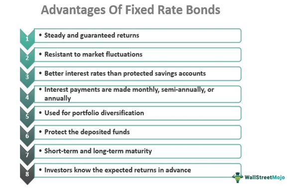

## Table of Contents

## What is a bond portfolio?

A bond portfolio is a collection of bonds that an investor owns. Bonds are like loans that you give to a government or a company, and in return, they pay you back with interest over time. By having a bond portfolio, an investor can spread out their risk and potentially earn more money than if they just owned one bond.

When building a bond portfolio, investors often choose different types of bonds to balance risk and reward. Some bonds might be safer but pay less interest, while others might be riskier but offer higher interest rates. By mixing these different bonds, investors can create a portfolio that fits their financial goals and how much risk they are willing to take.

## Why should someone consider investing in bonds?

Someone should consider investing in bonds because they can provide a steady stream of income. When you buy a bond, you are basically lending money to a company or a government. In return, they agree to pay you interest regularly, usually every six months, until the bond matures. This can be really helpful if you need a reliable source of income, especially if you're retired or just want to make sure you have money coming in regularly.

Another reason to invest in bonds is that they can help you spread out your risk. Not all investments are safe, and sometimes the stock market can be very unpredictable. By including bonds in your investment mix, you can balance out the ups and downs of stocks. Bonds are generally seen as safer investments, so if the stock market takes a dive, your bond investments might hold up better. This can give you peace of mind and help protect your money over the long run.

## How do bond portfolios help in diversifying an investment strategy?

Bond portfolios help in diversifying an investment strategy by spreading out the risk across different types of investments. When you invest only in stocks, your money can go up and down a lot because the stock market can be very unpredictable. But if you add bonds to your investments, you're mixing in something that's usually more stable. This means that if the stock market has a bad day, your bond investments might not be affected as much, helping to keep your overall investment safer.

Another way bond portfolios help with diversification is by allowing you to invest in different kinds of bonds. There are government bonds, corporate bonds, and even bonds from different countries. Each type of bond has its own level of risk and reward. By choosing a mix of these, you can create a bond portfolio that fits your comfort level with risk and your financial goals. This mix can help you earn steady income while also protecting your money from big losses.

## What are the different types of bonds that can be included in a portfolio?

There are several types of bonds you can add to your portfolio. One type is government bonds, which are issued by governments to raise money. These are often seen as very safe because they're backed by the government. For example, in the U.S., you have Treasury bonds, which can be short-term, like Treasury bills, or long-term, like Treasury bonds that last 30 years. Another type is municipal bonds, which are issued by local governments or cities. They can help you save on taxes because the interest you earn is often tax-free.

Another kind of bond is corporate bonds, which are issued by companies. These can be riskier than government bonds because companies can go bankrupt, but they also usually offer higher interest rates to make up for the extra risk. Within corporate bonds, there are investment-grade bonds, which are safer, and high-yield bonds, also called junk bonds, which are riskier but pay even more interest. You can also include international bonds in your portfolio, which are issued by foreign governments or companies. These can add another layer of diversification but also come with risks like changes in currency values.

By including different types of bonds in your portfolio, you can balance your risk and reward. For example, if you want safety and stability, you might lean more towards government bonds. If you're okay with taking on more risk for potentially higher returns, you might choose more corporate bonds, especially high-yield ones. Mixing these different kinds of bonds can help you create a portfolio that fits your financial goals and comfort level with risk.

## How do interest rates affect bond portfolios?

Interest rates have a big impact on bond portfolios. When interest rates go up, the value of existing bonds usually goes down. This happens because new bonds that are issued will have higher interest rates, making the older bonds with lower rates less attractive to investors. So, if you want to sell your old bonds, you might have to sell them for less money than you paid for them. On the other hand, if interest rates go down, the value of your existing bonds goes up because they now have higher interest rates compared to new bonds being issued.

This relationship with interest rates is something to keep in mind when managing your bond portfolio. If you think interest rates are going to rise, you might want to invest in shorter-term bonds because they are less affected by rate changes. Shorter-term bonds mature quicker, so you can reinvest the money at the new, higher rates. If you think rates are going to fall, longer-term bonds could be a good choice because they will keep paying the higher [interest rate](/wiki/interest-rate-trading-strategies) for a longer time, and their value will go up as rates drop.

## What is the role of bond duration in managing a bond portfolio?

Bond duration is an important concept when managing a bond portfolio. It tells you how sensitive your bond's price is to changes in interest rates. The longer the duration of a bond, the more its price will go up when interest rates fall, and the more it will go down when interest rates rise. So, if you think interest rates are going to drop, you might want to choose bonds with a longer duration to get the most benefit from the price increase. But if you think rates are going to rise, shorter duration bonds are less risky because their prices won't fall as much.

Understanding bond duration helps you manage the risk in your bond portfolio. If you want a more stable portfolio, you might choose bonds with shorter durations because they are less affected by interest rate changes. This can be good if you need to be sure about your investments or if you're planning to use the money soon. On the other hand, if you're willing to take on more risk for potentially higher returns, you might go for bonds with longer durations. By mixing bonds with different durations, you can balance your portfolio to match your financial goals and how much risk you're comfortable with.

## How can bond portfolios generate income for investors?

Bond portfolios generate income for investors mainly through the interest payments they receive. When you buy a bond, you're lending money to a company or a government. In return, they agree to pay you interest regularly, usually every six months, until the bond matures. This interest is like a steady paycheck for your investment. By having a mix of bonds in your portfolio, you can get these interest payments from different sources, which adds up to a reliable stream of income.

Another way bond portfolios can generate income is when the bonds mature. At the end of a bond's term, the issuer pays back the full amount you lent them, called the principal. If you've bought bonds at different times, some will mature before others, giving you cash at different times. You can then use this money to buy new bonds or spend it as you need. By carefully choosing when your bonds mature, you can make sure you always have some money coming in, which helps keep your income steady over time.

## What are the risks associated with bond portfolios and how can they be mitigated?

One of the main risks with bond portfolios is interest rate risk. When interest rates go up, the value of your bonds can go down. This happens because new bonds will offer higher interest rates, making your older bonds with lower rates less attractive to other investors. If you need to sell your bonds before they mature, you might have to sell them for less than you paid. Another risk is credit risk, which means the chance that the company or government you lent money to might not be able to pay you back. This is more of a worry with corporate bonds, especially high-yield or junk bonds, because companies can go bankrupt.

You can lower these risks in a few ways. To manage interest rate risk, you can choose bonds with shorter durations. Shorter-term bonds are less affected by changes in interest rates, so if rates go up, their value won't drop as much. For credit risk, you can stick to safer bonds like government bonds or investment-grade corporate bonds. Diversifying your bond portfolio is also a good idea. By spreading your money across different types of bonds, you won't lose everything if one bond doesn't pay out. Regularly checking and adjusting your portfolio can help you stay on top of these risks and keep your investments safe.

## How does the credit quality of bonds impact a bond portfolio's performance?

The credit quality of bonds really matters for how well your bond portfolio does. Credit quality tells you how likely it is that the company or government you lent money to will pay you back. Bonds with high credit quality, like government bonds or investment-grade corporate bonds, are seen as safer because the chances of them paying you back are higher. But these safer bonds usually pay less interest. On the other hand, bonds with lower credit quality, like high-yield or junk bonds, are riskier because there's a bigger chance the issuer might not pay you back. But because they're riskier, they offer higher interest rates to make up for it.

If you have a lot of high credit quality bonds in your portfolio, you'll get a steady income but probably not as much as you could from riskier bonds. Your portfolio will be safer, but you might miss out on higher returns. If you go for more lower credit quality bonds, you could earn more interest, but you're also taking on more risk. If some of these bonds don't pay out, it could hurt your overall portfolio's performance. Balancing the credit quality of the bonds in your portfolio helps you manage the trade-off between safety and potential returns.

## What strategies can be used to optimize the returns from a bond portfolio?

One way to optimize the returns from a bond portfolio is by carefully choosing the mix of bonds you hold. You can do this by balancing the types of bonds in your portfolio. For example, you might include some government bonds, which are safer but offer lower interest rates, and some corporate bonds, which are riskier but pay higher interest. By spreading your money across different types of bonds, you can aim for higher returns while still keeping some safety. Another strategy is to pay attention to the bond's duration. If you think interest rates will go down, you might choose longer-term bonds to benefit from their higher price when rates fall. If you think rates will go up, shorter-term bonds are better because they won't lose as much value.

Another way to optimize returns is by keeping an eye on the credit quality of the bonds in your portfolio. Higher credit quality bonds are safer but usually pay less interest. Lower credit quality bonds, like high-yield or junk bonds, offer higher interest rates but come with more risk. By mixing these, you can find a sweet spot that gives you good returns without too much risk. Also, regularly reviewing and adjusting your portfolio can help you take advantage of changes in the market. For example, if interest rates are expected to rise, you might sell some longer-term bonds and buy shorter-term ones. This way, you can keep your portfolio working hard to give you the best possible returns.

## How do macroeconomic factors influence bond portfolio management?

Macroeconomic factors play a big role in how you manage your bond portfolio. One key [factor](/wiki/factor-investing) is interest rates. When interest rates go up, the value of your bonds can go down because new bonds will offer higher interest rates, making your older bonds less attractive. This means if you need to sell your bonds before they mature, you might have to sell them for less than you paid. Another important factor is inflation. When inflation goes up, the interest you earn on your bonds might not be worth as much because the cost of things goes up. So, you might want to choose bonds that protect against inflation, like Treasury Inflation-Protected Securities (TIPS), to keep your money's value.

Economic growth also affects bond portfolios. When the economy is doing well, companies and governments might borrow less, which can lead to lower interest rates on new bonds. This makes your existing bonds more valuable. But when the economy is struggling, the opposite can happen. Governments and companies might borrow more, pushing interest rates up and making your existing bonds less valuable. By keeping an eye on these macroeconomic factors, you can make smart choices about which bonds to buy or sell, and when to do it, to keep your portfolio performing well.

## What advanced techniques can be used for bond portfolio rebalancing and optimization?

One advanced technique for bond portfolio rebalancing and optimization is using duration management. This means keeping an eye on how sensitive your bonds are to changes in interest rates. If you think interest rates are going to go up, you might want to shift your portfolio towards shorter-term bonds because they are less affected by rate changes. If you think rates are going to go down, longer-term bonds could be a good choice because they will go up in value more. By adjusting the duration of your bonds, you can protect your portfolio from big swings in interest rates and try to get the best returns possible.

Another technique is to use a strategy called laddering. This involves buying bonds that mature at different times, like steps on a ladder. When one bond matures, you can use the money to buy a new bond at the current interest rate. This way, you always have some bonds maturing, which can give you a steady stream of income and help you take advantage of changes in interest rates. Laddering can also help you spread out the risk of having all your bonds mature at the same time, which could be a problem if interest rates are low when they do.

You can also use advanced tools like bond ETFs or mutual funds to optimize your portfolio. These funds can give you easy access to a wide range of bonds, helping you diversify your investments without having to buy each bond individually. By using these funds, you can quickly adjust your portfolio to match your goals and the current market conditions. This can be a simpler way to manage your bond investments and can help you get better returns while managing risk.

## What are the benefits of fixed-income investments?

Fixed-income investments, particularly bonds, serve as a vital component of a diversified investment portfolio, valued for their ability to generate predictable income and maintain lower levels of [volatility](/wiki/volatility-trading-strategies) compared to equities. Bonds, by their nature, promise a fixed return in the form of interest payments at regular intervals until maturity, whereupon the principal amount is returned to the investor. This characteristic not only offers stability to the investors but also provides a reliable source of income, which is particularly attractive during periods of economic uncertainty.

The inclusion of bonds in a portfolio aids in risk diversification. Unlike equities, which are subject to market volatility and can result in significant capital losses, bonds often behave independently of the stock market. This inverse correlation helps investors hedge against downturns in equity markets, thereby reducing the overall risk of the portfolio. The formula for calculating the diversification benefit in a mixed portfolio of stocks and bonds is expressed as:

$$
\sigma_p^2 = w_s^2 \sigma_s^2 + w_b^2 \sigma_b^2 + 2w_s w_b \rho_{sb} \sigma_s \sigma_b
$$

where $\sigma_p$ is the portfolio's standard deviation (risk), $w_s$ and $w_b$ are the weights of stocks and bonds in the portfolio, $\sigma_s$ and $\sigma_b$ represent the standard deviations of stocks and bonds respectively, and $\rho_{sb}$ is the correlation coefficient between the returns on stocks and bonds. Lower correlation results in greater diversification benefits.

Moreover, bonds offer advantageous tax features that support capital preservation and growth. Interest income from municipal bonds, for instance, is often exempt from federal taxes and, in some cases, state and local taxes as well, depending on the investor's location. This tax efficiency makes municipal bonds particularly appealing to investors in higher tax brackets seeking to maximize after-tax returns.

In summary, fixed-income investments, and bonds specifically, are integral to achieving a balanced and robust investment strategy. They offer a stable income stream, contribute to risk mitigation through diversification, and provide tax efficiencies that can enhance net returns. As investors aim to preserve and grow capital over time, bonds continue to play a crucial role in achieving these financial objectives.

## References & Further Reading

[1]: ["Algorithmic Trading & DMA: An Introduction to Direct Access Trading Strategies"](https://archive.org/details/algorithmictradi0000john) by Barry Johnson

[2]: ["The Bond Book: Everything Investors Need to Know About Treasuries, Municipals, GNMAs, Corporates, Zeros, Bond Funds, Money Market Funds, and More"](https://www.amazon.com/Bond-Book-Third-Everything-Treasuries/dp/007166470X) by Annette Thau

[3]: ["Fixed Income Securities: Tools for Today's Markets"](https://www.amazon.com/Fixed-Income-Securities-Markets-Finance/dp/1119835550) by Bruce Tuckman and Angel Serrat

[4]: ["Principles of Financial Engineering"](https://www.sciencedirect.com/book/9780123735744/principles-of-financial-engineering) by Salih N. Neftci

[5]: Hendershott, T., & Riordan, R. (2013). ["Algorithmic Trading and the Market for Liquidity."](https://www.jstor.org/stable/43303831) American Economic Review, 102(1), 1-28.

[6]: ["Trading & Exchanges: Market Microstructure for Practitioners"](https://www.amazon.com/Trading-Exchanges-Market-Microstructure-Practitioners/dp/0195144708) by Larry Harris