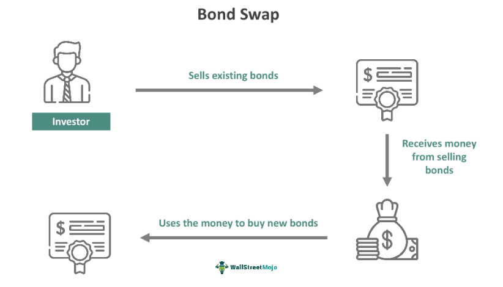

## Table of Contents

## What is bond swapping?

Bond swapping is when an investor sells one bond and uses the money to buy another bond. This is usually done to improve the investor's financial situation. For example, they might swap to get a higher interest rate, to reduce risk, or to make their taxes lower.

There are different reasons for bond swapping. One common reason is to take advantage of changes in interest rates. If interest rates go up, an investor might sell a bond with a lower rate and buy one with a higher rate. Another reason could be to change the risk level of their investments. For instance, they might swap from a risky bond to a safer one. Bond swapping can help investors manage their portfolios better and meet their financial goals.

## Why would someone consider bond swapping?

Someone might consider bond swapping to improve their investment situation. For example, if interest rates go up, an investor could sell a bond that has a lower interest rate and buy a new bond with a higher rate. This way, they can earn more money from their investment. Another reason could be to manage risk. If an investor feels that a bond they own is too risky, they might sell it and buy a safer bond. This helps them feel more secure about their money.

Bond swapping can also help with taxes. Sometimes, an investor can sell a bond at a loss and use that loss to reduce their taxes. Then, they can buy a similar bond and still keep their investment strategy. This is called tax swapping. Additionally, bond swapping can help an investor adjust their portfolio to meet changing financial goals. As life changes, so do financial needs, and bond swapping is a way to adapt to these changes without starting over with new investments.

## What are the basic types of bond swaps?

There are a few basic types of bond swaps that people use. One type is called a rate anticipation swap. This happens when someone thinks interest rates are going to change. They might sell a bond and buy a new one to get a better [interest rate](/wiki/interest-rate-trading-strategies). For example, if they think rates will go up, they could sell their current bond and buy one with a higher rate to earn more money.

Another type is a pure yield pickup swap. This is when someone swaps bonds to get a higher yield or return on their investment. They might sell a bond with a lower yield and buy one with a higher yield. This helps them make more money from their investment.

The last common type is a tax swap. This is when someone sells a bond at a loss to reduce their taxes. They can then use the money to buy a similar bond. This way, they keep their investment strategy the same but pay less in taxes. Tax swaps are useful for managing money and taxes at the same time.

## How can bond swapping improve a portfolio's yield?

Bond swapping can help improve a portfolio's yield by allowing investors to trade in bonds with lower interest rates for ones with higher rates. When interest rates go up, the value of existing bonds with lower rates might go down. By selling these bonds and buying new ones with higher rates, investors can earn more money from their investments. This is called a pure yield pickup swap. It's like trading in an old, low-paying bond for a new one that pays more.

Another way bond swapping can improve yield is by adjusting the risk level of the portfolio. Sometimes, investors might have bonds that are too safe and don't offer high returns. By swapping these safe bonds for riskier ones that offer higher yields, they can increase the overall yield of their portfolio. This strategy requires careful thinking because higher risk means there's a chance of losing money, but it can also lead to higher returns if everything goes well.

## What tax advantages can be gained from bond swapping?

Bond swapping can help lower your taxes. One way is through a tax swap, where you sell a bond at a loss. You can use this loss to reduce your taxes. After selling the bond, you can buy a similar bond to keep your investment strategy the same. This way, you don't lose out on your investment goals but still save on taxes.

Another tax advantage comes from swapping bonds to take advantage of different tax treatments. For example, you might swap from a taxable bond to a tax-exempt bond like a municipal bond. These bonds often have lower interest rates, but because the interest is not taxed, your after-tax return can be higher. This can help you keep more of your investment earnings.

## How does bond swapping help in managing interest rate risk?

Bond swapping helps manage interest rate risk by allowing investors to switch from bonds that are losing value to ones that might gain value. When interest rates go up, the value of existing bonds with lower rates usually goes down. By selling these bonds and buying new ones with higher rates, investors can protect their money from losing value. This is called a rate anticipation swap. It's like trading in an old bond for a new one that will do better when rates change.

Another way bond swapping helps with interest rate risk is by adjusting the duration of the bonds in a portfolio. Duration is a measure of how sensitive a bond's price is to changes in interest rates. If an investor thinks rates will go up, they might swap longer-duration bonds, which are more sensitive to rate changes, for shorter-duration bonds. This reduces the risk of losing money if rates rise. By making these swaps, investors can keep their portfolios safer and more stable when interest rates change.

## What role does bond swapping play in adjusting the duration of a portfolio?

Bond swapping helps investors change how long their money is tied up in bonds, which is called adjusting the duration of a portfolio. Duration is a way to measure how much a bond's price might change if interest rates go up or down. If an investor thinks interest rates will rise, they might want to swap their long-duration bonds, which are more affected by rate changes, for short-duration bonds. Short-duration bonds are less sensitive to interest rate changes, so this swap can help protect their money from losing value.

By swapping bonds, investors can make their portfolio more flexible and better suited to their current financial goals. For example, if someone wants to take less risk, they might swap longer-term bonds for shorter-term ones. This makes their investments less likely to lose value if interest rates go up. On the other hand, if they want to take more risk for a chance at higher returns, they might swap shorter-term bonds for longer-term ones. Bond swapping is a smart way to manage the timing of investments and keep the portfolio balanced as conditions change.

## Can bond swapping be used to improve the credit quality of a bond portfolio?

Bond swapping can be used to improve the credit quality of a bond portfolio. If an investor has bonds from companies that are risky or not doing well, they might want to swap those for bonds from companies that are safer and more stable. This means selling bonds with a lower credit rating and buying bonds with a higher credit rating. By doing this, the investor makes their portfolio less risky because the new bonds are more likely to pay back the money they owe.

For example, if someone owns bonds from a company that's struggling and might not be able to pay its debts, they could swap those bonds for ones from a company with a strong financial position. This helps protect their money because the new bonds are less likely to default. Bond swapping for better credit quality is a way to make sure the portfolio stays safe and secure, even if the economy changes or if certain companies start to have problems.

## How does bond swapping affect the overall risk profile of an investment portfolio?

Bond swapping can change the overall risk profile of an investment portfolio by allowing investors to switch from riskier bonds to safer ones, or vice versa. If someone wants to take less risk, they might swap bonds from companies that are struggling for bonds from companies that are doing well. This makes the portfolio safer because the new bonds have a lower chance of defaulting. On the other hand, if an investor wants to take more risk for a chance at higher returns, they could swap safer bonds for riskier ones. This increases the risk but also the potential reward.

Another way bond swapping affects risk is by changing the portfolio's sensitivity to interest rate changes. If an investor swaps longer-duration bonds, which are more affected by interest rate changes, for shorter-duration bonds, they can reduce the risk of losing money if rates go up. This makes the portfolio more stable. By carefully choosing which bonds to swap, investors can adjust the risk level of their portfolio to match their comfort and financial goals. Bond swapping is a powerful tool for managing risk and making sure the portfolio stays balanced as conditions change.

## What are the potential pitfalls and costs associated with bond swapping?

Bond swapping can have some downsides and costs that investors need to think about. One big problem is the transaction costs. Every time you buy or sell a bond, you might have to pay fees or commissions. These costs can add up and eat into the money you make from swapping. Another issue is the risk of not getting it right. If you swap bonds to take advantage of a change in interest rates, but the rates don't change the way you thought they would, you could end up with a bond that doesn't perform as well as the one you sold.

There's also the risk of losing money on the swap itself. If the bond you sell goes up in value after you sell it, or if the new bond you buy goes down in value, you could lose money. Plus, there's the tax side of things to consider. If you swap bonds and make a profit, you might have to pay taxes on that profit. This can take away some of the benefits you were hoping to get from the swap. It's important to think about these potential pitfalls and costs before deciding to swap bonds.

## How can advanced investors use bond swapping for speculative purposes?

Advanced investors can use bond swapping to try and make money from changes in the market. They might swap bonds to bet on what they think will happen with interest rates. For example, if they think rates will go up, they could sell bonds with lower rates and buy ones with higher rates. This is a way to try and earn more money if their guess about rates is right. But it's risky because if rates don't go up like they thought, they might lose money on the swap.

Another way advanced investors use bond swapping is to take advantage of changes in credit quality. They might swap bonds from a company that's doing okay to one that they think will do better in the future. If their guess is right and the new company's bonds go up in value, they can make a profit. But if the company doesn't do as well as they hoped, the bonds could lose value, and they could lose money. Bond swapping for speculation is like playing a game where you try to predict the future, and it can lead to big wins or big losses.

## What are the regulatory and compliance considerations when engaging in bond swapping?

When you swap bonds, you have to think about the rules and laws that govern these trades. Different countries and markets have their own rules about what you can and can't do with bond swaps. For example, some places might have rules about how you report these swaps to the tax office or how you record them in your financial statements. It's important to make sure you're following all these rules so you don't get in trouble. Also, if you're working with a financial advisor or a broker, they have to follow their own set of rules, like making sure they're giving you good advice and not doing anything that's against the law.

Another thing to think about is the rules that come with certain types of bonds. Some bonds, like municipal bonds, have special tax rules that you need to follow. If you swap these bonds, you need to make sure you understand how it might change your taxes. Also, if you're investing in bonds from different countries, you have to know the rules in each country. It can be tricky because the rules can change, and you need to stay up to date. It's a good idea to talk to a financial advisor or a tax expert to make sure you're doing everything right when you swap bonds.

## References & Further Reading

[1]: Jarrow, R. A. (2002). ["Modeling Fixed Income Securities and Interest Rate Options."](https://archive.org/details/modelingfixedinc0000jarr) Stanford University Press.

[2]: Fabozzi, F. J. (2015). ["Bond Markets, Analysis, and Strategies."](https://books.google.com/books/about/Bond_Markets_Analysis_and_Strategies_ten.html?id=bQpNEAAAQBAJ) 9th Edition, Pearson.

[3]: ["Algorithmic Trading and DMA: An Introduction to Direct Access Trading Strategies"](https://www.amazon.com/Algorithmic-Trading-DMA-introduction-strategies/dp/0956399207) by Barry Johnson

[4]: Chincarini, L. B., & Kim, D. (2006). ["Quantitative Equity Portfolio Management: An Active Approach to Portfolio Construction and Management."](https://archive.org/details/quantitativeequi0000chin_c9d6) McGraw-Hill Education.

[5]: Litterman, R. & Quantitative Resources Group (2003). ["Modern Investment Management: An Equilibrium Approach."](https://archive.org/details/moderninvestment0000litt) John Wiley & Sons.