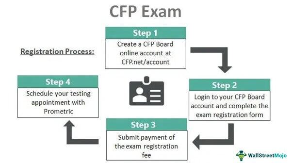

The financial industry is continuously reshaped by technological advancements, with algorithmic trading emerging as one of the most transformative changes. This strategy employs complex algorithms to execute trades at speeds and volumes that far surpass human capability. As the landscape of finance becomes more sophisticated, the role of Certified Financial Planners (CFPs) expands in importance. CFPs hold a crucial position in guiding clients through these technological and strategic advancements, ensuring that financial goals are met amidst evolving tools and methodologies.

This article examines the relationship between the roles of certified financial planners, financial advisors, and the advent of algorithmic trading. The CFP designation denotes a commitment to a high standard of expertise and ethical practice, setting CFPs apart from other financial practitioners. As financial markets become increasingly influenced by technology, CFPs are tasked with integrating these new techniques into their advisory framework, balancing the precision and adaptability offered by algorithmic trading with the personalized, fiduciary responsibility they uphold.



Algorithmic trading holds both opportunities and challenges for financial planners. It offers a new frontier for diversifying strategies and optimizing client portfolios. However, it also demands an understanding of complex algorithms and the potential risks associated with their use. This balance is crucial as CFPs navigate these new waters, leveraging technological advancements while maintaining the core principles of financial planning—trust, reliability, and personalized client care.

In the sections that follow, we will explore how CFPs can benefit from the integration of algorithmic trading and the challenges they may face in doing so. Understanding the dynamics of financial technology, along with the steadfast principles of financial planning, will be key to advancing in this rapidly evolving industry.

## Table of Contents

## Understanding the Role of a Certified Financial Planner (CFP)

A Certified Financial Planner (CFP) stands as a benchmark of excellence in the financial planning industry. This professional designation is conferred upon individuals who meet the rigorous standards established by the Certified Financial Planner Board of Standards (CFP Board). These standards are meticulously designed to ensure that CFPs possess the expertise necessary to guide clients through intricate financial landscapes.

To obtain the CFP designation, candidates must satisfy several stringent requirements. Firstly, they must complete a comprehensive education program that covers various aspects of financial planning, including investment, retirement, estate planning, tax management, and insurance. This education is followed by a challenging examination that rigorously tests their knowledge in these areas, ensuring that only those with a profound understanding qualify.

One of the defining features of a CFP is their role as a fiduciary. This critical distinction demands that CFPs prioritize their clients' interests above their own. The fiduciary obligation is vital, setting CFPs apart from other financial advisory roles, where such a primary duty may not be obligatory. This commitment to acting in the clients' best interests provides a safeguard against conflicts of interest, ensuring unbiased and ethical advisement.

The significance of the CFP designation also lies in its ethical underpinnings. CFPs are required to adhere to a strict code of professional conduct, which mandates honesty, integrity, and transparency. This ethical framework assures clients that they are engaging with trustworthy advisors who are held to the highest standards of accountability.

Moreover, the CFP designation serves as a reliable indicator of expertise. Consumers selecting a CFP can expect a level of proficiency and integrity that is unparalleled in the financial advisory landscape. This assurance is particularly crucial when navigating complex financial strategies, where reliable guidance is essential.

In summary, the role of a Certified Financial Planner is characterized by its adherence to high educational and ethical standards. The fiduciary duty associated with the CFP certification ensures that clients receive financial planning advice that is both competent and principled, enhancing their trust in the advisor-client relationship.

## Financial Advisor vs. Certified Financial Planner

Financial advisors and Certified Financial Planners (CFPs) share overlapping duties, such as providing investment advice and managing client assets, yet they differ distinctly in qualifications and obligations to clients. While both roles aim to enhance a client's financial well-being, the CFP designation signifies a higher level of expertise and commitment to ethical standards. 

A financial advisor typically offers guidance on investments, tax planning, estate planning, and other wealth management strategies. However, not all financial advisors possess the CFP certification. The CFP credential requires passing a comprehensive exam administered by the Certified Financial Planner Board of Standards, demonstrating a thorough understanding of personal financial planning. Moreover, CFPs are required to adhere to a strict code of ethics and act as fiduciaries, meaning they must prioritize the interests of their clients above their own. This fiduciary duty sets CFPs apart from many other financial advisors, who may not be bound to such a rigorous ethical standard.

The distinction is particularly significant when considering complex strategies like [algorithmic trading](/wiki/algorithmic-trading), where the stakes and potential for conflict of interest are higher. Clients seeking advice in these areas should note the enhanced accountability and expertise that a CFP brings. A CFP's obligation to maintain transparency and uphold client interests is crucial, ensuring that advanced trading strategies are aligned with the client's broader financial goals.

In summary, while both financial advisors and CFPs contribute significantly to financial planning, the CFP designation offers a guarantee of greater competency and ethical commitment, which is particularly valuable in sophisticated financial domains.

## Algorithmic Trading: An Overview

Algorithmic trading is a method of executing a large [volume](/wiki/volume-trading-strategy) of trades using advanced mathematical models and automated systems. It relies on high-speed computer algorithms, which operate based on predefined instructions to [carry](/wiki/carry-trading) out trades swiftly and accurately. The primary goal is to capitalize on trading opportunities that may not be visible to human traders due to limitations in processing speed and information analysis.

This method of trading enhances efficiency by reducing the market impact of large orders and minimizing losses caused by human error or emotion-driven decisions. By ensuring quick execution of trades, algorithmic trading can help capture short-lived trading opportunities and offer potentially higher returns for investors.

Algorithmic trading represents a synthesis of computer science and financial theory, utilizing techniques from both fields to predict market behavior and make informed trading decisions. Algorithms are built using historical data to identify trends, patterns, and correlations. The execution of trades can be triggered by market conditions such as price movement, volume, and timing, making the process largely automated. 

For example, a basic algorithm might look for a moving average crossover—a common trading signal wherein the short-term moving average (e.g., 50-day) crosses above the long-term moving average (e.g., 200-day). Such events can be programmed as basic rules in the algorithm to automatically execute buy or sell orders.

```python
# Example of a basic moving average crossover strategy
def moving_average(prices, window_size):
    return sum(prices[-window_size:]) / window_size

def trade_strategy(short_window, long_window, prices):
    if len(prices) < long_window:
        return "Hold"

    short_ma = moving_average(prices, short_window)
    long_ma = moving_average(prices, long_window)

    if short_ma > long_ma:
        return "Buy"
    elif short_ma < long_ma:
        return "Sell"
    else:
        return "Hold"
```

The convergence of finance and computer science broadens opportunities for generating returns. However, algorithmic trading is not without its risks. Rapid trading can escalate systemic risks in financial markets, especially if a technical failure or programming error occurs. Market changes not accounted for in the original algorithm can result in unexpected losses, highlighting the need for continuous monitoring and refinement of trading strategies.

In conclusion, while algorithmic trading provides mechanisms for generating efficient and potentially lucrative trading outcomes, it also demands a deep understanding of both the markets and the algorithms in use. Balancing technological advancements with comprehensive risk management practices is essential for success.

## Benefits of Algorithmic Trading for Financial Planners

Algorithmic trading presents a considerable advantage for financial planners, particularly Certified Financial Planners (CFPs), as it empowers them to implement sophisticated and quantitative strategies that can respond promptly to fluctuations in market dynamics. With algorithmic trading, financial planners can leverage advanced computational techniques to enhance portfolio management and deliver superior outcomes for their clients.

One notable benefit of algorithmic trading is its capability to automate the trading process based on predefined criteria, enabling swift execution of trades which can capitalize on market inefficiencies. This rapid reaction time to market changes is critical in financial planning, where timely decisions can significantly impact investment returns.

CFPs can harness these algorithms to optimize portfolios by modeling various scenarios and adjusting asset allocations according to market conditions. For example, an algorithm can be set to monitor specific indicators and automatically rebalance a portfolio to maintain a target risk level, thereby ensuring that investment strategies align with clients' financial goals and risk tolerance.

Moreover, the data-driven nature of algorithmic trading offers a level of market insight that surpasses traditional manual trading. By analyzing vast amounts of financial data, algorithms can identify trends and patterns that may not be immediately apparent to human analysts. This depth of analysis allows CFPs to make more informed decisions, enhance risk management practices, and improve the overall efficacy of their strategic recommendations.

In Python, a simple demonstration of algorithmic trading might involve using libraries such as pandas for data manipulation and NumPy for numerical operations. An algorithm could be created to identify buying opportunities based on moving averages:

```python
import pandas as pd
import numpy as np

# Sample data: closing prices
data = {'close': [120, 125, 130, 128, 132, 136, 139, 138]}
df = pd.DataFrame(data)

# Calculate the moving averages
short_window = 2
long_window = 3
df['short_mavg'] = df['close'].rolling(window=short_window, min_periods=1).mean()
df['long_mavg'] = df['close'].rolling(window=long_window, min_periods=1).mean()

# Determine buy signals where short moving average crosses above long moving average
df['signal'] = np.where(df['short_mavg'] > df['long_mavg'], 1, 0)

print(df[['close', 'short_mavg', 'long_mavg', 'signal']])
```

This code calculates short and long moving averages of stock closing prices, generating a buy signal when the short-term moving average crosses above the long-term moving average—an example of how financial planners can use algorithms to guide investment decisions.

By utilizing algorithmic tools, financial planners can not only streamline their processes but also gain a competitive edge in investment management, ultimately offering clients better financial planning services. This technological integration promises improved efficiency, accuracy, and strategic depth in managing investment portfolios.

## Risks and Challenges of Algorithmic Trading

Algorithmic trading, while offering numerous efficiencies, also presents notable risks and challenges that financial planners must navigate to protect client interests and investments. One primary concern is systemic market risk, where the extensive use of algorithms can exacerbate market [volatility](/wiki/volatility-trading-strategies). This risk becomes particularly pronounced during events where algorithms interact in unforeseen ways, potentially triggering widespread market disruptions. An example of this is the "flash crash" incidents, where rapid, automated trading exacerbates [liquidity](/wiki/liquidity-risk-premium) issues, leading to significant price fluctuations in a very short period.

Technical failures represent another critical risk, as algorithmic trading systems heavily rely on complex software and hardware infrastructures. A minor glitch can result in significant losses if not promptly identified and rectified. These systems require constant monitoring to ensure that all components function optimally. Additionally, trading algorithms can sometimes operate on incorrect market data or outdated strategies, further compounding potential issues.

For Certified Financial Planners (CFPs), awareness of these risks is crucial. It enables them to provide informed advice while implementing strategies to mitigate potential damages to client portfolios. Ensuring rigorous compliance with financial regulations and implementing robust risk management strategies are essential components of a sound approach to algorithmic trading. Such measures may include stress-testing algorithms under varying market conditions and maintaining comprehensive audit trails for trades executed by algorithms.

For instance, a CFP implementing algorithmic trading might employ Python-based risk management frameworks. These could feature modules for real-time monitoring of algorithm performance and anomaly detection. Here's a simple example of an algorithm implementation that monitors trade execution and identifies deviations:

```python
import numpy as np

def monitor_trade_execution(actual_prices, expected_prices, threshold=0.01):
    deviations = np.abs(np.array(actual_prices) - np.array(expected_prices))
    anomalies = deviations > threshold

    if np.any(anomalies):
        print("Warning: Trade execution deviations detected.")
    else:
        print("Trade executions within acceptable range.")

# Example usage:
actual_prices = [100.5, 101.0, 102.2]
expected_prices = [100.4, 100.9, 102.0]
monitor_trade_execution(actual_prices, expected_prices)
```

Robust risk management strategies and regular audits are necessary to foster accountability and continuous improvement in trading algorithms. By employing such measures, CFPs can better navigate the challenges of algorithmic trading, ultimately delivering more resilient, informed, and technology-integrated financial planning to their clients.

## The Intersection of Algorithmic Trading and Financial Planning

Integrating algorithmic trading into financial planning requires a nuanced approach that bridges cutting-edge technology with established financial principles. Certified Financial Planners (CFPs) stand to benefit from this integration by enhancing their capacity to deliver sophisticated, tailored advice. Algorithmic trading, characterized by high-speed execution and data-driven strategies, complements the methodical and personalized planning process that CFPs traditionally employ.

The key to synthesizing these two domains lies in the CFP's ability to leverage algorithmic trading techniques to optimize investment strategies. This can be achieved by utilizing algorithms to process vast quantities of financial data, enabling CFPs to identify trends and make timely decisions that align with clients' financial goals. For example, portfolio diversification, a cornerstone of financial planning, can be dynamically managed using algorithms to balance risk and return more efficiently.

CFPs must, however, maintain a commitment to ongoing education and skill development. The rapid pace of technological advancement necessitates that they remain informed about new algorithmic trading tools and techniques to ensure their strategies remain relevant and effective. This involves not only understanding the technical aspects of algorithmic models but also interpreting their outputs to provide meaningful insights to clients.

Balancing technology with tradition is crucial. While algorithms can enhance efficiency and accuracy, human insight is invaluable for interpreting long-term financial plans and understanding clients’ unique circumstances. CFPs can elevate their value proposition by offering a harmonious blend of automated precision and personalized guidance, striking a balance that leverages the strengths of both machine intelligence and human expertise.

Overall, the integration of algorithmic trading into financial planning enriches the CFP's toolkit, providing a competitive edge in delivering comprehensive, forward-looking financial advice. As the financial landscape evolves, CFPs who adeptly blend tradition with innovation will help clients navigate complexities and achieve their financial objectives more effectively.

## The Future of Financial Planning with Algorithmic Trading

The integration of algorithmic trading in financial planning is poised to transform the role of Certified Financial Planners (CFPs) by providing sophisticated tools that enable a more nuanced approach to investment strategies. As technology continues to evolve, CFPs are expected to incorporate advanced computing techniques and big data analytics into their practice, significantly enhancing the depth and accuracy of financial insights.

Algorithmic trading is already altering the landscape of financial markets through the use of complex algorithms that can process vast amounts of financial data at unprecedented speeds. This capability allows CFPs to design and implement strategies that are not only responsive to changing market conditions but also informed by far more data points than traditional methods. As such, understanding and leveraging these quantitative methods will become indispensable for CFPs aiming to develop forward-thinking financial strategies.

Incorporating algorithmic trading into financial planning goes beyond simply adopting new tools; it calls for a rethinking of financial strategies to align with the potential and limits of these technologies. Algorithmic trading can profit from market inefficiencies and optimize asset allocation through techniques such as statistical [arbitrage](/wiki/arbitrage), [momentum](/wiki/momentum) strategies, and mean-reversion techniques. For instance, the application of [machine learning](/wiki/machine-learning) models can enhance prediction accuracy in asset price movements, thus enabling more informed decision-making.

```python
# Example of a rudimentary strategy using Python's pandas and numpy libraries

import numpy as np
import pandas as pd

# Sample data for asset prices
np.random.seed(0)
dates = pd.date_range('20230101', periods=100)
prices = pd.DataFrame(np.random.randn(100, 4), index=dates, columns=list('ABCD'))

# Calculate moving average
moving_avg = prices.rolling(window=10).mean()

# Signal generation: when current price crosses above moving average, buy
signals = (prices > moving_avg).astype(int)

# Display the first few signals
signals.head()
```

However, this technological shift is not devoid of challenges. The integration of algorithmic trading demands continuous innovation and robust ethical standards to ensure fair and transparent practices. There are also concerns related to systemic risks, data privacy, and the potential for reduced human oversight. As a result, CFPs must engage in ongoing education and skill development to keep pace with technological advancements and maintain their role as fiduciaries who act in the best interest of their clients.

Moreover, regulatory frameworks will likely evolve to address the unique risks posed by algorithmic trading. This evolution will necessitate CFPs to stay informed about legal and compliance standards, ensuring their practices are aligned with new regulations.

The future of financial planning, facilitated by algorithmic trading, promises a landscape where technology and human insight coexist to deliver unparalleled value to clients. As the industry advances, the ability of CFPs to integrate these technologies while adhering to highest ethical standards will set the benchmark for success in an increasingly complex financial world.

## Conclusion

Algorithmic trading presents both opportunities and challenges for Certified Financial Planners (CFPs) aiming to offer sophisticated, data-driven financial advice. It enables planners to harness quantitative methods and high-speed execution to potentially enhance client portfolios. This technological advancement necessitates a blend of traditional financial expertise and modern algorithmic strategies, proving essential for meeting contemporary client expectations.

Clients today seek financial advisors who not only excel in foundational financial principles but also embrace modern technology for informed decision-making. Algorithmic trading, with its ability to process vast amounts of data and execute trades rapidly, provides CFPs with a significant advantage in optimizing investment strategies. However, advisors must balance this with sound risk management practices to mitigate potential drawbacks, including systemic risks and technical errors inherent in automated systems.

By responsibly integrating algorithmic trading into their services, CFPs can improve their effectiveness and enhance their standing in the financial services industry. This approach requires ongoing education and adaptation to the technological advancements shaping the financial landscape. Successfully doing so not only enriches the planning process for clients but also elevates the reputation of CFPs as forward-thinking leaders capable of navigating the complexities of modern financial markets.

## References & Further Reading

[1]: Bergstra, J., Bardenet, R., Bengio, Y., & Kégl, B. (2011). ["Algorithms for Hyper-Parameter Optimization."](https://dl.acm.org/doi/10.5555/2986459.2986743) Advances in Neural Information Processing Systems 24.

[2]: ["Advances in Financial Machine Learning"](https://www.amazon.com/Advances-Financial-Machine-Learning-Marcos/dp/1119482089) by Marcos Lopez de Prado

[3]: ["Evidence-Based Technical Analysis: Applying the Scientific Method and Statistical Inference to Trading Signals"](https://www.amazon.com/Evidence-Based-Technical-Analysis-Scientific-Statistical/dp/0470008741) by David Aronson

[4]: ["Machine Learning for Algorithmic Trading"](https://github.com/stefan-jansen/machine-learning-for-trading) by Stefan Jansen

[5]: ["Quantitative Trading: How to Build Your Own Algorithmic Trading Business"](https://github.com/LucindaYa/quant-resources/blob/master/Quantitative%20Trading%20How%20to%20Build%20Your%20Own%20Algorithmic%20Trading%20Business.pdf) by Ernest P. Chan