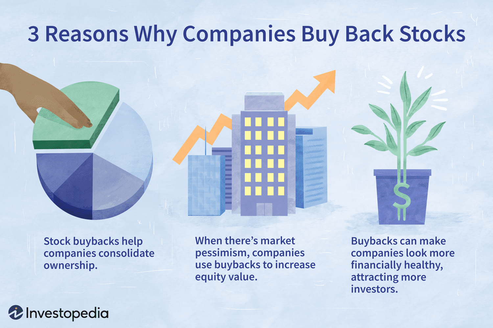

## Table of Contents

## What is a corporate stock buyback?

A corporate stock buyback, also known as a share repurchase, is when a company buys back its own shares from the market. This means the company is essentially investing in itself by reducing the number of shares available to the public. Companies might do this for several reasons, like thinking their stock is undervalued, wanting to increase the value of remaining shares, or having extra cash they want to use effectively.

When a company buys back its shares, it can make the stock price go up because there are fewer shares available. This can be good for investors because their shares might become more valuable. However, it can also be controversial. Some people think companies should use their money for other things, like investing in new projects or paying employees more, instead of buying back shares.

## Why do companies engage in stock buybacks?

Companies engage in stock buybacks for a few main reasons. One big reason is that they might think their stock is not valued correctly by the market. When a company believes its shares are undervalued, buying them back can be a smart move. It's like saying, "We think our company is worth more than what the stock price shows." This can also show investors that the company's leaders have confidence in its future, which might make more people want to invest.

Another reason is to boost the value of the remaining shares. When a company buys back its stock, it reduces the total number of shares out there. With fewer shares, the value of each share can go up because the company's earnings are spread over fewer shares. This can make the stock more attractive to investors and can be a way for the company to return value to its shareholders without paying dividends.

Lastly, companies might do buybacks when they have extra cash and don't have better ways to use it. Instead of letting the cash sit idle or investing in projects that might not pay off, they can use it to buy back shares. This can be seen as a way to efficiently use their money, but it can also be controversial. Some people argue that the money could be better spent on things like research and development, employee wages, or other investments that could help the company grow in the long run.

## How do stock buybacks affect a company's stock price?

When a company buys back its own stock, it usually makes the stock price go up. This happens because there are fewer shares available in the market. Imagine if you have a pizza and you cut it into fewer slices. Each slice gets bigger, right? It's the same with stock. When a company buys back shares, it's like cutting the pizza into fewer slices, so each share (or slice) becomes more valuable because the company's earnings are now spread over fewer shares.

But it's not just about fewer shares. When a company decides to buy back its stock, it sends a message to investors. It's like the company is saying, "We believe in ourselves and think our stock is a good investment." This can make investors feel more confident and want to buy more shares, which can push the stock price up even more. However, if investors think the company should be using its money for other things, like growing the business or paying employees more, the stock price might not go up as much or could even go down.

## What are the financial implications of stock buybacks for a company?

When a company does a stock buyback, it uses its cash to buy its own shares from the market. This means the company is spending money it has on hand, which could affect its cash reserves. If a company spends a lot of money on buybacks, it might have less cash to use for other things like investing in new projects, paying off debts, or saving for the future. On the positive side, if the stock price goes up because of the buyback, the value of the company can increase, making it look more attractive to investors.

Stock buybacks can also change how much the company is worth on paper. When a company buys back its shares, it reduces the total number of shares out there. This can make the earnings per share (EPS) go up because the company's profits are now divided by fewer shares. A higher EPS can make the company look more profitable and can make the stock price go up. But if the company uses too much money for buybacks and doesn't have enough left for other important things, it might struggle in the long run. So, while buybacks can be good for the stock price in the short term, they need to be done carefully to make sure the company stays healthy over time.

## How do stock buybacks impact shareholders?

Stock buybacks can be good for shareholders because they often make the stock price go up. When a company buys back its shares, there are fewer shares available, so each share becomes more valuable. This means that if shareholders decide to sell their shares, they might get more money than before. Also, when a company buys back its stock, it's like telling investors, "We believe in our company." This can make shareholders feel more confident about their investment, which can be a good thing.

But stock buybacks aren't always great for everyone. If a company uses a lot of its money to buy back shares, it might not have enough left to spend on other important things, like growing the business or paying employees more. Some shareholders might prefer if the company used its money to pay dividends instead of buying back shares. Dividends are like a regular paycheck from the company, and some investors count on that money. So, while buybacks can make the stock price go up, they can also lead to debates about how a company should use its money.

## What are the tax advantages of stock buybacks compared to dividends?

When a company does a stock buyback, it can be better for shareholders in terms of taxes compared to getting dividends. If a company pays dividends, shareholders have to pay taxes on that money right away. But if the company buys back its stock, shareholders don't have to pay taxes until they sell their shares. And if they hold onto their shares for a long time, they might pay a lower tax rate when they finally sell.

This difference can make a big impact on how much money shareholders keep. For example, if you get a dividend, you pay taxes on it right away, which means you have less money to spend or invest. But with a stock buyback, you can choose when to sell your shares and pay taxes, which might be at a time when your tax rate is lower. This flexibility can help shareholders keep more of their money and use it in ways that are best for them.

## Can stock buybacks be used to manipulate earnings per share (EPS)?

Yes, stock buybacks can be used to make earnings per share (EPS) look better. When a company buys back its own shares, it reduces the total number of shares out there. Since EPS is calculated by dividing the company's earnings by the number of shares, fewer shares mean the EPS goes up, even if the company's actual earnings haven't changed. This can make the company look more profitable on paper, which might make investors think the company is doing better than it really is.

But using buybacks to boost EPS isn't always a good thing. If a company spends a lot of money on buybacks just to make its EPS look better, it might not have enough money left for other important things, like investing in new projects or paying employees more. This can hurt the company in the long run. Also, if investors find out that a company is using buybacks to make its numbers look better instead of actually improving its business, they might lose trust in the company, which can hurt the stock price.

## What are the potential downsides of stock buybacks for a company?

Stock buybacks can have some downsides for a company. One big problem is that they use up a lot of the company's cash. If a company spends too much money buying back its own shares, it might not have enough money left for other important things, like investing in new projects, paying off debts, or saving for the future. This can make it hard for the company to grow and stay healthy in the long run.

Another downside is that stock buybacks can make the company look better on paper without actually improving its business. For example, buybacks can make earnings per share (EPS) go up, which can make the company seem more profitable. But if the company is just using buybacks to make its numbers look good instead of focusing on real growth, it might be hiding bigger problems. This can make investors lose trust in the company, which can hurt the stock price and the company's reputation.

## How do stock buybacks influence a company's capital structure?

When a company does a stock buyback, it changes its capital structure. Capital structure is how a company uses different types of money, like debt and equity, to run its business. When a company buys back its shares, it's using cash to reduce the amount of equity it has. This means the company might have less cash on hand, which could affect how it uses debt. If the company has less cash, it might need to borrow more money to keep things running, which can increase its debt levels.

This shift in capital structure can have big effects. If the company's debt goes up because of the buyback, it might have to pay more interest on that debt. This can make the company's finances more risky, especially if it's hard to pay back the debt. On the other hand, if the buyback makes the stock price go up and makes investors happy, it can be good for the company's overall value. But the company needs to be careful to balance its debt and equity well, so it stays healthy and can keep growing.

## What role do stock buybacks play in corporate governance?

Stock buybacks are a big deal in how companies are run. They show what the people in charge, like the CEO and the board of directors, think is best for the company. When they decide to buy back shares, it means they believe the company's stock is a good investment. This can make investors feel good about the company because it shows that the leaders have confidence in it. But it also means the leaders are choosing to spend the company's money on buying back shares instead of other things, like growing the business or paying employees more. So, buybacks are a way for leaders to show what they think is most important for the company's future.

But stock buybacks can also cause problems in how a company is run. If the leaders use buybacks just to make the company's numbers look better without really improving the business, it can be a bad sign. This can make investors lose trust in the company because they might think the leaders are more focused on short-term gains than on making the company strong in the long run. Also, if a lot of money goes into buybacks, there might not be enough left for other important things, like investing in new projects or keeping the company's finances healthy. So, while buybacks can be a part of good corporate governance, they need to be used carefully and for the right reasons.

## How do regulatory environments affect the practice of stock buybacks?

The rules and laws set by governments can really change how companies do stock buybacks. In some countries, there are strict rules about when and how companies can buy back their shares. For example, in the United States, companies have to follow rules from the Securities and Exchange Commission (SEC). These rules say things like how much a company can spend on buybacks and when they have to tell everyone about it. If the rules are too strict, companies might do fewer buybacks because it's too hard to follow all the rules.

But in other places, the rules might be easier, which can make it simpler for companies to buy back their shares. For example, some countries might not have as many rules, so companies can do buybacks more often and spend more money on them. This can be good for companies because it gives them more freedom to use their money how they want. But it can also be risky if companies use buybacks in ways that aren't good for the company or its shareholders in the long run. So, the rules in different places can make a big difference in how much and how often companies do stock buybacks.

## What are the long-term strategic benefits of stock buybacks for a corporation?

Stock buybacks can help a company in the long run by making its stock more valuable. When a company buys back its shares, there are fewer shares out there, so each share becomes worth more. This can make the company look more attractive to investors because they see that the stock price might go up. If investors think the company is doing well, they might want to buy more shares, which can help the company raise more money in the future. Also, when a company buys back its stock, it shows that the leaders believe in the company's future, which can make investors feel more confident about their investment.

But stock buybacks can also help a company in other ways over time. For example, if a company has extra cash and doesn't have good projects to spend it on, buying back shares can be a smart way to use that money. This can help the company keep its finances strong because it's not wasting money on things that might not pay off. Also, by making the stock price go up, buybacks can make it easier for the company to use its stock to pay for things like buying other companies or rewarding employees with stock options. So, while buybacks can be good for the stock price right away, they can also help the company stay healthy and grow in the long run if they're done the right way.

## What is the understanding of Stock Repurchase and Share Buyback?

A stock repurchase, also known as a share buyback, is a corporate action in which a company buys back its own shares from the marketplace. This reduces the number of outstanding shares, thereby increasing the ownership stake of remaining shareholders. Buybacks have become a strategic tool in corporate finance used to optimize various financial metrics.

One of the primary advantages of stock repurchases is their impact on earnings per share (EPS) and return on equity (ROE). By reducing the number of shares outstanding, a company can increase its EPS, assuming net income remains constant. The formula for EPS is:

$$
\text{EPS} = \frac{\text{Net Income}}{\text{Outstanding Shares}}
$$

A similar effect occurs with ROE, which is calculated as:

$$
\text{ROE} = \frac{\text{Net Income}}{\text{Shareholders' Equity}}
$$

By decreasing the number of shares, buybacks can bolster EPS and ROE, making the company attractive to potential investors.

From a taxation perspective, stock buybacks can be more advantageous than dividends. When a company distributes dividends, shareholders must pay taxes on them, which can reach high tax rates. In contrast, capital gains taxes on the appreciation of share value due to buybacks are typically lower and deferred until the shares are sold. This tax efficiency encourages companies to prefer buybacks over dividends as a method of returning capital to shareholders.

Valuation impacts of buybacks also play a significant role. When a company repurchases its shares at a price lower than its intrinsic value, it can enhance shareholder wealth by effectively buying assets at a discount. This action signals to the market that management believes the stock is undervalued, potentially attracting more investors.

Case studies from major corporations illustrate the strategic use of stock buybacks. For instance, Apple Inc. has executed substantial buyback programs as part of its capital return strategy. Through these buybacks, Apple has aimed to enhance its EPS and reward its shareholders by returning billions of dollars over time. Microsoft has also embarked on significant buyback initiatives. By leveraging its robust cash flow, Microsoft has been able to support share repurchases that contribute to rising EPS and investor confidence.

These examples of Apple and Microsoft underscore the strategic importance of share buybacks in maximizing shareholder value and aligning financial metrics with corporate growth objectives. Their experiences demonstrate how well-executed buybacks can effectively leverage excess cash reserves, optimize financial performance, and signal institutional confidence to the market.

## Why do companies opt for share buybacks?

Companies opt for share buybacks for various strategic reasons, chief among them being stock undervaluation and excess cash reserves. When a firm's stock is perceived as undervalued, management may initiate buybacks to buy shares at a bargain, which can lead to an increase in stock price as the market recognizes the implicit confidence in the company’s future. Additionally, companies with substantial cash reserves and limited investment opportunities may prefer buybacks to redistribute capital to shareholders, enhancing per-share metrics.

Buybacks can significantly enhance earnings per share (EPS). The formula for EPS is:

$$
\text{EPS} = \frac{\text{Net Income}}{\text{Outstanding Shares}}
$$

By reducing the number of outstanding shares through buybacks, the denominator decreases, resulting in an increased EPS if net income remains constant or increases. This improvement in EPS can subsequently elevate the stock price and attract further investment, enhancing overall shareholder value.

Moreover, buybacks serve as a defensive mechanism against potential takeovers. When a company repurchases its shares, it reduces the number of shares available in the open market, making it pricier and more challenging for a hostile entity to acquire a controlling stake. This concentration of ownership can also solidify the power of existing shareholders or management against hostile bids.

Share buybacks hold a vital place in strategic financial management, impacting equity ownership concentration. By reducing the publicly available shares, buybacks can increase the ownership percentage of shareholders who choose to hold onto their shares. This concentration can lead to more decisive and aligned management and shareholder strategies, potentially leading to better governance and strategic outcomes.

In conclusion, share buybacks are a multifaceted tool in corporate finance, allowing companies to address undervaluation, optimize capital distribution, enhance financial metrics, and fortify against unwanted takeovers, all while strategically managing equity concentration.

## References & Further Reading

[1]: Bergstra, J., Bardenet, R., Bengio, Y., & Kégl, B. (2011). ["Algorithms for Hyper-Parameter Optimization."](https://dl.acm.org/doi/10.5555/2986459.2986743) Advances in Neural Information Processing Systems 24.

[2]: ["Advances in Financial Machine Learning"](https://www.amazon.com/Advances-Financial-Machine-Learning-Marcos/dp/1119482089) by Marcos Lopez de Prado

[3]: ["Evidence-Based Technical Analysis: Applying the Scientific Method and Statistical Inference to Trading Signals"](https://www.amazon.com/Evidence-Based-Technical-Analysis-Scientific-Statistical/dp/0470008741) by David Aronson

[4]: ["Machine Learning for Algorithmic Trading"](https://github.com/stefan-jansen/machine-learning-for-trading) by Stefan Jansen

[5]: ["Quantitative Trading: How to Build Your Own Algorithmic Trading Business"](https://www.amazon.com/Quantitative-Trading-Build-Algorithmic-Business/dp/1119800064) by Ernest P. Chan