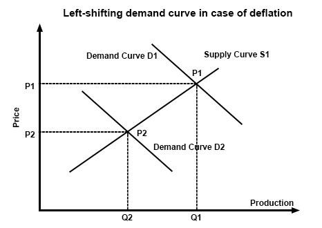

Deflation is an economic phenomenon characterized by a general decline in prices for goods and services. This process is often contrasted with inflation, where the prices of goods and services increase. Unlike inflation, which typically erodes the real value of money, deflation enhances its value, allowing consumers to purchase more with the same amount of currency. This dynamic presents both challenges and opportunities within an economic system. Deflation holds significant importance as it has the potential to disrupt economic growth, influence investment strategies, and alter market dynamics.

At the heart of financial markets today is algorithmic trading, where computer algorithms execute financial transactions at high speed and volume by employing predefined criteria. The nuances of deflation bring about unique challenges and opportunities for algorithmic trading. Traders and investors must adapt to price shifts and other accompanying market conditions that deflation may usher in, such as shifts in liquidity and volatility.



This article focuses on the implications of deflation, as well as its intersections with economic variables and algorithmic trading strategies. By exploring the benefits of deflation alongside its impacts, and evaluating the interplay with algorithmic trading strategies, this piece aims to provide valuable insights for key market participants including traders, investors, and policymakers. Understanding these dynamics is crucial for navigating the complex and evolving financial landscape in the face of deflationary pressures.

## Table of Contents

## Understanding Deflation

Deflation is characterized by a sustained decrease in the general price level of goods and services within an economy. Unlike inflation, where the purchasing power of money decreases over time due to rising prices, deflation enhances the real value of money as consumer prices fall. This phenomenon can emerge from two primary economic conditions: a reduction in overall consumer demand or an increase in the supply of goods and services.

A demand-side deflation is often a result of consumers delaying purchases in anticipation of lower prices, which contributes to a further decline in demand. Meanwhile, supply-side deflation can be propelled by technological advancements that lead to increased productivity and reduced production costs, thereby increasing the supply of goods.

Historically, notable occurrences of deflation include the Great Depression in the 1930s and Japan's Lost Decade during the 1990s. The Great Depression saw a severe contraction in economic activity and a sharp decline in prices, driven by a collapse in consumer and business confidence, leading to soaring unemployment and reduced spending. Japan's deflationary period was a result of asset price bubbles bursting, coupled with a prolonged banking crisis, which led to stagnation and persistent price declines.

Key indicators of deflation include a falling Consumer Price Index (CPI), which measures the average change in prices paid by consumers for goods and services. A sustained decline in CPI suggests that prices are decreasing across an economy. Additionally, deflation is marked by reduced consumer spending as individuals and businesses opt to hold onto cash reserves in expectation of lower prices in the future. Furthermore, falling asset prices, such as real estate and stock market valuations, are also indicative of deflation, potentially leading to reduced wealth and confidence among investors.

Understanding these aspects is crucial for policymakers, investors, and traders, as deflationary pressures can have profound impacts on economic stability, investment returns, and market dynamics. The ability to anticipate and navigate these conditions can offer strategic advantages in adapting to deflation's challenges and opportunities.

## Economic Impact of Deflation

Deflation, characterized by a general decline in the price level of goods and services, can exert significant influences on the economy. One primary impact is the potential to cause decreased consumer spending. As individuals anticipate further price declines, they may delay purchases, leading to reduced overall spending. This behavior can precipitate an economic slowdown, as consumer spending is a primary driver of economic activity.

Another critical effect of deflation is it increases the real value of debt. This occurs because while the nominal value of debts remains constant, the real burden—the amount of goods and services that must be worked for to repay the debt—increases due to falling prices. This condition can pose significant challenges for borrowers, potentially leading to financial distress as their capacity to service their debts diminishes.

Sector-specific impacts of deflation can vary. Companies may experience reduced corporate profits if declining prices outpace cost reductions. Furthermore, the reduction in expected returns can lead to hesitancy in investments, as firms may postpone or cancel planned capital expenditures. Such behaviors can stifle innovation and long-term economic growth prospects.

Despite these challenges, deflation can offer some benefits. It can increase consumers' purchasing power, as their real incomes rise when prices fall. This increase in real income can allow individuals to acquire more goods and services than before, potentially improving standards of living. Additionally, deflation can lead to reduced input costs for businesses, as falling prices of raw materials and other inputs decrease production costs. This reduction can enhance profit margins if savings on inputs surpass price declines.

In essence, the economic impact of deflation is multifaceted, bearing both challenges and opportunities that vary across different economic sectors and actors. The complexities involved in navigating a deflationary environment necessitate a comprehensive understanding for effective decision-making and strategic positioning.

## Algorithmic Trading: An Overview

Algorithmic trading is a technological advancement in financial markets where computer algorithms automate the process of trading based on predetermined criteria such as timing, price, and [volume](/wiki/volume-trading-strategy). This form of trading is marked by its ability to enhance market efficiency, reduce transaction costs, and capitalize on fleeting market opportunities.

In [algorithmic trading](/wiki/algorithmic-trading), pre-programmed instructions execute trades at speeds and frequencies that are beyond human capabilities. An algorithm, in this context, is a defined set of rules designed to perform tasks—in this case, buying or selling securities. These algorithms can analyze a multitude of parameters in real-time, allowing for optimal decision-making based on market data.

A primary advantage of algorithmic trading is its efficiency. By automating the trading process, algorithms minimize the likelihood of human error and emotional decision-making, which can lead to suboptimal trading outcomes. This automation also allows for high-frequency trading ([HFT](/wiki/high-frequency-trading-strategies)), where thousands of trades can be executed within a fraction of a second to exploit small price changes.

Moreover, algorithmic trading significantly reduces transaction costs. Traditional trading often involves brokerage fees and slippage (the difference between the expected price of a trade and the actual price). Algorithms can execute trades at precise moments, thus minimizing these costs. They can also access various market venues simultaneously to discover the best possible prices, a process known as "smart order routing."

The adaptability and capabilities of algorithmic trading have been further enhanced by advancements in technology, particularly Artificial Intelligence (AI) and Machine Learning (ML). These technologies enable algorithms to learn from historical market data and adapt to changing market conditions. Machine learning models can identify complex patterns and predict market movements, providing a strategic edge in formulating trading strategies.

Consider the following simplified Python code snippet which illustrates a basic algorithmic trading strategy using moving averages, a common technical indicator:

```python
def moving_average(prices, window_size):
    return [sum(prices[i:i+window_size])/window_size for i in range(len(prices)-window_size+1)]

def trading_strategy(prices, short_window, long_window):
    short_ma = moving_average(prices, short_window)
    long_ma = moving_average(prices, long_window)

    signals = []
    for i in range(1, len(short_ma)):
        if short_ma[i] > long_ma[i]:
            signals.append("Buy")
        elif short_ma[i] < long_ma[i]:
            signals.append("Sell")
        else:
            signals.append("Hold")

    return signals

prices = [110, 112, 115, 114, 117, 116, 119, 121, 120]
short_window = 2
long_window = 3

signals = trading_strategy(prices, short_window, long_window)
print(signals)
```

This code demonstrates a simplistic form of algorithmic trading, where buy or sell signals are generated based on the crossover of short-term and long-term moving averages.

In conclusion, algorithmic trading represents a paradigm shift in how financial markets operate. Its capabilities have been amplified by AI and [machine learning](/wiki/machine-learning), opening up new possibilities for efficiency and precision in trading. These technologies ensure that algorithmic trading will continue to play an increasingly central role in modern finance.

## The Intersection of Deflation, Economy, and Algorithmic Trading

Deflationary environments exert significant influence on algorithmic trading strategies, introducing unique challenges and opportunities within the financial markets. The decrease in the general price level tends to alter traditional market dynamics, particularly [liquidity](/wiki/liquidity-risk-premium) and [volatility](/wiki/volatility-trading-strategies), necessitating strategic adjustments.

Algorithmic trading, which relies on predefined criteria such as timing, price, and volume for making transactions, can be particularly sensitive to changes in market liquidity. In deflationary periods, the anticipation of further price declines often results in reduced consumer and investor activity, leading to decreased market liquidity. This can impact the execution of algorithmic strategies, which may depend on the availability of market participants to respond to trades. Consequently, strategies need to be adapted to effectively navigate the lower liquidity environment, potentially by employing techniques that enhance order execution and manage the spread impacts efficiently.

Price stability inherent in deflation could also influence algorithmic strategies. The stability might reduce market volatility, affecting [momentum](/wiki/momentum)-based trading algorithms that capitalize on price movements. Traders may need to pivot towards algorithms that emphasize mean-reversion strategies or capture gains in more stable environments. 

Additionally, deflationary trends present opportunities, particularly through the exploitation of low interest rates that commonly accompany such economic conditions. Fixed-income strategies can benefit from relatively stable or declining rates, enhancing returns from interest-bearing assets. Algorithms that optimize bond portfolios or precisely time entries and exits may flourish in these conditions.

However, traders must be vigilant regarding potential risks like liquidity traps. A scenario where low or negative interest rates fail to stimulate economic growth poses significant challenges. In such cases, algorithmic models need to incorporate broader economic indicators to adjust for potential stagnation risks. Prolonged deflation could also exacerbate economic stagnation, necessitating more sophisticated risk management techniques to ensure portfolio resilience.

In conclusion, understanding and adapting to the changes brought on by deflation are crucial for algorithmic traders. By adjusting strategies to navigate altered liquidity and stability landscapes, while also capitalizing on advantageous conditions such as low interest rates, traders can adeptly manage both opportunities and challenges arising from deflationary environments.

## Future Outlook: Deflation and Algorithmic Trading

The future of deflation necessitates a thorough examination of its long-term impacts, particularly how it intersects with the evolution of algorithmic trading and associated regulatory landscapes. In periods of deflation, algorithmic trading has the potential to enhance market liquidity. This is largely due to the sophisticated algorithms employed, which are designed to quickly adapt to fluctuations in economic conditions, thus providing traders with a competitive edge.

The adoption and evolution of machine learning and data analytics tools are anticipated to play pivotal roles in refining these trading strategies. Machine learning, characterized by its capacity to process large volumes of data and identify complex patterns without explicit programming instructions, can significantly improve the adaptability of trading algorithms to the nuances of a deflationary market. For instance, algorithms can be trained to recognize deflationary signals from economic indicators and adjust trading strategies accordingly.

Advancements in data analytics further support these efforts by enabling the processing and interpretation of real-time data streams, which enhance decision-making processes in a rapidly changing market environment. This capacity allows for the assessment of macroeconomic trends and market sentiment analysis with a high degree of accuracy, which is crucial for effective trading during deflationary periods.

Moreover, potential regulatory considerations will need to be addressed. As algorithms become more sophisticated, regulators may need to implement frameworks that ensure transparency and mitigate systemic risk, especially given the potential for algorithmic trading to exacerbate market volatility under certain conditions. These regulations could focus on risk management practices, the prevention of market manipulation, and ensuring fair access to financial markets.

In summary, the future landscape of algorithmic trading within a deflationary context is poised for significant transformation, driven by technological advancements and evolving regulatory frameworks. These developments will likely offer traders improved tools to navigate the complexities and opportunities presented by deflation, ultimately contributing to more stable and efficient markets.

## Conclusion

Deflation and its impacts on the economy highlight the interconnectedness with algorithmic trading strategies. As deflation affects price stability and market liquidity, algorithmic trading must adapt to these changes, necessitating innovative approaches to exploit emerging opportunities. While the challenges posed by deflation include increased debt burdens and potential economic stagnation, strategic trading can leverage the reduced cost of borrowing and enhanced purchasing power, providing valuable opportunities for investors and traders.

Algorithmic trading, with its capability to automate and optimize trading decisions, can adapt to deflationary environments by adjusting strategies to accommodate low-interest rates and stable prices. For instance, algorithms can be designed to capitalize on fixed-income strategies that thrive in low-interest-rate environments, or to identify undervalued assets resulting from reduced consumer demand. This adaptability ensures that traders remain competitive, even as market dynamics shift due to deflation.

Future research and adaptation will play a crucial role in refining these strategies. Advances in data analytics, machine learning, and computational power will enable the development of sophisticated algorithms that can better anticipate and respond to deflationary trends. By continuously evolving and recalibrating trading strategies, algorithmic trading can efficiently navigate the complexities of a deflationary economy, maintaining market stability and offering a competitive edge. Continued innovation and exploration in this field will allow traders, investors, and policymakers to harness the potential benefits of deflation, while mitigating its adverse effects.

## References & Further Reading

Bergstra, J., Bardenet, R., Bengio, Y., & Kégl, B. (2011). "Algorithms for Hyper-Parameter Optimization." Advances in Neural Information Processing Systems, 24, highlights methodologies for optimizing algorithmic trading strategies by fine-tuning hyper-parameters, a critical aspect for adapting to deflationary environments.

Lopez de Prado, M. "Advances in Financial Machine Learning," provides insights into machine learning applications in finance, essential for developing adaptive algorithmic trading systems capable of responding to economic fluctuations such as deflation.

Aronson, D. "Evidence-Based Technical Analysis," emphasizes the importance of data-driven decision-making in trading, underpinning the need for strategies that can efficiently operate in deflationary markets.

Jansen, S. "Machine Learning for Algorithmic Trading," details the integration of machine learning in trading algorithms, enhancing the ability to capitalize on deflation-related market conditions by improving prediction accuracy and execution speed.

Chan, E.P. "Quantitative Trading: How to Build Your Own Algorithmic Trading Business," covers the construction and adaptation of [quantitative trading](/wiki/quantitative-trading) strategies, offering foundational knowledge for leveraging algorithmic tools to navigate deflation's unique challenges and opportunities.

