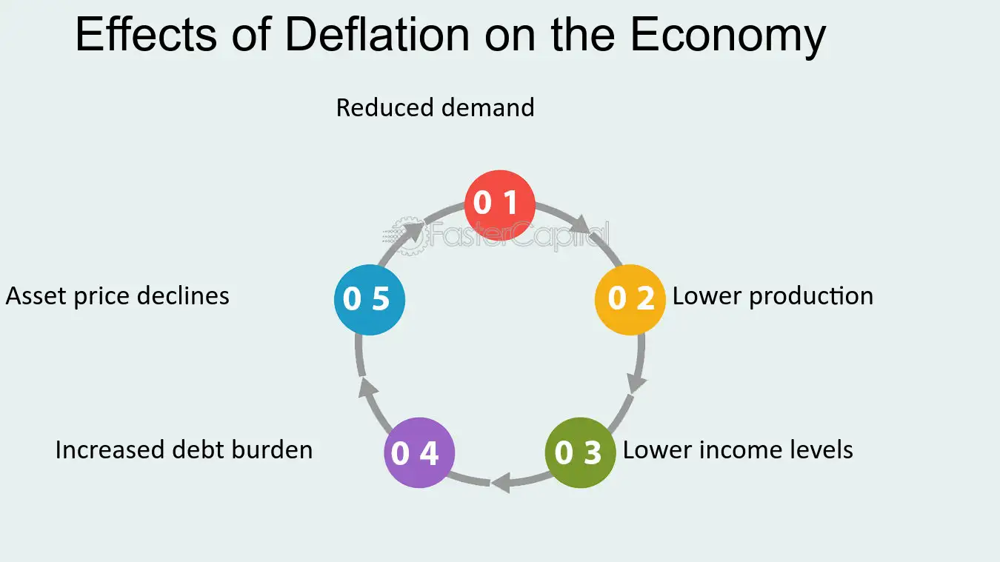

## Table of Contents

## What is economic deflation?

Economic deflation is when the general price level of goods and services in an economy goes down over time. This means that the value of money goes up, so people can buy more with the same amount of money. Deflation happens when there is less demand for things or when there is too much supply. For example, if everyone starts saving more and spending less, businesses might lower their prices to attract customers.

While deflation might sound good because things get cheaper, it can actually be bad for the economy. When prices fall, people might delay buying things, thinking they will be even cheaper later. This can slow down the economy because businesses sell less and may have to cut jobs. Also, if people owe money, like on a loan, the money they pay back becomes worth more than when they borrowed it, which can be tough for them. So, while a little deflation might not be a big problem, a lot of it can lead to serious economic issues.

## How does deflation differ from inflation?

Deflation and inflation are opposite things that happen to the prices of things we buy. Deflation is when prices go down over time. This means that the money you have can buy more stuff because everything costs less. On the other hand, inflation is when prices go up over time. This means that the same amount of money buys you less because everything costs more. So, if you have $100, during deflation, you might be able to buy more things with it than during inflation.

Both deflation and inflation can affect the economy in big ways, but they do it differently. With deflation, people might wait to buy things because they think prices will keep going down. This can make businesses sell less and maybe even have to let people go from their jobs. It can also make it harder for people who owe money because they have to pay back more valuable money than they borrowed. With inflation, people might buy things quicker because they think prices will keep going up. This can help businesses sell more, but if inflation is too high, it can make it hard for people to afford things and can make their money worth less over time. So, both can be tricky for the economy, just in different ways.

## Can deflation be beneficial for an economy?

Deflation can be good for an economy in some ways. When prices go down, people can buy more things with the same amount of money. This means they might feel richer because their money goes further. For example, if you save money for a big purchase like a car, deflation means you might be able to buy a better car for the same price later on. Also, if you have money saved up, deflation makes that money more valuable because you can buy more with it.

However, deflation can also cause problems if it goes on for too long or happens too fast. If people think prices will keep going down, they might wait to buy things, which can hurt businesses because they sell less. This can lead to fewer jobs and slower economic growth. Also, if people owe money, like on a loan, they have to pay back more valuable money than they borrowed, which can be tough. So, while a little bit of deflation might help people buy more with their money, too much deflation can be bad for the economy overall.

## What are the immediate effects of deflation on consumer spending?

When prices start to go down because of deflation, people might change how they spend their money. If they think prices will keep falling, they might decide to wait before buying things. They think, "Why buy this now when it will be cheaper next month?" This waiting can make businesses sell less stuff, which can be bad for the economy. 

But deflation can also make people feel like they have more money because everything costs less. If they have money saved up, they can buy more things with it. So, some people might spend more because they feel richer. It really depends on how much prices are going down and how people feel about the future of the economy.

## How does deflation impact savings and investment?

Deflation can make savings more valuable because the money you have saved can buy more things as prices go down. If you have money in the bank, it's worth more because everything costs less. This might make people want to save more and spend less, thinking their money will be even more valuable in the future. But if everyone saves and doesn't spend, it can slow down the economy because businesses sell less.

When it comes to investments, deflation can be tricky. If prices are going down, people might be less willing to invest in things like stocks or real estate because they think the value of these investments might go down too. This can lead to less money being put into the economy, which can make things worse. On the other hand, if someone can find a good investment that will still do well even when prices are falling, they might make more money because their returns will be worth more as deflation continues.

## What role does deflation play in debt reduction?

Deflation can help people pay off their debts because it makes money more valuable. If you owe money, like on a loan, you'll be paying it back with dollars that can buy more than when you borrowed them. So, if you borrowed $10,000 and deflation happens, the money you pay back is worth more, which means you're really paying less in terms of what that money can buy.

However, this can also be tough for people who owe money. If they earn less because of deflation, it might be harder to make their loan payments even though the money they pay back is worth more. Also, if businesses struggle because people aren't buying as much, they might not be able to pay back their loans, which can lead to more problems in the economy. So, while deflation can make the actual amount of debt smaller in real terms, it can also make it harder for people and businesses to manage their debts.

## How can deflation lead to increased purchasing power?

Deflation makes things cheaper over time. When prices go down, the money you have can buy more stuff. If you have $100, you might be able to buy more things with it than before because everything costs less. This means you can get more for your money, which is what we call increased purchasing power.

However, if people think prices will keep going down, they might wait to buy things. They might think, "Why buy this now if it will be even cheaper later?" This waiting can slow down the economy because businesses sell less. But if you have money saved up, deflation can make you feel richer because your savings can buy more as prices fall.

## What historical examples demonstrate the benefits of deflation?

One historical example of deflation that some people say was good happened in the United States during the late 1800s. Back then, prices for things like food and clothes went down a lot. This made life easier for many people because they could buy more with the money they had. Farmers, who were a big part of the economy, could sell their crops and buy things they needed for less money. So, even though not everyone was happy, many people felt like they had more money because their dollars could buy more.

Another example is Japan in the early 2000s. Japan had a long period of deflation, but some people say it was good for them. Prices for things like electronics and cars went down, which made it easier for people to buy these things. This helped some people feel like they could afford more, even if their salaries didn't go up. But it's important to know that not everyone agrees that deflation was good for Japan, because it also made the economy grow very slowly.

## How do businesses adapt to a deflationary environment?

In a deflationary environment, businesses have to be smart about how they handle things. When prices are going down, people might not buy as much because they think things will get even cheaper later. So, businesses might have to lower their prices too, just to keep selling their stuff. They might also try to cut costs by finding cheaper ways to make their products or by spending less on things like advertising. Some businesses might even decide to wait to make big investments, like buying new machines or opening new stores, because they're not sure if they'll make enough money back.

But it's not all bad for businesses during deflation. If they can keep selling their products, even at lower prices, they might still do okay. Some businesses might try to focus on making their products better or different, so people still want to buy them even when prices are falling. They might also look for new ways to reach customers, like selling online, to keep their sales up. So, while deflation can be tough, businesses that can adapt and find ways to keep selling might still do well.

## What are the long-term economic benefits of deflation?

In the long run, deflation can make people's money go further because everything costs less. If prices keep going down, people might be able to buy more things with the same amount of money. This can make people feel richer because their savings can buy more. For example, if someone saves money to buy a house, deflation means they might be able to afford a bigger or better house later on. Also, if businesses can keep selling their stuff even when prices are falling, they might be able to make more money because their costs go down too.

But, deflation can also cause problems if it lasts a long time. If people keep waiting to buy things because they think prices will keep going down, businesses might sell less and have to let people go from their jobs. This can slow down the whole economy. Also, if people owe money, like on a loan, paying it back can be harder because the money they pay back is worth more than when they borrowed it. So, while deflation might help people buy more with their money in the long run, it can also make things tough for the economy if it goes on too long.

## How does deflation affect different sectors of the economy?

Deflation affects different parts of the economy in different ways. For example, in the retail sector, when prices go down, stores might have to lower their prices too to keep selling their stuff. This can be good for shoppers because they can buy more things with their money, but it can be hard for the stores if they can't make enough money to stay open. In the manufacturing sector, businesses might try to cut costs by finding cheaper ways to make their products. If they can do this, they might still make money even when prices are falling, but if they can't, they might have to close down or lay off workers.

The service sector can also feel the effects of deflation. For example, if people think prices will keep going down, they might wait to get services like haircuts or car repairs. This can make it hard for businesses in these areas because they might not have enough customers. On the other hand, if service businesses can find ways to offer their services for less, they might still do okay. In the real estate sector, deflation can make houses and buildings cheaper, which can be good for buyers but bad for sellers and builders who might have to sell at lower prices.

Overall, deflation can be good for some parts of the economy because it makes things cheaper, but it can also be bad if it makes businesses sell less and have to cut jobs. It's all about how each sector can adapt to prices going down and whether they can still make money in a deflationary environment.

## What are the potential risks and challenges associated with managing deflation effectively?

Managing deflation effectively can be really hard because it can lead to a lot of problems if it's not handled right. One big risk is that if prices keep going down, people might wait to buy things, thinking they'll be even cheaper later. This can make businesses sell less and might even cause them to close down or lay off workers. If a lot of businesses do this, it can slow down the whole economy. Another challenge is that deflation can make it harder for people who owe money. If they have to pay back loans with money that's worth more than when they borrowed it, it can be tough for them, especially if they're [earning](/wiki/earning-announcement) less because of the slowing economy.

Another risk is that deflation can make people save more and spend less, which can make the economy even slower. When people save more, businesses don't sell as much, and this can lead to a cycle where prices keep falling and people keep saving, making things worse. Governments and central banks have to be careful when trying to stop deflation because the things they do, like lowering interest rates or printing more money, might not work if people still think prices will keep going down. It's a tricky balance to get right, and if they don't, the economy could stay stuck in a bad spot for a long time.

## References & Further Reading

Bergstra, J., Bardenet, R., Bengio, Y., & Kégl, B. (2011). "Algorithms for Hyper-Parameter Optimization." Advances in Neural Information Processing Systems, 24, highlights methodologies for optimizing [algorithmic trading](/wiki/algorithmic-trading) strategies by fine-tuning hyper-parameters, a critical aspect for adapting to deflationary environments.

Lopez de Prado, M. "Advances in Financial Machine Learning," provides insights into [machine learning](/wiki/machine-learning) applications in finance, essential for developing adaptive algorithmic trading systems capable of responding to economic fluctuations such as deflation.

Aronson, D. "Evidence-Based Technical Analysis," emphasizes the importance of data-driven decision-making in trading, underpinning the need for strategies that can efficiently operate in deflationary markets.

Jansen, S. "Machine Learning for Algorithmic Trading," details the integration of machine learning in trading algorithms, enhancing the ability to capitalize on deflation-related market conditions by improving prediction accuracy and execution speed.

Chan, E.P. "Quantitative Trading: How to Build Your Own Algorithmic Trading Business," covers the construction and adaptation of [quantitative trading](/wiki/quantitative-trading) strategies, offering foundational knowledge for leveraging algorithmic tools to navigate deflation's unique challenges and opportunities.

