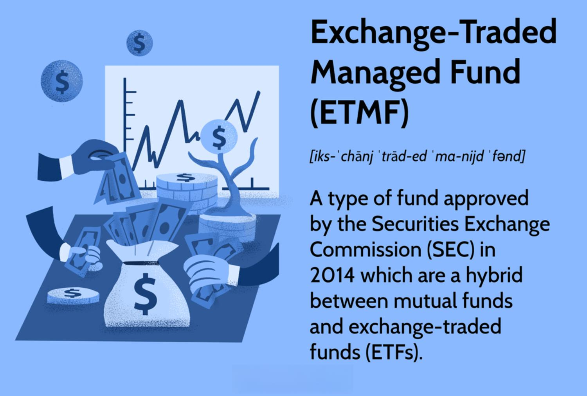

Exchange-Traded Funds (ETFs) have profoundly transformed investment strategies by offering a combination of flexibility, accessibility, and diversification. These investment vehicles allow investors to buy and sell a basket of assets, such as stocks or bonds, throughout the trading day, much like individual stocks. The inherent versatility of ETFs has made them a cornerstone for both individual and institutional investors seeking to achieve balanced, diversified portfolios without incurring the high costs typically associated with mutual funds.

The ascent of ETFs occurred alongside significant technological advancements, leading to an innovative intersection with algorithmic trading. This form of trading leverages computer programs and mathematical models to execute trades with precision and speed unattainable by human traders. Algorithmic trading plays a crucial role in enhancing the efficiency of ETF transactions by facilitating the automation of trading strategies, minimizing human errors, and eliminating emotional biases. This precision allows for rapid execution of trades, which is vital in the fast-paced environment of financial markets.



In recent years, algorithmic trading has become indispensable in the world of ETFs. The increasing complexity and volume of financial data require sophisticated algorithms capable of analyzing vast datasets to capitalize on market opportunities. Algorithms help in making split-second decisions by calculating indicators such as moving averages or implementing strategies like arbitrage. This capability is particularly significant for ETFs, as their value is derived from underlying asset prices, and even minor discrepancies can lead to substantial gains or losses if not promptly addressed.

The symbiotic relationship between ETFs and algorithmic trading underscores the importance of ETFs in a diversified investment portfolio. They provide investors with exposure to various market segments, asset classes, and geographic regions, thereby facilitating risk distribution. The diversification inherent in ETFs helps mitigate unsystematic risk, which stems from uncertainties unique to specific securities. This risk reduction is vital for investors aiming to safeguard their portfolios against market volatility.

In summary, ETFs and algorithmic trading collectively enhance the investment landscape, providing a comprehensive toolkit for modern investors. As technology continues to advance, the dynamic between these two components is expected to evolve, offering new opportunities and challenges. Understanding this interplay is crucial for investors who seek to harness the potential benefits of ETFs and algorithmic trading in their investment endeavors. This introduction lays the groundwork for a more detailed examination of how these innovations reshape financial markets.

## Table of Contents

## Understanding ETFs

Exchange-Traded Funds (ETFs) are investment vehicles that allow investors to pool their money to purchase a diversified portfolio of assets. These assets typically mirror the performance of a specific index, commodity, bonds, or a collection of different asset types. ETFs trade on stock exchanges similar to individual stocks, making them accessible to a wide range of investors.

### Historical Context

The first [ETF](/wiki/etf-trading-strategies), the SPDR S&P 500 ETF Trust (SPY), was introduced in 1993 in the United States and designed to track the S&P 500 Index. Since their inception, ETFs have grown in popularity due to their ability to offer the benefits of mutual funds combined with the flexibility of stocks. The transparency, cost-effectiveness, and operational ease of ETFs have made them a favored choice, leading to significant growth in both the number and assets under management (AUM) of ETFs globally.

### Types of ETFs

ETFs come in several varieties, which can be categorized into different types:

1. **Index ETFs**: These are designed to replicate the performance of a specific index, such as the S&P 500 or Nasdaq-100.

2. **Sector ETFs**: These focus on specific sectors of the economy, such as technology, healthcare, or utilities, allowing investors to target particular industries.

3. **Bond ETFs**: These invest in fixed-income securities, providing exposure to government, municipal, or corporate bonds.

4. **Commodity ETFs**: These track the price of a commodity, such as gold, oil, or natural gas, allowing investors to gain exposure to these raw materials.

5. **International ETFs**: These offer exposure to markets outside the investor's home country, such as emerging markets or specific regions like Asia or Europe.

### Advantages of ETFs

ETFs offer several benefits to investors:

- **Diversification**: By holding a basket of different assets, ETFs reduce the risk associated with individual security investments. This diversification can be across asset classes, geographies, sectors, or investment styles.

- **Liquidity**: ETFs are traded on stock exchanges throughout the trading day, providing investors with the ability to quickly buy and sell shares at market prices.

- **Cost Efficiency**: Generally, ETFs have lower expense ratios compared to mutual funds because they tend to be passively managed, tracking indices rather than attempting to outperform them.

### Potential Drawbacks

Despite their advantages, ETFs also present certain risks and limitations:

- **Tracking Errors**: ETFs aim to replicate an index, but discrepancies can arise due to factors like management fees, cost of acquiring assets, or changes in the underlying index, leading to tracking errors.

- **Market Risks**: Like all investments, ETFs are subject to market risk. Changes in market conditions, interest rates, or economic events can affect ETF performance.

Overall, ETFs provide an efficient and accessible means for investors to diversify their portfolios and implement a wide array of investment strategies. However, prospective investors should be aware of the various types available and assess the associated risks and potential tracking errors. Investing in ETFs can be a cost-effective strategy, but understanding the fundamentals and market dynamics is crucial for optimizing returns.

## The Role of Algorithmic Trading in ETFs

Algorithmic trading involves the use of computerized systems to execute trading strategies based on pre-defined rules. These systems utilize complex mathematical models and algorithms to analyze market data and execute trades at high speeds. With the proliferation of technological advancements and big data, [algorithmic trading](/wiki/algorithmic-trading) has gained considerable traction, particularly in the exchange-traded funds (ETFs) market.

Algorithms enhance the trading of ETFs by automating strategies that optimize investment returns. They enable traders to handle large volumes of trades, quickly respond to market conditions, and maintain consistency in execution, eliminating the delays and potential human errors present in manual trading. For instance, a common strategy is [arbitrage](/wiki/arbitrage), where algorithms can identify and exploit price discrepancies between an ETF's market price and its net asset value (NAV) to generate profit.

The advantages of algorithmic trading in the context of ETFs are manifold. Speed is a significant advantage, as algorithms can execute trades within milliseconds, outperforming even the most adept human traders. Additionally, algorithmic trading allows for precise execution of trades, ensuring that orders are filled at optimal prices. Another critical advantage is the absence of emotions in trading decision-making. Algorithms operate based on data and mathematical constructs, thereby reducing the risk of irrational financial decisions caused by human emotions.

However, algorithmic trading is not without its challenges. High-frequency trading ([HFT](/wiki/high-frequency-trading-strategies)), a subset of algorithmic trading characterized by exceptionally fast order execution rates, poses certain risks. These include the potential for market instability and flash crashes, where rapid selling leads to precipitous declines in market prices. The complexity of algorithmic systems also raises issues; errors in the underlying code or strategy misalignments can lead to substantial financial losses.

To manage these risks, traders must employ robust risk management strategies, such as implementing circuit breakers to halt trading during extreme [volatility](/wiki/volatility-trading-strategies) and continuously testing and refining algorithms to adjust to evolving market conditions. Additionally, understanding and complying with regulatory frameworks is essential for trading seamlessly within the ETF market.

## Benefits of Combining ETFs with Algorithmic Trading

Algorithmic trading has significantly enhanced the efficiency of Exchange-Traded Fund (ETF) trading by automating and optimizing trading strategies. This is achieved primarily through the utilization of algorithms that can process and act upon large datasets at remarkable speeds. Algorithms analyze varying market indicators and execute trades based on predefined criteria, thereby removing the emotional aspect inherent in manual trading.

One of the primary benefits of algorithmic trading in the context of ETFs is improved trading efficiency. By employing algorithms, traders can execute large volumes of trades at speeds far beyond human capability. This speed is especially crucial for high-frequency trading (HFT), where the ability to enter and [exit](/wiki/exit-strategy) positions quickly can be the difference between profit and loss. This enhanced efficiency allows traders to exploit price discrepancies faster than traditional methods, often within fractions of a second, leading to potentially higher returns.

Furthermore, algorithmic trading can contribute to greater market stability by reducing price discrepancies. When algorithms detect discrepancies between an ETF's market price and its net asset value (NAV), they can swiftly execute arbitrage strategies to adjust these discrepancies. This mechanism contributes to market efficiency as it helps in aligning prices closer to their true value. As a result, investors can benefit from price adjustments that reflect more accurate market conditions.

Case studies illustrate the successful combination of ETFs with algorithmic strategies. For instance, consider a scenario involving the S&P 500 ETF. By employing a [momentum](/wiki/momentum)-based algorithmic strategy, a trader could analyze historical data to identify trending patterns in the S&P 500 index. The algorithm could be designed to automatically buy or sell the ETF based on momentum indicators such as moving average crossovers. This strategy has the potential to capitalize on short-term market movements while mitigating risk through diversification inherent in ETFs.

To illustrate with Python code, a simple moving average crossover strategy could be implemented as follows:

```python
import pandas as pd
import numpy as np

# Load historical price data for the ETF
data = pd.read_csv('etf_price_data.csv')

# Calculate short-term and long-term moving averages
data['Short_MA'] = data['Close'].rolling(window=40, min_periods=1).mean()
data['Long_MA'] = data['Close'].rolling(window=100, min_periods=1).mean()

# Generate buy and sell signals
data['Signal'] = np.where(data['Short_MA'] > data['Long_MA'], 1, 0)
data['Position'] = data['Signal'].diff()

# View the resulting signals
print(data[['Close', 'Short_MA', 'Long_MA', 'Position']].tail())
```

This code demonstrates a basic approach to generating buy and sell signals based on moving averages. The automation and discipline of algorithmic trading can capitalize on such signals as they arise, bolstering trade execution accuracy and consistency.

Together, these enhancements offer traders the ability to navigate ETF markets with increased precision and performance. As the integration of ETFs and algorithmic trading becomes more sophisticated, it will continue to unlock new avenues for efficiency and opportunity in the financial markets.

## Risks and Considerations

Algorithmic trading, while offering numerous benefits in the ETF market, also presents various risks that investors and traders must carefully consider. One significant risk is the complexity and speed involved in high-frequency trading (HFT), a subset of algorithmic trading. HFT algorithms are designed to execute orders within microseconds to capitalize on minuscule price discrepancies in the market. This rapid execution, while advantageous for capturing short-term market inefficiencies, can lead to increased volatility and potential destabilization of ETF prices. The sheer [volume](/wiki/volume-trading-strategy) and speed of transactions can overwhelm market data infrastructure, and in extreme cases, trigger flash crashes where asset prices plummet briefly and then recover.

Moreover, high-frequency trading can contribute to [liquidity](/wiki/liquidity-risk-premium) fragmentation. Although liquidity is generally an advantage of ETFs, the presence of multiple, rapid trades across various platforms can lead to fragmented pools of liquidity, thereby affecting price discovery and efficiency. The rapid in-and-out nature of trades can also result in higher bid-ask spreads during volatile periods, impacting traders who are not using high-speed algorithms.

Regulatory concerns further complicate the landscape of algorithmic trading with ETFs. Regulators are tasked with ensuring market fairness and stability, and the opaque nature of some algorithmic strategies can pose challenges to oversight. There is a continuous effort to develop regulatory frameworks that can effectively monitor and manage the risks associated with HFT and algorithmic trading. This includes rules on market conduct, transparency requirements, and safeguards against market manipulation.

Robust risk management strategies are essential for those engaged in algorithmic trading with ETFs. Such strategies involve not only the design and testing of trading algorithms to anticipate different market conditions but also the implementation of controls to prevent unintended trades. Risk management must also address adverse market impacts, such as ensuring algorithms are designed to handle sudden spikes in volatility or illiquidity.

Additionally, the use of stop-loss orders and dynamic risk assessment tools can help mitigate some of the intrinsic risks of algorithmic trading. Continuous monitoring and adjustment of algorithms are crucial to adapt to evolving market conditions and regulatory environments. As the market for ETFs and algorithmic trading grows, staying abreast of technological advancements and regulatory changes is imperative for successful and secure trading.

## Future Trends

The anticipated evolution of ETFs (Exchange-Traded Funds) and algorithmic trading holds the promise of reshaping the financial markets. Increased adoption of algorithm-driven strategies and the proliferation of ETFs are setting the stage for a transformative shift in how assets are traded and managed.

Emerging technologies such as [artificial intelligence](/wiki/ai-artificial-intelligence) (AI) and [machine learning](/wiki/machine-learning) (ML) are at the forefront of this anticipated evolution. AI and ML can process vast amounts of data faster and more precisely than traditional methods, offering potential improvements in trading efficacy. These technologies support the development of more sophisticated trading algorithms that can not only execute trades but also predict market trends and adjust strategies dynamically based on real-time data. For example, natural language processing (NLP) can be used to analyze news and social media sentiment, influencing trading decisions within seconds. 

Another impactful technology is blockchain, which may introduce enhanced transparency and efficiency to ETF trading. By securely recording transactions, blockchain ensures the integrity of trade data, potentially reducing counterparty risk and increasing trust among market participants. Additionally, decentralized finance (DeFi) platforms powered by blockchain technology could enable innovative forms of ETF trading, bypassing traditional financial intermediaries and potentially lowering transaction costs.

Quantum computing is another emerging technology with the potential to revolutionize algorithmic trading. By performing complex calculations at unprecedented speeds, quantum computing could solve optimization problems that are currently unmanageable, thereby enhancing the efficiency and speed of trade execution.

However, the evolution of technology in ETF trading is accompanied by significant regulatory considerations. As algorithms grow more complex and integrated with AI and ML, regulators may need to update their frameworks to ensure fair and transparent market practices. Algorithmic trading, particularly high-frequency trading, raises concerns about market stability and manipulation. In response, regulatory bodies may implement stricter compliance requirements and real-time monitoring of algorithmic transactions to prevent undesirable market behaviors.

Furthermore, evolving data privacy laws may impact how trading firms access and utilize data for algorithmic strategies. Ensuring that trading algorithms comply with privacy regulations will be essential to avoid legal challenges and reputational risks.

Anticipated future trends in ETFs and algorithmic trading are likely to be shaped by the interplay of technological advancements and regulatory evolutions. As these factors converge, they will redefine market dynamics, offering both opportunities and challenges for investors and trading firms. As the trading landscape continues to evolve, keeping abreast of these trends and adapting strategies accordingly will be crucial for market participants.

## Conclusion

Exchange-Traded Funds (ETFs) and algorithmic trading have established a synergistic relationship that is reshaping the modern investment landscape. This union leverages the inherent benefits of ETFs, such as low cost and diversification, with the advantages of algorithmic trading, including speed and precision. The result is an investment tool that promotes efficiency and accessibility, appealing to both institutional and individual investors.

Algorithmic trading significantly enhances ETF market dynamics by facilitating rapid trade execution and minimizing human error. Algorithms, driven by sophisticated data analysis, can adapt to market conditions in real-time, reducing arbitrage opportunities and contributing to a more stable pricing environment. This improvement in market efficiency is particularly valuable in high-volume trading, where manual intervention could lead to costly delays.

Innovations in algorithmic trading, such as machine learning and artificial intelligence, have the potential to further transform ETF markets. These technologies promise to refine trading strategies by learning from vast datasets, anticipating market movements, and optimizing decision-making processes. As these advancements continue to unfold, they are likely to introduce more adaptive and responsive trading models, thereby increasing the attractiveness of ETFs as a core portfolio component.

Investors are encouraged to remain vigilant about ongoing technological shifts in trading. Understanding how these innovations can influence ETF markets will enable investors to make informed decisions and harness new opportunities. As the landscape of financial markets continues to evolve, staying informed about technological advancements is crucial for navigating potential risks and capitalizing on emerging trends. A proactive approach will ensure that investors are well-positioned to benefit from the continued integration of ETFs and algorithmic trading.

## References & Further Reading

[1]: ["Exchange-Traded Funds: Risk and Return"](https://www.nerdwallet.com/article/investing/what-is-an-etf) by Ronald E. Johnson, CFA Institute

[2]: ["Advances in Financial Machine Learning"](https://www.amazon.com/Advances-Financial-Machine-Learning-Marcos/dp/1119482089) by Marcos Lopez de Prado

[3]: BlackRock. (2020). ["ETFs vs. Mutual Funds: Key differences"](https://www.morningstar.com/funds/etfs-vs-mutual-funds-benefits-that-really-matter)

[4]: ["Machine Learning for Asset Managers"](https://github.com/emoen/Machine-Learning-for-Asset-Managers) by Marcos Lopez de Prado

[5]: Aldridge, I. (2013). ["High-frequency trading: a practical guide to algorithmic strategies and trading systems"](https://books.google.com/books/about/High_Frequency_Trading.html?id=8QpIsVUMhmEC) (Second edition). Wiley.

[6]: ["Quantitative Trading: How to Build Your Own Algorithmic Trading Business"](https://books.google.com/books/about/Quantitative_Trading.html?id=j70yEAAAQBAJ) by Ernest P. Chan