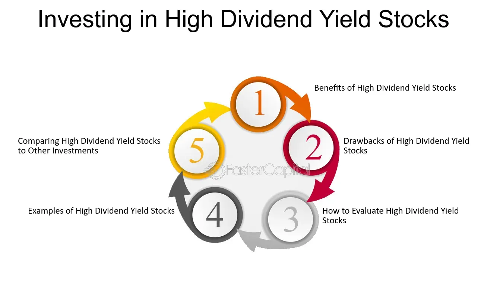

## Table of Contents

## What are high-dividend yield stocks?

High-dividend yield stocks are shares in companies that pay out a higher percentage of their stock price as dividends compared to other stocks. Dividends are payments made by a company to its shareholders, usually from the company's profits. When a stock has a high dividend yield, it means that the annual dividend payment is a large portion of the stock's current price. For example, if a stock costs $100 and pays a $5 dividend each year, its dividend yield is 5%.

Investors often look for high-dividend yield stocks because they can provide a steady income stream. This can be especially appealing for people who want to earn money from their investments without selling their stocks. However, high-dividend yields can sometimes be a sign that the company is struggling, and the stock price might be falling. It's important for investors to research the company and understand why the dividend yield is high before deciding to invest.

## How do dividends work and why are they important?

Dividends are payments that companies give to people who own their stocks. When a company makes money, it can choose to share some of that money with its shareholders. This sharing happens regularly, often every three months. The amount you get depends on how many shares you own. If a company decides to pay a dividend of $1 per share, and you own 100 shares, you will get $100.

Dividends are important for a few reasons. First, they give investors a way to earn money from their investments without selling their stocks. This can be really helpful for people who want a steady income, like retirees. Second, dividends can show that a company is doing well and has enough money to share with its shareholders. But, it's also important to know that not all companies pay dividends. Some, especially newer or growing companies, might use their money to grow the business instead of paying dividends.

## What is the difference between dividend yield and dividend payout ratio?

Dividend yield and dividend payout ratio are two different ways to look at dividends, but they tell us different things. Dividend yield is about how much money you get back from a stock compared to its price. It's like a percentage that shows how much of the stock's price you get back each year as dividends. If a stock costs $100 and pays a $5 dividend every year, the dividend yield is 5%. This helps investors see how much income they can expect from a stock.

The dividend payout ratio, on the other hand, tells us how much of a company's earnings are given out as dividends. It's calculated by dividing the total dividends paid by the company's net income. If a company earns $100 million and pays out $25 million in dividends, the payout ratio is 25%. This ratio helps investors understand if a company is keeping enough money to grow or if it's giving too much away. Both measures are important, but they give different kinds of information about a company's dividends.

## What are the potential benefits of investing in high-dividend yield stocks?

Investing in high-dividend yield stocks can give you a steady income. If you own these stocks, you get money regularly, usually every three months. This can be really helpful if you need money to live on, like if you're retired. It's like getting paid for owning the stocks without having to sell them. This steady income can help you feel more secure about your money.

Another benefit is that high-dividend yield stocks can make your overall investment safer. When the stock market goes up and down, the money you get from dividends can help balance things out. Even if the stock price goes down, you still get the dividend payments. This can make your investments less risky. Plus, if the company keeps paying good dividends, it might mean the company is doing well and is likely to keep doing well in the future.

## How can high-dividend yield stocks contribute to a diversified investment portfolio?

High-dividend yield stocks can be a big help in making your investment portfolio more diverse. When you have different kinds of investments, it's like not putting all your eggs in one basket. High-dividend yield stocks can give you regular money, which is different from other investments like bonds or [growth stocks](/wiki/growth-stocks). This means you have money coming in from different places, which can make your overall investments safer and more balanced.

Also, high-dividend yield stocks can help balance out the ups and downs of the stock market. If the market goes down, the money you get from dividends can help soften the blow. This makes your investments less risky. Plus, if you mix high-dividend yield stocks with other types of investments, you can have a portfolio that grows over time and gives you money to use now.

## What are the risks associated with high-dividend yield stocks?

High-dividend yield stocks can be risky because a high yield might mean the company is having problems. If a company's stock price is going down a lot, the dividend yield goes up. This can make the yield look good, but it might be because the company is not doing well. If the company keeps struggling, it might cut the dividend or even stop paying it altogether. This means you could lose the income you were counting on.

Another risk is that high-dividend yield stocks might not grow as much as other stocks. Companies that pay big dividends often don't have as much money left over to grow their business. This can mean their stock price doesn't go up as much over time. If you're looking for your investments to grow a lot, high-dividend yield stocks might not be the best choice. It's important to think about what you want from your investments and understand these risks before you decide to buy high-dividend yield stocks.

## How does one identify high-dividend yield stocks?

To find high-dividend yield stocks, you need to look at the dividend yield of different companies. The dividend yield is the amount of money a company pays in dividends each year divided by the price of one share of its stock. You can find this information on financial websites or in stock market reports. A high dividend yield usually means the company is paying out a big part of its stock price as dividends. For example, if a stock costs $100 and pays $5 in dividends every year, the dividend yield is 5%. You can compare the dividend yields of different stocks to see which ones are high.

But, it's not just about finding the highest yield. You also need to check if the high yield is because the company is doing well or if it's because the stock price is falling. A falling stock price can make the yield look high, but it might be a sign that the company is struggling. So, you should look at other things like the company's earnings, its history of paying dividends, and what people think about its future. This will help you pick high-dividend yield stocks that are less risky and more likely to keep paying good dividends.

## What are some strategies for investing in high-dividend yield stocks?

One good way to invest in high-dividend yield stocks is to look for companies that have a long history of paying steady dividends. These companies are often more stable and less likely to cut their dividends, even if the economy gets tough. You can check how long a company has been paying dividends and if they've increased them over time. This can give you a good idea if the company is reliable. Also, it's smart to spread your money around and not put it all in one stock. This way, if one company has problems, you still have money in other stocks that might be doing well.

Another strategy is to keep an eye on the company's financial health. Look at things like their earnings and how much debt they have. A company with strong earnings and low debt is more likely to keep paying good dividends. You can also look at the dividend payout ratio, which shows how much of the company's earnings go to dividends. A high payout ratio might mean the company is giving away too much and might not have enough money left to grow or handle problems. By paying attention to these details, you can pick high-dividend yield stocks that are more likely to be safe and give you a good income.

It's also important to think about your overall investment plan. High-dividend yield stocks can give you money now, but they might not grow as much as other stocks. So, you might want to mix them with other kinds of investments, like growth stocks or bonds. This way, you can have a balanced portfolio that gives you income and grows over time. Always think about what you want from your investments and how much risk you're okay with before you decide to buy high-dividend yield stocks.

## Can high-dividend yield stocks provide income during retirement?

High-dividend yield stocks can be a good way to get money during retirement. When you own these stocks, you get paid regularly, usually every three months. This is like getting a paycheck just for owning the stocks. This can help you pay for things you need without having to sell your investments. It's like having a steady income that can make your retirement more comfortable and secure.

But, it's important to be careful when [picking](/wiki/asset-class-picking) high-dividend yield stocks for retirement. A high yield might mean the company is having problems, and the stock price is going down. If the company keeps struggling, it might cut the dividend or stop paying it. This could hurt your retirement income. So, you should look for companies that have a good history of paying dividends and are financially strong. By choosing wisely, you can use high-dividend yield stocks to help you have a good income during retirement.

## How have high-dividend yield stocks performed historically compared to other investments?

High-dividend yield stocks have done well over time, but they can be different from other investments like growth stocks or bonds. These stocks usually give you a steady income because they pay out a lot of their earnings as dividends. This can be really helpful for people who want money to use now, like retirees. But, high-dividend yield stocks might not grow as fast as other stocks. Companies that pay big dividends often don't have as much money left to grow their business, so their stock prices might not go up as much.

Looking back, high-dividend yield stocks have often done better than the overall stock market during tough times. When the market goes down, the money you get from dividends can help make up for some of the losses. This can make your investments safer. But, during good times, growth stocks might do better because they can grow faster. So, high-dividend yield stocks can be a good choice if you want a steady income and less risk, but they might not give you the big growth that other investments can.

## What are the tax implications of investing in high-dividend yield stocks?

When you invest in high-dividend yield stocks, you need to think about taxes. The money you get from dividends is usually taxed, but how much you pay can depend on where you live and what kind of dividends you get. In the U.S., for example, dividends can be taxed as regular income or at a lower rate called the "qualified dividend" rate. Qualified dividends are taxed at a lower rate, which can be 0%, 15%, or 20%, depending on your income. If the dividends are not qualified, you might have to pay your normal income tax rate, which could be higher.

It's also important to know that some countries might take taxes out of your dividends before you get them. This is called withholding tax. You might be able to get some of this money back when you file your taxes, but it can make things more complicated. Because of these tax rules, it's a good idea to talk to a tax advisor before you decide to invest in high-dividend yield stocks. They can help you understand how much you might have to pay and how to plan your investments to keep more of your money.

## How do sector-specific factors affect the performance of high-dividend yield stocks?

Sector-specific factors can really change how well high-dividend yield stocks do. Different industries have their own ups and downs, and these can affect how much money a company makes and how much it can pay out in dividends. For example, if you look at the energy sector, things like oil prices can make a big difference. When oil prices are high, energy companies might make more money and pay bigger dividends. But if oil prices drop, these companies might have to cut their dividends because they're not making as much money.

Another thing to think about is how much a sector is growing or shrinking. Sectors like utilities or consumer staples, which include things like electricity and food, are usually more stable. These companies often pay good dividends because they have steady earnings. But sectors like technology might not pay as many dividends because they're using their money to grow the business instead. So, when you're looking at high-dividend yield stocks, it's smart to think about what's going on in the sector they're in. This can help you pick stocks that are more likely to keep paying good dividends.

## What is the understanding of high-dividend stocks?

High-dividend stocks are securities issued by companies that distribute a larger proportion of their earnings to shareholders in the form of dividends compared to average market practices. These enterprises typically have a history of established business operations and demonstrate substantial cash flow, permitting them to allocate a significant portion of profits to their shareholders rather than aggressively reinvesting in business expansion.

Companies within defensive sectors, such as utilities, consumer goods, and healthcare, are often able to offer high dividend yields. These industries are characterized by continued demand for essential services and products, regardless of broader economic fluctuations, thereby providing a buffer against market volatility. This inherent stability makes them attractive to dividend-focused investors seeking reliable income streams even during economic downturns.

Dividend yield, a critical metric for evaluating high-dividend stocks, assesses the ratio of a company's annual dividend payouts relative to its current stock price. Mathematically, it is expressed as:

$$
\text{Dividend Yield} = \left( \frac{\text{Annual Dividend Payment}}{\text{Current Stock Price}} \right) \times 100\%
$$

This yield provides investors with a straightforward measure of the income-generating potential of an investment in that stock. A higher dividend yield indicates a greater return on investment through dividends, although it is essential to consider the sustainability of such payouts. A company offering a high dividend yield might be doing so at the expense of reinvestment in growth, or it might face operational challenges affecting its long-term profitability. Hence, while appealing, high-dividend stocks necessitate thorough assessment of the company’s overall financial health and strategic positioning within its industry.

## What are the benefits of high-dividend stocks?

High-dividend stocks offer several compelling benefits contributing to their popularity among investors. One of the foremost advantages is the regular income stream they provide. These stocks typically distribute a portion of the company’s profits as dividends at regular intervals, such as monthly, quarterly, or annually. This steady cash flow can be particularly attractive for retirees or individuals seeking to supplement their income, as it provides a predictable source of income independent of the stock's market price.

Moreover, high-dividend stocks are associated with stability and lower [volatility](/wiki/volatility-trading-strategies). Companies that consistently pay high dividends often possess robust business models and stable earnings. They tend to operate in sectors that are less sensitive to economic cycles, such as utilities and consumer goods, which ensures more stable stock prices compared to non-dividend-paying stocks. This characteristic makes high-dividend stocks an appealing option for conservative investors who prioritize capital preservation and steady growth over high-risk investments that may offer higher potential returns but with significant volatility.

In addition to income and stability, reinvestment opportunities through dividend reinvestment plans (DRIPs) present another benefit of high-dividend stocks. These plans enable investors to automatically reinvest their dividend earnings to purchase additional shares of the company, often without incurring brokerage fees. Over time, this practice can lead to compound growth as the accumulated shares generate more dividends, which in turn are used to purchase even more shares. Mathematically, this can be represented as:

$$
A = P \left(1 + \frac{r}{n}\right)^{nt}
$$

where:
- $A$ is the amount of money accumulated after n years, including interest.
- $P$ is the principal investment amount.
- $r$ is the annual interest rate (dividend yield).
- $n$ is the number of times that interest is compounded per year.
- $t$ is the time the money is invested for in years.

Through these benefits, high-dividend stocks serve as an attractive component of investment portfolios, particularly for those focusing on income generation and long-term stability.

## How do Algorithmic Trading and Dividend Investing work together?

Algorithmic trading employs advanced algorithms and quantitative analysis to refine investment strategies, including those focused on dividends. This approach enables traders to efficiently manage their portfolios and potentially enhance their returns. Algorithms in this domain are programmed to analyze historical dividend data and market trends, which allows for precise prediction of stock price movements and dividend payout patterns.

Traders utilize these algorithms by setting specific buying and selling criteria based on dividend yields, payout ratios, and stock performance metrics. For instance, algorithms may evaluate a stock's Dividend Yield, which is calculated as:

$$
\text{Dividend Yield} = \frac{\text{Annual Dividend per Share}}{\text{Price per Share}}
$$

The process can be automated using Python, allowing for real-time adjustments to the investment portfolio. Here is a basic Python example demonstrating how one might begin automating these investment strategies:

```python
import pandas as pd
from sklearn.linear_model import LinearRegression

# Sample data: historical dividend data and stock prices
data = pd.DataFrame({
    'Dividend': [2.5, 2.6, 2.7, 2.8, 3.0],
    'Stock Price': [100, 105, 110, 115, 120]
})

# Define the model
model = LinearRegression()
X = data['Stock Price'].values.reshape(-1, 1)
y = data['Dividend'].values

# Train the model
model.fit(X, y)

# Predict future dividends
future_price = [[125]]  # example future stock price
predicted_dividend = model.predict(future_price)
print(f"Predicted Dividend: {predicted_dividend[0]}")
```

This simplistic model can be expanded by incorporating additional variables such as economic indicators, allowing for a more comprehensive analysis. Furthermore, sophisticated algorithms can adjust portfolios dynamically to leverage fluctuating market conditions, enhancing dividend yields and investment returns.

Overall, [algorithmic trading](/wiki/algorithmic-trading) in dividend investing is not just about executing trades but optimizing the decision-making process. By adopting quantitative techniques and technology, investors can better position themselves to achieve their financial objectives.

## What are the risks and considerations?

Investing in high-dividend stocks, while offering numerous benefits such as regular income and stability, carries certain risks that investors must be aware of. One significant risk is the potential for dividend cuts, which typically occur during periods of financial hardship faced by companies. During such times, a company may choose to conserve cash to maintain operations or meet other financial obligations, leading to reduced or suspended dividend payments. This can negatively impact an investor's expected income stream and overall investment returns.

To mitigate these risks, investors must undertake thorough due diligence before committing to dividend-focused investment strategies. Several critical factors should be evaluated, including payout ratios, company financial health, and prevailing market conditions.

The payout ratio, which is the proportion of earnings a company pays to its shareholders as dividends, is a vital metric to examine. It is expressed in percentage terms, calculated as:

$$
\text{Payout Ratio} = \left( \frac{\text{Dividends per Share}}{\text{Earnings per Share}} \right) \times 100\%
$$

A high payout ratio might indicate potential sustainability issues, as it suggests the company is returning a substantial portion of its earnings to shareholders, potentially at the expense of reinvestment in business operations or cushioning against economic downturns.

Assessing a company's health involves analyzing its financial statements, including balance sheets, income statements, and cash flow statements. These documents provide insights into the company's revenue generation, debt levels, and [liquidity](/wiki/liquidity-risk-premium), which are crucial indicators of its ability to maintain dividend payments.

Additionally, understanding current market conditions is essential in evaluating the risk associated with high-dividend stocks. Economic downturns, industry-specific challenges, or shifts in consumer behavior can adversely affect a company's profitability and, subsequently, its dividend payments.

Given these considerations, a diversified investment approach that incorporates a mix of sectors, geographies, and asset classes can help reduce risk. Additionally, investors should remain vigilant regarding changes in company-specific or broader economic conditions that could impact dividend sustainability.

By systematically assessing these factors, investors can make informed decisions about their high-dividend stock investments, balancing the potential for attractive income with the inherent risks involved.

## References & Further Reading

[1]: Jacobs, B. I., & Levy, K. N. (2013). ["Equity Management: The Art and Science of Modern Quantitative Investing, Second Edition."](https://www.amazon.com/Equity-Management-Science-Quantitative-Investing/dp/1259835243) Wiley Finance.

[2]: Graham, B., & Zweig, J. (2003). ["The Intelligent Investor: The Definitive Book on Value Investing."](https://www.amazon.com/Intelligent-Investor-Definitive-Investing-Essentials/dp/0060555661) HarperBusiness Essentials.

[3]: Siegel, J. J. (2007). ["Stocks for the Long Run: The Definitive Guide to Financial Market Returns & Long-Term Investment Strategies."](https://archive.org/details/stocksforlongrun0000sieg_o4p9) McGraw-Hill.

[4]: Malkiel, B. G. (2019). ["A Random Walk Down Wall Street: The Time-Tested Strategy for Successful Investing."](https://www.academia.edu/10850809/A_Random_Walk_Down_Wall_Street_The_Time_Tested_Strategy_for_Successful_Investing) W. W. Norton & Company.

[5]: Chan, E. P. (2009). ["Quantitative Trading: How to Build Your Own Algorithmic Trading Business."](https://github.com/ftvision/quant_trading_echan_book) Wiley Trading.